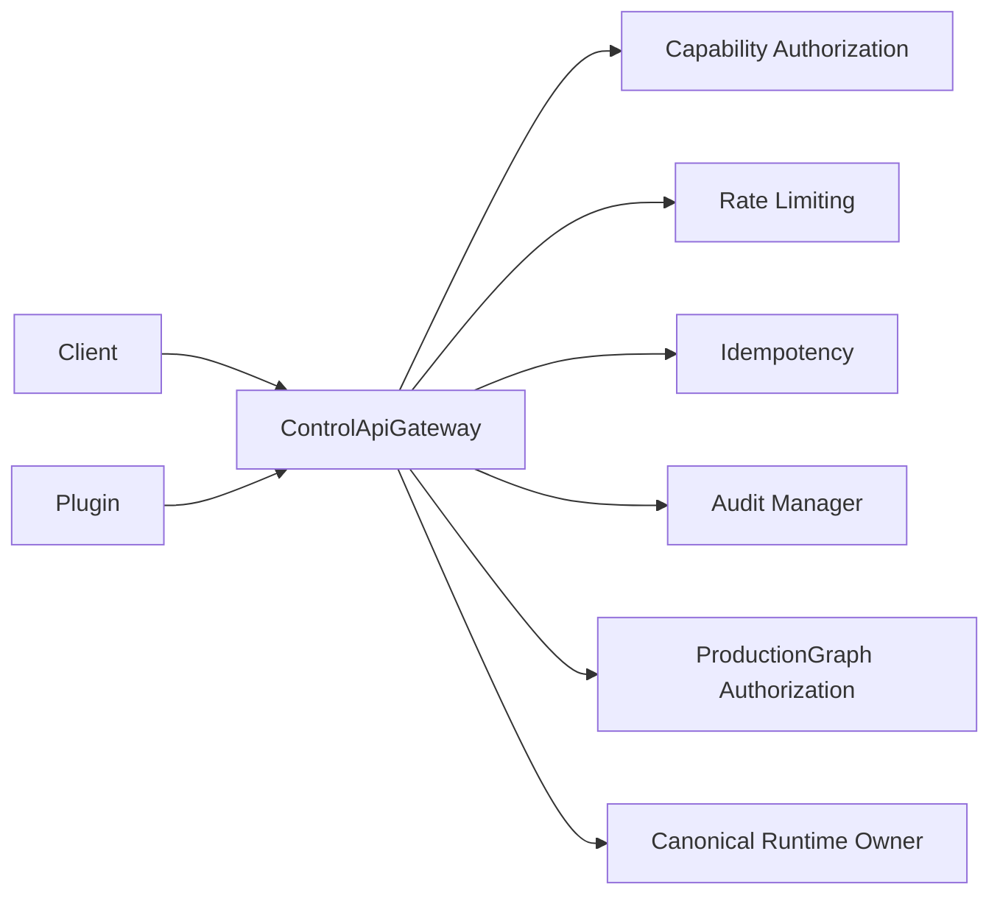

# Control Event Subscriptions

UBOS v4.10 exposes a transport-neutral Control API through `ControlApiGateway`. External clients and plugins submit typed metadata commands, queries, and subscriptions; the gateway delegates ownership decisions to canonical UBOS owners such as ProductionGraph, RuntimeController, RuntimeEventBus, Monitoring Runtime, and Workspace Manager.



## Ownership boundaries
- No raw media handles, DOM objects, sockets, process handles, device handles, database clients, or secrets are exposed.
- Production-changing commands require explicit `expectedRevision`, capability checks, rate limiting, audit logging, and ProductionGraph authorization.
- Emergency actions are distinct command classes requiring `production.emergency`.

## Examples

```ts
await gateway.execute({ commandType: 'core.take', commandVersion: '1.0.0', expectedRevision: 42, payload: { sceneId: 'scene-a' } });
await gateway.query({ queryType: 'core.monitoring.summary', queryVersion: '1.0.0', pagination: { limit: 25 } });
```

## Security and versioning
Schemas validate external metadata, incompatible versions are rejected, audit records are bounded but not silently discarded, and event publication is redacted/filtered before external delivery.

## Unsupported in this milestone
Production-ready HTTP/WebSocket/gRPC servers, raw media access, arbitrary UI injection, worker/native sandboxes, OAuth/SSO, marketplace downloads, and remote code execution are explicitly deferred.
