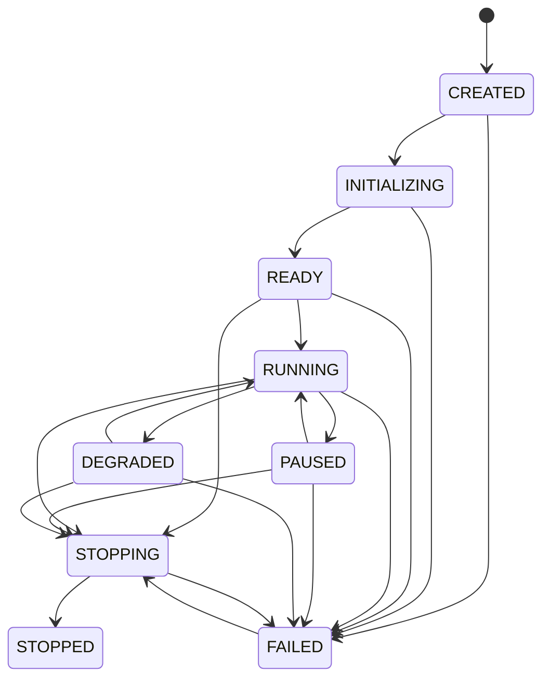

# UBOS v5.1.1 Runtime Foundation and Execution Engine Core

## Purpose

The v5.1.1 execution engine is the metadata-safe, deterministic runtime foundation for future UBOS real-time media systems. It lives in `@ubos/media-plane` beside the existing media runtime, synchronization, orchestration, production-runtime, diagnostics, and transport foundations. This phase intentionally does **not** process video or audio frames; it defines lifecycle, command, tick, event, processor, and telemetry contracts that source acquisition, composition, audio, graphics, recording, streaming, and replay systems can attach to later.

## Lifecycle model

Runtime state is controlled only through the engine lifecycle state machine:

Invalid transitions throw typed runtime errors. Idempotent operations are supported where safe, including repeated `start()` while running, `pause()` while paused, `stop()` after stopped, and `fail()` after failed.

## Command flow

Commands use a runtime-local envelope with `id`, `type`, `payload`, `sequence`, `priority`, nanosecond issue time, optional target frame, optional correlation ID, and optional source. The first built-in command types are:

- `RUNTIME_NOOP`
- `RUNTIME_BARRIER`
- `ENGINE_PAUSE`
- `ENGINE_RESUME`
- `ENGINE_STOP`
- `WORKER_START`
- `WORKER_STOP`
- `WORKER_RESTART`

Handlers are registered by command type, duplicate registration is rejected, unknown command types throw `UnknownCommandType`, and command-start/completion/failure events preserve correlation IDs.

## Scheduler ordering guarantees

The in-memory deterministic scheduler freezes copied commands on insertion and orders due work by:

1. `targetFrame` ascending; absent target frames are treated as frame `0`.
2. `priority` descending; larger numbers run first.
3. `sequence` ascending.
4. Command ID lexicographically ascending as the final stable tie-breaker.

It rejects duplicate command IDs, sequence collisions, negative frames, queue-capacity overflow, and command cancellation for unknown IDs. Draining removes due commands exactly once so commands cannot execute twice.

## Tick flow

`executeSingleTick()` is the test-friendly execution-loop skeleton for v5.1.1. It verifies the runtime is `RUNNING`, prevents overlapping ticks, creates a provisional frame tick using the injected clock, drains due commands, executes command handlers, runs tick processors sequentially, records timings and failures, emits structured runtime events, commits telemetry, and advances the frame number. Continuous high-precision clocking is deferred to v5.1.2.

## Tick-processor extension model

Tick processors provide `id`, `order`, `initialize(context)`, `processTick(tick, context)`, and `shutdown(context)`. The registry guarantees stable ordering by order then ID, prevents duplicate IDs, tracks initialization and timing metrics, captures failures, and shuts processors down in reverse order. Registration is blocked during a tick to avoid re-entrancy hazards.

## Structured events

Events include runtime lifecycle changes, tick start/completion/overrun, command lifecycle, processor lifecycle, and worker health changes. Each event carries an event ID, type, runtime ID, ISO timestamp, optional frame number serialized as a string, optional correlation ID, and typed payload.

## Error policy

Typed runtime errors cover invalid lifecycle transitions, invalid configuration, duplicate/unknown/missing commands, full queues, command failures, duplicate processors, processor failures, runtime readiness, and already-stopped conditions. Command and processor failures are always recorded and emitted. Whether the engine enters `FAILED` is controlled by `failOnCommandError` and `failOnProcessorError`.

## Telemetry model

Telemetry snapshots are JSON-serializable. Bigint fields such as frame number are converted to strings. Snapshots include lifecycle state, uptime, tick timings, maximum tick duration, tick counts, late/dropped ticks, pending commands, command and processor counters, last error, and health status.

## Integration points for v5.1.2 and v5.2

- v5.1.2 can replace the provisional injected clock/timer with the master high-precision frame clock.
- Source acquisition, compositor, audio, graphics, recording, streaming, and replay packages can register processors and services without receiving mutable engine internals.
- Existing media-plane orchestration can translate production plans into runtime command envelopes.
- Telemetry and event publishers can later bridge to the monitoring runtime and control API subscription model.

## Current limitations

- No real video, audio, GPU, network, WebRTC, FFmpeg, SRT, NDI, or device I/O is performed in this phase.
- The continuous loop is intentionally skeletal; deterministic unit tests should use `executeSingleTick()`.
- Processor execution is sequential only; deterministic concurrency is out of scope until a repository-wide concurrency policy exists.

## Determinism and re-entrancy hardening

- Runtime event IDs are generated from the injected clock context plus a runtime-local monotonic event sequence; they do not use randomness.
- Public telemetry serializes frame numbers as strings and is safe to pass through `JSON.stringify` without native `bigint` values.
- Commands are cloned on scheduler insertion and cloned again when inspected or drained, so caller-side mutation after enqueueing cannot alter the scheduled command.
- Scheduler inspection and draining explicitly sort command collections and do not rely on `Map` or `Set` insertion order for execution order.
- Runtime services are copied into a stable key-sorted map at engine construction before being exposed through the context.
- Lifecycle state and tick state use ECMAScript private fields so callers cannot mutate the actual runtime state through ordinary object property access.
- v5.1.1 still runs in a single JavaScript execution context. If v5.2 introduces worker threads, workers must communicate through command/event messages or a dedicated atomic ownership layer rather than sharing mutable engine internals.
