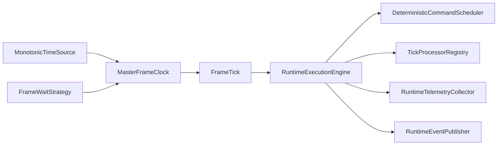
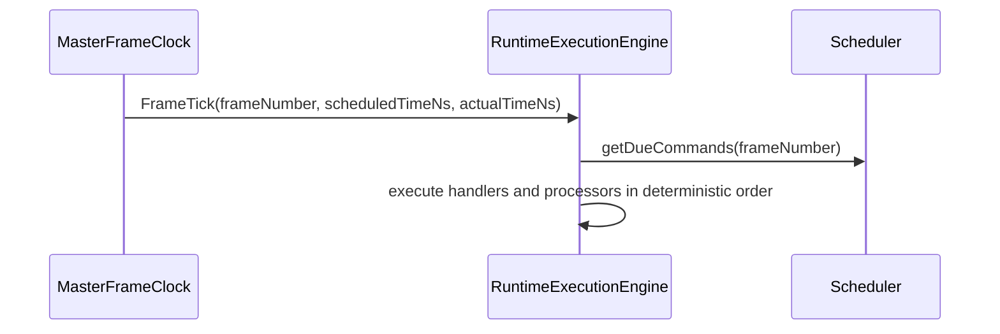
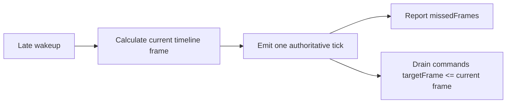
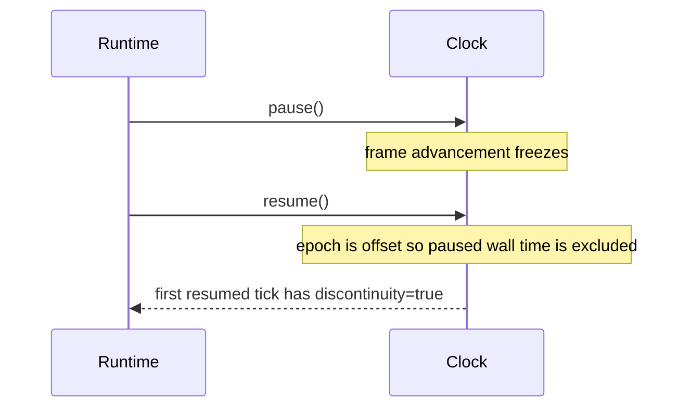

# UBOS v5.1.2 Master Frame Clock

UBOS v5.1.2 extends the v5.1.1 media-plane execution engine with an authoritative, metadata-only master frame clock. The clock is the single owner of runtime frame numbering for scheduling, command draining, tick processors, runtime telemetry, and future media pipelines.

## Rational rate model

Frame rates are represented as `{ numerator, denominator }` rational values, including 24000/1001, 24/1, 25/1, 30000/1001, 30/1, 50/1, 60000/1001, and 60/1. Floating point is display-only; helpers expose labels such as `23.976`, `29.97`, and `59.94`.

## Frame convention and epoch

The first emitted runtime frame is **frame 1 after one complete frame interval**. Frame 0 is the epoch anchor. This preserves target-frame scheduling semantics where commands scheduled for frame 1 run on the first produced clock tick.

Absolute deadlines are derived from the epoch with rational bigint arithmetic:

```text
deadline(frame) = epochNs + floor(frame × 1,000,000,000 × denominator / numerator)
```

The implementation never repeatedly adds a rounded frame duration, so long-duration 29.97 fps and 59.94 fps calculations do not accumulate per-frame rounding drift.

## Execution flow



## Normal and late timing





## Drift, lateness, missed frames, and discontinuities

`driftNs` is `actualTimeNs - scheduledTimeNs`. `latenessNs` is the positive portion of that drift. A frame is late when lateness exceeds the configured tolerance. Missed frames count frame boundaries skipped since the prior emitted tick; UBOS emits one tick for the current logical frame and does not replay every missed frame automatically. Commands whose target frame is missed become due on the next emitted frame and execute once.

Discontinuities are marked for pause/resume/reset and severe delays. A monotonic time source moving backward is rejected with a typed error rather than producing negative intervals.

## Pause, resume, stop, and reset



`stop()` cancels pending waits. `reset()` returns the clock to the created state and is rejected while actively running.

## Waiting strategy and Node.js limitations

The public clock depends on `FrameWaitStrategy`, not `setTimeout`. Production uses a simple asynchronous timer strategy backed by a monotonic high-resolution time source. Tests use fake time and immediate waiting, so no deterministic validation depends on real sleeping. Node.js timer wakeups are not hard real-time; future phases can host the same contract in a worker, native process, Rust/C++ timing service, shared synchronization service, external genlock bridge, or audio-clock synchronizer.
