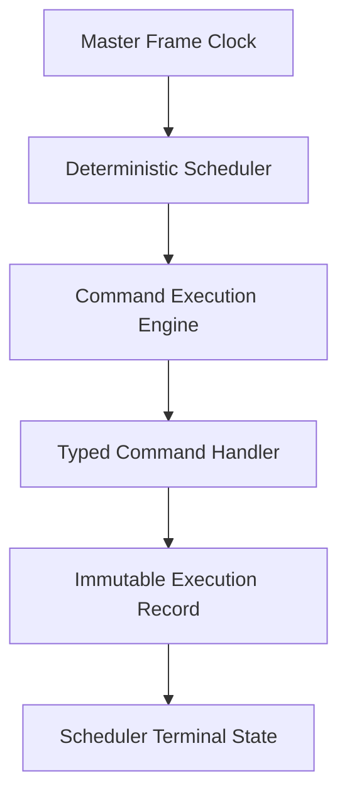
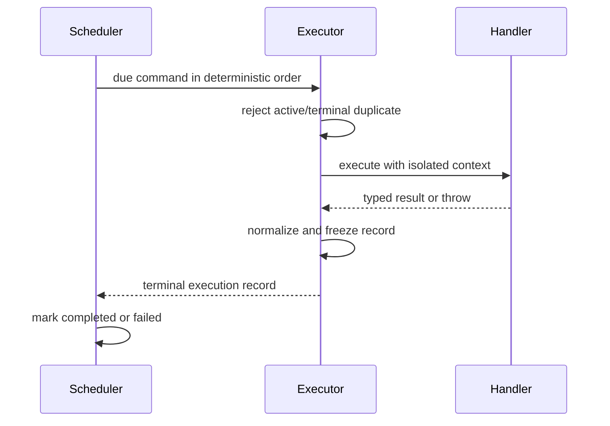
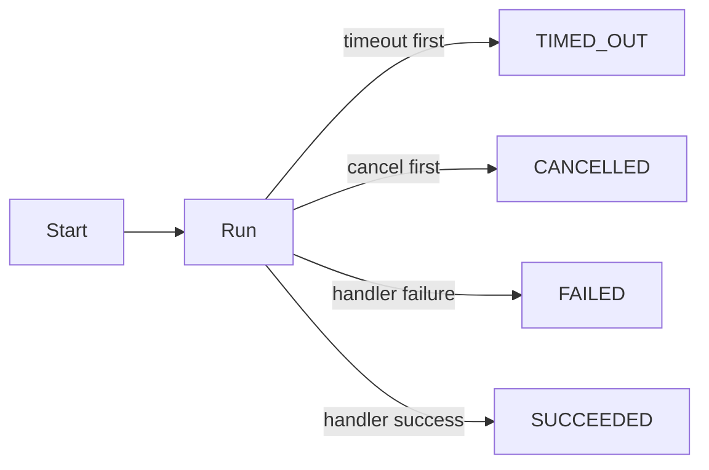
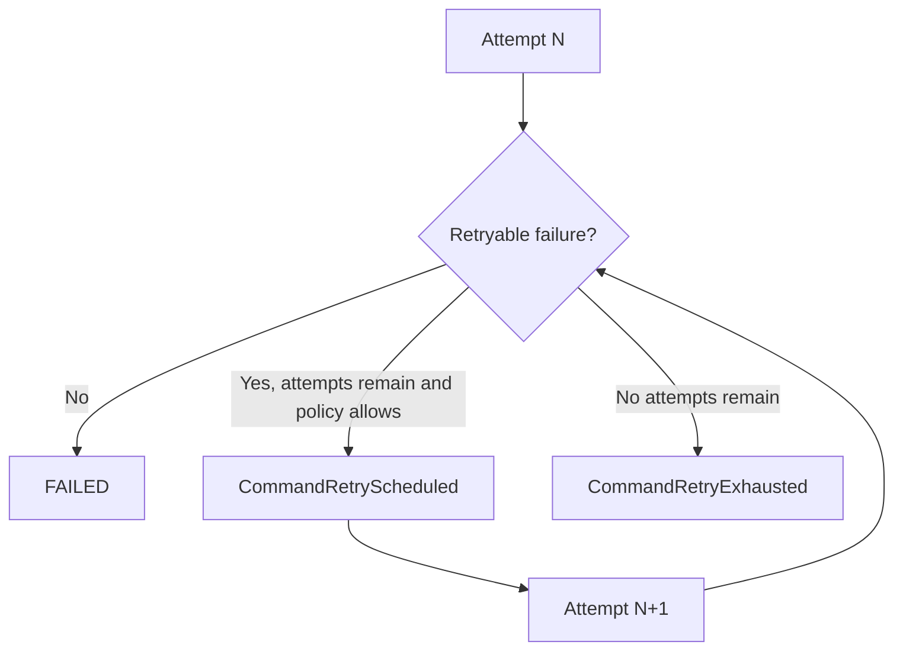
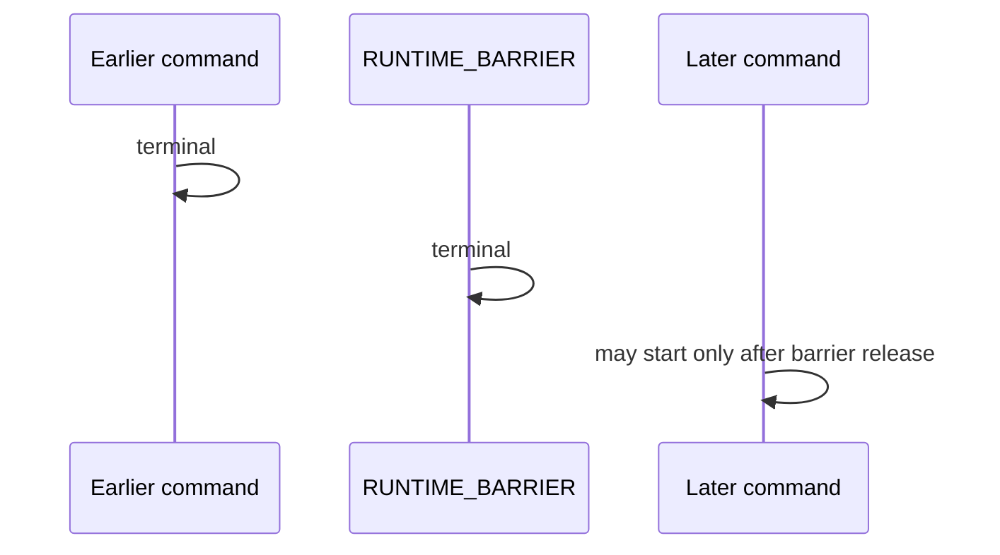

# UBOS v5.1.4 Command Execution Engine

UBOS v5.1.4 adds a dedicated, transport-agnostic command execution layer between the deterministic scheduler and typed runtime command handlers. The scheduler remains authoritative for readiness, ordering, expiration, dependencies, and queued state. The command execution engine is authoritative for handler resolution, attempt lifecycle, timeout/cancellation signaling, typed result normalization, retries, immutable execution history, and execution telemetry.

## Handler contract

Handlers may be legacy functions or typed handlers with `commandType` and `execute()`. Typed handlers return one of `SUCCEEDED`, `FAILED`, or `CANCELLED`; thrown `Error` and non-`Error` values are normalized into safe command errors. Payloads are not logged or copied into execution records by default; records store safe metadata only.

## Execution context

Handlers receive a restricted `RuntimeCommandContext` containing runtime identity, command identity, correlation/causation/source metadata, current lifecycle state, authoritative `FrameTick`, current/target frame, monotonic start timestamp, runtime configuration, logger, event publisher, cancellation signal, read-only services, attempt number, deadline, and command-local metadata. Scheduler internals and telemetry mutation APIs are not exposed.

## Lifecycle and exactly-once policy

A command ID may have only one active execution. A terminal command cannot be executed again in the same execution-engine history; duplicate active calls throw `DuplicateCommandExecution`, and duplicate terminal calls throw `CommandExecutionAlreadyTerminal`. Existing terminal records are available through inspection APIs rather than silent success.

## Timeout and cancellation

Timeouts start when handler execution begins. The executor aborts a command-local signal and records `TIMED_OUT`; JavaScript cancellation is cooperative, so late handler completions cannot overwrite the timeout record. Terminal precedence is runtime fatal failure, timeout, explicit cancellation, handler failure, then handler success.

## Retry model

Retries are opt-in through `CommandRetryPolicy` and only run automatically for commands whose policy is `EXECUTE_UNTIL_SUCCESS`. Retry attempts preserve command ID and correlation ID while increasing attempt numbers. Frame-critical commands default to no retry, so they fail rather than silently execute late unless explicitly configured.

## Idempotency and side effects

Commands may provide an idempotency key. The executor indexes records by key and rejects conflicting duplicate keys. This supports safe replay inspection for explicitly idempotent handlers, but UBOS only guarantees exactly-once execution inside the runtime. External side effects are not exactly-once unless a future external transactional system participates.

## Barrier behavior

`RUNTIME_BARRIER` uses the same executor path as all built-ins. Because the runtime loop executes due commands sequentially in scheduler order, later commands in the same batch cannot pass the barrier until the barrier reaches a terminal record. Barrier reached/released events make this observable.

## Failure policy and telemetry

The runtime applies `failOnCommandError`, `failOnCommandTimeout`, cancellation continuation, consecutive-failure counters, and failure-window counters after receiving execution outcomes. Telemetry now includes active, total, successful, failed, cancelled, timed-out, retried, exhausted-retry, duplicate-rejection, unknown-handler, duration, queue-latency, current-command, last-execution, and history-size fields.

## Events

The executor publishes command execution requested/started/succeeded/failed/cancelled/timed-out, retry scheduled/started/exhausted, duplicate rejected, handler resolved/missing, and barrier reached/released events through the existing runtime event envelope. Existing command started/completed/failed events are preserved for compatibility.

## Execution history and invariants

Execution history is bounded by `executionHistoryCapacity` and evicted deterministically in insertion order. Lookup is O(1) by command ID, execution ID, and idempotency key; correlation/type/outcome indexes are maintained for inspection. `assertInvariants()` validates active-count telemetry and history index integrity for development and tests.

## Transaction boundary and limitations

The current transaction boundary is: execute handler, atomically record one terminal outcome, then mark scheduler terminal state. General distributed transactions, rollback across external systems, media workers, video/audio processing, FFmpeg, GPU work, and source acquisition remain out of scope. v5.1.5 should harden this path in the continuous runtime loop with budgets, backpressure, overload handling, clean shutdown, and deterministic recovery.

## Final v5.1.4 audit notes

The final audit tightened several invariants:

- Terminal command IDs are retained independently from bounded history records. Evicting a record from inspection history does not permit the same command ID to execute again.
- Idempotency ownership is retained independently from bounded idempotency-record lookup. Evicting a record does not allow a conflicting command to reuse the same idempotency key.
- Explicit cancellation no longer resolves through the timeout path; timeout terminalization only wins when the command-local controller has not already been aborted for another reason.
- Runtime stop and runtime failure abort all active command-local cancellation signals so active execution tracking cannot remain orphaned.
- Telemetry clears the currently executing command fields when a command reaches a terminal outcome, and `assertInvariants()` validates active-count and history-index consistency.

The audit regression suite covers cancellation-versus-timeout precedence, terminal duplicate rejection after eviction, idempotency conflicts after eviction, non-`Error` throw normalization, runtime failure active-execution cleanup, and 10,000 sequential direct command executions with bounded history.
