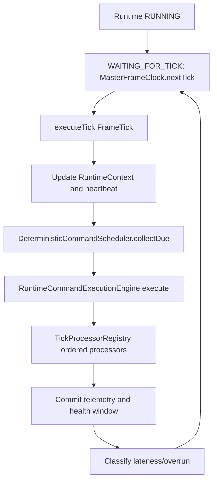
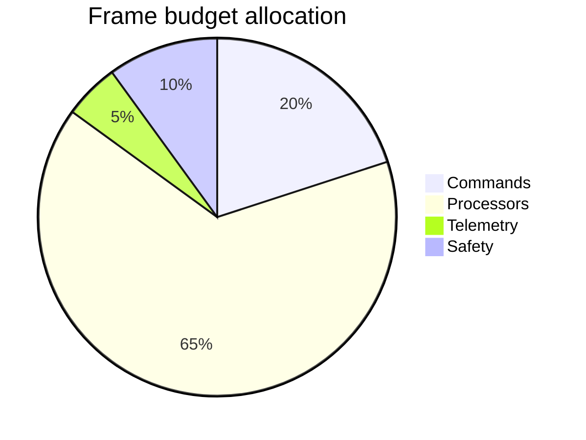
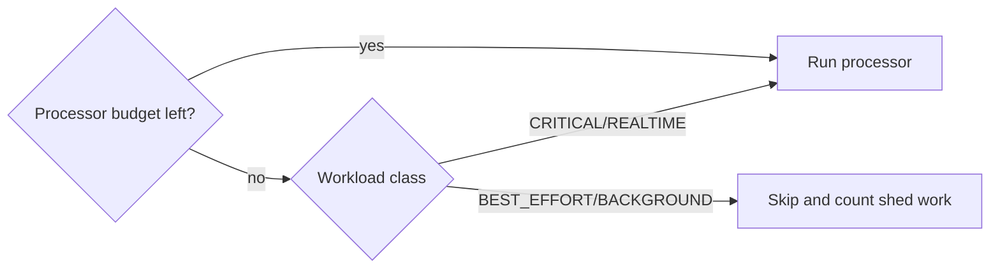
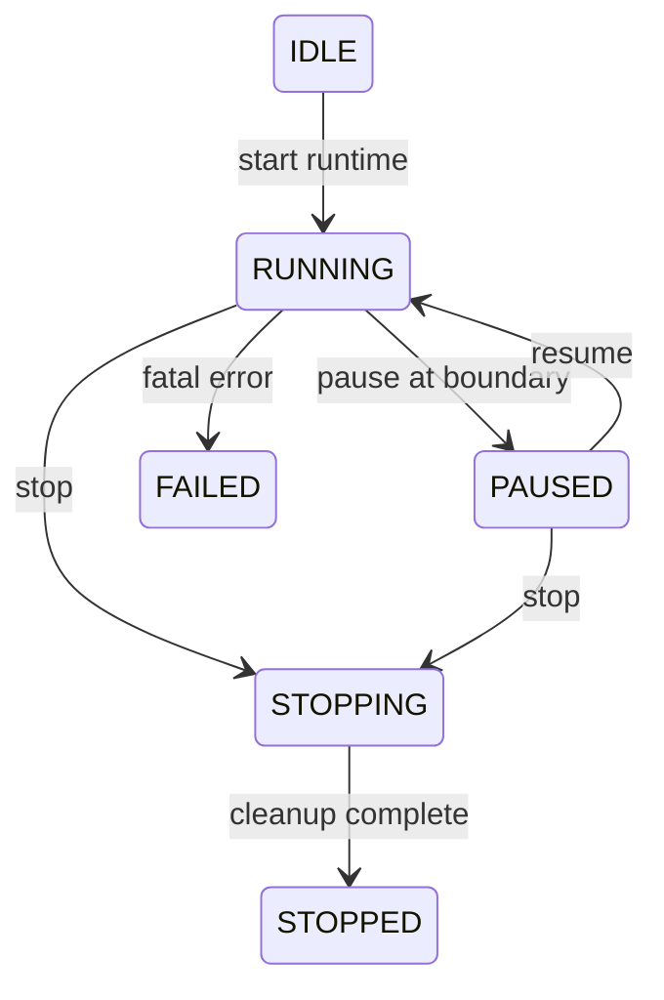

# UBOS v5.1.5 Runtime Execution Loop

UBOS v5.1.5 hardens the execution engine into a continuous broadcast runtime loop while preserving the v5.1.1 runtime lifecycle, v5.1.2 master frame clock, v5.1.3 deterministic scheduler, and v5.1.4 command execution engine.

## Architecture



The continuous loop and `executeSingleTick()` share the same internal `executeTick()` pipeline. Tests may inject a `FrameTick` directly, and continuous mode always obtains ticks from `MasterFrameClock.nextTick()` so frame numbering has one authority.

## Tick lifecycle

```mermaid
sequenceDiagram
  participant Loop
  participant Clock
  participant Scheduler
  participant Executor
  participant Processors
  participant Telemetry
  Loop->>Clock: nextTick()
  Clock-->>Loop: FrameTick
  Loop->>Scheduler: collectDue(frame)
  loop deterministic command order
    Loop->>Executor: execute(command, tick)
  end
  loop stable processor order
    Loop->>Processors: processTick(tick, context)
  end
  Loop->>Telemetry: commit RuntimeTickResult
```

Each tick records start, completion, duration, deadline, budget, command counts, processor counts, skipped work, overload state, missed frames, and discontinuities as JSON-safe strings for bigint values.

## Frame budgets and overruns

Budgets are configured as deterministic percentage basis points of the frame duration. Defaults allocate 20% to commands, 65% to processors, 5% to telemetry, and 10% to safety margin. Validation rejects illegal or over-allocated budgets.



Timing classification is `ON_TIME`, `LATE_START`, `SOFT_OVERRUN`, `HARD_OVERRUN`, `SEVERE_OVERRUN`, or `DISCONTINUITY`. Soft and hard overruns are recorded; severe overruns publish a specific severe event and influence overload state.

## Backpressure and load shedding

Processors can declare `CRITICAL`, `REALTIME`, `BEST_EFFORT`, or `BACKGROUND`. Legacy processors default to `REALTIME` and are not skipped. Best-effort/background processors may be skipped when processor budget is exhausted; skipped work is counted and emitted as events. Commands remain scheduler-ordered and are never silently skipped.



## Lifecycle coordination

Pause moves the loop to `PAUSING`/`PAUSED`, pauses the frame clock, preserves scheduled commands, and marks the next resumed clock tick as a discontinuity. Stop is idempotent, cancels pending command execution, stops the clock, shuts processors down in reverse order, commits final telemetry, and enters `STOPPED`. Failure records the first fatal error path, cancels work, emits failed events, and leaves the instance in `FAILED`.



## Heartbeat and health window

The loop exposes O(1) heartbeat fields: `lastLoopHeartbeatNs`, `currentLoopPhase`, `activeTick`, `currentTickFrame`, `loopIterations`, and `lastHealthyTickNs`. Recent tick health is maintained as a bounded deterministic ring buffer by slicing to the configured capacity on append. This is intentionally watchdog-ready for UBOS v5.1.7 without implementing process supervision.

## Event and telemetry failure policy

Event publication failures are counted and recorded without recursive event publication. In-memory telemetry commits remain in the critical path and external exporters are not added in this phase.

## Invariants

The implementation guards one active tick, one loop state per engine, stable scheduler command order, stable processor order, no ticks while not running, bounded health history, lifecycle/clock consistency, and terminal cleanup consistency.

## Complexity

Hot path complexity is O(1) for tick state and telemetry counters, inherited scheduler complexity for due collection, O(c) for commands, O(p) for processors, and O(w) bounded only by the configured health-window capacity for immutable snapshot creation.

## Next phase

UBOS v5.1.6 should formalize the plugin-style Tick Processor Framework for future source, video, audio, graphics, recording, streaming, and replay processors.
