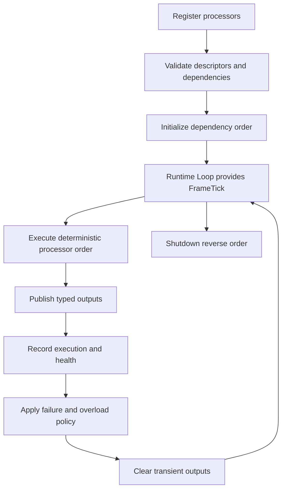
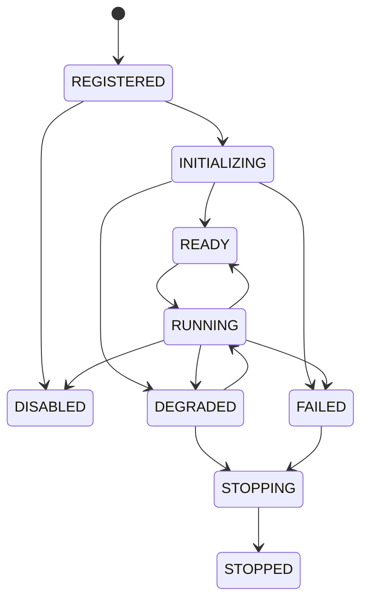
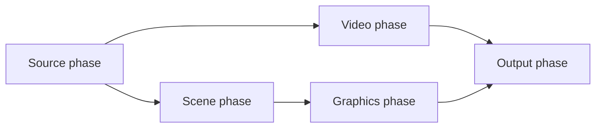
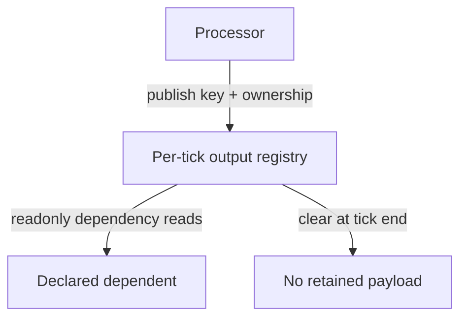
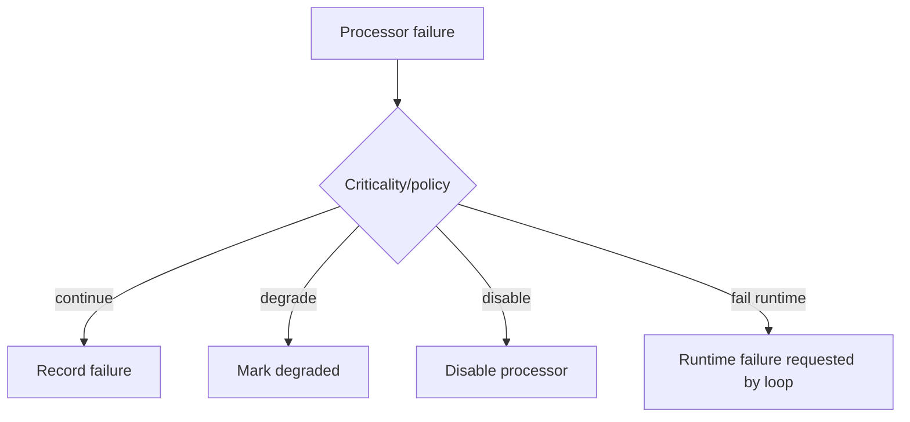
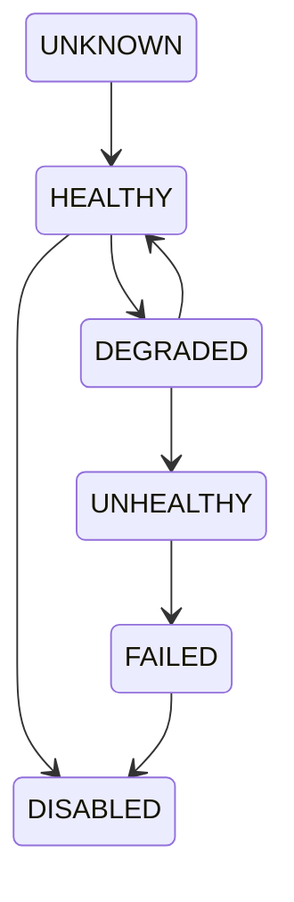
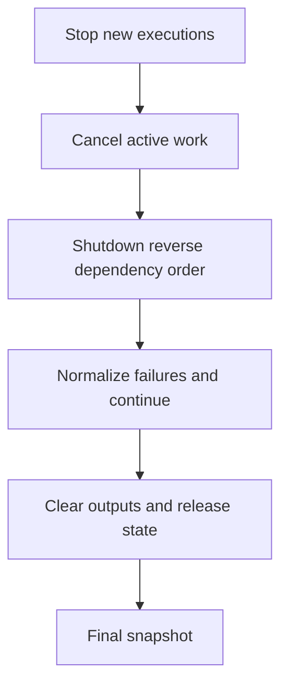

# UBOS v5.1.6 Tick Processor Framework

UBOS v5.1.6 formalizes the existing runtime-loop processor hook into a deterministic, transport-neutral framework. It reuses the v5.1.1 runtime lifecycle, v5.1.2 Master Frame Clock, v5.1.3 Deterministic Scheduler, v5.1.4 Command Execution Engine, and v5.1.5 Runtime Loop. The Runtime Loop remains authoritative for per-frame orchestration; the Master Frame Clock remains authoritative for frame timing.

## Processor flow



## Lifecycle



Invalid transitions raise typed processor framework errors. Processor-local state remains private and is only passed through restricted contexts.

## Descriptor model

Each processor has an immutable serializable descriptor: identity, name, version, explicit order, optional phase, workload class, default enablement, dependencies, optional capabilities, budget metadata, timeout, load-shedding flag, failure policy, criticality, hot-operation support flags, state persistence policy, and safe metadata.

## Dependency and ordering model

The framework validates missing dependencies, detects cycles, rejects reverse cross-phase dependencies, initializes dependencies before dependents, executes dependency-respecting order, and shuts down dependents before dependencies.



Ordering is deterministic: dependency topology, phase order, explicit order, then processor ID. Registration order is not a tie-breaker.

## Per-tick pipeline

```mermaid
sequenceDiagram
  participant Loop as Runtime Loop
  participant FW as TickProcessorRegistry/Framework
  participant P as Processor
  participant Out as Output Registry
  Loop->>FW: executeTick(FrameTick, budgets, overload)
  FW->>P: processTick(tick, restricted context)
  P->>Out: publish handles/references
  FW->>FW: create immutable execution record
  FW->>FW: update health and telemetry counters
  FW->>Out: clearTick()
  FW-->>Loop: ProcessorExecutionRecord[]
```

## Contexts and result types

Initialization, runtime, and shutdown contexts expose runtime ID, processor ID, descriptor, logger, events, readonly services, monotonic time, cancellation signals, attempts, dependency health, budgets, overload state, and output access. They do not expose mutable scheduler, lifecycle, telemetry, or other processor state internals.

Typed results include READY, DEGRADED, FAILED initialization outcomes and SUCCEEDED, SKIPPED, DEGRADED, FAILED, CANCELLED, and TIMED_OUT tick outcomes. Thrown values are normalized into safe processor errors.

## Output ownership



Output ownership supports BORROWED, OWNED_BY_PROCESSOR, OWNED_BY_RUNTIME, and EXTERNAL_HANDLE. The registry stores references/handles, rejects duplicate keys, deep-freezes published values where practical, and clears transient data at tick end. It does not introduce frame buffers or media libraries.

## Budgets, load shedding, and failure policy

The Runtime Loop supplies the frame and processor budgets. Processor descriptors provide estimated, maximum, and timeout metadata. Critical/realtime processors execute unless unavailable or failing; best-effort/background processors may be skipped under overloaded/critical runtime states. Skips and overruns are observable in execution records, health, events, and runtime tick counts.

Failure policies are descriptor-level and include CONTINUE, DEGRADE_PROCESSOR, DISABLE_PROCESSOR, DEGRADE_RUNTIME, PAUSE_RUNTIME, STOP_RUNTIME, and FAIL_RUNTIME. Processors cannot directly mutate runtime lifecycle.



## Health and recovery

Health snapshots track lifecycle, enabled/initialized state, success/failure frames, consecutive and window failures, rolling average and maximum duration, overruns, timeouts, skipped executions, dependency health, last error/warning, and update time. Recovery hooks are defined by the contract but uncontrolled self-restarting processors are not implemented.



## Enable, disable, and replacement

Enable/disable operations are explicit. Disabling a processor with active enabled dependents is rejected. Hot enable/disable is only allowed when the descriptor opts in. State can reset on disable when the descriptor policy is RESET_ON_DISABLE. Hot replacement is intentionally not transparent; unsupported replacement raises `ProcessorReplacementNotSupported`.

## Shutdown



Shutdown is idempotent at the runtime layer and prevents post-stop execution.

## Events, telemetry, security, and invariants

The framework emits lifecycle, execution, skip, timeout, dependency, disable/enable, and shutdown events using the runtime event envelope. Telemetry remains bounded and stores timing, counts, health summaries, and last execution summaries rather than processor state, payloads, stream keys, or media buffers. Descriptor metadata and errors are summarized to avoid secret leakage.

`assertInvariants()` validates unique IDs, immutable descriptors, acyclic dependency graph, resolved dependencies, deterministic orders, active-execution consistency, disabled/failed execution guards, bounded history, and output-registry tick scoping.

## Validation and future integration

Long-run validation uses fake clocks and deterministic ticks rather than real sleeping. The framework provides the plug-in point for future v5.2-v5.9 source, video, audio, graphics, output, replay, monitoring, and diagnostics processors, and is the monitored execution subsystem for v5.1.7 Telemetry & Watchdog.
