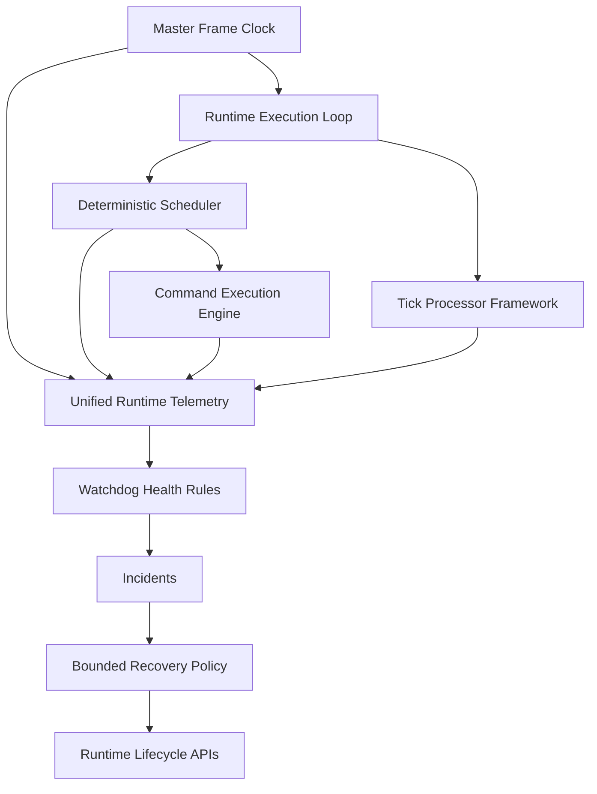
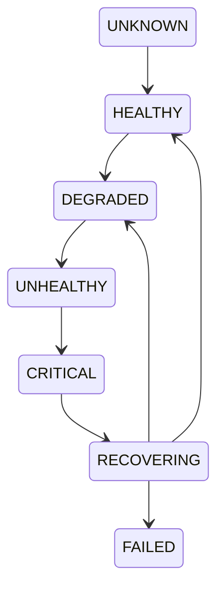
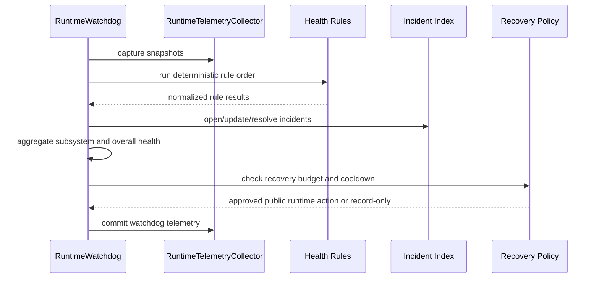
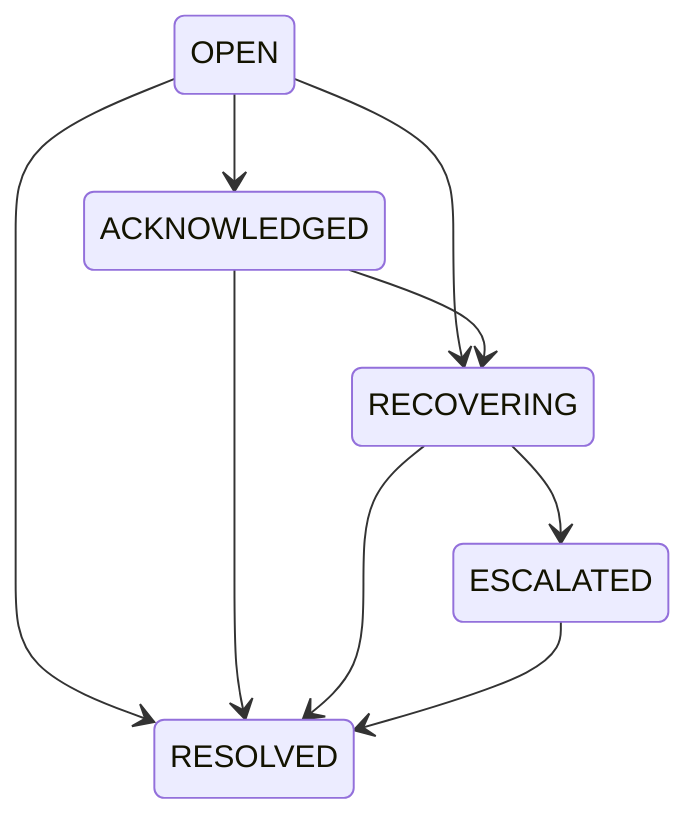
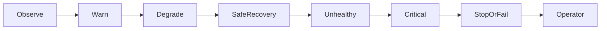

# UBOS v5.1.7 Telemetry & Watchdog

UBOS v5.1.7 adds a deterministic runtime watchdog that observes the v5.1 execution engine without becoming a second executor. It reuses the Master Frame Clock, Runtime Execution Loop heartbeat fields, Deterministic Scheduler snapshots, Command Execution Engine counters and invariants, Tick Processor Framework health snapshots, RuntimeTelemetryCollector, lifecycle APIs, and runtime event envelope.

## Health model

Health states are `UNKNOWN`, `HEALTHY`, `DEGRADED`, `UNHEALTHY`, `CRITICAL`, `RECOVERING`, `DISABLED`, `STOPPED`, and `FAILED`. Severity is separate: `INFO`, `WARNING`, `ERROR`, and `CRITICAL`. Overall health is calculated by precedence: failed/critical required subsystems dominate, followed by unhealthy, degraded, healthy, and unknown data.

## Evaluation flow

## Supervised subsystems

The watchdog defines explicit subsystem identities for `RUNTIME`, `FRAME_CLOCK`, `SCHEDULER`, `COMMAND_EXECUTOR`, `RUNTIME_LOOP`, `PROCESSOR_FRAMEWORK`, `EVENT_PUBLISHER`, `TELEMETRY`, and placeholder `WORKER_SUPERVISION`. Future v5.2+ media subsystems are reserved but not implemented.

## Rules and incidents

Rules are pure observers with stable IDs. They detect stale loop heartbeats, active tick stalls, clock drift/lateness, missed-frame windows, scheduler queue pressure, scheduler/executor/processor invariant failures, command failure loops, runtime overruns, processor health thresholds, event publisher failures, and stale telemetry. Repeated observations deduplicate by subsystem and incident code, increment occurrence counts, and preserve active incidents before bounded eviction.

## Recovery policy

Automatic recovery is disabled by default. When enabled, only bounded public lifecycle actions are allowed: record-only, pause, resume, stop, fail, clear noncritical diagnostics, or request operator intervention. The watchdog never mutates scheduler internals, executor history, processor state, frame numbers, clock internals, telemetry counters outside telemetry commits, or lifecycle state directly.

## Diagnostics, telemetry, and security

Runtime health snapshots, subsystem health snapshots, incidents, recovery attempts, and diagnostics are immutable JSON-safe operator summaries. Bigints are serialized as strings. Redaction removes keys such as stream keys, tokens, passwords, credentials, auth values, and cookies. Diagnostics contain safe summaries only; no media payloads, raw command payloads, credentials, or full processor state are serialized.

## Invariants and validation

`assertInvariants()` verifies non-overlapping evaluation, bounded incident and diagnostic history, unique incident IDs, valid resolved incident state, timer shutdown, and overall health precedence. Validation includes watchdog creation/start/stop, duplicate start and stop idempotency, manual evaluation, heartbeat incidents, scheduler pressure health, incident acknowledgement, redaction, immutable diagnostics, and 1,000 deterministic evaluations in package validation; the watchdog data structures remain bounded for larger long-run harnesses without real sleeping.

## v5.1 completion checklist

- Runtime lifecycle: complete and reused.
- Master Frame Clock: complete and observed.
- Deterministic Scheduler: complete and observed through snapshots/invariants.
- Command Execution Engine: complete and observed through counters/invariants.
- Runtime Execution Loop: complete and observed through heartbeat/tick windows.
- Tick Processor Framework: complete and observed through framework snapshots/invariants.
- Telemetry: extended with watchdog fields.
- Watchdog: complete for v5.1.7 execution-engine supervision.
- Tests and long-duration simulation: deterministic validation added.
- Documentation: this architecture note documents v5.1.7 and v5.2 integration boundary.
- Public API stability: existing v5.1.1-v5.1.6 APIs are reused, not redesigned.
- Known limitations: no source acquisition, media processing, external monitoring vendor, worker process manager, or destructive recovery by default.
- Readiness for v5.2: ready for Source Acquisition Foundation after audit and release validation; no release tag is created here.
