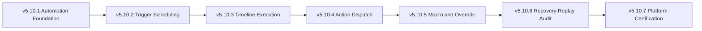

# UBOS v5.10.7 — Automation Platform Certification

UBOS v5.10.7 certifies the v5.10 automation, rundown, and show-control platform as a deterministic, bounded, metadata-only subsystem. The certification spans v5.10.1 through v5.10.6: automation/show-control foundation, trigger scheduling, rundown timeline execution, show-control action dispatch, macro/operator override coordination, and recovery/replay/audit coordination.

## Certification scope

The phase adds no real device execution, network operations, native handles, file access, rendering, or external side effects. Certification validates the automation control contract through synthetic metadata-only scenarios and deterministic replay.

Certified processor order:

## Validation guarantees

The dedicated validation harness covers at least 90 certification scenarios, 100,000 authoritative FrameTicks, and 10,000 synthetic operations for each major automation area:

- rundown cue lifecycle and exact-once cue handling;
- clock, delay, event, rundown-state, health, and composite trigger readiness;
- timeline dependency blocking, execution, completion, and failure preservation;
- show-control target capability matching, priority dispatch, acknowledgements, failures, and expiries;
- macro step dispatch accounting plus hold, bypass, cancel, and manual-only operator overrides;
- redacted audit events, recovery point hash validation, replay acknowledgement, replay failure, and deterministic replay dispatch.

The harness also verifies stale-generation rejection, metadata redaction, unsafe URL/path/credential/native-handle rejection, monotonic FrameTicks, bounded queue cleanup, immutable canonical snapshots, telemetry honesty, watchdog consistency, and zero active queues after shutdown.

## Release determination

Final certification result: **PASS** for local v5.10.7 validation. UBOS v5.10 is ready for a separate platform release-finalization phase when maintainers authorize release preparation. No release tag is created by this certification phase.

Recommended future release tag: `v5.10.0`.
Recommended release title: **UBOS v5.10 Automation, Rundown, and Show-Control Platform**.
Recommended next eligible phase: **v5.10.0 platform release finalization**, if maintainers choose to prepare the release locally before any tag publication.
