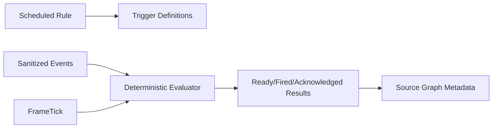

# UBOS v5.10.2 — Production-Safe Automation Triggering, Scheduling, and Conditional Logic

UBOS v5.10.2 adds a metadata-only trigger scheduling engine for automation rules. It evaluates clock, delay, event, rundown-state, health, and composite triggers against deterministic frame ticks and sanitized event metadata.

## Production-safety boundaries

- The engine does not contact devices, networks, URLs, files, native handles, or streaming endpoints.
- Rule, trigger, and event metadata is redacted before publication.
- Stale rule generations are rejected to preserve authoritative workflow ordering.
- Trigger results are deterministic for equivalent rules, events, and frame numbers.
- Processor output is published as borrowed metadata snapshots only.

## Validation coverage

The focused validation covers stale generation rejection, clock/event/health triggers, conditional equality checks, event metadata redaction, acknowledgement, metadata-only telemetry, Source Graph metadata, and 10,000 synthetic processor-equivalent frames.
