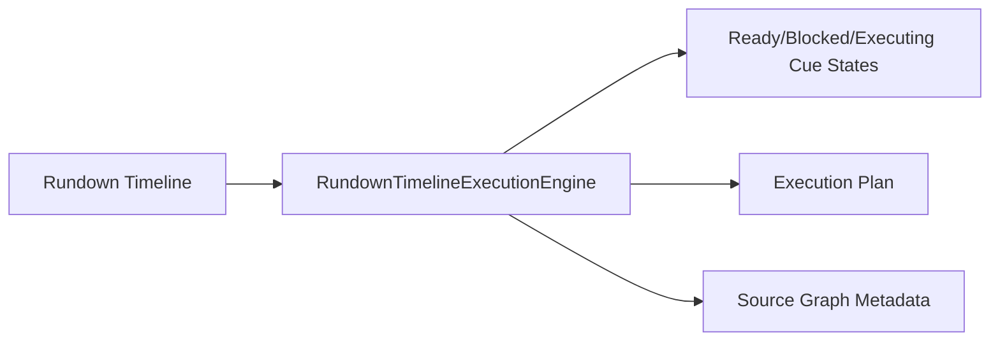

# UBOS v5.10.3 — Production-Safe Rundown Timeline Execution and Cue Dependency Coordination

UBOS v5.10.3 adds a metadata-only rundown timeline execution engine for deterministic cue readiness, dependency blocking, and exact-once execution planning. The engine never controls real devices, network endpoints, files, or media bytes; it publishes safe Source Graph metadata and immutable snapshots for orchestration layers.

## Production-safety rules

- Timeline and cue generations reject stale updates.
- Sensitive metadata keys such as credentials, tokens, endpoints, paths, and buffers are redacted.
- Cue execution is exact-once per cue generation.
- Dependency modes support all-completed, any-completed, and none-failed coordination.
- The TickProcessor publishes metadata-only snapshots and degrades without touching physical devices.
