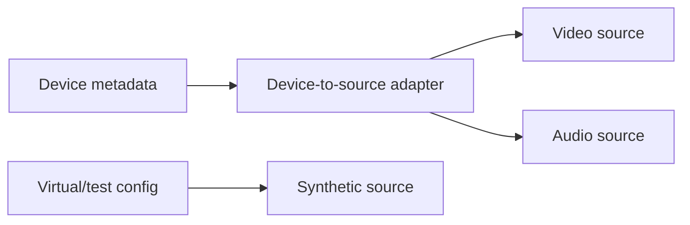
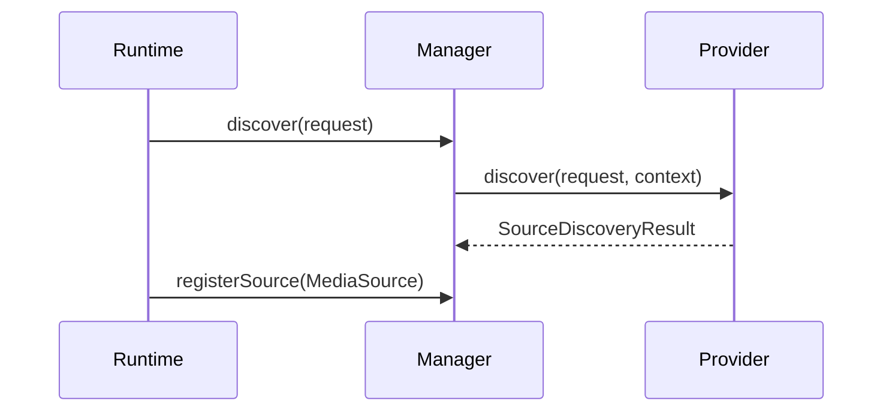
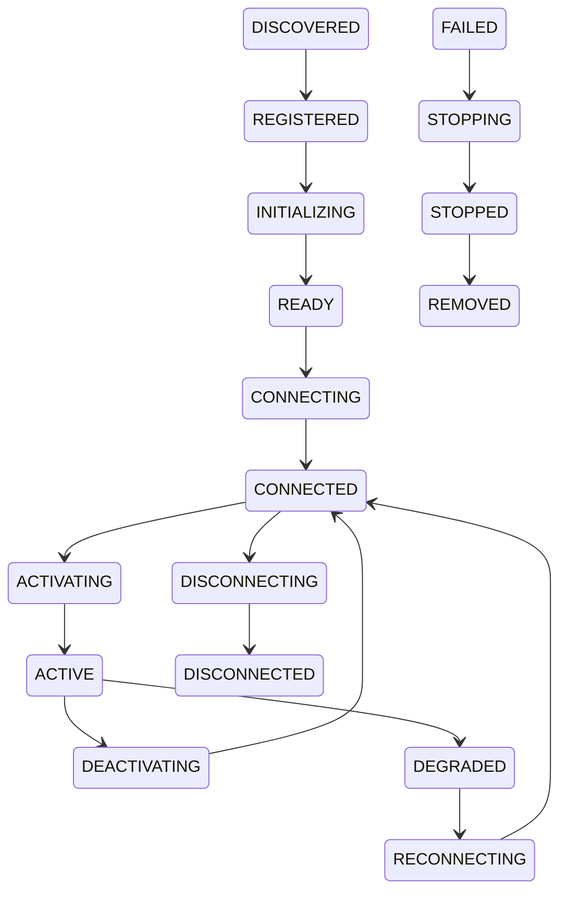
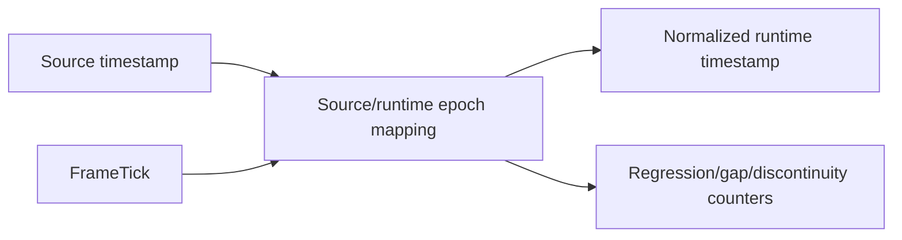
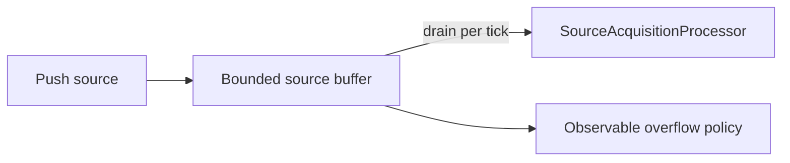
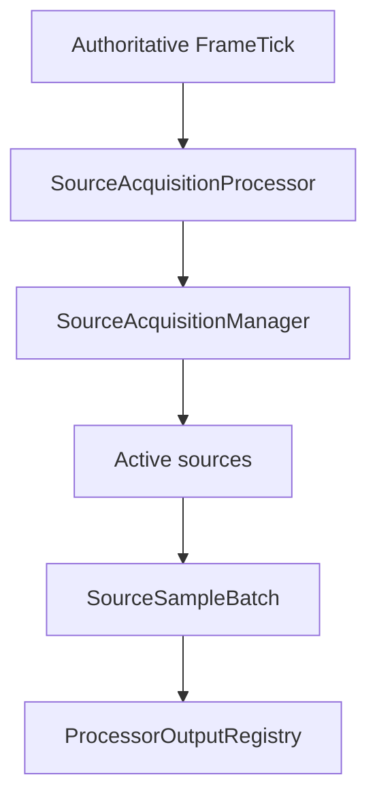
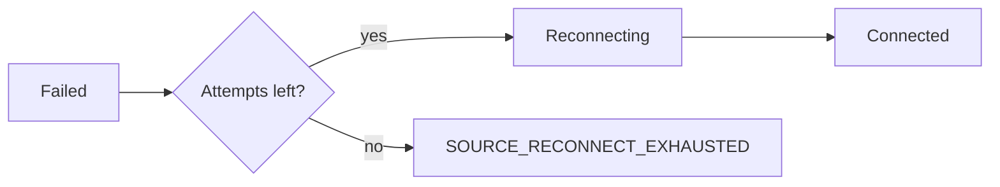
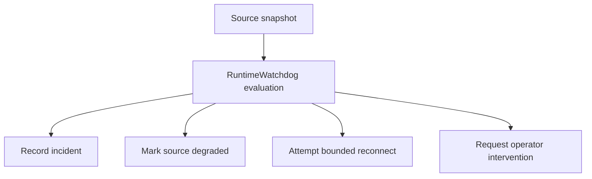

# UBOS v5.2.1 Source Acquisition Foundation

## Purpose

UBOS v5.2.1 introduces a media-library-independent source layer for camera, file, screen, browser, audio, network, synthetic, and custom inputs. It does not implement real capture protocols; it defines stable contracts, deterministic lifecycle, format negotiation, sample envelopes, buffering, telemetry, watchdog incident vocabulary, and a Tick Processor Framework integration point.

## Device layer versus source layer

The existing device platform remains responsible for hardware or endpoint discovery, device capability metadata, profiles, connection state, and device health. The source layer represents a usable media input instance. A device can expose multiple sources; virtual or synthetic sources can exist without a physical device.

## Source architecture

`DefaultSourceAcquisitionManager` owns source providers, source instances, immutable inspection snapshots, format selection, lifecycle transitions, acquisition telemetry, bounded buffers, and invariant checks. It has no internal timing loop; acquisition is driven by authoritative runtime ticks.

## Source provider model

`SourceProvider` discovers descriptors, creates `MediaSource` instances, and shuts down deterministically. v5.2.1 ships `SyntheticSourceProvider`; future providers can add camera, screen, file, browser, NDI, SRT, RTMP, WebRTC, and remote guest implementations without changing common contracts.

## Source lifecycle

The lifecycle is explicit and validated: `DISCOVERED`, `REGISTERED`, `INITIALIZING`, `READY`, `CONNECTING`, `CONNECTED`, `ACTIVATING`, `ACTIVE`, `DEGRADED`, `RECONNECTING`, `DEACTIVATING`, `DISCONNECTING`, `DISCONNECTED`, `UNAVAILABLE`, `FAILED`, `STOPPING`, `STOPPED`, and `REMOVED`.

## Source descriptor

`SourceDescriptor` is immutable and JSON-safe. It includes source identity, provider id, type, media kinds, capability metadata, supported and default formats, availability, permission state, acquisition mode, latency class, clock domain, tags, and safe metadata.

## Media formats

The format model covers transport-neutral video, audio, and data formats. Video includes dimensions, rational frame rate, pixel/color attributes, scan/field order, aspect ratio, alpha, bit depth, rotation, memory domain, and hardware hints. Audio includes sample rate, channels, layout, sample format, planar/interleaved, bit depth, clock domain, frames per buffer, and latency. Data includes content type, schema id, encoding, and timebase.

## Format negotiation

`negotiateSourceFormat` validates requests, filters unsupported formats, rejects required-constraint violations, scores preferences deterministically, and tie-breaks by latency, resource cost, and canonical format id. Tests verify provider enumeration order does not change the selected result.

## Acquisition modes

Sources declare `PUSH`, `PULL`, or `HYBRID`. PUSH uses bounded buffers or callbacks, PULL is queried per runtime tick, and HYBRID allows asynchronous ingress with runtime-pulled normalized samples. The v5.2.1 synthetic source primarily uses PULL while preserving the shared mode contract.

## Timestamp normalization

`DeterministicSourceTimestampNormalizer` maps source timestamps to runtime tick time, establishes epochs, detects backward movement, sequence gaps, discontinuities, reconnection resets, and exposes bounded snapshots.

## Video frame envelope

`VideoFrameEnvelope` carries source id, stream id, sequence, source and normalized timestamps, duration, PTS/DTS, format, keyframe/discontinuity/corruption/drop flags, memory domain, opaque payload handle, and safe metadata. Raw image data is never placed in telemetry.

## Audio buffer envelope

`AudioBufferEnvelope` carries source id, stream id, sequence, source and normalized timestamps, duration, sample count, format, discontinuity/corruption/drop flags, opaque payload handle, and safe metadata. It does not implement mixing or DSP.

## Buffering

`SourceBoundedBuffer` enforces maximum video, audio, and metadata counts with high/low-water configuration and overflow/underflow policies. Drops and gaps are observable through counters.

## Source Acquisition Processor

`SourceAcquisitionProcessor` executes in the v5.1 `SOURCE` processor phase, receives `FrameTick`, queries active sources, publishes video/audio/metadata/health/statistics into the per-tick output registry, and skips duplicate execution for the same tick.

## Runtime command integration

v5.2.1 defines typed command names for source register, remove, connect, disconnect, activate, deactivate, set format, reconnect, reset, enable, and disable. Commands are intended to be handled by the existing Command Execution Engine so mutations remain scheduled and exactly-once.

## Health model

`SourceHealthSnapshot` reports lifecycle, health state, connection/activation, selected format, last samples, bounded failure counts, reconnect attempts, dropped samples, buffer pressure, timestamp instability, latency, jitter, last error, and update time.

## Reconnection

`SourceReconnectPolicy` is bounded and deterministic, with enablement, maximum attempts, initial delay, backoff, maximum delay, reset-after-healthy, and jitter percent. v5.2.1 models the policy and synthetic failures; real network reconnects are deferred.

## Discovery

Discovery supports provider filtering, media-kind filtering, source-type filtering, deduplication by stable identity, stable ordering, warnings, provider errors, unavailable descriptors, duration, and partial results. Synthetic discovery is deterministic.

## Permissions

Permission states are modeled as `UNKNOWN`, `NOT_REQUIRED`, `PROMPT_REQUIRED`, `GRANTED`, `DENIED`, `RESTRICTED`, and `UNAVAILABLE`. OS prompts are intentionally deferred.

## Telemetry

`SourceTelemetrySnapshot` summarizes counts, frames/buffers/samples received and dropped, buffer pressure, timestamp instability, reconnects, acquisition timing, active source ids, last source event, and health summary. It avoids unbounded per-source telemetry.

## Watchdog integration

v5.2.1 adds source watchdog incident vocabulary: `SOURCE_STALLED`, `SOURCE_UNAVAILABLE`, `SOURCE_TIMESTAMP_UNSTABLE`, `SOURCE_BUFFER_PRESSURE`, `SOURCE_RECONNECT_EXHAUSTED`, `SOURCE_PROCESSOR_FAILED`, and `SOURCE_INVARIANT_FAILURE`. Safe recovery remains policy-controlled and does not restart the runtime by default.

## Security and redaction

Descriptors and errors are sanitized for sensitive query values and credentials. Payloads are opaque handles, metadata is cloned/frozen, and raw media/provider state is not serialized into telemetry or events.

## Invariants

The manager asserts unique source ids, registered providers, valid transitions, active implies connected, removed sources are gone, selected formats are supported, buffer capacities are respected, reconnect budgets are bounded, and telemetry remains aligned with snapshots.

## Synthetic source

`SyntheticMediaSource` supports video-only, audio-only, audio/video formats, deterministic sequences and timestamps, configurable dropped samples, timestamp discontinuities, connection failures, opaque handles, and pull acquisition suitable for tests and long-run validation.

## Long-run validation

The validation script simulates 100,000 acquisition ticks over video, audio, and audio/video synthetic sources, with periodic drops and discontinuities, validating stable ordering, no duplicate tick execution, bounded buffers, telemetry, and clean shutdown.

## Performance complexity

Expected complexity: source/provider lookup O(1), buffer enqueue/dequeue O(1), timestamp normalization O(1), format negotiation O(f log f), tick traversal O(s), snapshot O(s), watchdog evaluation O(s + bounded incidents).

## Current limitations

Real camera capture, OS permissions, screen capture, browser rendering, file decoding, NDI/SRT/RTMP/WebRTC transport, PCM/video acquisition, FFmpeg/GStreamer/GPU dependencies, composition, mixing, recording, streaming, and replay remain out of scope.

## Integration points for v5.2.2 Device Discovery

v5.2.2 should connect device discovery providers to source providers using the `createSourceDescriptorFromDevice` adapter, map device profiles into source roles/default formats, and keep the source manager as the single lifecycle/acquisition boundary.
