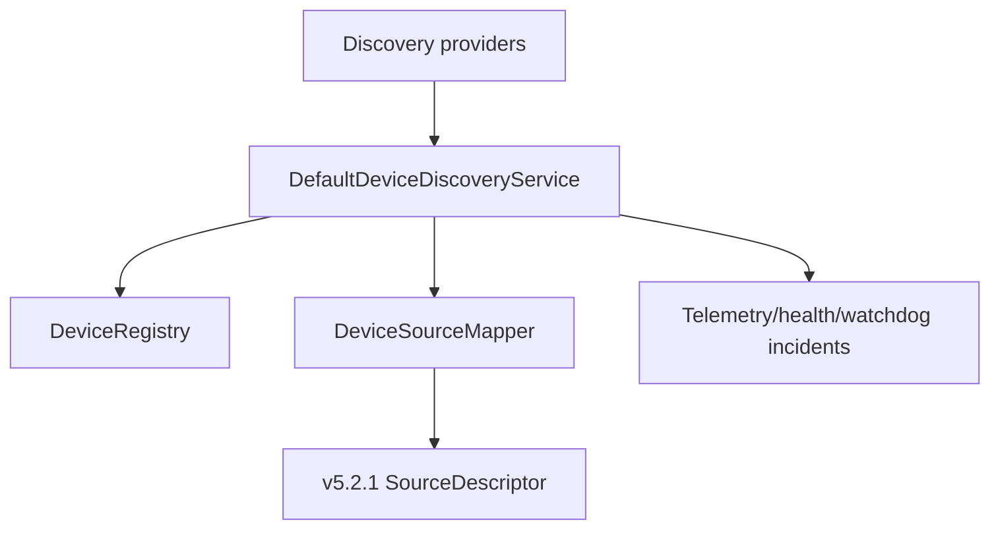
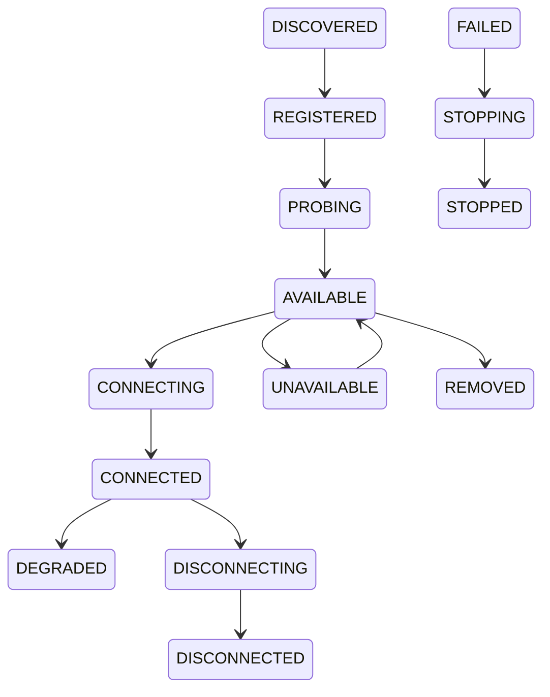
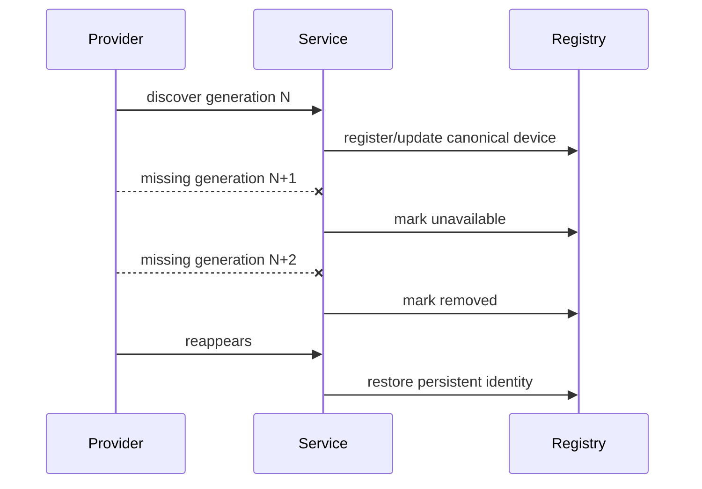
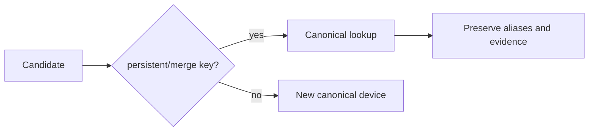
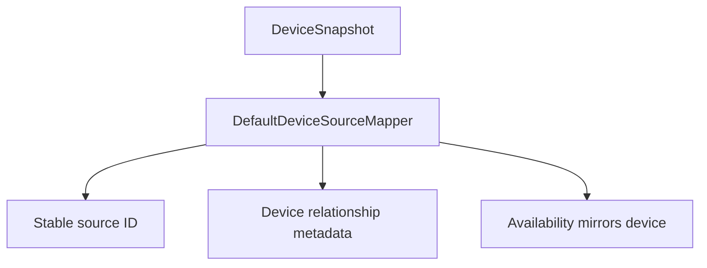

# UBOS v5.2.2 Device Discovery

UBOS v5.2.2 adds a production discovery layer that enumerates device metadata without opening cameras, microphones, screens, or network media streams. Devices remain separate from sources: devices describe hardware or virtual endpoints; source descriptors are acquisition-ready contracts generated from devices under an explicit registration policy.

## Architecture and provider contract

`DefaultDeviceDiscoveryService` reuses `DeviceRegistry` as the authoritative record store and supports deterministic provider registration, discovery, refresh, monitoring, snapshots, shutdown, and invariant checks. Providers expose descriptors with priority, supported device types, monitoring/probe support, native-bridge requirements, and safe metadata. Execution order is priority, provider ID, then registration sequence.

## Stable identity and privacy

Each `DeviceSnapshot` includes `DeviceIdentity` with provider ID, persistent identity, session identity, safe transport/manufacturer/model fields, deterministic hashes for serial numbers and hardware paths, and redacted metadata. Display names are never accepted as the sole identity, and public snapshots avoid raw paths, serials, tokens, URLs, and credentials.

## Lifecycle

Valid transitions are exported as `DEVICE_DISCOVERY_LIFECYCLE_TRANSITIONS`; invalid transitions use typed errors.

## Generations, arrival/removal, and monitoring

Refresh increments a monotonic generation and tracks first seen, last seen, consecutive missing generations, removal generation, and reappearance generation. Monitoring supports one active monitor per provider with clean stop and shutdown; tests use fake time and no real sleeping.

## Deduplication

Deduplication uses persistent identity or explicit merge keys, never display name alone. Canonical choice is deterministic, aliases are retained, and cross-provider merge can be disabled by providers.

## Capabilities, probing, and permissions

The capability model is transport-neutral and covers video, audio, and general metadata-only capabilities without codec or media-library dependencies. Probe states include `NOT_REQUESTED`, `PENDING`, `COMPLETE`, `PARTIAL`, `FAILED`, and `UNSUPPORTED`; probe results are cached in immutable snapshots and failures do not remove devices. Permission states match v5.2.1 source acquisition and denial changes availability details without equating to removal.

## Device-to-source mapping and policies

`DeviceSourceMapper` maps one device to zero, one, or many `SourceDescriptor` objects. `DefaultDeviceSourceMapper` reuses the v5.2.1 device-to-source adapter, generates stable source IDs, does not connect or activate sources, and supports `DISCOVER_ONLY`, `REGISTER_AVAILABLE_SOURCES`, `REGISTER_ALL_KNOWN_SOURCES`, and `REGISTER_ON_OPERATOR_REQUEST` policy boundaries.

## Health, telemetry, and watchdog

Snapshots include bounded health fields for lifecycle, availability, permission, probing, failures, latency, and update time. Telemetry aggregates provider counts, device counts, permission denials, probe counts, arrival/removal/reappearance, deduplication, duration windows, generation, last event, and health summary. Watchdog incident identifiers include discovery stalls, provider failures, unavailable/removed devices, permission denial, probe failure, monitoring failure, identity conflicts, registry invariant failures, and source mapping failures.

## Synthetic and platform providers

Deterministic synthetic providers model cameras, microphones, capture cards, virtual devices, aliases, permission states, monitoring, and capability probes without media frames. Windows, macOS, and Linux provider stubs document future boundaries for Media Foundation/WASAPI/DXGI, AVFoundation/CoreAudio/ScreenCaptureKit, and V4L2/ALSA/PipeWire.

## Invariants and validation

Invariants verify unique provider/device IDs, valid lifecycle state, removed devices not available, generation monotonicity, source mappings to existing devices, no display-name-only identity, redaction, bounded telemetry histories, and clean shutdown. Long-run validation simulates 1,000 devices and 100,000 refresh generations with stable identity and source IDs.

## Current limitations and v5.2.3 integration

This phase is metadata-only. It intentionally does not implement native enumeration, OS permission prompts, real capture, codecs, streaming protocols, GPU processing, auto-connect, or auto-activation. v5.2.3 Source Graph can consume stable device/source mappings and health/telemetry snapshots to build graph-level routing and policy.
