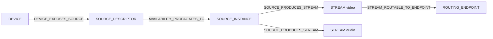
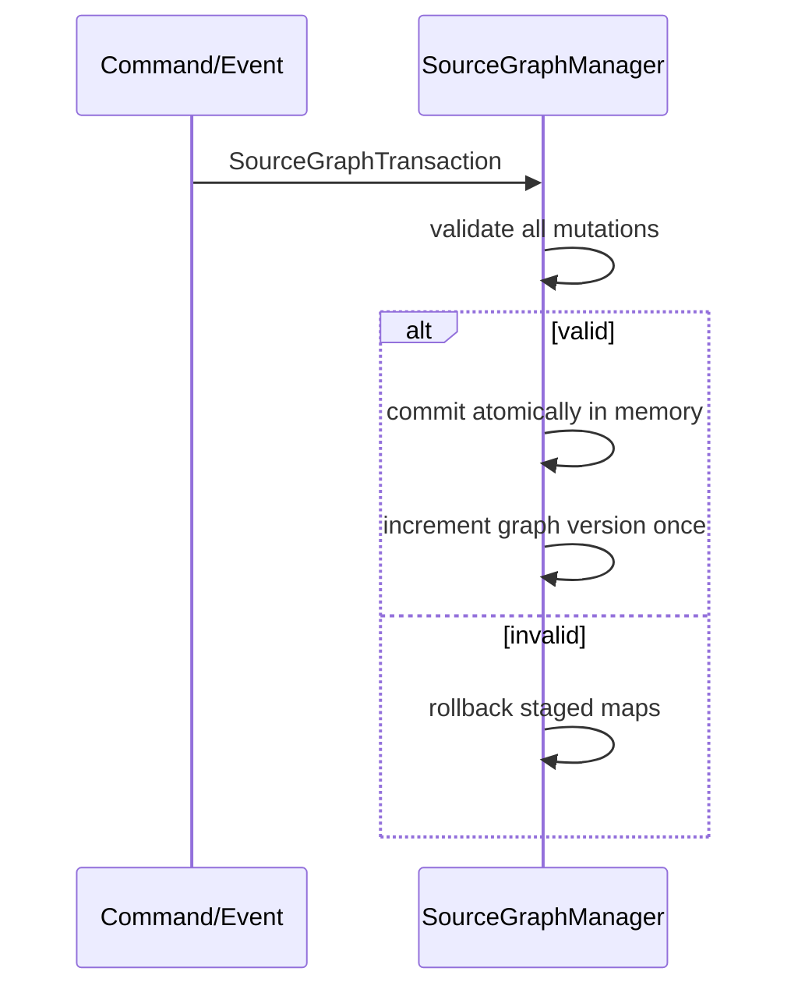
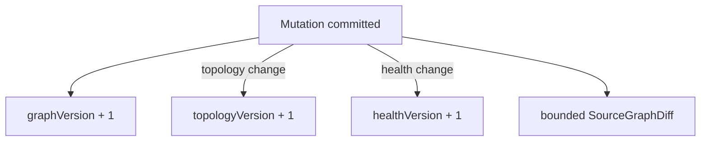
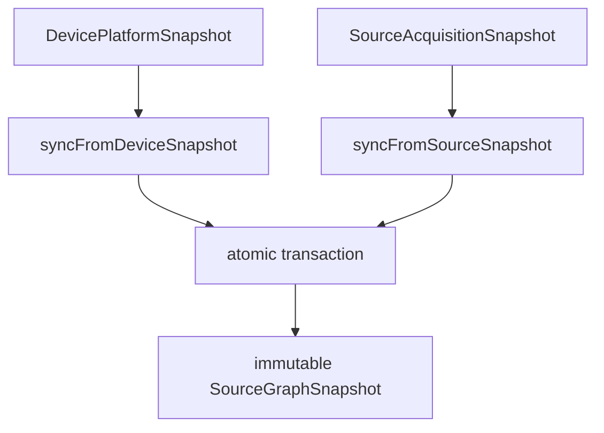
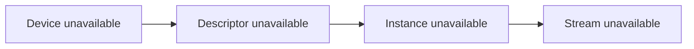
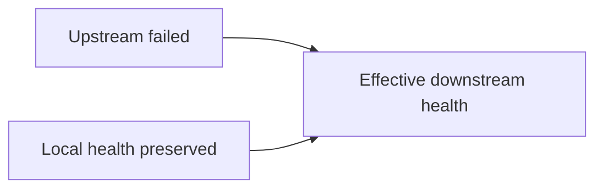
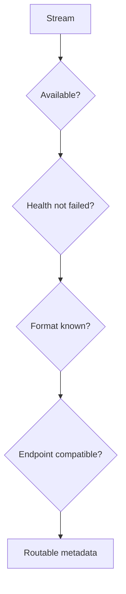
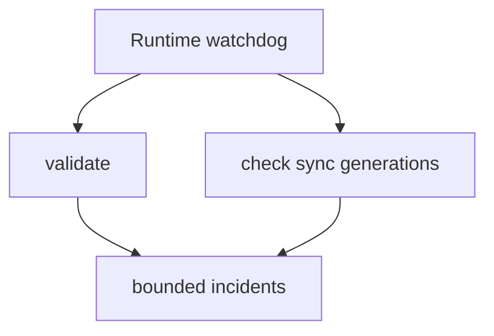

# UBOS v5.2.3 Source Graph

## Purpose

The Source Graph is the authoritative, metadata-only topology for devices, source descriptors, source instances, logical streams, groups, routing endpoints, acquisition processors, future consumers, and external references. It never opens devices, captures media, transports frames, or runs a media loop.

## Relationship to the production graph

UBOS already has a broad `ProductionGraph` for session, scene, source, destination, audio, recording, health, and operator state. v5.2.3 uses relationship **A: the Source Graph is a specialized subgraph feeding the broader Production Graph**. The production graph remains the authority for show execution and production state. The source graph owns source-topology identity, validation, stream generation, availability propagation, health propagation, and routing eligibility metadata. Future v5.2.4+ adapters can map source graph stream nodes into production graph source metadata without creating a conflicting graph authority.

Ownership boundaries:

- Device discovery remains authoritative for device snapshots.
- Source acquisition remains authoritative for source lifecycle and format snapshots.
- Source graph mirrors those authorities into deterministic topology.
- Production graph consumes source topology metadata when scenes, audio, outputs, and routing attach.

## Topology

## Node and edge types

Nodes include `DEVICE`, `SOURCE_DESCRIPTOR`, `SOURCE_INSTANCE`, `STREAM`, `ACQUISITION_PROCESSOR`, `SOURCE_GROUP`, `ROUTING_ENDPOINT`, `FUTURE_CONSUMER`, `EXTERNAL_REFERENCE`, and reserved future media node kinds. Edges include device/source, source/stream, processor, group, routing, dependency, health propagation, availability propagation, alias, and external mapping relations. Each edge kind has explicit valid source/target node-kind pairs.

## Identity conventions

Stable IDs are deterministic and do not use display names:

- `device:<deviceId>`
- `source-descriptor:<sourceId>`
- `source-instance:<sourceId>`
- `stream:<sourceId>:video:0`
- `processor:<processorId>`
- `group:<groupId>`
- `endpoint:<endpointId>`
- `external:<namespace>:<id>`

## Mutations and transactions

`ADD_NODE`, `UPDATE_NODE`, `REMOVE_NODE`, `ADD_EDGE`, `REMOVE_EDGE`, `REPLACE_NODE`, health, availability, active, format, group membership, and subgraph rebuild mutations are supported.

## Versioning and diffing

`graphVersion` increments for any successful transaction, `topologyVersion` for node/edge topology changes, and `healthVersion` for health/availability/active changes. Recent diffs are deterministic and bounded.

## Synchronization

Device snapshots create/update device nodes, source descriptor nodes, source instance nodes, stream nodes, and deterministic edges. Source snapshots are accepted as metadata-only source synchronization inputs. Manual groups and endpoints are not overwritten.

## Stream generation

Streams are generated in deterministic media order: video, audio, data, metadata. IDs are stable for the same source and ordinal.

## Availability and health propagation

Propagation follows explicit propagation edges only.

## Routing eligibility

Eligibility is computed only as metadata. A stream must exist, be enabled, available, not failed, have a selected format, and match endpoint media kind.

## Commands, runtime, events, telemetry, watchdog

Command handler factories expose v5.1 execution-engine compatible handlers for source-graph mutations, transactions, sync, validation, health, and availability. v5.2.3 is event/command driven and does not add a per-frame processor. Telemetry summarizes topology counts, health, routing eligibility, mutation/transaction counts, validation counts, propagation counts, and bounded diffs. Watchdog diagnostics report stale, out-of-sync, invalid, and invariant-risk states.

## Security and redaction

Graph metadata is sanitized and bounded. Secret-like keys such as serial numbers, hardware paths, URLs, stream keys, tokens, and credentials are redacted. Snapshots contain no raw media handles or payloads.

## Invariants and validation

Validation checks edge endpoints, edge kind pairing, prohibited cycles, duplicate logical streams, orphan streams, metadata safety, and telemetry consistency. `assertInvariants()` is available for development and tests.

## Synthetic fixtures and validation

The validation fixture covers camera, microphone, capture-card, virtual source, group, endpoint, alias-compatible identity, propagation, routing, command handlers, watchdog diagnostics, 1,000-node operation, and 100,000 generation no-sleep simulation.

## Current limitations

The Source Graph intentionally does not perform real capture, switching, routing execution, processing, decoding, output activation, scene composition, or audio mixing. It is ready for v5.2.4 Camera Sources to attach real camera descriptors while preserving topology-only graph responsibilities.
