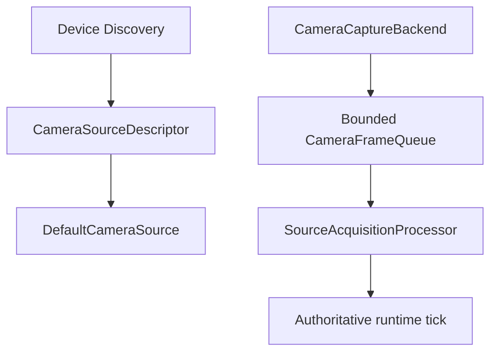
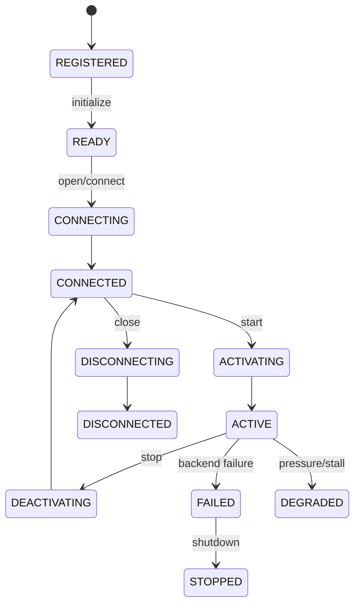
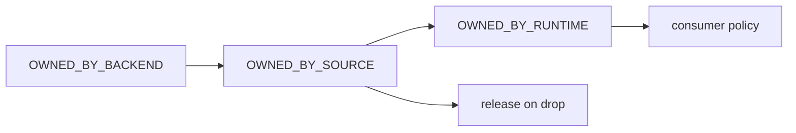
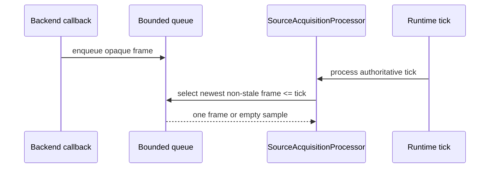
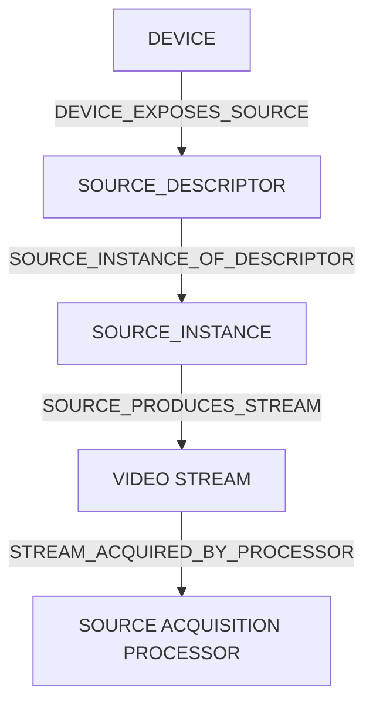

# UBOS v5.2.4 Camera Sources

UBOS v5.2.4 adds a production-safe camera-source layer that bridges discovered video devices into the existing source-acquisition processor and source graph without creating a second runtime loop, frame clock, registry, or graph.

## Purpose

The camera layer provides deterministic contracts for providers, descriptors, explicit open/start/stop/close lifecycle, bounded frame queues, timestamp normalization, opaque frame ownership, synthetic backends, and native adapter boundaries. It intentionally does not implement composition, recording, streaming, browser rendering, screen capture, NDI, SRT, RTMP, WebRTC, GPU effects, FFmpeg, or GStreamer.

## Architecture

Camera contracts extend existing source-provider and media-source concepts. Providers expose safe device descriptors and create `CameraSource` instances. Sources remain explicitly opened and explicitly started.

## Device-to-camera mapping

Eligible device-discovery types (`VIDEO_INPUT`, `CAPTURE_CARD`, `VIRTUAL_CAMERA`, `SYNTHETIC`) map to stable camera source and stream IDs using provider/device identity hashing rather than display names. Public metadata is redacted and excludes serial numbers, full hardware paths, credentials, URLs, and raw handles.

## Lifecycle

Opening does not start capture. Registration and discovery never activate hardware. Stop and close are idempotent; shutdown stops capture, closes the backend, clears queues, and releases retained handles.

## Permissions

The descriptor reuses `SourcePermissionState`: `UNKNOWN`, `NOT_REQUIRED`, `PROMPT_REQUIRED`, `GRANTED`, `DENIED`, `RESTRICTED`, and `UNAVAILABLE`. Denial is not removal; denied cameras may stay visible, but open fails with `CameraPermissionDenied`.

## Format model and negotiation

Camera formats reuse `SourceVideoFormat` and include resolution, rational frame rate, pixel format, color information, bit depth, scan mode, rotation, memory domain, hardware acceleration hint, and latency class. Negotiation applies required constraints first, then deterministic preferences for exact/preferred resolution, frame rate, pixel format, latency, resource cost, and canonical format ID. Fallbacks include explanations and rejected candidate reasons.

## Backend and native boundaries

`CameraCaptureBackend` is platform-neutral: open, start, stop, close, optional controls, and health. Backend callbacks cannot mutate runtime lifecycle; they can only deliver opaque frames into the bounded queue. Native boundaries are declared for Windows Media Foundation/DirectShow, macOS AVFoundation, and Linux V4L2/PipeWire without native bindings in this phase.

## Frame envelope and ownership

Camera frames specialize video envelopes with source ID, stream ID, sequence number, source and normalized timestamps, duration, presentation timestamp, format, discontinuity/corruption flags, dropped-before count, clock domain, hardware timestamp flag, callback receipt time, backend ID, opaque payload reference, ownership state, and safe metadata. Raw media is never placed in events, telemetry, snapshots, or graph metadata.

Double release is detected by `CameraFrameHandle`. Late callbacks after stop/close are rejected and counted.

## Queueing, backpressure, and selection

`CameraFrameQueue` is always bounded. Defaults keep a small latest-video queue and release dropped frames. It tracks enqueue/dequeue counts, old/new/stale drops, rejected frames, high-water events, depth, and oldest frame age.

Runtime ticks never block waiting for frames. The default policy selects the newest non-stale frame whose normalized timestamp is at or before the tick presentation time.

## Timestamp normalization

`DeterministicSourceTimestampNormalizer` is reused for source epoch mapping, sequence gaps, timestamp regression handling, discontinuities, and reset after reopen/reconnect. Hardware timestamps are preferred when present; callback receipt time remains fallback metadata.

## Controls

Camera controls are explicit command-oriented metadata: exposure, gain, white balance, focus, zoom, pan/tilt/roll, anti-flicker, and similar controls can be described. Unsupported controls and out-of-range values return typed errors. Telemetry and watchdog paths never write controls.

## Commands, source processor, and graph integration

The camera API declares typed command constants for register, open, start, stop, close, set format, set/reset control, reconnect, enable/disable, and refresh capabilities. Runtime mutations are intended to flow through existing command lifecycle handlers and source managers. Active cameras are consumed only through `SourceAcquisitionProcessor`; no camera tick loop is introduced.

## Health, telemetry, events, and watchdog

Camera health snapshots include lifecycle, connection/activity, availability, permission, selected format, backend ID, queue depth, dropped/stale/corrupt frames, sequence gaps, timestamp regressions/discontinuities, failures, reconnect counters, last error, and update time. Camera telemetry is bounded and aggregated. Frame events are represented as typed event names but are not emitted per frame by default. Watchdog incidents cover no frames, stalls, unavailable/permission states, queue overflow, drop rate, timestamp instability, latency/jitter, backend failure, reconnect exhaustion, control failure, and invariant failure.

## Reconnect

Reconnect policy is bounded and disabled unless configured. Reconnect preserves logical camera identity, resets timestamp normalization with a discontinuity, revalidates permission and format, and never loops infinitely.

## Security and redaction

Public snapshots are immutable, JSON-safe, deterministically ordered where lists are exposed, and redacted. Opaque handles are represented by safe IDs only; raw native handles and media payloads never appear in observability.

## Synthetic backend

The synthetic backend produces deterministic sequence numbers, timestamps, opaque handles, configurable corruption/drops/regressions/discontinuities, open/start failures, controls, late callback simulation, and release tracking without allocating real image buffers.

## Invariants and validation

`assertInvariants()` verifies bounded depth, active/open consistency, selected format support, and related camera safety checks. Validation covers provider registration, descriptors, permission denial, format negotiation, queue overflow, frame selection, late-frame rejection, acquisition manager integration, redaction, synthetic long-run frame generation, and clean shutdown.

## Performance expectations

Lookup is O(1) through existing managers, enqueue/dequeue are O(1) except bounded tiny queue sorting/selection, timestamp normalization is O(1), camera traversal per tick is O(c), negotiation is O(f log f), and snapshots/watchdog evaluation are O(c) over bounded state.

## Current limitations

Native camera bindings are not implemented. Network camera transport, codec conversion, frame decoding, adaptive frame-rate reduction, genlock/PTP/SMPTE timecode, and downstream repeat-last-frame behavior are deferred.

## v5.2.5 integration

The file-source phase can reuse the same descriptor, bounded queue, ownership, timestamp-normalization, source-processor, telemetry, watchdog, and invariant patterns while substituting file timeline semantics for camera hardware timestamps.
