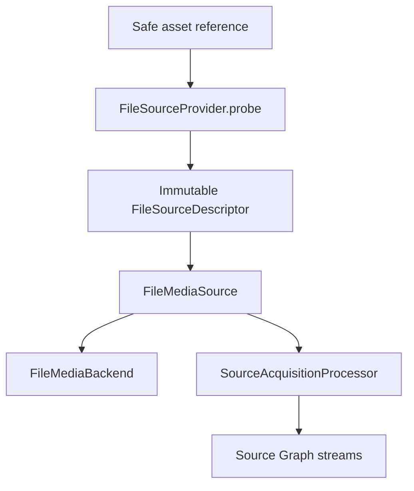
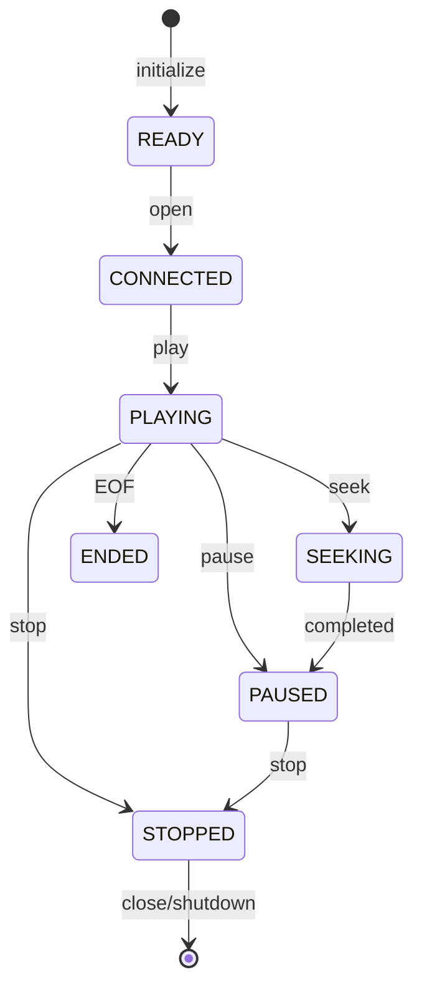
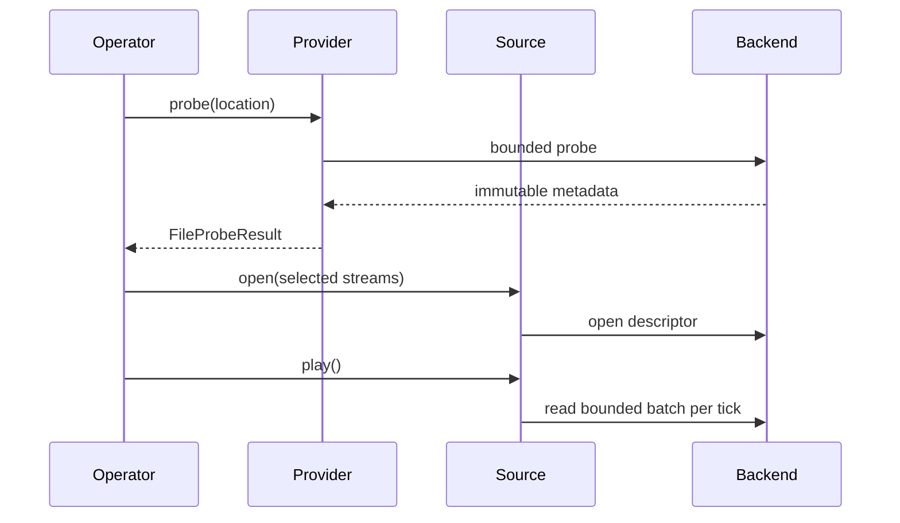
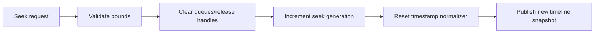
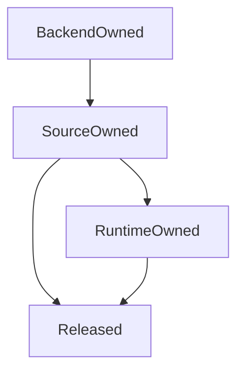
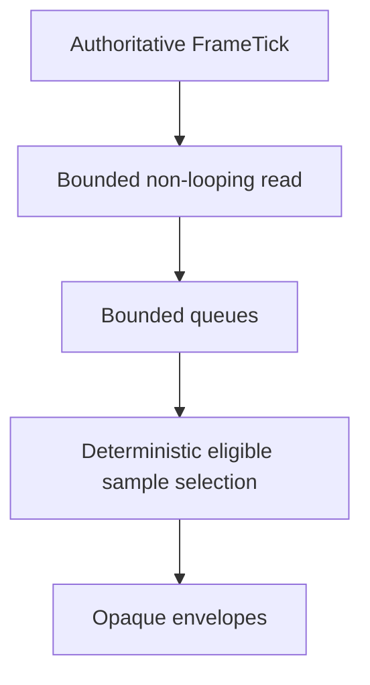
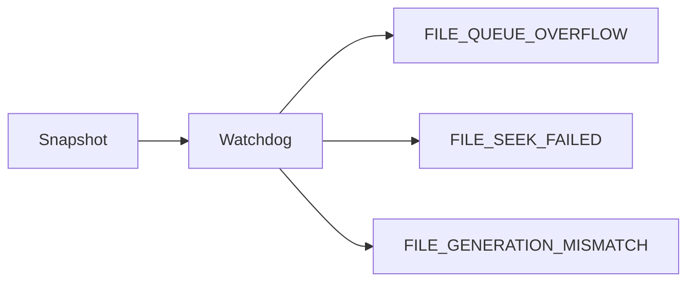

# UBOS v5.2.5 Production-Safe File Sources

UBOS v5.2.5 adds a transport-neutral file-source layer that bridges local, managed, sandboxed, cloud-placeholder, and synthetic asset references into the existing source acquisition and source graph architecture. The phase is intentionally interface-first: probing, opening, reading, seeking, looping, timeline mapping, bounded queueing, health, telemetry, events, and watchdog incidents are modeled without requiring FFmpeg, GStreamer, or native decoders.

## Architecture

The implementation reuses the v5.2 source provider and media source contracts, `DefaultSourceAcquisitionManager`, pull-mode acquisition, `DeterministicSourceTimestampNormalizer`, opaque source payload references, health snapshots, watchdog incident naming, and explicit public exports.

## Safe path and URI handling

`normalizeFileLocation()` accepts synthetic references, file URIs, and local paths. Unsupported schemes are rejected, traversal segments are rejected, allowed roots can be enforced, and public references use redacted path summaries plus stable hashes rather than raw private paths.

## Identity and descriptor

`FileSourceIdentity` separates `sourceId`, `providerId`, `assetId`, display name, stable location hash, persistent identity, session identity, tags, and sanitized metadata. `FileSourceDescriptor` wraps the stable source descriptor with duration, seekability, loopability, playback-rate support, stream lists, default selected streams, safe location, file-size summary, clock domain, latency class, and acquisition mode.

## Lifecycle and playback substates

Open never autoplays. Play requires an open source. Pause is idempotent. EOF is an ended playback state, not source failure. Close clears queues and closes the backend.

## Probe/open/read pipeline

Probe is explicit and does not mutate playback state. Codec names are metadata only.

## Stream selection

Video, audio, and metadata stream IDs are validated against deterministic stream descriptors. The source refuses missing streams instead of silently substituting a different stream.

## Timeline, playback rate, seek, loop, and EOF

The file timeline tracks duration, current and requested position, playback rate, paused/ended flags, loop region, timeline epoch, source timebase, discontinuity count, seek generation, and playback generation. Playback rate is validated; the synthetic backend currently supports only 1.0 and reports unsupported rates deterministically.

EOF is idempotent per playback generation. With looping disabled, playback moves to `ENDED` and emits no more samples. With looping enabled, queues are cleared and a discontinuity/seek generation update returns the timeline to the loop start.

## Backend and decoder boundaries

`FileMediaBackend` owns only probe/open/read/seek/close. It does not own lifecycle or create a frame loop. `createFileDecoderAdapterBoundaries()` documents future FFmpeg, GStreamer, Media Foundation, AVFoundation, platform-native, image, and audio decoder adapter boundaries as inactive integration points.

## Sample envelopes and ownership

Synthetic samples reuse `VideoFrameEnvelope`, `AudioBufferEnvelope`, and metadata sample contracts with file-specific safe metadata: asset ID, backend ID, playback generation, and seek generation. Payloads are opaque handles. Queues release dropped and cleared samples; double-release is a development invariant violation.

## Bounded queues, read-ahead, backpressure, and tick selection

Video, audio, and metadata queues are bounded by count. Overflow is observable and supports drop-oldest, drop-newest, keep-latest-video, and reject policies. Runtime tick acquisition never waits for unbounded read-ahead; at most one read is active. Video selection publishes at most one eligible frame at or before the tick position; audio selection drains eligible buffers in order; metadata drains entries in the tick interval.

## Source processor and graph integration

File sources are pull-mode `MediaSource` implementations, so the existing source acquisition manager can initialize, connect, activate, pull, deactivate, disconnect, and shutdown them. Graph synchronization uses the existing descriptor/instance/stream/processor topology and stores only safe metadata, stream summaries, state, health, and routing eligibility.

## Health, telemetry, events, and watchdog

`FileSourceHealthSnapshot` includes lifecycle, playback state, availability, selected streams, duration, position, loop state, queue depths, EOF count, seek counts, failures, dropped samples, generation mismatches, and sanitized last error. `createFileTelemetrySnapshot()` aggregates bounded source-level counters. File event and watchdog incident constants enumerate production observability without per-sample payload logging.

## Production safety and security guarantees

The layer enforces no autoplay, no traversal outside allowed roots, no raw private paths in public descriptors, no raw media in snapshots, no unbounded queues, no unlimited concurrent reads, no old-generation acceptance after seek, no duplicate same-tick video publication from the file source, EOF-as-ended rather than failed, and close/shutdown handle release.

## Synthetic backend

`SyntheticFileBackend` provides deterministic video-only, audio-only, audio/video, and still-image assets with finite duration, stream metadata, timestamps, opaque handles, configurable probe/open/read/seek failures, EOF behavior, and release tracking. It allocates no real media buffers.

## Invariants and validation

`assertInvariants()` checks playing/open consistency and bounded queues. The validation module covers provider registration, duplicates, path normalization, traversal and scheme rejection, redaction, probing, descriptor immutability, stream selection, open/play/pause/stop/close, no autoplay, seeking, generation increment, unsupported rate rejection, looping, source acquisition integration, no samples after close, and long deterministic tick traversal.

## Current limitations and v5.2.6 integration

Real demuxing and decoding are intentionally not enabled. Playlist composition, image sequences, audio stretching, reverse playback, recording, streaming, browser rendering, NDI, SRT, RTMP, WebRTC, and screen capture are out of scope. v5.2.6 Screen Capture can reuse the same source acquisition, graph, timestamp, ownership, health, telemetry, watchdog, and safe-public-snapshot patterns.
