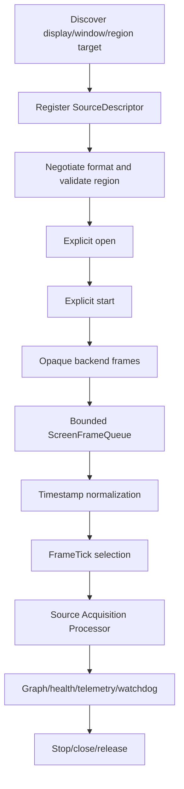
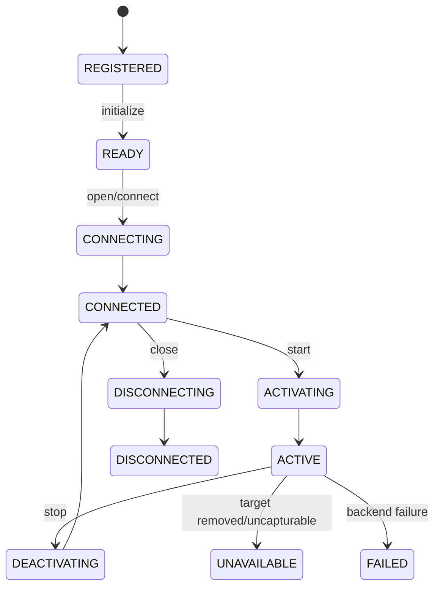

# UBOS v5.2.6 Production-Safe Screen Capture

UBOS v5.2.6 adds a production-safe screen-capture acquisition layer for displays, windows, regions, virtual targets, synthetic targets, and future browser-tab adapters. It reuses the v5.1 execution engine and the v5.2 source-acquisition, timestamp, source-graph, health, telemetry, watchdog, bounded-queue, ownership, redaction, lifecycle, and validation conventions.

## Purpose and architecture

The subsystem is implemented in `packages/media-plane/src/screen-capture.ts` and exported explicitly from `packages/media-plane/src/index.ts`. It defines provider, source, backend, target, descriptor, frame-envelope, queue, health, telemetry, event, command, and watchdog contracts without creating a second runtime loop or source manager.

## Target discovery and identity/privacy

Discovery returns deterministic display/window/unavailable target arrays with generation, duration, snapshot ID, warnings, provider errors, and stable ordering by target type, provider, display/application name, persistent identity, and target ID. Public identity includes hashes and redacted safe metadata only; raw handles, process IDs, usernames, paths, and raw sensitive titles are not exposed. Synthetic identities are deterministic.

## Lifecycle and permissions

Discovery never starts capture and registration never opens capture. `open()` is explicit, `startCapture()` requires an open source, `stopCapture()` is idempotent, and `close()` releases queued frames and backend resources. Permission states reuse `SourcePermissionState`; denied or restricted targets remain discoverable but fail open with typed errors.

## Display/window/region geometry, DPI, rotation

Targets expose geometry, pixel/logical dimensions, scale factor, rotation, refresh-rate, HDR, color-space, alpha, virtual/physical, minimized, visibility, occlusion, protected-content, cursor, and region support summaries. `ScreenCaptureRegion` supports physical, logical, normalized, and target-relative coordinates with explicit `CLAMP` or `REJECT` behavior. Silent expansion is not allowed; effective regions are observable.

## Minimized/occlusion/protected-content and cursor policy

Window policies include `PAUSE_CAPTURE`, `RETURN_EMPTY`, `KEEP_LAST_NOT_IN_SOURCE_LAYER`, `MARK_UNAVAILABLE`, and `BACKEND_DEFINED`. Occlusion policies include `CAPTURE_IF_SUPPORTED`, `MARK_DEGRADED`, `RETURN_EMPTY`, and `BACKEND_DEFINED`. Cursor policy supports include, exclude, auto, separate metadata, and future click highlighting. Unsupported policies return typed errors.

## Format negotiation

The screen format model reuses `SourceVideoFormat` and records requested/effective dimensions, frame rate, pixel format, color space, alpha, rotation, memory domain, hardware hint, and scale mode. Deterministic negotiation selects compatible formats by required constraints, preferred geometry/rate, pixel format, latency/resource cost, and canonical ID, returning explanations and rejected reasons.

## Backend and native platform boundaries

`ScreenCaptureBackend` is platform-neutral: discover, open, start callbacks, update region/cursor, stop, close, health. It owns no runtime tick loop and cannot mutate runtime lifecycle directly. Native adapter boundaries are declared for Windows Graphics Capture/DXGI, macOS ScreenCaptureKit/CoreGraphics, and Linux PipeWire/X11/Wayland portal. Native bindings are not implemented in this phase.

## Frame envelope, ownership, queues, and backpressure

`ScreenFrameEnvelope` extends the video envelope with target ID, geometry, effective region, scale, rotation, cursor/minimized/occlusion/protected-content flags, discontinuity/corruption/drop counters, backend ID, opaque payload reference, and ownership. `ScreenFrameQueue` is bounded, supports drop-oldest/drop-newest/keep-latest/reject policies, releases discarded handles via adapter hooks, tracks high-water and stale-frame counters, and never blocks runtime ticks or backend callbacks.

## Frame selection and timestamp normalization

For each tick, active screen sources select at most one newest non-stale frame at or before the authoritative scheduled tick time. Future frames are held; absent frames return an empty batch; duplicate same-tick publication is prevented; wrong-generation frames are rejected. `DeterministicSourceTimestampNormalizer` handles source timestamps, callback timestamps, sequence gaps, regressions, and discontinuities.

## Commands, processor, graph, health, telemetry, events, watchdog

The module declares screen command types for register, discover, open, start, stop, close, target/region/cursor/format updates, refresh, reconnect, enable, and disable so command-engine integrations can preserve exactly-once semantics. Pull-based integration publishes through the existing source-acquisition processor. Source descriptors carry graph-safe target, region, format, active/availability, routing, and health metadata without frame handles.

Telemetry is bounded: source counts, frame received/published/dropped/stale/corrupted totals, sequence/timestamp/discontinuity totals, target/geometry/permission/backend totals, queue depth, active IDs, last event, and health summaries. Events are typed and production-safe; frame-per-event emission is not required by default. Watchdog incidents cover no frames, stalls, unavailable/removed targets, permission denial, protected content, overflow, drop rate, timestamp instability, latency, backend failure, reconnect exhaustion, graph mismatch, and invariant failure.

## Synthetic backend and validation

The deterministic synthetic backend exposes primary/secondary/virtual displays, normal/minimized/occluded/protected windows, and a region target. It uses opaque handles, deterministic sequence/timestamp behavior, redacted titles, and release accounting without real image buffers.

## Invariants and production safety

`assertInvariants()` verifies capturing sources are open, queues stay within capacity, and snapshots remain bounded. Shutdown stops capture, closes backend resources, clears queues, and prevents late-frame publication. Public snapshots are JSON-safe, immutable, deterministically ordered, redacted, and free of native handles or payload bytes.

## Limitations and v5.2.7 integration points

This phase intentionally does not implement browser capture, composition, switching, audio mixing, graphics rendering, recording, streaming, replay, NDI, SRT, RTMP, WebRTC, FFmpeg/GStreamer capture, or native bindings. v5.2.7 Browser Sources can attach behind the same target/provider/backend/source contracts as a future `BROWSER_TAB` adapter.
