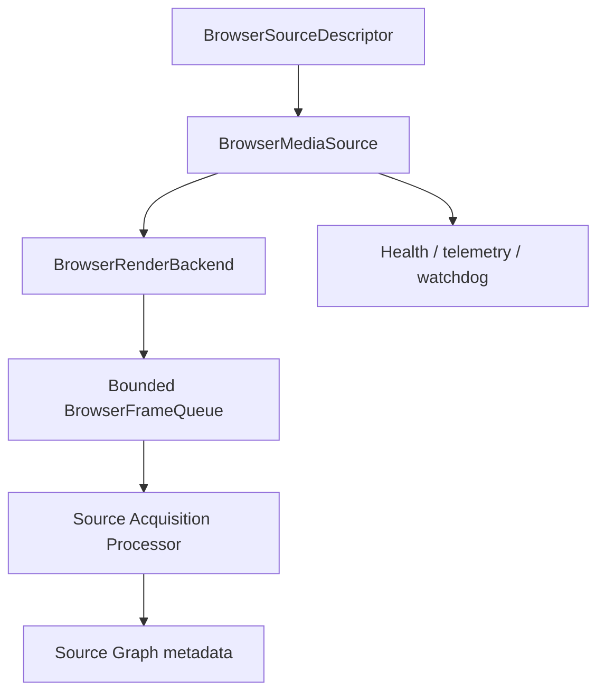
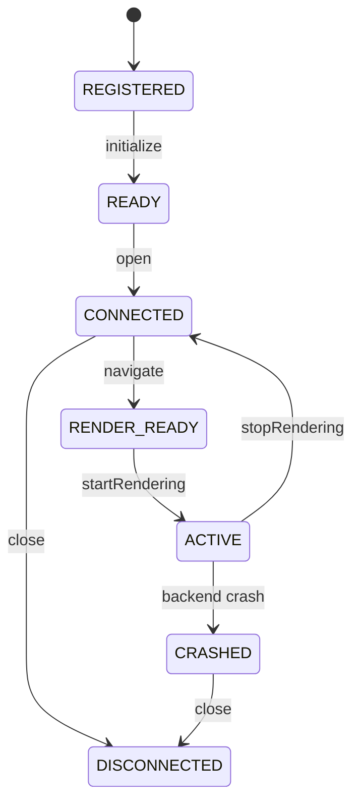
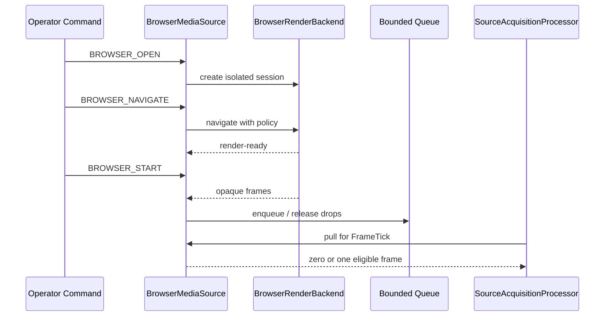

# UBOS v5.2.7 Production-Safe Browser Sources

UBOS v5.2.7 adds browser-backed sources to the existing media-plane source-acquisition model without adding a real browser engine or a second runtime loop. Browser sources are registered as metadata, opened explicitly, navigated explicitly, rendered explicitly, and published through the existing source-acquisition processor contract.

## Source types and identity

Supported categories include web pages, local HTML, overlays, dashboards, remote graphics, authenticated web apps, widgets, synthetic browsers, and custom/future adapter categories. Identity is not the raw URL: it is derived from provider ID, content-reference ID, safe origin, category, isolated partition ID, persistent identity, session identity, viewport profile ID, tags, and redacted metadata.

## Content references, URL/origin policy, and private-network restrictions

Content references model HTTPS/HTTP URLs, local assets, repository assets, sandboxed local roots, synthetic pages, and future cloud browser assets. HTTPS is the default. Unsupported schemes such as `javascript:`, `data:`, `blob:`, `file:`, `chrome:`, and `about:` are rejected by default. User/password URLs and secret-bearing query parameters are rejected. Top-level navigation and redirects are revalidated against allowlists, denylists, scheme policy, same-origin mode, redirect limits, localhost/IP/internal-host controls, cloud metadata addresses, and private/link-local ranges.

## Session isolation, credentials, and permissions

Default session policy is ephemeral isolated storage with one partition per source. Persistent/shared profiles require profile references rather than arbitrary paths. Credentials are represented only by refs (`credentialRef`, `cookieJarRef`, `authProfileRef`, `headerProfileRef`); snapshots, graph state, telemetry, diagnostics, and errors are redacted. Browser permissions default to deny for camera, microphone, geolocation, notifications, clipboard, MIDI, USB, serial, Bluetooth, screen capture, file access, downloads, pop-ups, and fullscreen.

## Lifecycle, viewport, and render readiness

Registration does not create a browser instance. Open creates an isolated backend session but does not navigate. Navigation increments `navigationGeneration`; resize increments `renderGeneration`; session reset increments `sessionGeneration`. Render readiness is explicit (`DOM_READY`, `LOAD_EVENT`, `NETWORK_IDLE`, `FIRST_FRAME`, `CUSTOM_SIGNAL`, timeout). Viewports validate dimensions, device scale, transparency, color scheme, reduced motion, locale/timezone refs, and maximum pixel count.

## Backend and engine boundaries

`BrowserRenderBackend` is platform-neutral and owns no UBOS lifecycle. It exposes create, navigate, start, stop, resize, optional interaction, clear-session, and close callbacks. Native engine concerns stay behind adapter boundaries for CEF, Electron offscreen rendering, Playwright/Chromium, Puppeteer/Chromium, WebView2, WKWebView, WebKitGTK, and cloud-rendered browsers. No real engine dependency is introduced in this phase.

## Frame envelopes, ownership, queueing, and backpressure

Browser frames specialize video envelopes with session refs, navigation/render generations, viewport/content size, scroll offset, ready state, safe origin, backend ID, opaque payload refs, and ownership. Queues are bounded, default to keep-latest-video, release discarded frames, reject wrong-generation/stale frames, track high-water pressure, and never block a runtime tick. Selection returns at most one newest eligible frame at or before the authoritative tick; future frames are held and duplicate same-tick publication is prevented.

## Diagnostics, timestamp normalization, audio, and interactions

Console/network/error buffers are bounded, sampled, duplicate-suppressed, length-limited, and redacted. Response bodies, POST bodies, DOM snapshots, cookies, and raw headers are not stored. `DeterministicSourceTimestampNormalizer` handles compositor/system/unknown timestamps, discontinuities, sequence gaps, regression, reload, resize, and render-process restart. Browser audio is modeled as metadata and disabled by default; mixing is out of scope. Interactions are typed and disabled unless descriptor policy enables them; JavaScript execution is denied unless explicitly trusted.

## Commands, processor integration, graph integration, health, recovery, telemetry, and watchdog

The public command set includes register/open/navigate/start/stop/close/reload/viewport/url/header/auth/session/audio/interact/enable/disable/recover. Slow commands stay outside frame-critical paths and generation checks prevent late completions from overwriting newer state. The source graph receives only safe origin, viewport, state, health, and routing eligibility metadata. Watchdog incidents cover navigation failure/blocking, render-not-ready, no frames, stalls, queue overflow, high drop rate, crash, network failure rate, redirect/reload loops, permission violations, secret-leak risk, storage quota, backend failure, graph mismatch, and invariant failure.

## Synthetic backend, invariants, long-run validation, and limitations

The synthetic backend deterministically models static pages, dashboards, overlays, authenticated pages, redirects, blocked origins, slow/never-ready pages, console/network pressure, crashes, audio metadata, resizing, reload loops, wrong-generation/late/stale frames, and handle-release tracking without a real browser engine. Invariants assert unique IDs, isolated partitions, bounded queues/diagnostics, valid generations, sanitized public origin, no secret exposure, no frames after stop/close/crash, no duplicate same-tick publication, bounded recovery, and clean shutdown. Long-run validation simulates 10,000 frames and 100,000 ticks. Limitations: native Chromium/WebView rendering, audio mixing, scene composition, streaming, recording, WebRTC, and release tagging are deferred. v5.2.8 should add audio-device acquisition using the same bounded ownership and telemetry model.
