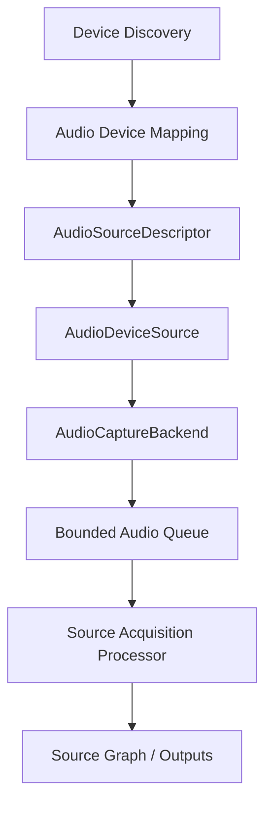
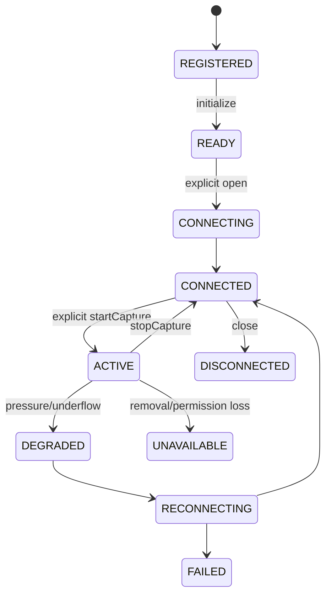
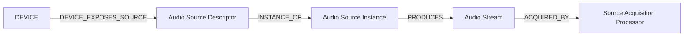

# UBOS v5.2.8 Production-Safe Audio Devices

UBOS v5.2.8 adds metadata-only, production-safe audio-device sources for microphones, line inputs, multichannel interfaces, desktop/system loopback endpoints, virtual devices, capture-card embedded audio, and deterministic synthetic validation. It extends the existing v5.2 source-acquisition contracts instead of creating a second source manager, graph, frame clock, runtime loop, or acquisition processor.

## Purpose and architecture

The subsystem bridges discovered audio endpoints into the existing source-acquisition architecture with explicit `open`, `startCapture`, `stopCapture`, and `close`. Discovery and registration are intentionally passive: they never open microphones, activate interfaces, enable monitoring, or enable loopback.

## Device mapping, categories, and identity

Eligible device-discovery types are `AUDIO_INPUT`, `AUDIO_OUTPUT`, `CAPTURE_CARD`, `VIRTUAL_AUDIO`, and `SYNTHETIC`. Mapping creates deterministic source IDs from provider ID, device ID, category, and logical group. Raw serial numbers, hardware paths, endpoint identifiers, user names, payload handles, and PCM markers are redacted from public metadata.

Supported categories include `MICROPHONE`, `LINE_INPUT`, `AUDIO_INTERFACE_INPUT`, `DESKTOP_AUDIO`, `SYSTEM_LOOPBACK`, `VIRTUAL_AUDIO_INPUT`, `EMBEDDED_CAMERA_AUDIO`, `CAPTURE_CARD_AUDIO`, `REMOTE_AUDIO_ADAPTER`, `SYNTHETIC_AUDIO`, and `CUSTOM_AUDIO`. Remote network transport is intentionally not implemented in this phase.

## Lifecycle and permissions

`DENIED`, `RESTRICTED`, and `UNAVAILABLE` permission states remain discoverable but fail explicit open with typed errors. Desktop/system loopback is treated as a separate explicit policy and cannot bypass input permission.

## Format model and negotiation

Audio formats reuse `SourceAudioFormat` and normalize vocabulary for sample rate, channel count, layout, sample format, bit depth, planar/interleaved state, frames per buffer, clock domain, and latency hint. Deterministic negotiation applies required constraints first and then stable tie-breakers: exact/preferred sample rate, channel layout, sample format, buffer size, hardware clock, latency, resource cost, and canonical ID. Provider enumeration order therefore cannot change the selected format. No resampling, remapping, downmixing, or silent fallback is performed.

## Backend and native boundaries

`AudioCaptureBackend` is platform-neutral. It owns opaque native/backend handles but not UBOS lifecycle. Callback work only enqueues bounded envelopes and must not block indefinitely. Native adapters are boundaries for WASAPI input/loopback and Media Foundation on Windows, CoreAudio/AVAudioEngine/AudioUnit on macOS, and ALSA/PipeWire/PulseAudio compatibility on Linux. This phase defines the boundary and synthetic backend; it does not add native dependencies.

## Envelopes, ownership, queues, and backpressure

Audio buffers are immutable envelopes with source/stream IDs, sequence number, source and normalized timestamps, duration, sample count, sample positions, format, clock domain, hardware timestamp flag, discontinuity/corruption flags, backend ID, opaque payload reference, and safe metadata. PCM bytes and native handles are never included in logs, telemetry, graph state, snapshots, or events.

Bounded queues enforce maximum buffers, maximum samples, and maximum buffered duration. Overflow policies include `DROP_OLDEST`, `DROP_NEWEST`, `REJECT`, `FAIL_SOURCE`, and `SIGNAL_DISCONTINUITY`; dropped envelopes release retained handles. Underflow policies are observable and do not fabricate silence or repeat previous buffers.

## Sample positions and timestamps

The source tracks expected next sample position, sequence gaps, sample gaps, overlaps, regressions, and discontinuity generation. Timestamp normalization reuses the deterministic source timestamp normalizer and prefers hardware/sample clocks when present, falling back to monotonic callback time metadata. Regression is observable and not silently corrected by resampling or clock conversion.

## Acquisition policy and graph integration

For each authoritative runtime tick, an active audio source selects zero or more queued buffers that overlap the requested interval, preserves ordering, holds future buffers, rejects stale/wrong-generation callbacks, and publishes a buffer at most once. Source graph metadata contains descriptor, stream, selected format, channel group, clock domain, availability, health, and routing eligibility, but no PCM or native handles.

## Channel groups and controls

Channel groups are stable, explicit, and metadata-only: mono channels, stereo pairs, multichannel interface groups, embedded capture-card audio, and loopback groups are represented without hidden channel reorder, remap, or downmix. Controls such as gain, hardware mute, phantom power, pad, high-pass filter, clock source, impedance, channel enable, and loopback enable are explicit commands only; dangerous controls require confirmation metadata.

## Commands, events, telemetry, watchdog, and health

The public command vocabulary covers register, open, start, stop, close, set format, select channel group, set/reset control, set loopback, reconnect, enable/disable, and refresh capabilities. Events are typed and bounded; production defaults avoid per-buffer event spam. Telemetry summarizes source counts, buffer/sample counts, drops, underflows, overflows, sequence/sample/timestamp anomalies, reconnects, latency/jitter, queue depth, IDs, last event, and health summary. Watchdog incidents cover no buffers, stalls, unavailable devices, permission denial, overflow, underflow/drop/gap rates, overlaps, unstable timestamps, clock drift, high latency, backend failure, reconnect exhaustion, graph mismatch, and invariants.

## Synthetic backend, validation, and performance

The synthetic backend emits deterministic opaque handles with sample positions, timestamps, release tracking, and configurable source descriptors. It does not allocate PCM. Long-run validation is designed around fake clocks and injected emissions so it can simulate 100,000 ticks, multiple devices, gaps, overlaps, queue pressure, permission changes, reconnects, and shutdown without real-time sleeping.

Expected complexity remains O(1) for lookup, queue enqueue/dequeue, timestamp normalization, and sample tracking; O(q) for bounded tick selection; O(f log f) for format negotiation; and O(a) for snapshots and watchdog evaluation.

## Production safety guarantees

The implementation enforces no automatic microphone activation, no automatic loopback, bounded queue duration, no runtime tick blocking on native work, no hidden resampling/remixing/downmixing, no fabricated silence, no duplicate or stale-generation publication, explicit release of retained handles, typed permission failures, sanitized errors, immutable JSON-safe snapshots, and source/graph-compatible metadata.

## Limitations and v5.2.9 integration

This phase does not implement audio mixing, EQ, compression, limiting, loudness processing, recording, streaming, replay, NDI, SRT, RTMP, WebRTC, browser media permission prompts, or native bindings. UBOS v5.2.9 Network Sources can reuse the same descriptor, negotiation, queue, ownership, timestamp, telemetry, and watchdog patterns while adding network sender clock and transport-specific reconnect policy.
