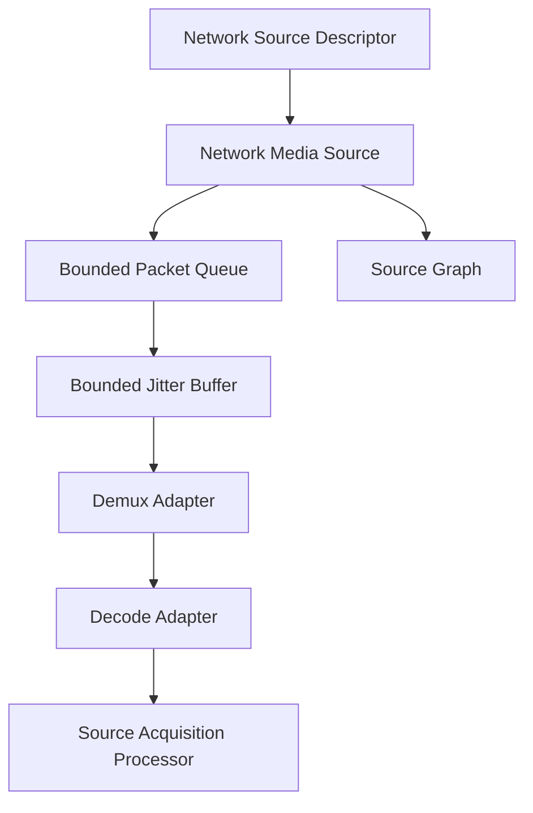
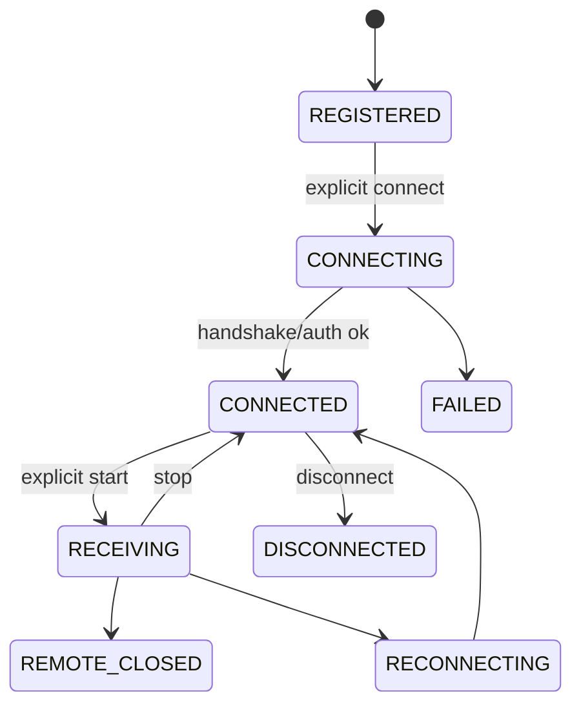

# UBOS v5.2.9 Production-Safe Network Sources

## Purpose
v5.2.9 adds protocol-neutral network contribution sources to the existing source-acquisition and source-graph architecture without adding native transport dependencies or a second runtime loop.

## Architecture and protocol categories
The public contract models SRT, RTMP/RTMPS, NDI/NDI HX, RTP/RTP_UDP, RIST, WebRTC contribution, MPEG-TS UDP/TCP, HLS/DASH pull, custom TCP/UDP, synthetic network, and custom network categories. Only a deterministic synthetic backend is implemented in this phase.

## Identity, endpoint references, and connection modes
Network identity is stable and contains source/provider IDs, protocol, connection mode, endpoint reference ID, safe endpoint summary, persistent/session identity, optional peer/binding/failover references, timestamps, tags, and safe metadata. Public descriptors carry endpoint references, not full URLs or secrets. Modes include caller, listener, rendezvous, pull, push receiver, discovery based, and session negotiated; registration and discovery never connect or bind.

## Address policy
`NetworkAddressPolicy` denies localhost, link-local, cloud metadata style addresses, unspecified/broadcast/bind-all, and private networks by default unless trusted policy explicitly permits them. DNS/address results are revalidated at explicit connect boundaries.

## Credentials and encryption
Credential, passphrase, stream key, certificate, token, auth profile, and encryption profile values are represented by references. Redaction removes secret-like keys, URL userinfo, query secrets, full URLs, payload bytes, and handles from snapshots, telemetry, errors, events, diagnostics, graph metadata, and command records.

## Lifecycle

## Backend and adapter boundaries
`NetworkReceiveBackend` owns transport-specific resolve/connect/start/stop/disconnect boundaries but not UBOS runtime lifecycle. Protocol adapters are expected to isolate socket lifecycle, handshake, authentication, encryption, recovery, jitter stats, demux, codec discovery, clocks, metadata, reconnect, and native cleanup.

## Packet envelope, ownership, buffering, and jitter
`NetworkPacketEnvelope` is immutable, transport-neutral, and references opaque payload handles only. `NetworkPacketHandleTracker` enforces one owner and double-release detection. `NetworkPacketQueue` bounds packets by count and bytes with DROP_OLDEST, DROP_NEWEST, REJECT, FAIL_SOURCE, and SIGNAL_DISCONTINUITY policies. `NetworkJitterBuffer` provides deterministic fixed-mode ordering, duplicate detection, late-packet rejection, gap tracking, and bounded reorder windows.

## Loss/reordering, demux/decode, streams, and timestamps
Sequence tracking records duplicates, late packets, and gaps. Demux and decode are separate adapter interfaces; v5.2.9 provides synthetic adapters with opaque sample handles. Runtime stream discovery supports video, audio, metadata/data, timecode, and captions with deterministic stream IDs. Timestamp normalization prefers sender/media timestamps and falls back to arrival metadata; reconnect and stream changes create discontinuity generations.

## Acquisition, graph, health, telemetry, events, watchdog
Acquisition drains bounded decoded samples per authoritative tick, publishes each sample once, holds future samples, rejects stale generations, and never blocks waiting for network input. Source graph state contains safe protocol/endpoint/session/stream metadata only. Health, telemetry, events, and watchdog incidents are bounded and redacted; per-packet events are diagnostic-only by default.

## Reconnect and failover
Reconnect and failover are modeled as bounded policies with maximum attempts/switches, deterministic endpoint order, generation invalidation, queue clearing, revalidation of address and credential references, and no overlapping or infinite loops.

## Commands
Typed command names cover register, connect, start, stop, disconnect, reconnect, endpoint/credential/encryption/latency/jitter/stream/failover/enable/disable/refresh operations. Handlers route mutations through the network source registry and return sanitized results.

## Production safety and invariants
v5.2.9 enforces no automatic connection, no automatic listener bind, no bind-all default, no unrestricted private network access, no credential leakage, no unbounded queues, no runtime-tick blocking, no fabricated media, no duplicate publication, no stale-generation publication, no infinite reconnect/failover, and no backend outliving shutdown. `assertInvariants()` verifies queue bounds and ownership state.

## Synthetic backend and validation
The synthetic backend opens no sockets and supports deterministic stream discovery, packet generation, failures, remote close, late callbacks, opaque handles, and release tracking. Validation covers provider/source registration, duplicate rejection, descriptor immutability, endpoint validation, credential URL rejection, address denial, lifecycle operations, late stop/disconnect cleanup, queue policies, jitter duplicate handling, ownership transfer/release/double-release rejection, redaction, 10,000 packet enqueue, and 100,000 snapshot ticks.

## Limitations and v5.2.10 integration
No production protocol library, codec, real socket, PTP/NTP discipline, media fabrication, streaming output, recording, replay, mixing, composition, or scene switching is added. v5.2.10 Source Acquisition Certification can consume these invariants, snapshots, synthetic scenarios, and public exports to certify network-source readiness.
