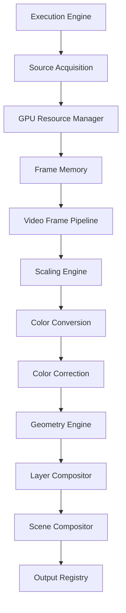
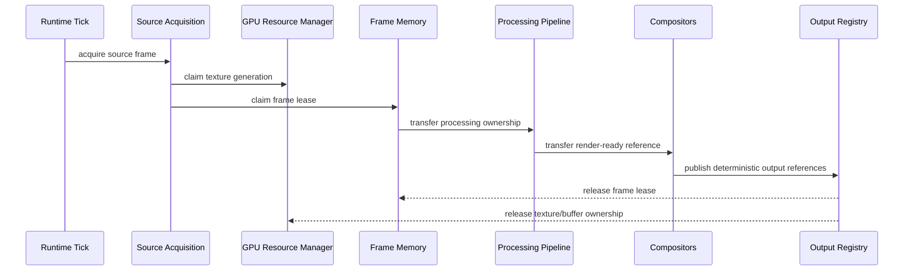

# UBOS v5.3.10 Media Processing Certification

## Purpose

UBOS v5.3.10 is a certification phase for the complete v5.3 Media Processing Layer. It does not add effects, transitions, switching, recording, streaming, audio processing, UI, or native GPU API features. The goal is to prove that the existing media-processing chain behaves as one deterministic, production-safe subsystem before v5.4 Video Effects and v5.5 Scene Engine work begins.

## Architecture under certification

The certification validation treats this graph as a single ordered contract. Each runtime tick must pass through each mandatory processor exactly once, preserve frame identity metadata, publish outputs in deterministic order, and release all temporary ownership before the next recovery or shutdown boundary.

## Subsystem interactions

| Boundary                            | Certified contract                                                                                                     |
| ----------------------------------- | ---------------------------------------------------------------------------------------------------------------------- |
| Source Acquisition ↔ Video Pipeline | Source id, stream id, sequence number, source timestamp, normalized timestamp, generation, and metadata remain stable. |
| Video Pipeline ↔ Scaling            | Scaling plans are explicit, deterministic, profile matched, and pass-through is honored when dimensions already match. |
| Scaling ↔ Color Conversion          | No hidden resize occurs during color work; color conversion consumes the dimensions produced by the scaling plan.      |
| Color Conversion ↔ Color Correction | Primaries, transfer, matrix, range, alpha mode, HDR/SDR state, and bit depth remain explicit.                          |
| Color Correction ↔ Geometry         | Corrected frames retain source identity and timestamp when transforms, crop, rotation, anchor, and bounds are planned. |
| Geometry ↔ Layer Compositor         | Layer descriptors consume geometry output, keep z-order stable, and preserve visibility and clipping decisions.        |
| Layer Compositor ↔ Scene Compositor | Scene render plans consume a sorted layer list and must not reorder layers outside z-index/order/id tie-breakers.      |
| Scene Compositor ↔ Output Registry  | Preview, Program, AUX, and Multiview outputs are published through stable registry keys in role/order order.           |

## Ownership model

Ownership has one active owner at a time. The certification validation checks that leases and GPU textures are released exactly once, that recovery never occurs while active textures remain, and that shutdown leaves no active leases, textures, caches, processors, callbacks, or timers.

## Memory model

Frame memory certification covers:

- lease retain/release balance;
- generation checks for stale-frame rejection;
- mapping and pinning conflict rules;
- deterministic pool reuse;
- explicit garbage collection and cache invalidation;
- shutdown rejection of late allocations;
- zero leaked frame leases after long-run execution.

## GPU model

GPU certification covers:

- texture and buffer ownership;
- device generation tracking across recovery;
- pool reuse instead of unbounded allocation;
- stale-resource rejection after generation changes;
- explicit cleanup at frame, recovery, and shutdown boundaries;
- zero leaked textures, buffers, render targets, or temporary resources.

## Pipeline and rendering methodology

The certification validation in `packages/media-plane/src/media-processing-certification.validation.ts` runs deterministic synthetic audits for:

- 100,000 runtime ticks;
- 10,000 scene renders;
- 10,000 layer renders;
- 10,000 pipeline executions;
- repeated activation and deactivation;
- repeated GPU recovery;
- repeated frame-memory reuse;
- repeated cache invalidation;
- repeated source updates.

The same long-run simulation is repeated and the final snapshots are compared using stable serialization. This certifies identical scene plans, output ordering, telemetry, watchdog events, health snapshots, and processor execution order.

## Determinism invariants

A valid certification run proves:

- every mandatory stage executes exactly once per tick;
- no duplicate processing occurs;
- no mandatory stage is skipped;
- timestamps, source identities, stream identities, sequence numbers, generations, and metadata are preserved;
- layer and scene ordering are deterministic;
- cache invalidation is explicit;
- watchdog timeout, overload, duplicate tick, and cancellation counters are deterministic.

## Performance certification

No machine-specific timing thresholds are imposed. Certification reports complexity classes only:

| Area                            | Certified complexity class                                             |
| ------------------------------- | ---------------------------------------------------------------------- |
| Runtime tick dispatch           | O(1) per tick plus processor chain length.                             |
| Pipeline execution              | O(s), where `s` is the number of enabled mandatory stages.             |
| Scaling/color/geometry planning | O(1) with bounded cache lookup for stable profiles.                    |
| Layer composition ordering      | O(l log l), where `l` is layer count.                                  |
| Scene output planning           | O(o + d), where `o` is output count and `d` is scene dependency count. |
| Snapshot generation             | O(m), where `m` is telemetry and health field count.                   |
| Cache invalidation              | O(c), where `c` is active cache entry count.                           |
| Shutdown cleanup                | O(r), where `r` is active resource count.                              |

## Certification checklist

- [x] Deterministic execution order.
- [x] Frame ownership and frame-memory lease balance.
- [x] GPU ownership, pool reuse, generation recovery, and shutdown cleanup.
- [x] Processor ordering with no duplicate or skipped mandatory stage.
- [x] Timestamp, source identity, stream identity, generation, and metadata preservation.
- [x] Scaling pass-through and explicit scaling-plan boundaries.
- [x] Color metadata, HDR/SDR, transfer, matrix, primaries, alpha, and bit-depth boundaries.
- [x] Geometry transform, crop, anchor, rotation, bounds, visibility, and ordering boundaries.
- [x] Layer z-order, opacity/blending boundary, clipping/masking boundary, pass-through, and cleanup.
- [x] Scene Preview, Program, AUX, Multiview, variants, nested-scene, dependency, cache, generation, activation, and publication boundaries.
- [x] Runtime duplicate tick rejection, timeout handling, overload handling, cancellation, shutdown, and restart safety.
- [x] Long-run simulations and repeated deterministic snapshots.
- [x] Leak detection for frames, GPU resources, temporary targets, caches, processors, callbacks, timers, and ownership violations.

## Limitations

This phase is certification-only. It intentionally uses deterministic synthetic validation rather than introducing new rendering capabilities. Native GPU APIs, new effects, transitions, TAKE/AUTO/CUT switching, recording, streaming, replay, audio processing, and UI behavior remain out of scope.

## Release readiness

UBOS v5.3.10 is release-ready when formatting, media-plane lint, media-plane typecheck, media-plane build, media-plane test, and practical root validation pass. Passing certification means the v5.3 Media Processing Layer is a stable foundation for v5.4 Video Effects and v5.5 Scene Engine work.
