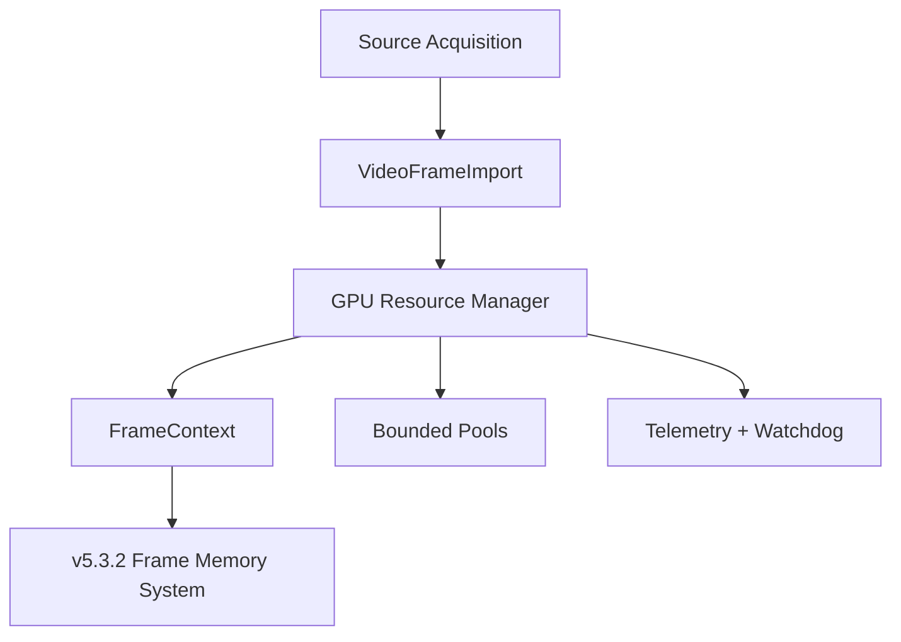
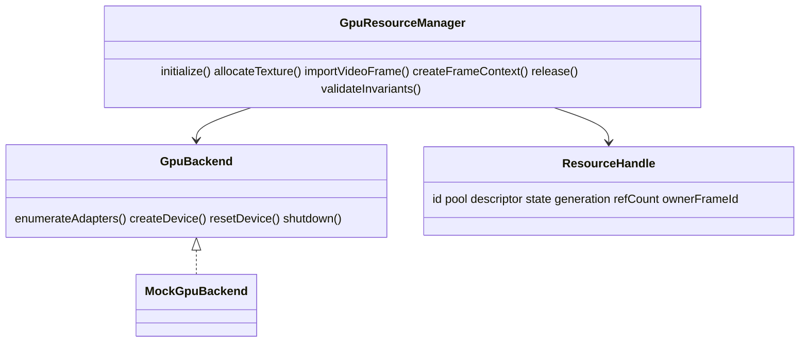
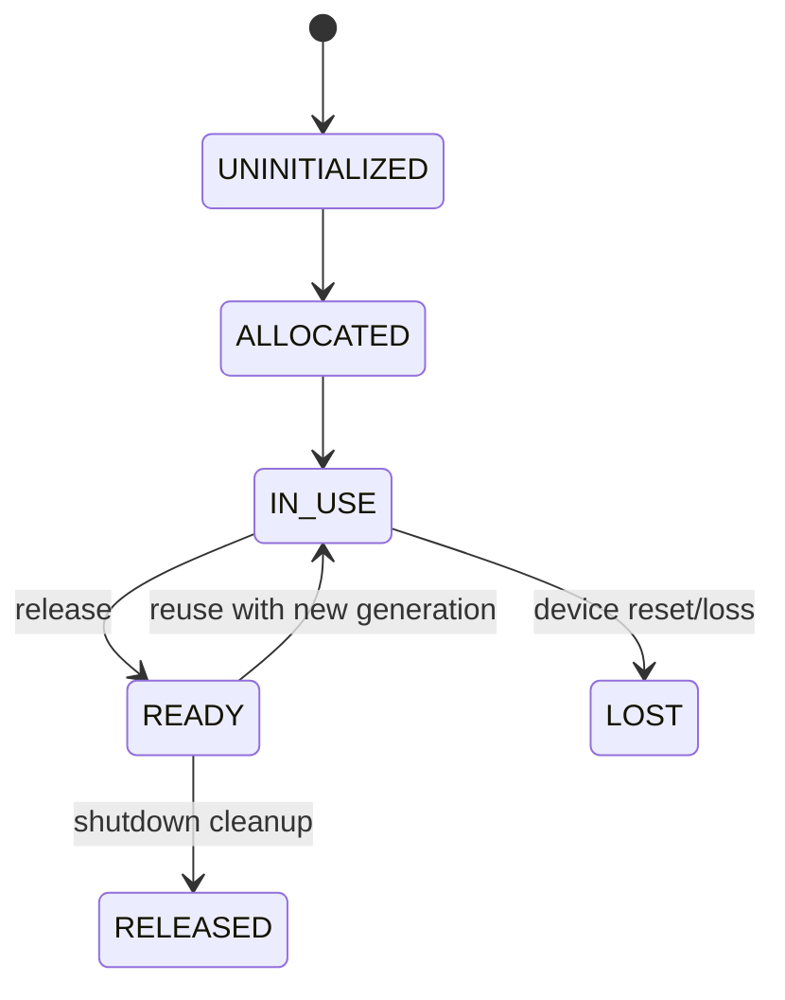

# UBOS v5.3.1 GPU Resource Manager

The GPU Resource Manager is the deterministic boundary between source acquisition and future video processing. It models device lifecycle, bounded resource pools, ownership, synchronization, telemetry, and watchdog checks without exposing Direct3D, Vulkan, Metal, OpenGL, or WebGPU objects to the rest of UBOS.

## Architecture

`GpuBackend` is the only backend-facing contract. The current implementation ships a deterministic `MockGpuBackend` for CI and certification. Future backends implement adapter enumeration, device creation, reset, and shutdown while returning metadata-only snapshots.

## Memory model

Descriptors distinguish GPU memory, CPU-visible memory, shared memory, upload heaps, and readback heaps. Texture byte estimates are deterministic and tracked in telemetry. Runtime API handles are intentionally absent from public descriptors and handles.

## Ownership and lifecycle

Each leased resource has one owner, a single reference count, and a generation. Releasing an unknown or already released resource raises a watchdog-visible error. Reuse increments generation so stale handles cannot be mistaken for current leases.

## Pooling

Pools are bounded for video textures, intermediate textures, framebuffers, depth buffers, upload buffers, readback buffers, command allocators, and descriptor heaps. Matching descriptors are reused before new allocation. Exhaustion is deterministic and recorded as telemetry plus a watchdog event.

## Synchronization

Frame resources include a `FrameContext`, command-list allocation, upload space, temporary texture list, and fence value. Queue submission and fence signaling are modeled without blocking runtime ticks.

## Video frame resources

`importVideoFrame` bridges imported, copied, shared, external-handle, and synthetic frames into texture resources. No decoding is performed. Supported formats are RGBA8, BGRA8, RGBA16F, RGBA32F, NV12, P010, YUV420, and YUV422.

## Telemetry

Telemetry tracks allocated and peak textures, memory, pool usage, allocation failures, reuse, lost resources, frame uploads, texture reuse, upload latency, pool pressure, utilization estimate, recovery events, and watchdog events.

## Watchdog and invariants

The watchdog detects device-not-ready paths, pool exhaustion, invalid release, stale generation, lost resources, and ownership violations. `validateInvariants` checks leased ownership, generation freshness, and bounded pool pressure.

## Production safety

The manager guarantees deterministic release, no double free, no backend API exposure, bounded allocation, no frame resurrection through generation tracking, and shutdown cleanup of active leases.

## Future DirectX/Vulkan integration

Direct3D 12 and Vulkan implementations should stay behind `GpuBackend`. API objects such as ID3D12Resource, VkImage, MTLTexture, WebGPU GPUTexture, and GL texture IDs must remain private backend internals. Higher layers consume only immutable descriptors, handles, frame contexts, fences, queues, telemetry, and invariant results.
