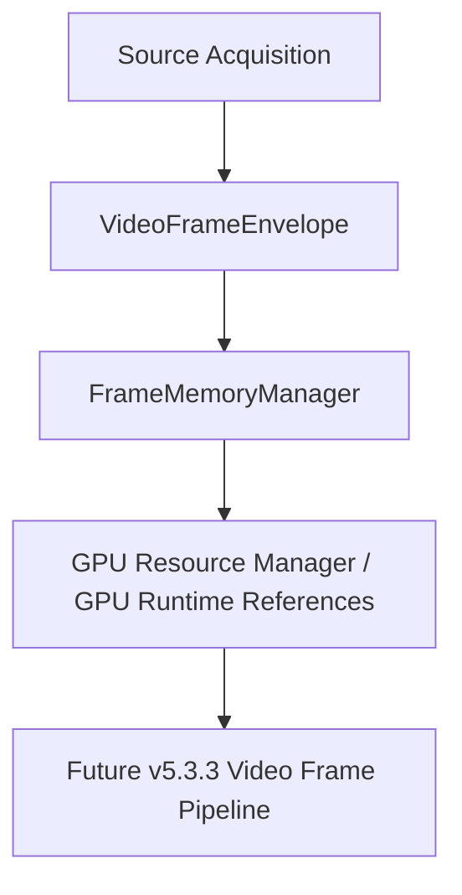
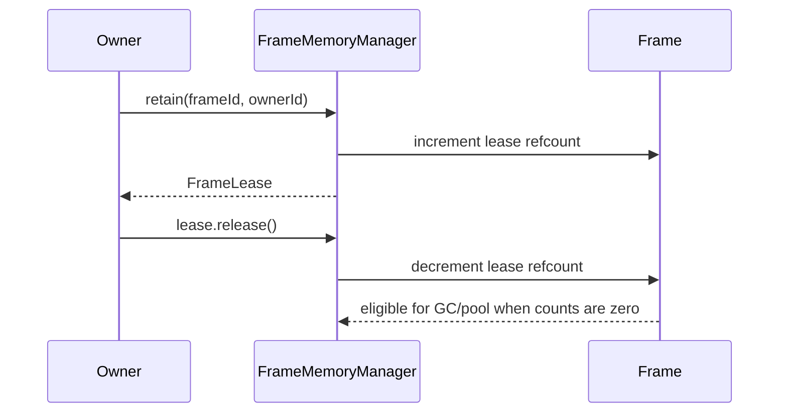
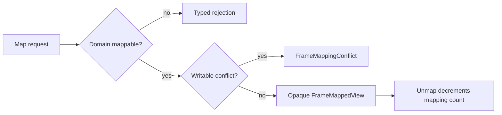
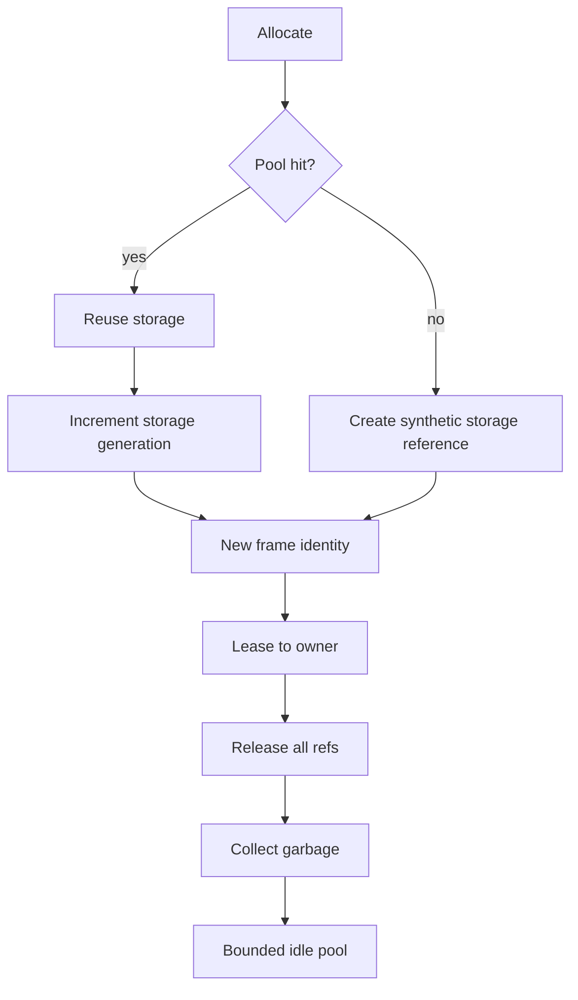
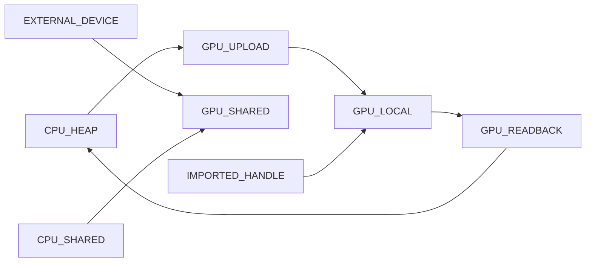
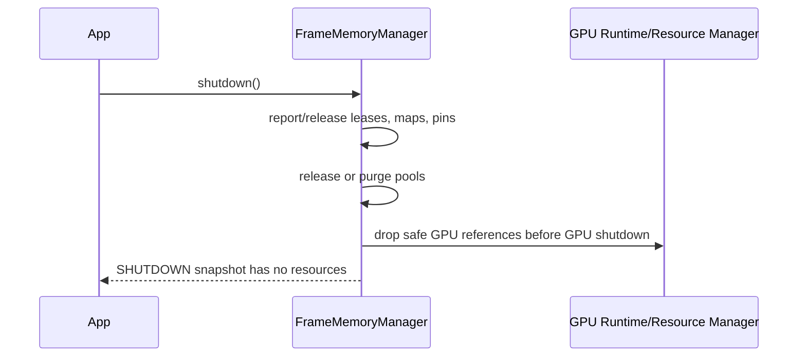

# UBOS v5.3.2 Production-Safe Frame Memory System

UBOS v5.3.2 introduces the authoritative frame-memory layer between source acquisition envelopes and the GPU runtime/resource abstractions. It stores and references video frame memory only; it does not scale, crop, color-convert, composite, record, stream, or replay pixels.

## Architecture and reused abstractions

The implementation reuses v5.1 command-handler contracts, source `VideoFrameEnvelope` and `SourcePayloadRef` metadata, GPU resource reference IDs, immutable JSON-safe snapshots, bounded telemetry, and explicit release semantics. Public state never includes raw pointers, native handles, process handles, GPU objects, or pixel bytes.

## Memory domains and storage types

Supported domains are `CPU_HEAP`, `CPU_PINNED`, `CPU_SHARED`, `GPU_LOCAL`, `GPU_UPLOAD`, `GPU_READBACK`, `GPU_SHARED`, `EXTERNAL_DEVICE`, `EXTERNAL_PROCESS`, `IMPORTED_HANDLE`, `SYNTHETIC`, and `UNKNOWN`. Storage types distinguish owned allocations, imported resources, shared resources, borrowed resources, external handles, frame views, staging resources, and synthetic validation resources.

## Identity, descriptors, and planes

Each frame has stable `frameId`, underlying `storageId`, source/stream/sequence fields when imported, frame/storage generations, timestamps, content version, origin, and safe metadata. `FrameMemoryDescriptor` captures format, dimensions, plane layout, domain, storage type, allocation size, strides, offsets, alignment, usage/access flags, color/alpha/orientation metadata, mapping/import/export/zero-copy capabilities, and optional safe GPU resource references. Multi-plane validation enforces plane count, bounds, positive dimensions, aligned offsets/strides, and non-overlap.

## Usage, access, ownership, and leases

Usage flags model source input, processing, render, shader, copy, recording, streaming, replay, CPU/GPU access, external sharing, temporary, and persistent uses. Access modes are read-only, write-only, read-write, immutable, and copy-on-write. Leases include lease ID, frame ID, owner ID, access, generation, acquisition time, optional expiry, and an exact-once `release()` method. Duplicate release, stale generation access, immutable writable access, and write conflicts produce typed `FrameMemoryError` failures.

## Reference counting, pinning, mapping

The manager tracks active/read/write leases, external references, parent/child view references, mappings, GPU submissions, and pin counts separately. Pin reasons are counted independently and prevent pool reuse. Mapping is allowed only for mappable domains; GPU-local mapping requires explicit transition. Mapped planes expose opaque byte-range references only.

## Zero-copy and source imports

Zero-copy assessment is metadata-only and returns eligibility plus reason codes. It never claims eligibility without compatible GPU/shared memory, backend import support, format, alignment, synchronization, ownership, and security policy evidence. Imports from source envelopes preserve source IDs, stream IDs, timestamps, sequence numbers, payload kind metadata, and release policy without exposing the payload handle.

## Allocation, lifetime, pools, pressure, cache

Allocations validate dimensions, format, plane layout, usage, pool eligibility, maximum frames, and byte budgets. Lifetime classes include tick transient through persistent/external lifetime. Pools are bounded by frame count and bytes, keyed by descriptor class, inspectable through immutable snapshots, and reuse storage only with incremented storage generation. General frame cache behavior remains disabled by default; future cache entries must hold explicit leases and include generation in their keys.

## Copy-on-write, views, transitions, state, generations

Cloning/copy-on-write creates a new frame identity and storage generation while leaving the original unchanged. Views are non-owning references bounded by parent plane metadata. Valid transitions include CPU heap/upload/GPU local/readback and imported/shared paths; every transition is explicit and recorded with operation ID and generation. Released or lost frames never return to ready state, and pooled storage can be reused only under new generations.

## Commands, processor integration, graph boundary

The module exports typed command names and lightweight handlers that route state changes through `FrameMemoryManager`. A separate processor is not required for v5.3.2: source acquisition can import envelopes via command/event integration. Source graph integration is metadata-only: domain, import capability, zero-copy result, generation, availability, pressure, and health may be exposed; frame handles, GPU objects, memory addresses, native pointers, and pixel data must not be exposed.

## Health, telemetry, events, watchdog

Health snapshots report active/pooled/leased/mapped/pinned/transitioning/lost/quarantined counts, CPU/GPU/shared/pool bytes, peak bytes, failures, stale-generation rejections, double-release attempts, leaks, pressure, device-loss count, and update time. Telemetry is bounded and aggregate. Event names and watchdog incidents are documented for integration; production should sample or aggregate per-frame events rather than emit all events by default.

## Production safety and synthetic backend

The synthetic backend uses opaque storage IDs and byte accounting rather than large real buffers. Invariants verify unique IDs, generation monotonicity, reference-count consistency, no negative counts, no active references in pools, no lost/quarantined reuse, budget compliance, immutable snapshots, and clean shutdown.

## Validation and limitations

Validation covers allocation, import, leases, mapping, pinning, clone/copy-on-write metadata, transitions, pool reuse, generation rejection, telemetry, invariants, long-run synthetic lifecycles, and shutdown idempotency. Device-loss callbacks, full watchdog incident publication, and source-graph UI surfacing remain integration points for v5.3.3 Video Frame Pipeline.
