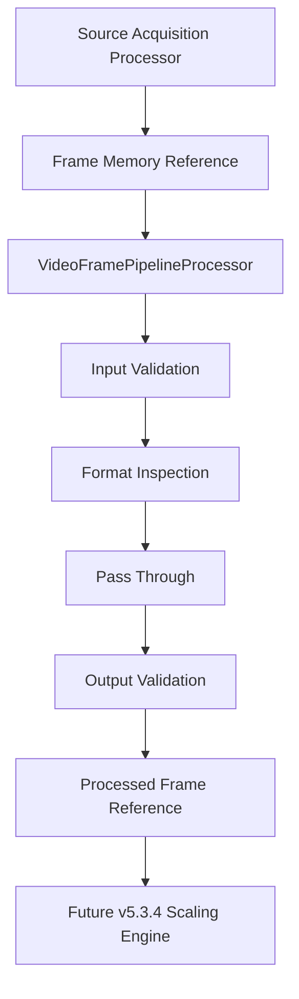
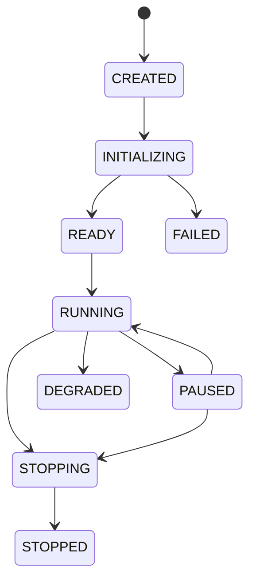
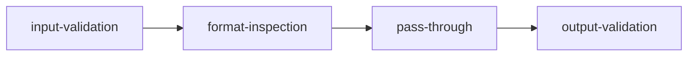
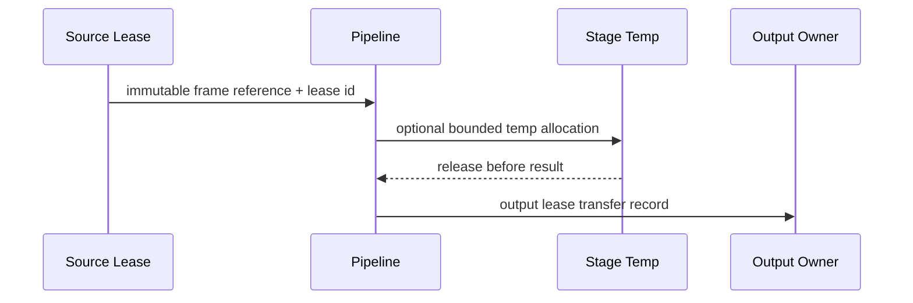
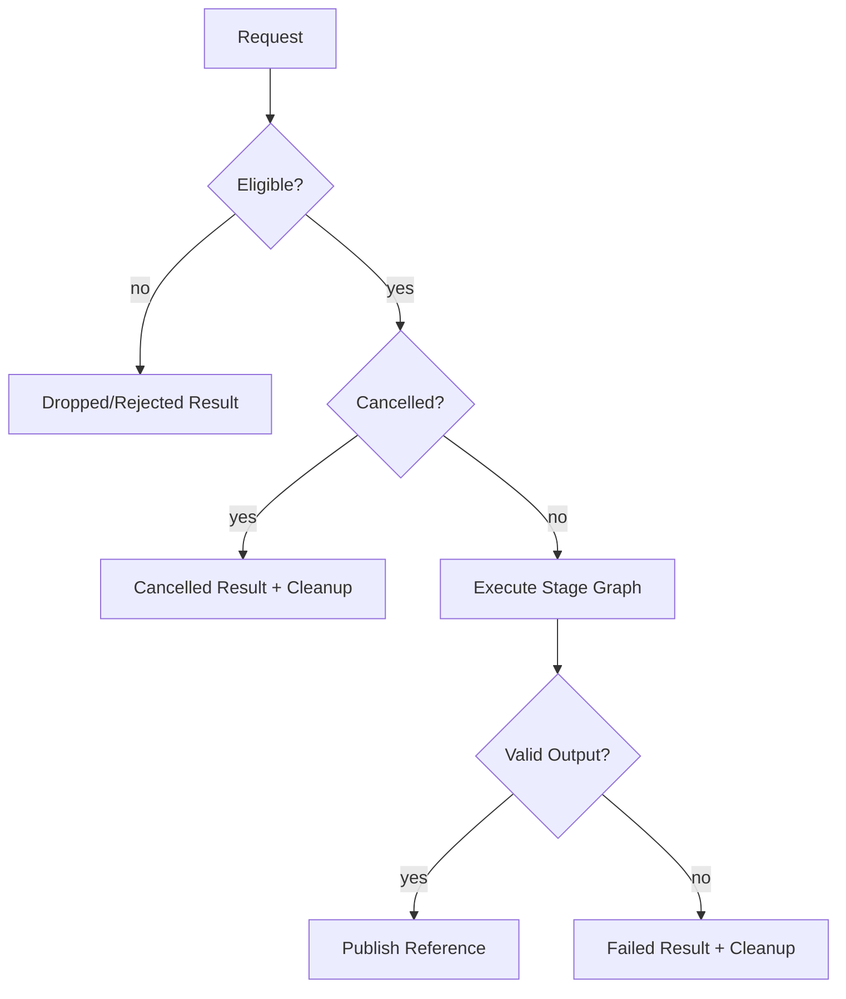
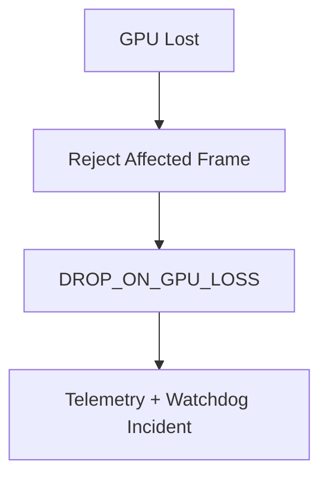
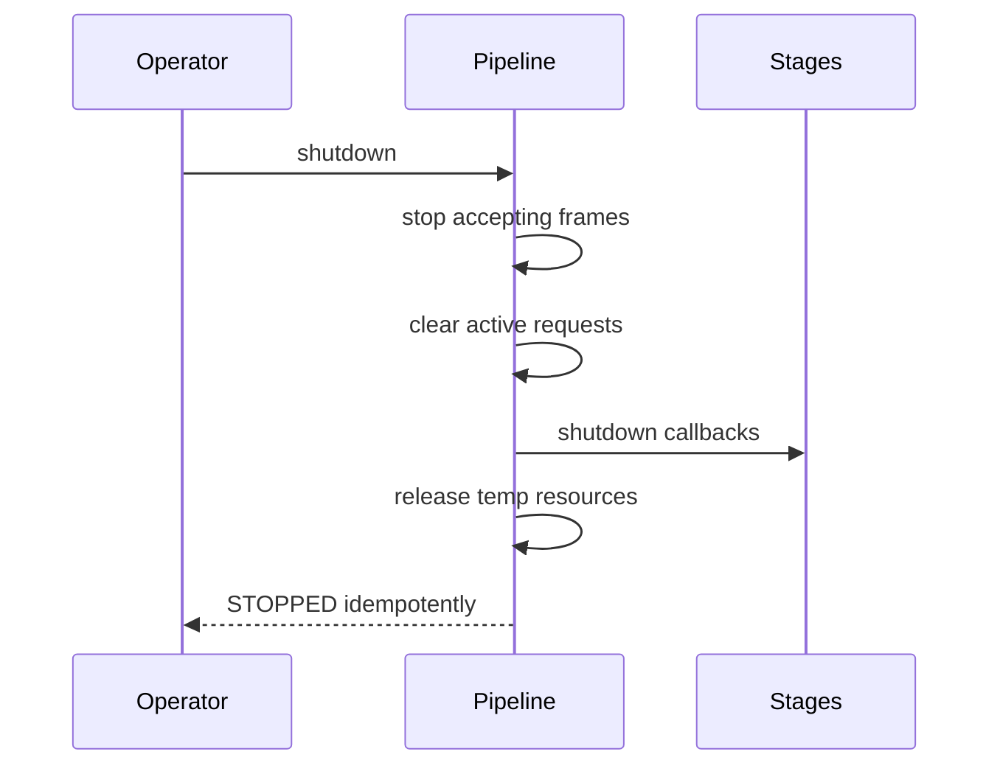

# UBOS v5.3.3 Production-Safe Video Frame Pipeline

UBOS v5.3.3 adds the deterministic video-frame pipeline between v5.2 source acquisition / frame import and the future v5.3.4 scaling engine. The pipeline orchestrates immutable frame-memory references; it does **not** scale, convert color, correct color, crop, rotate, composite, render, record, stream, replay, create shaders, or touch native graphics APIs.

## Responsibilities and Boundaries

The pipeline owns stage orchestration, dependency validation, immutable per-frame contexts, stage timing, budget accounting, request de-duplication, cancellation boundaries, failure/drop results, metadata-only telemetry, health snapshots, and output publication through the existing `ProcessorOutputRegistry`. Source discovery, source topology, frame-clock authority, frame-memory internals, GPU backend allocation, and pixel transformations remain owned by prior or future subsystems.

## Lifecycle

The lifecycle is `CREATED -> INITIALIZING -> READY -> RUNNING -> PAUSED/DEGRADED -> STOPPING -> STOPPED`, with `FAILED` reserved for unrecoverable validation or stage failures. Processing is accepted only in `RUNNING`; stopped and failed pipelines return structured rejection results.

## Stage Model, Phases, and Dependency Ordering

Stages implement immutable descriptors plus initialize/process/reconfigure/flush/shutdown callbacks. Implemented v5.3.3 stages are synthetic input validation, format inspection, pass-through, output validation, optional delay, failing, temporary-frame, and cancellation stages. Every descriptor has `mutatesPixels: false`; placeholder stage kinds cannot claim transformation.

Ordering is deterministic by phase, dependency topology, explicit order, and stable stage ID. Registration order is ignored.

## Process Requests, Contexts, and Frame References

`VideoFrameProcessRequest` carries source/stream identity, input frame ID, lease ID, expected frame/storage generations, runtime frame number, `FrameTick`, output profile ID, configuration generation, deadline, cancellation signal, correlation ID, and redacted metadata. `VideoFrameProcessContext` is built per frame as a deeply immutable snapshot and exposes no manager internals. `VideoPipelineFrameReference` contains frame/storage IDs, generations, lease ID, owner ID, source/stream, sequence, runtime frame, safe format, memory domain, state, timestamps, discontinuity, optional redacted GPU reference, and safe metadata.

## Ownership, Leases, and Temporary Resources

The phase models lease ownership explicitly in results. Pass-through stages preserve frame identity, source identity, timestamps, and output lease ID. Temporary synthetic frames are stage/request tagged, bounded by configuration, and always released on success, failure, cancellation, timeout, shutdown, or invariant checks.

## Configuration, Output Profiles, Eligibility, Failures, Drops, Budgets, and Concurrency

Configuration is immutable, generationed, and atomically reconfigured. Output profiles validate media kind, dimensions, format, color metadata, memory domain, GPU requirement, pass-through permission, mismatch policy, and maximum latency. A frame is eligible only when the pipeline is running, the configuration generation matches, request/frame/tick is unique, frame/storage generations match, lease reference is present, the frame is not lost/released/failed, and the deadline/drop policy permits processing.

Failure policies, drop policies, budget accounting, single-in-flight defaults, per-source de-duplication, and cancellation states are surfaced in immutable results and telemetry. No dropped, cancelled, or failed frame publishes an output reference.

## Processor, Registry, Source Graph, GPU, and Frame Memory Integration

`VideoFramePipelineProcessor` is a normal Tick Processor Framework processor ordered after source acquisition. It reads `source.videoFrames`, creates safe pipeline frame references, processes once per runtime tick, and publishes stable keys for imported video frames, pipeline results, processed references, dropped results, health, and telemetry. Source Graph integration remains metadata-only: last status, health, routing eligibility, output profile, and required future transforms can be projected without handles or pixels. GPU resources are visible only as redacted references; lost GPU frames deterministically drop. Frame-memory ownership is respected through public lease/generation/reference contracts without touching refcounts.

## Commands, Events, Health, Telemetry, and Watchdog

The public API declares typed command names for initialize/start/pause/resume/stop, stage registration, enable/disable, reconfigure, process, cancel, flush, validate, profile, and budget changes. Events are represented by telemetry `lastPipelineEvent` and health snapshots; production per-frame event emission is intentionally aggregatable. Watchdog incident constants cover stalls, stage failure/timeout, budget exceeded, duplicate frames, stale generations, invalid input/output, leaks, temp-memory pressure, GPU loss, invalid configuration, graph mismatch, and invariant failure.

## Security and Redaction

Metadata is bounded and redacted for handles, paths, URLs, credentials, device identifiers, native objects, and arbitrary unsafe fields. Snapshots are JSON-safe: bigint values become strings where snapshot consumers require serialization. No pixel data, raw memory, native GPU object, or mutable lease appears in observability.

## Synthetic Validation, Long-Run, and Performance

Synthetic stages provide deterministic validation of pass-through, optional failure, critical failure, timeout-like duration accounting, cancellation, and temporary frame cleanup without real sleeping. The hot path uses O(1) request lookup, O(1) stage lookup, cached O(s + e) topological ordering after configuration, O(s) per-frame traversal, and bounded snapshots/history.

## Limitations and v5.3.4 Integration

This phase intentionally preserves frame references without pixel transformation. v5.3.4 Scaling Engine should consume `videoPipeline.processedFrameReferences` and `videoPipeline.results`, add real transform stages through the same descriptor/dependency model, allocate any new frames through approved frame-memory contracts, and keep output publication deterministic.
