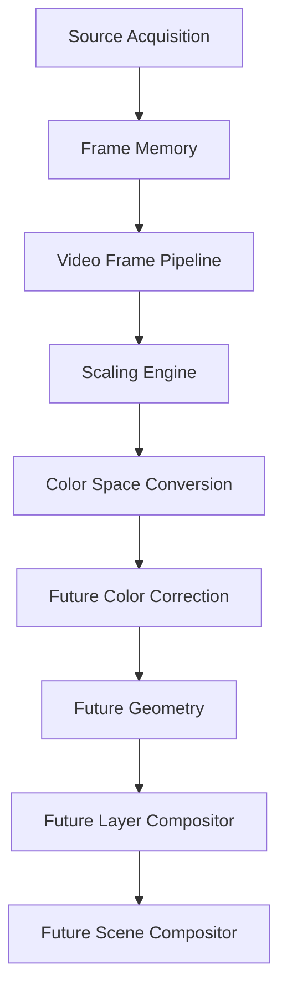
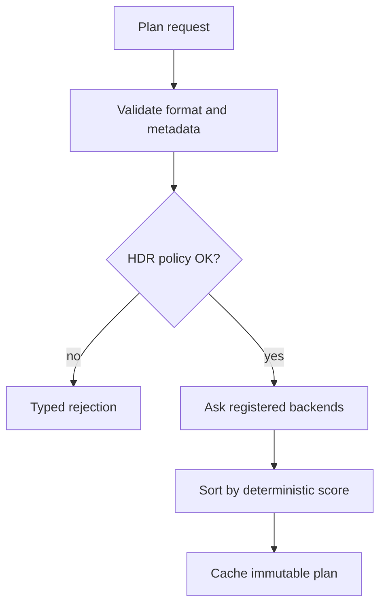
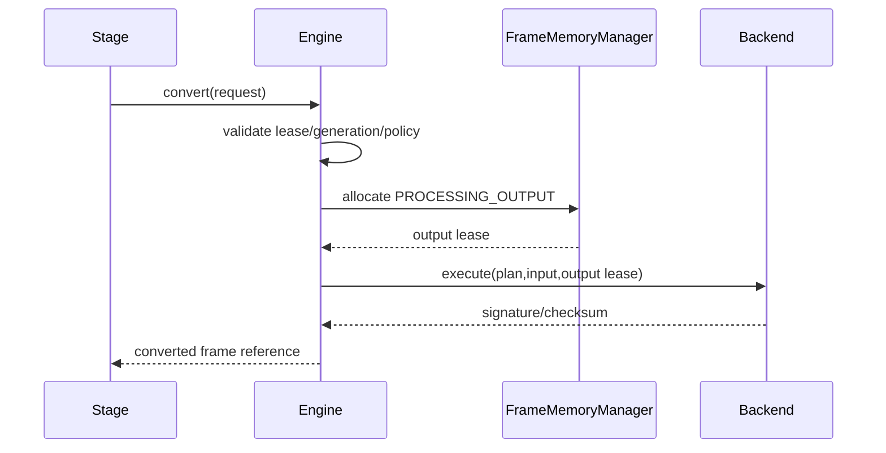
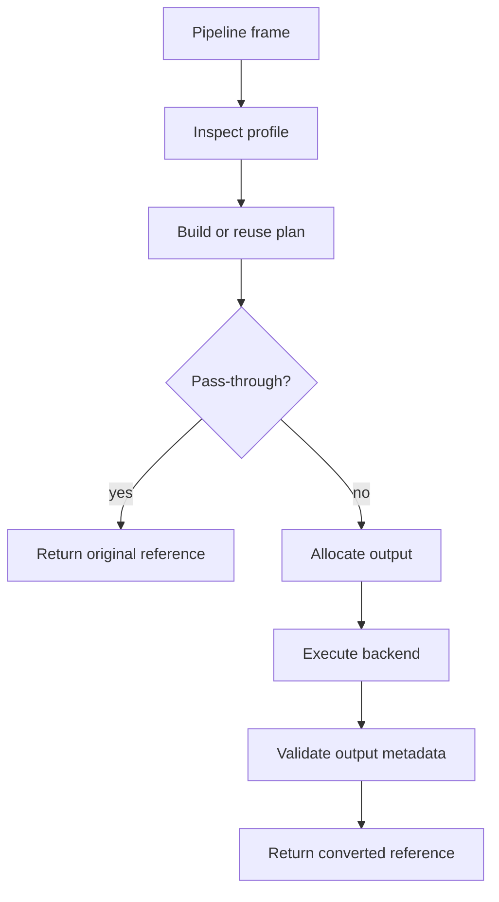
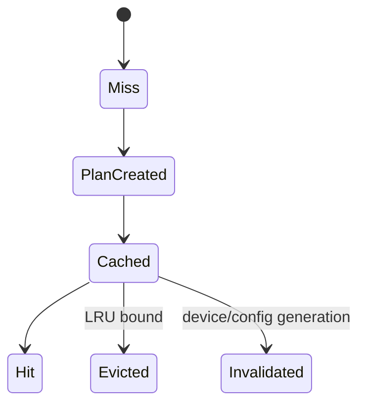
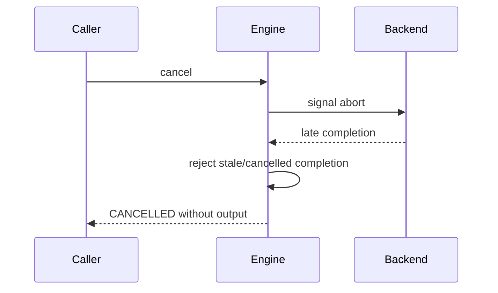
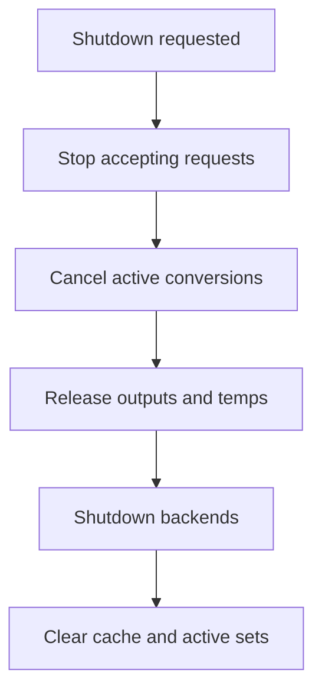

# UBOS v5.3.5 Color Space Conversion

## Purpose and position

UBOS v5.3.5 adds a production-safe, backend-neutral color conversion subsystem after the Video Frame Pipeline and Scaling Engine. It transforms pixel representation only: pixel format, RGB/YUV matrix representation, range, transfer, primaries, chroma layout, bit depth, and alpha representation. It deliberately excludes LUTs, grading, tone mapping, geometry, compositing, recording, streaming, and native graphics API code.

## Supported formats and metadata

The public API declares RGB24, BGR24, RGBA8, BGRA8, RGBA16F, RGBA32F, YUY2, UYVY, NV12, P010, I420, YV12, YUV420, YUV422, and YUV444. Capabilities are explicit per backend; unsupported pairs are rejected. Metadata supports BT.601, BT.709, BT.2020, Display P3, sRGB, Adobe RGB, ACES AP0/AP1, and UNKNOWN primaries; LINEAR, SRGB, BT.1886, GAMMA_22, GAMMA_24, PQ, HLG, LOG, and UNKNOWN transfers; IDENTITY, BT.601, BT.709, BT.2020 NCL/CL, FCC, SMPTE_240M, and UNKNOWN matrices; FULL, LIMITED, EXTENDED, and UNKNOWN ranges; CENTERED, LEFT, TOP_LEFT, COSITED, and UNKNOWN chroma siting; NONE, STRAIGHT, PREMULTIPLIED, OPAQUE, and UNKNOWN alpha.

UNKNOWN primaries, transfer, range, and matrix values are never guessed. HDR-to-SDR and SDR-to-HDR conversion is rejected because tone mapping is a future phase.

## Planning and pass-through

Plans include steps such as VALIDATE_INPUT, UNPACK, CHROMA_UPSAMPLE, RANGE_NORMALIZE, YUV_TO_RGB_MATRIX, TRANSFER_TO_LINEAR, PRIMARIES_MATRIX, TRANSFER_FROM_LINEAR, RGB_TO_YUV_MATRIX, RANGE_ENCODE, CHROMA_DOWNSAMPLE, BIT_DEPTH_CONVERT, ALPHA_PREMULTIPLY, ALPHA_UNPREMULTIPLY, PACK, and VALIDATE_OUTPUT. Selection is deterministic by score, backend ID, and plan ID; backend registration order does not change the selected plan.

Pass-through is allowed only when format and complete color metadata match and the profile allows it. It preserves frame identity and lease, performs no allocation, and reports PASSED_THROUGH.

## RGB/YUV path

## Backend abstraction and synthetic backend

Backends expose descriptors, capabilities, plan creation, execute, and shutdown. They do not mutate frame-memory reference counts or expose native handles. v5.3.5 ships a deterministic synthetic backend that validates compatibility, produces operation signatures and checksums, models warnings, and avoids large pixel buffers.

## Frame Memory and GPU integration

Actual conversion creates distinct frame/storage identity. Pass-through preserves identity. Temporary resources are bounded, failed outputs are released, and no raw pixels or native handles appear in telemetry.

GPU backends are future-compatible and must route resources through FrameMemoryManager and GPU Resource Manager. GPU loss deterministically fails conversion and invalidates stale GPU plans.

## Pipeline stage and output profiles

The `ColorConversionPipelineStage` consumes `VideoPipelineFrameReference`, reads the output profile for expected format, memory domain, and color metadata, plans conversion, and returns either a pass-through or converted reference. It preserves sourceId, streamId, sequence number, runtime frame number, timestamps, and discontinuity.

## Cache, cancellation, budgets, and failure

Cancellation is checked before planning, before output allocation, and after backend completion. Cancelled, failed, and timed-out conversions publish no output and release conversion-owned resources.

Failure policy supports frame failure, drop, explicit pass-through if allowed, bounded fallback, degraded pipeline, and operator intervention. No silent fallback is used when a profile requires conversion.

## Commands, outputs, source graph, health, telemetry, events, watchdog

Commands include backend registration, planning, execution, cancellation, defaults, quality, dither, clipping, cache clear, validation, and shutdown. Output registry keys cover requests, plans, completed results, converted/pass-through references, failures, health, and telemetry. Source Graph exposure is metadata-only.

Health and telemetry are bounded snapshots: counters for plans, cache hits/misses, conversions, pass-through, failures, unsupported conversions, range/matrix/transfer/primaries/chroma/bit-depth/alpha conversions, precision/alpha warnings, fallbacks, timeouts, GPU loss, allocation failures, durations, peak temporary bytes, and current request IDs.

Watchdog incidents include stalled conversion, backend failure, timeout, unsupported conversion, metadata mismatch, high precision loss, alpha loss, temporary memory pressure, GPU resource loss, allocation failure, stale generation, invalid cache, graph mismatch, and invariant failure.

## Security and invariants

Snapshots are JSON-safe, immutable, bounded, and redacted. They contain no pixel data, mapped memory references, GPU/native handles, URLs, credentials, private metadata, or backend error details. Invariants verify unique backend IDs, bounded cache, no active request after shutdown, pass-through identity preservation, distinct converted identity, matching metadata, HDR policy, timestamp and source identity preservation, and no leaked conversion-owned resources.

## Long-run and performance validation

Validation uses fake clocks, synthetic frames, synthetic frame memory, deterministic backend durations, and no real-time sleeping. The long-run scenario covers RGB/YUV formats, 8-bit/10-bit formats, full/limited ranges, BT.601/BT.709/BT.2020 metadata, SRGB/linear transfers, PQ/HLG preservation, chroma up/downsampling, alpha handling, fallback, failures, timeout/cancellation modeling, cache churn, and shutdown.

Expected complexity remains bounded: backend lookup O(1), cache lookup O(1), plan generation over bounded candidates, conversion orchestration O(steps), frame-memory operations O(1), snapshot O(backends + cache + active), and watchdog O(active + bounded incidents).

## Limitations and v5.3.6 integration

v5.3.5 does not perform real pixel math in the synthetic backend, tone mapping, creative grading, LUTs, white balance, exposure, saturation, geometry, compositing, recording, streaming, or native graphics API integration. v5.3.6 Color Correction can consume converted frame references and add explicit creative color operations without weakening v5.3.5 metadata, HDR, alpha, ownership, and determinism guarantees.
