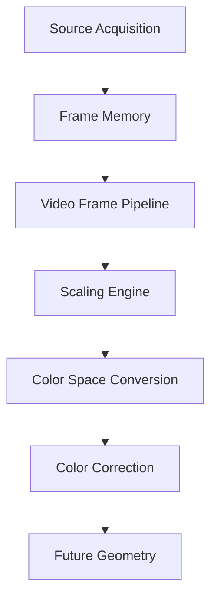
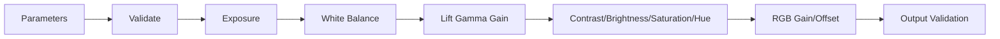
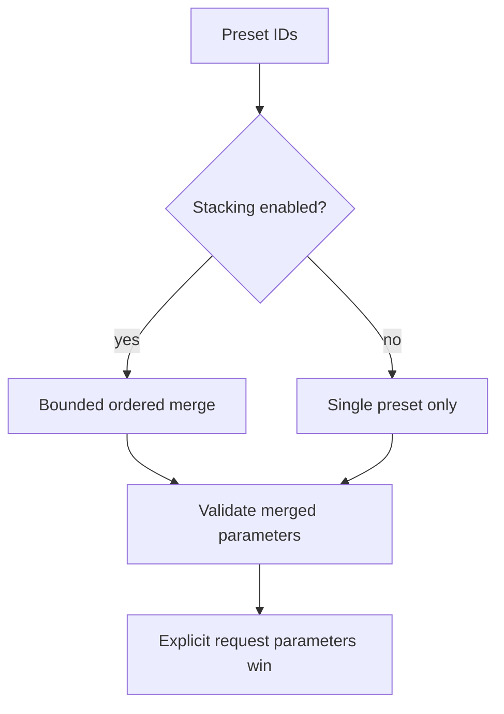
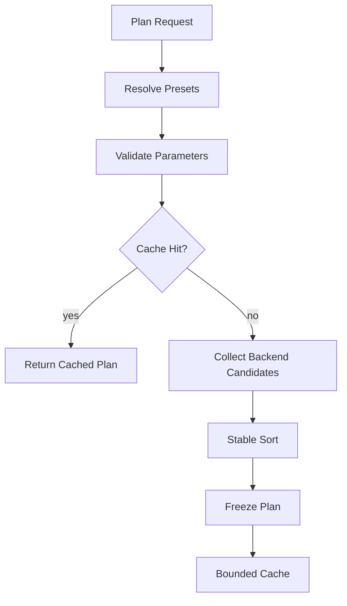
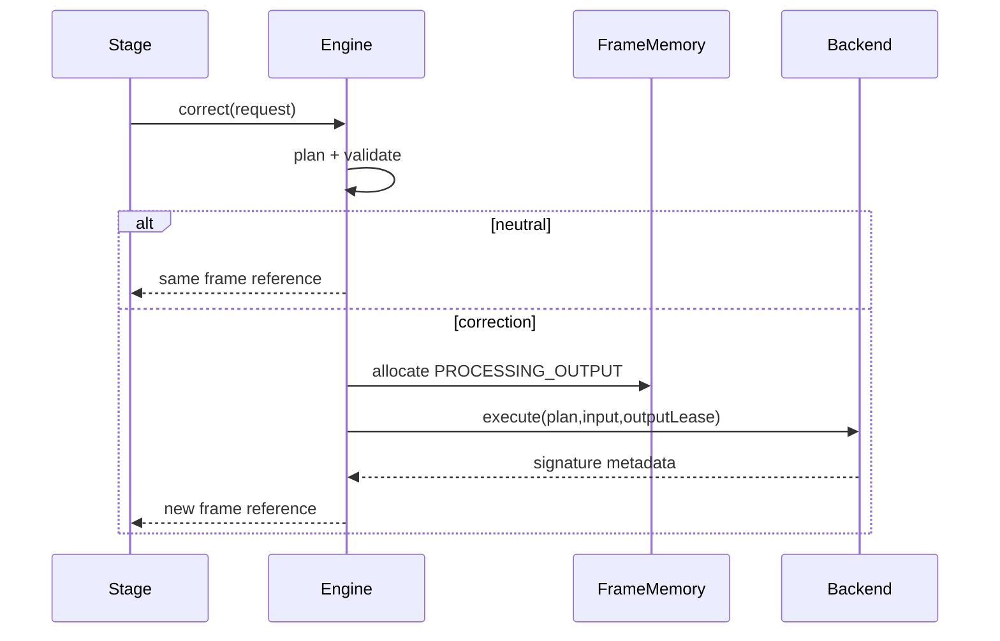
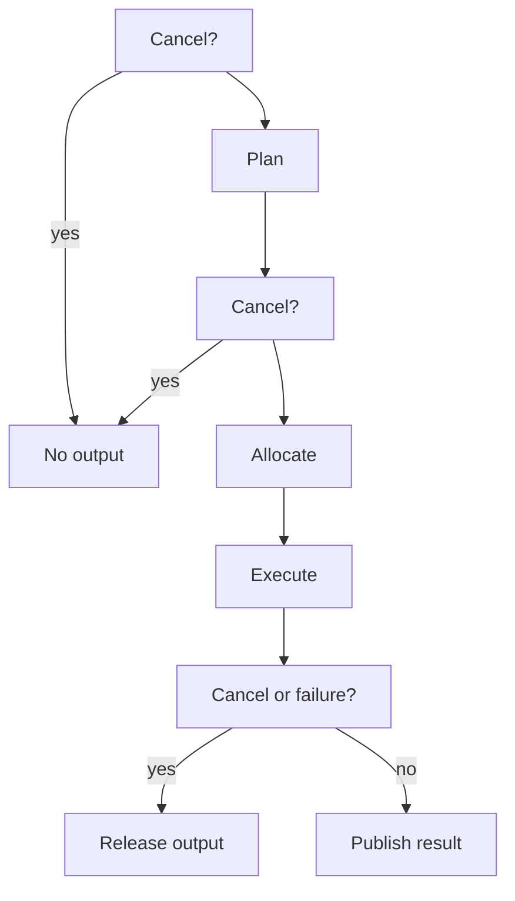
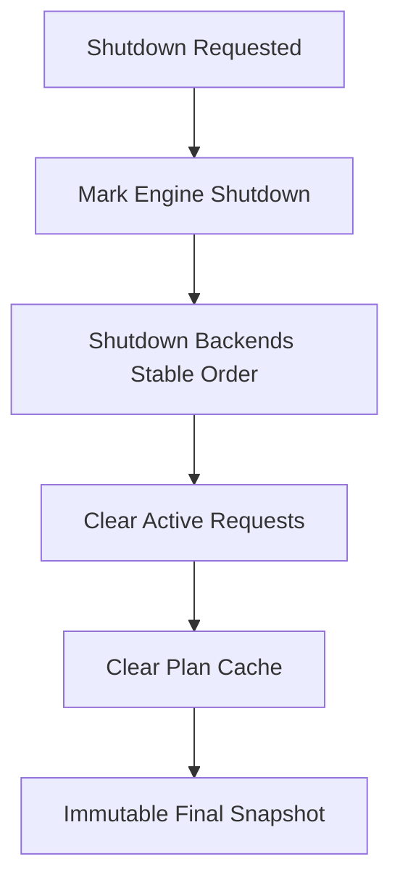

# UBOS v5.3.6 — Production-Safe Color Correction

## Purpose and position

Color Correction runs after Scaling and v5.3.5 Color Space Conversion and before future Geometry. It validates deterministic brightness, contrast, saturation, hue, exposure, gamma, white-balance, lift/gamma/gain, shadows/midtones/highlights, RGB gain/offset, and black/white level parameters without performing hidden scaling, color conversion, HDR tone mapping, compositing, or timing changes.

## Parameter model and ranges

`ColorCorrectionParameters` is snapshot-normalized against neutral defaults. Numeric values must be finite. Production default policy is `REJECT_OUT_OF_RANGE`; `CLAMP_TO_SUPPORTED_RANGE` and `WARN_AND_CLAMP` make clamped names observable. Ranges are: brightness -1..1, contrast 0..4, saturation 0..4, hue -180..180, exposure -10..10, gamma 0.1..10, temperature offset -20000..20000, tint/lift/shadows/midtones/highlights/RGB offsets -1..1, gain/RGB gains 0..4, and black/white levels 0..1 with black strictly lower than white.

## Correction order

The immutable operation order is validate input, normalize working representation, exposure, temperature/tint, lift, gamma, gain, shadows, midtones, highlights, contrast, brightness, saturation, hue, per-channel gain, per-channel offset, black/white level, clamp/extended-range policy, and validate output.

## Working spaces and intents

Working spaces are `LINEAR_RGB`, `SCENE_LINEAR`, `DISPLAY_REFERRED_RGB`, `ACESCG`, `BACKEND_NATIVE`, and `CUSTOM`. YUV formats are rejected by correction and must first pass through Color Conversion. Intents are metadata-only and include source normalization, camera matching, exposure balancing, white balance, look preparation, output compensation, operator adjustment, preset application, and custom.

## Presets, stacking, and LUT boundary

Presets are immutable redacted snapshots with unique IDs, versions, compatibility metadata, safe metadata, and bounded registry size. Optional preset stacking is explicit, bounded, acyclic, and deterministic with last explicit value winning. LUT references model future 1D/3D/CDL/ASC-CDL/ICC/custom LUT support but do not expose raw contents or private paths and are rejected unless a backend explicitly supports them.

## Planning and determinism

Plans include input/output format and metadata, working space, effective parameters, operation order, preset IDs, redacted LUT metadata, selected backend, pass-through flags, allocation estimates, quality tier, deterministic score, and warnings. Cache keys include format, metadata, working space, parameters, presets, LUT references, quality, backend preference, device generation, and pipeline configuration generation. Backend tie-breaking is stable by score, temporary memory, and backend ID; registration order does not affect selected output.

## Pass-through, bypass, output allocation, and frame ownership

Neutral or disabled correction with no LUT and compatible format is `PASSED_THROUGH`, preserving frame and storage identity and avoiding output allocation. Non-neutral correction allocates a distinct `PROCESSING_OUTPUT` frame through `FrameMemoryManager`; input frames are never mutated.

## HDR, alpha, clamping, cancellation, budgets, and failure

HDR PQ/HLG metadata is preserved; HDR-to-SDR, SDR-to-HDR, gamut compression, tone mapping, and transfer replacement are not implemented. Alpha behavior is explicit via preserve/RGB-only/premultiplied-safe/unpremultiply/reject/backend-default policies. Clamp policies are explicit and warnings are counted. Cancellation is checked before planning, before allocation, before execution, and after execution; failed, timed-out, and cancelled outputs are released.

## Pipeline, output registry, source graph, health, telemetry, and watchdog

`ColorCorrectionPipelineStage` reuses `VideoFramePipelineStage`, depends on color conversion, preserves timestamps and source identity, and publishes only safe result metadata. Output keys cover requests, plans, results, corrected references, pass-through references, failed results, health, telemetry, and active preset summaries. Source Graph integration exposes enabled state, active presets, parameter summary, working space, status, health, last corrected runtime frame, backend class, and bypass state only. Watchdog incident constants cover stalls, backend failures, timeouts, invalid parameters/presets, unsupported LUTs, excessive clamping, precision loss, temporary memory pressure, GPU loss, allocation failure, stale generation, invalid plan cache, graph mismatch, and invariant failure.

## Security and invariants

Snapshots are deeply immutable, JSON-safe, bounded, deterministically ordered, and redacted. They contain no pixel data, LUT contents, native handles, mutable leases, GPU objects, or private paths. Invariants enforce unique backend/preset IDs, bounded plan cache and preset registry, deterministic plans, distinct output identity when correction applies, pass-through identity preservation, operation order fidelity, generation safety, and clean idempotent shutdown.

## Validation, long-run model, performance, and limitations

Synthetic validation covers registration, duplicate rejection, preset immutability/redaction, plan determinism/cache hits, invalid gamma, NaN, black/white inversion, explicit clamp observability, pass-through identity, output allocation, timestamp preservation, and idempotent shutdown. Long-run validation uses fake clocks and synthetic frame memory with no real-time sleeps. Complexity remains O(1) for backend/preset/cache lookup, O(p) for bounded preset stacks, O(c log c) for bounded candidate planning, and O(operations) for orchestration. v5.3.6 intentionally does not implement native shaders, real LUT application, HDR tone mapping, geometry, compositing, recording, streaming, replay, or audio.

## v5.3.7 integration

The Geometry Engine should consume `colorCorrection.correctedFrameReferences` or pass-through references and must preserve correction metadata without reusing correction-owned output leases incorrectly.
