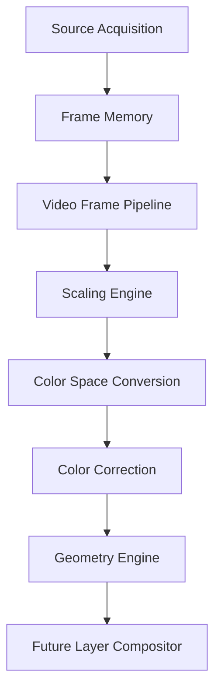
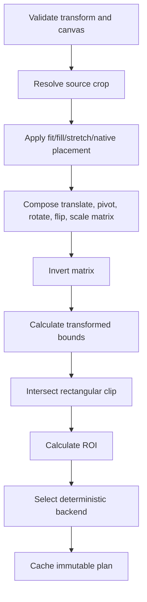
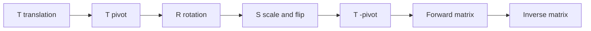
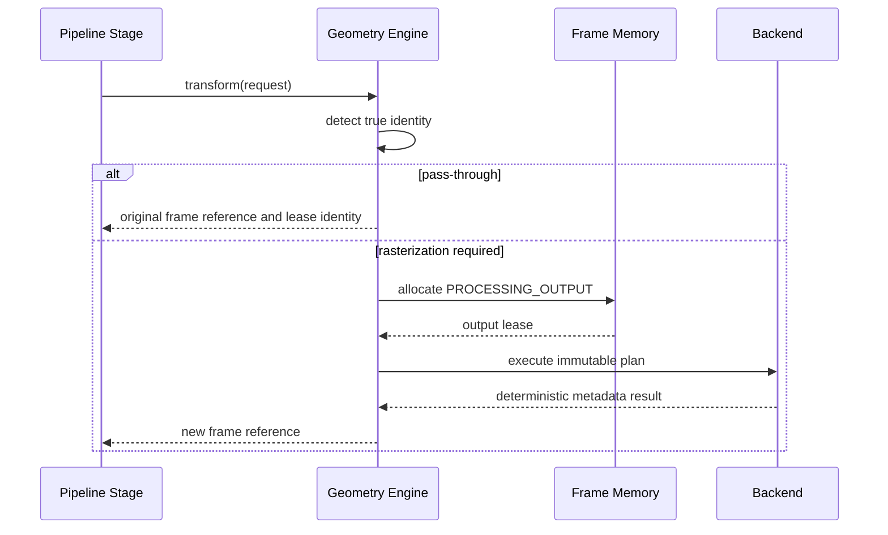
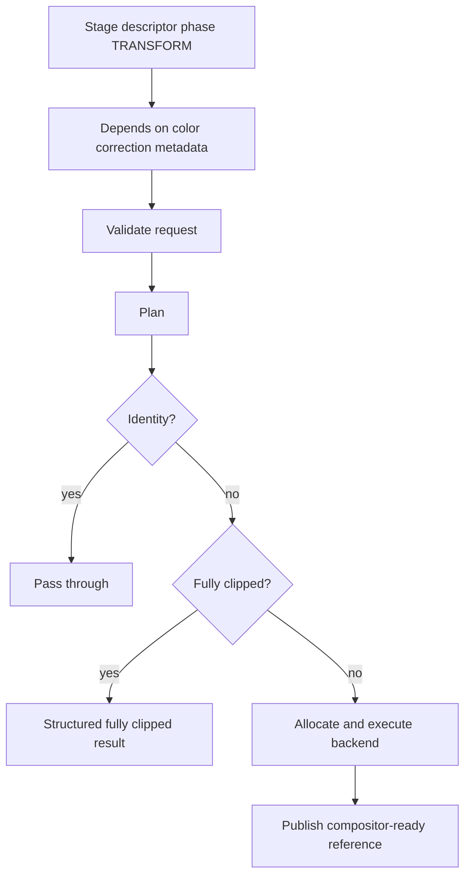
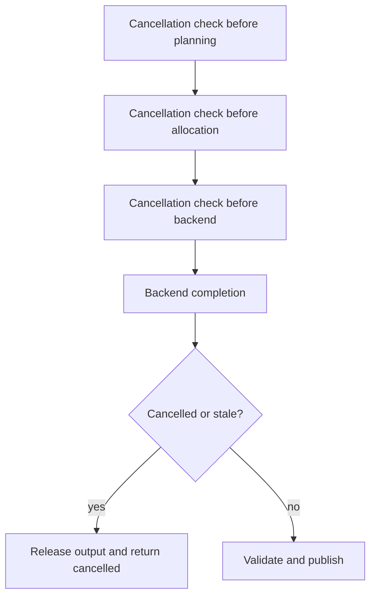
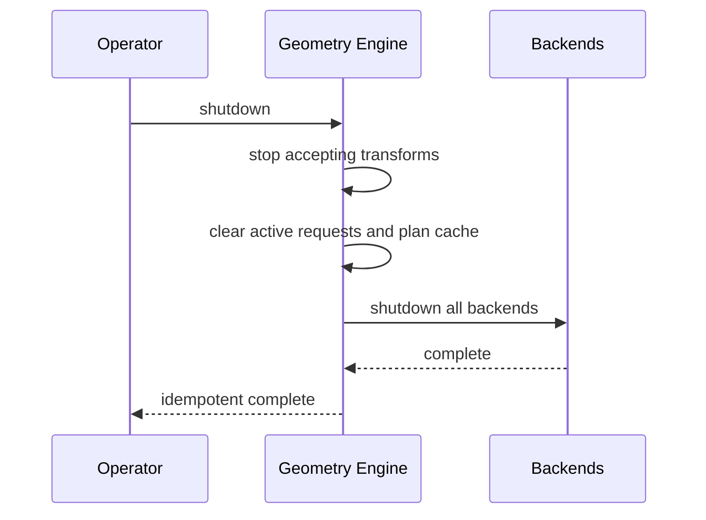

# UBOS v5.3.7 — Production-Safe Geometry Engine

The Geometry Engine adds deterministic spatial transformation after Scaling, Color Space Conversion, and Color Correction, and before the future Layer Compositor. It owns validation, coordinate interpretation, crop and placement planning, matrix construction, bounds/ROI calculation, backend selection, output allocation orchestration, telemetry, health, and cleanup. It does not composite layers, alter color, own source acquisition, or allocate GPU resources outside existing managers.

## Coordinate spaces and primitives

Every point, size, rectangle, and inset declares a coordinate space: source/destination/canvas pixels, normalized spaces using `0.0..1.0`, display points, clip space, or custom. Conversion is explicit and deterministic; unsupported conversion is rejected rather than inferred. Primitives are immutable, JSON-safe numeric metadata with no pixel payloads or native handles.

## Transform model

A `GeometryTransform` separates source crop from destination placement and includes translation, positive scale factors, explicit horizontal/vertical flip flags, normalized rotation degrees, anchor and pivot points, pixel aspect ratio, fit mode, alignment, clipping, safe-area metadata, interpolation, edge policy, canvas metadata, and enablement. Zero, negative, NaN, infinite, singular, or implicit negative-scale flip transforms are rejected.

## Planning flow

## Crop, fit, placement, rotation, and clipping

Source crop supports source-pixel rectangles, normalized rectangles, and insets. The default policy rejects out-of-bounds crops; explicit clamp produces observable effective crop metadata. Fit modes include NONE, FIT, FILL, STRETCH, CENTER, NATIVE, INTEGER_SCALE, DOWNSCALE_ONLY, UPSCALE_ONLY, and CUSTOM. Alignment is applied after fit/fill calculation. Rotation is clockwise-positive in canvas coordinates and normalized into `[0, 360)`. Flip order is scale/flip before rotation around the pivot.

## Matrix composition

Matrices are immutable `Matrix3x3` arrays. Determinants are checked and singular transforms are rejected. Bounds are calculated from transformed destination corners, then clipped against the declared rectangle or canvas. ROI reports source region, destination region, clip intersection, interpolation expansion, chroma expansion, and visible pixels.

## Frame ownership and output allocation

Identity pass-through preserves frame ID, storage ID, lease, timestamps, source identity, and color metadata. Rasterized geometry produces distinct output identity. Failure, cancellation, timeout, or fully clipped policies publish no invalid output.

## Pipeline-stage execution

The stage preserves source identity and timestamps, mutates pixels only when rasterization is required, and remains backend-neutral.

## Backend abstraction and synthetic backend

Backends expose descriptors, capabilities, deterministic plan candidates, execution, and shutdown. The v5.3.7 synthetic backend supports metadata-only deterministic crop, placement, fit/fill/stretch, translation, rotation, flip, clipping, matrix, inverse, bounds, ROI, pass-through, and opaque output signatures without native graphics dependencies or large pixel buffers.

## Output profile, profiles, and cache

The canvas descriptor carries width, height, pixel aspect ratio, format, color metadata, alpha mode, memory domain, and background behavior. Geometry does not silently convert color or relabel alpha. Reusable immutable profiles are bounded, unique, non-recursive defaults that resolve to explicit transforms. The plan cache is bounded and keyed by source identity/generation class, output canvas, transform, policies, quality, backend preference, device generation, and pipeline configuration generation. Eviction is deterministic insertion order; backend/profile changes invalidate affected plans.

## Fully clipped, cancellation, budgets, and fallback

Fully clipped output is observable and does not allocate unless an explicit transparent-frame policy requests it. Timing is captured with injected monotonic clocks for transform orchestration. Fallback is deterministic and bounded by sorted backend scores.

## Health, telemetry, events, watchdog, and security

Health tracks engine state, backend/profile/cache counts, active requests, completed/pass-through/fully-clipped/failed/cancelled/rejected counts, validation failures, singular matrices, allocation failures, stale generations, and temporary bytes. Telemetry tracks plan/transform totals, cache hits/misses, operation counters, peak temporary bytes, active request IDs, and the last geometry event. Watchdog incident codes cover stalls, backend failure, timeout, invalid transforms/crops/chroma alignment/matrices/bounds, clipping rate, memory pressure, GPU loss, allocation failure, stale generation, cache invalidity, graph mismatch, and invariant failure.

Observability redacts runtime handles and never exposes pixel data, GPU objects, native backend details, file paths, URLs, credentials, or mutable leases. Rectangles and matrices are bounded safe metadata.

## Output registry, commands, and Source Graph boundary

Typed output keys cover geometry requests, plans, results, transformed references, pass-through references, fully clipped results, failed results, health, telemetry, and active profiles. Commands route through the execution engine with typed payloads/results and exactly-once command records. Source Graph integration exposes metadata only: enabled state, active profile, effective crop/destination, rotation, flip, anchor, pivot, output canvas, visible bounds, clipping state, safe-area state, transform status, health, runtime frame number, backend class, and pass-through state.

## Shutdown

## Validation and limitations

Synthetic validation covers creation, backend registration, duplicate rejection, unregistration, immutable planning, cache hit/miss, crop policies, fit/fill, rotation normalization, flip, fully clipped behavior, matrix inverse/singularity, pass-through identity, distinct raster output identity, timestamp/source preservation, Source Graph metadata, output keys, watchdog incidents, generation rejection, invariants, and idempotent shutdown. Long-run and performance validation are deterministic loops without real-time sleeping and should avoid machine-specific thresholds.

Current limitations: v5.3.7 provides backend-neutral metadata rasterization and output identity orchestration, not native GPU or shader processing, compositing, masking, transitions, text, graphics rendering, color conversion, recording, streaming, or audio. UBOS v5.3.8 Layer Compositor should consume transformed frame references and ROI metadata without mutating geometry contracts.
