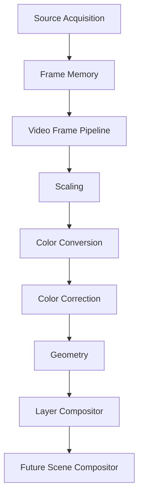
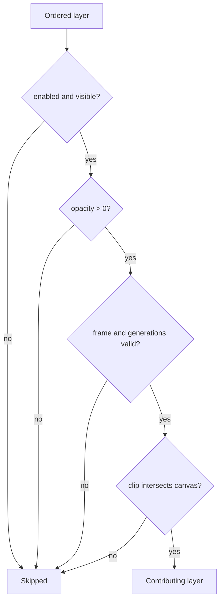
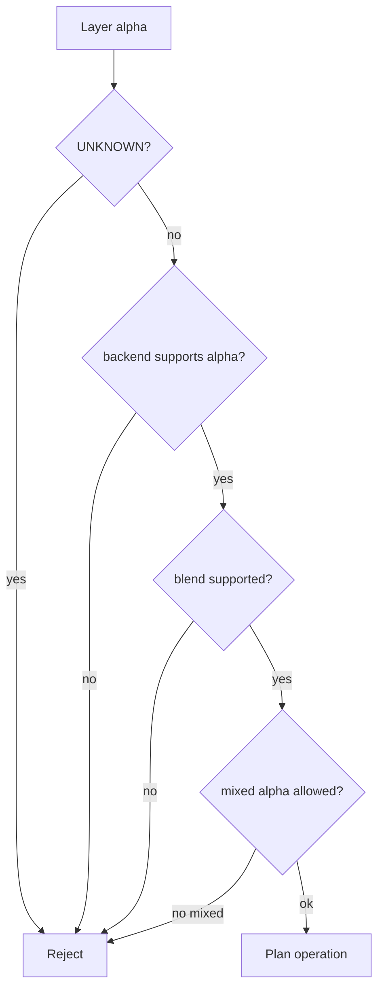
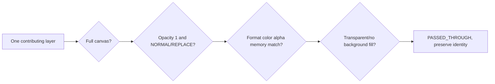
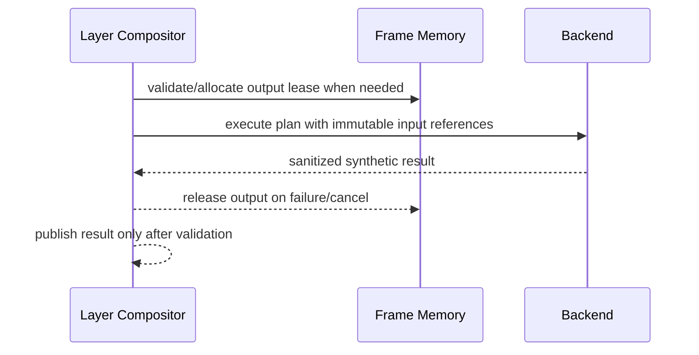
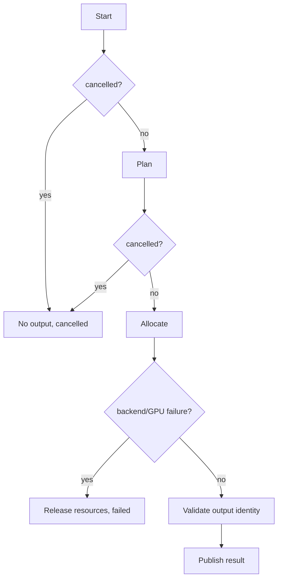
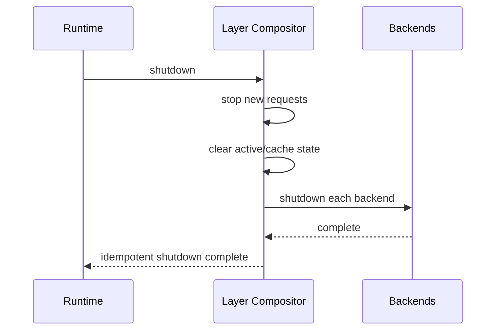

# UBOS v5.3.8 Layer Compositor

## Purpose and position

The v5.3.8 Layer Compositor is the backend-neutral stage between Geometry and the future Scene Compositor. It accepts geometry-ready video frame references, validates layers, computes one deterministic stack, plans blend and alpha operations, and either passes through one exact-canvas layer or allocates a new composited output frame.

## Layer model, roles, ordering, and z-index

`LayerDescriptor` is immutable and carries layer/source/stream identity, immutable pipeline frame reference metadata, frame/storage generations, geometry reference, signed bounded `zIndex`, explicit order, enable/visibility flags, opacity, blend mode, alpha mode, optional rectangular clip, bounds, role, group metadata, temporal/cache policy, criticality, and sanitized metadata.

Roles are metadata and deterministic ordering aids only: background, primary/secondary video, picture-in-picture, overlay, graphic, logo, bug, lower third, caption, placeholders, and custom. No graphics generation, keying, masks, or scene switching is implemented.

Insertion and backend registration order do not affect final order. Negative z-index is supported. Duplicate IDs, invalid z-index, stale geometry, invalid opacity, missing critical frames, unknown alpha, unsupported blends, and hidden conversions are rejected.

## Visibility, opacity, clipping, groups, dirty regions, and occlusion

A layer contributes only when enabled, visible, present, not lost/released, generation-matched, opacity is greater than zero, group visibility allows it, and its effective rectangular bounds intersect both clip and canvas. Group opacity multiplies layer opacity deterministically. One-level groups are supported; nested groups and unsupported isolation are rejected.

Dirty region metadata is deterministic and bounded. Occlusion is conservative: only later full-canvas, normal/replace, fully opaque layers with non-alpha modes can cover lower layers. Non-normal blends and transparent layers do not unsafe-occlude.

## Blend modes, alpha model, output alpha, and background

The public model includes normal, replace, add, multiply, screen, darken, lighten, difference, subtract, min, max, premultiplied-over, straight-alpha-over, and custom blend declarations. Backends must explicitly advertise support; unsupported modes fail typed planning.

Alpha modes are none, opaque, straight, premultiplied, and unknown. Unknown alpha is rejected. Mixed straight/premultiplied inputs are rejected under `REJECT_MIXED_ALPHA`. There is no hidden premultiply, unpremultiply, scaling, color conversion, or black fill. Background policy is explicit: transparent, opaque black/white/custom, background layer, preserve existing, or undefined.

## Canvas, geometry, timestamps, and composite identity

`LayerCompositionCanvas` defines dimensions, format, color metadata, alpha mode, memory domain, pixel aspect, background policy, safe area, and maximum layers. Inputs must already match canvas/profile constraints; mismatches are rejected or handled upstream. Geometry generations must match frame/storage generations, and the compositor does not mutate geometry.

Timestamp policy is explicit: runtime tick, primary/latest/earliest layer timestamp, aligned timestamps, or custom. Composite identity is distinct from source identity for allocated outputs and includes composition ID, frame/storage IDs, runtime frame number, pipeline and composition generations, contributing layer IDs, primary source when applicable, output profile, and canvas ID.

## Single-layer pass-through and empty composition

Empty composition returns `EMPTY` unless an explicit background policy requests a background-only output. Hold-last-output is modeled but disabled by default.

## Backend abstraction and synthetic backend

Backends expose descriptors, capabilities, deterministic plan candidates, execute hooks, and shutdown hooks. The synthetic backend performs metadata-only deterministic composition, supports configured blend/alpha capabilities, produces deterministic operation signatures, and never allocates or processes pixel buffers directly.

## Frame Memory and GPU Resource Manager integration

The compositor uses `FrameMemoryManager` for output allocation. It does not mutate refcounts directly and does not access native GPU objects. GPU loss, device-generation mismatch, stale completion, failure, timeout, and cancellation prevent output publication.

## Pipeline-stage, commands, outputs, source graph, health, telemetry, events, watchdog

`LayerCompositorPipelineStage` advertises the v5.3.8 stage descriptor and preserves existing single-frame pipeline behavior until multi-layer request metadata is supplied by the future scene layer. Typed commands, output keys, source-graph metadata boundaries, health snapshots, telemetry counters, event names, and watchdog incident names are exported with sanitized JSON-safe data.

## Cancellation, budgets, fallback, validation, and invariants

Invariants cover backend uniqueness, bounded plan cache, duplicate layer rejection, valid opacity/alpha/blends, deterministic order, stale generation rejection, no false pass-through, output identity separation for composites, snapshot redaction, and clean shutdown.

## Long-run validation and complexity

Validation covers deterministic plans, shuffled layer permutations, backend permutations, cache churn, empty/background/pass-through/composite paths, alpha/blend rejection, clipping, occlusion, source-graph metadata, shutdown idempotency, and frame-memory allocation. Expected complexity is O(1) backend and cache lookup, O(l log l) ordering, O(l) visibility, bounded conservative occlusion under maximum layer count, O(l) orchestration, and bounded snapshot generation.

## Limitations and v5.3.9 integration

This phase intentionally excludes scene switching, transitions, authored graphics, text rendering, arbitrary masks, keying, audio, recording, streaming, replay, and native graphics API dependencies. v5.3.9 Scene Compositor should consume composited frame references, layer-stack summaries, dirty-region summaries, health, telemetry, and explicit timestamp/composite identity metadata.

