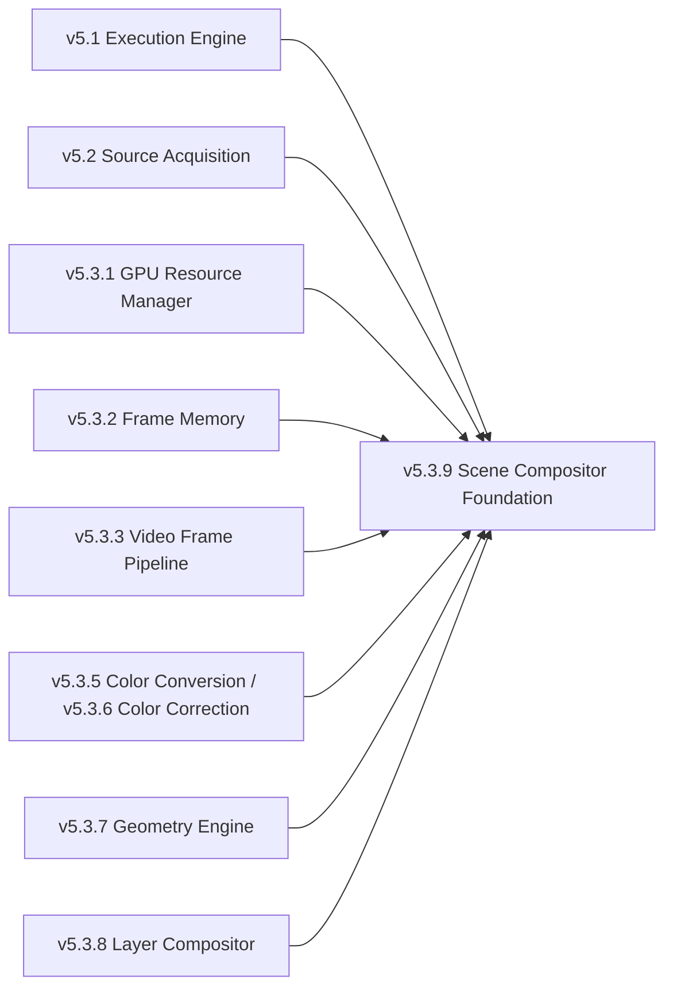
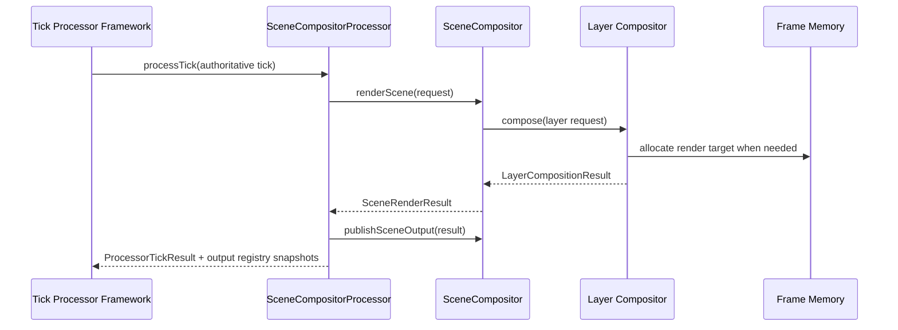

# UBOS v5.3.9 — Production-Safe Scene Compositor Foundation

UBOS v5.3.9 begins the Scene Compositor as the scene-level foundation above the v5.3.8 Layer Compositor. This phase is deliberately a **registry, validation, identity, lifecycle, and snapshot foundation**. It does not render scenes, allocate output frames, perform transitions, mix audio, record, stream, replay, or duplicate any v5.1–v5.3 media-plane subsystem.

## Reused media-plane boundaries

The foundation records dependencies as metadata and validates references, but ownership remains with the existing subsystem: source lifecycles stay in Source Acquisition, memory lifetimes stay in Frame Memory, GPU handles stay in the GPU Resource Manager, frame orchestration stays in the Video Frame Pipeline, geometry and color work stay in their engines, and layer composition remains in the Layer Compositor.

## Implemented model

The public model includes:

- `SceneCompositor` interface and `DefaultSceneCompositor` implementation;
- `SceneIdentity` with deterministic `sceneId`, deterministic `stableId`, version, and generation;
- `SceneDefinition` with bindings, output profiles, and dependency metadata;
- `SceneCollection`, `SceneTemplate`, and `SceneVariant` registries;
- `SceneInstance` runtime objects for Preview, Program, AUX, clean-feed, Multiview, and custom roles;
- `SceneOutputProfile` for horizontal, vertical, square, clean-feed, and Multiview output metadata.

All snapshots are immutable, JSON-safe, metadata-only, and explicitly mark that they contain no pixels and no runtime handles.

## Registration and validation

The compositor supports bounded registration for collections, templates, variants, and scenes. Registries reject duplicate IDs and enforce a configurable maximum size. Scene validation checks collection/template dependencies, duplicate binding IDs, source binding completeness, nested-scene references, direct self-nesting, integer order/z-index values, duplicate output profile IDs, and output registry key namespace rules.

Bindings and output profiles are normalized into deterministic order. Binding order is by z-index, authored order, role, then binding ID. Output profile order is by authored order, role, then output profile ID.

## Runtime lifecycle

Runtime scene lifecycle is instance-based. `createSceneInstance()` creates an inactive instance. `activateScene()`, `deactivateScene()`, `suspendScene()`, `resumeScene()`, and `destroySceneInstance()` enforce legal state transitions and expected-generation protection.

Supported activation states are:

- `INACTIVE`
- `ACTIVE`
- `SUSPENDED`
- `DESTROYED`

Invalid lifecycle transitions increment lifecycle-failure telemetry, degrade health, and emit a safe event. Stale generation attempts are rejected before state mutation.

## Scene updates and atomic commits

`updateScene()` and `commitSceneUpdate()` both require the caller's expected generation to match the current registered scene generation. Successful updates increment the scene generation and replace the immutable definition atomically. `commitSceneUpdate()` additionally records an atomic commit telemetry/event marker for callers that need explicit commit semantics.

## Runtime commands, health, telemetry, and metadata

The module exports command names and command handlers that reuse the v5.1 Execution Engine command shape. It also exports output-registry keys, event names, watchdog incident names, source-graph metadata helpers, health snapshots, telemetry snapshots, and invariant checks.

Health and telemetry track registry counts, live/active/suspended instances, validation failures, lifecycle failures, generation rejections, dependency rejections, registry pressure, recent events, and last incident. No native handles, device objects, frame leases, GPU resources, paths, URLs, credentials, or pixel data are serialized.

## Validation

`packages/media-plane/src/scene-compositor.validation.ts` certifies deterministic identity generation, bounded registration, collection/template/variant/scene registration, validation ordering, immutable snapshots, lifecycle transitions, generation rejection, atomic commit generation increments, source-graph metadata safety, command handler exposure, registry bounds, and shutdown behavior.

## Dependency graph, planning, rendering, and publication

The continued v5.3.9 implementation adds a deterministic scene dependency graph and render-planning layer without duplicating layer rendering. `buildDependencyGraph()` walks nested scenes as a DAG, tracks dependency generations, rejects cycles, enforces bounded nesting, and provides a deterministic graph key for cache invalidation. Scene updates invalidate cached render plans that reference the changed scene.

`SceneRenderRequest`, `SceneRenderContext`, and `SceneRenderPlan` describe scene-level planning inputs, dependency state, parameter overrides, source-frame availability, background policy, missing-source policy, frozen-source policy, output profile, and the generated `LayerCompositionRequest`. The plan uses the Layer Compositor for pass-through detection and composition planning.

`renderScene()` consumes the plan through the v5.3.8 Layer Compositor and passes Frame Memory/GPU Resource Manager context through the existing boundaries. It supports Preview, Program, AUX, horizontal, vertical, square, clean-feed, Multiview, variant outputs, nested scenes, pass-through metadata, and render target allocation via Frame Memory. `publishSceneOutput()` updates the scene output registry, source-graph-safe frame identity metadata, health, and telemetry. Replaced scene-owned output leases are released through Frame Memory with exact owner/frame identity. Transitions, CUT, AUTO, TAKE, recording, and streaming remain intentionally excluded.

## Processor integration

`SceneCompositorProcessor` implements the v5.1 Tick Processor contract and does not create a second runtime loop. It executes at most one queued scene render request per authoritative tick, rejects duplicate queued request IDs, sorts queued work deterministically by runtime frame and request ID, publishes immutable output snapshots through the processor output registry, and observes configurable budget, timeout, overload, and failure policies. Shutdown drains queued work, clears duplicate-prevention state, shuts down the owned compositor when applicable, and releases scene-owned outputs through the compositor cleanup path.

## Performance measurements and completion report

Validation exercises 100,000 `SceneCompositorProcessor` ticks and 10,000 deterministic scene renders in the media-plane test chain. The scene layer keeps planning deterministic, bounds registries and plan caches, publishes metadata-only output snapshots, and performs invariant checks and shutdown cleanup. v5.3.9 is complete for scene graph, planning, processor, render delegation, output publication, telemetry, watchdog naming, and validation; release tagging remains intentionally excluded.
