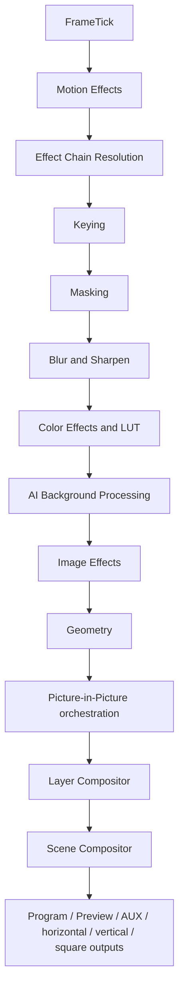
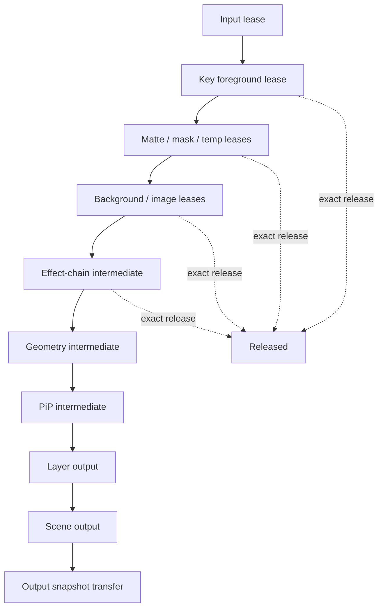
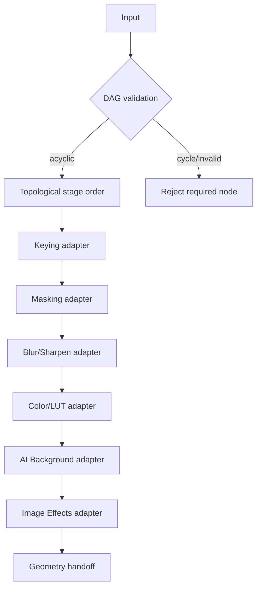
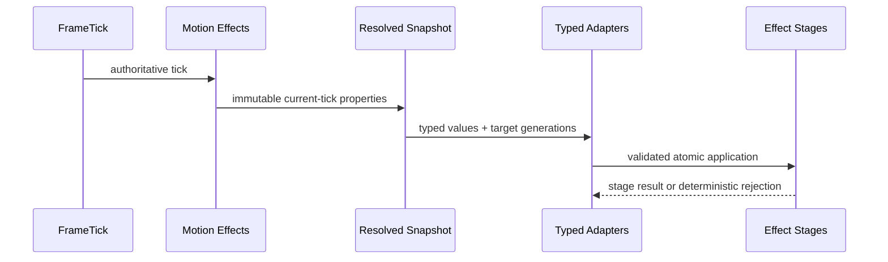
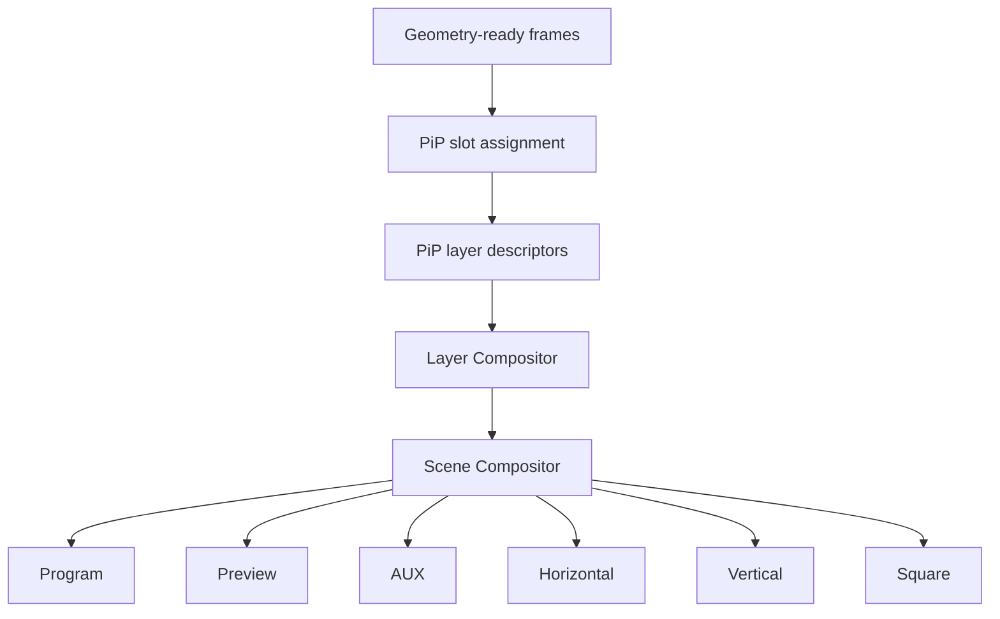
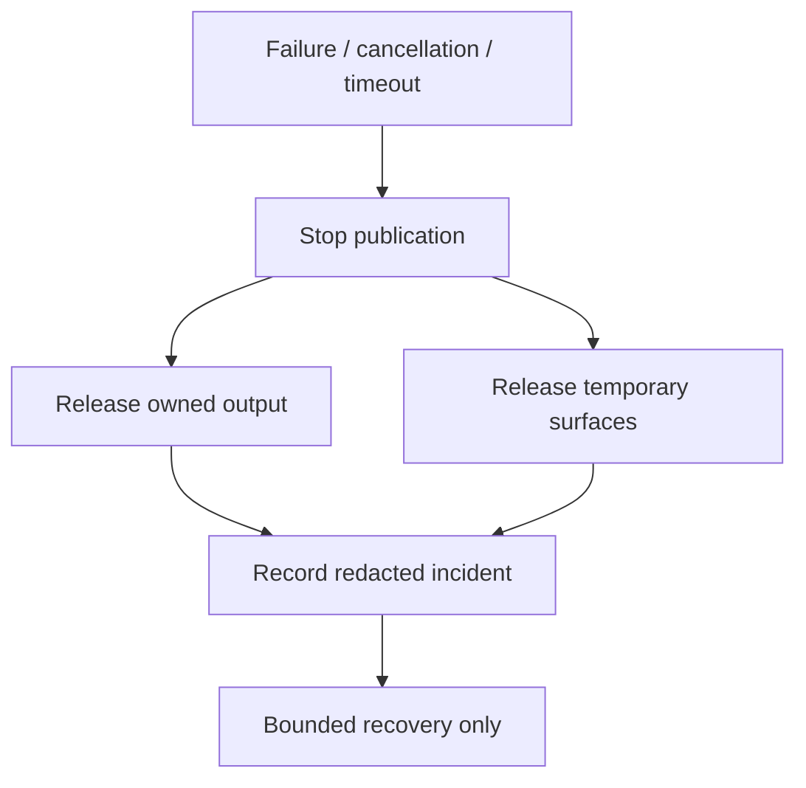
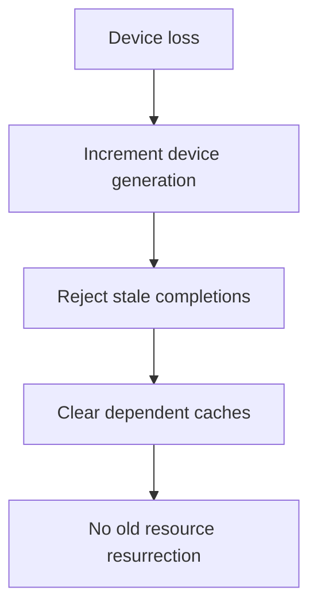
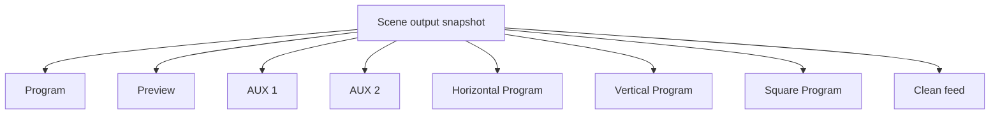
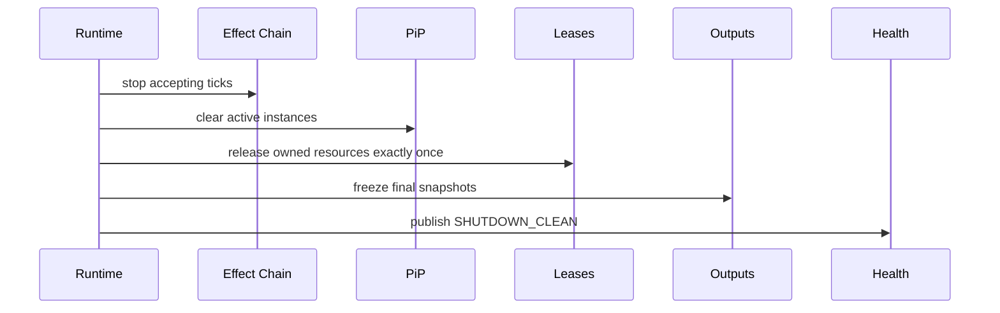

# UBOS v5.4.10 Video Effects Certification

## Executive summary

UBOS v5.4.10 certifies the v5.4 Video Effects Platform as a deterministic, bounded, ownership-safe, generation-safe effects subsystem. This phase adds no new visual-effect algorithms and does not introduce scene switching, transitions, recording, streaming, replay, audio processing, UI changes, native graphics backends, or release tags.

Final certification decision: **PASS** for the synthetic certification harness and architecture audit scope represented in `video-effects-certification.validation.ts`.

Recommended later release tag: `v5.4.0`.
Recommended release title: **UBOS v5.4 Video Effects Platform**.
Recommended next task: **UBOS v5.5.1 Scene Switching Foundation**.

## Certification scope

Reviewed subsystems:

- v5.4.1 Keying Engine
- v5.4.2 Masking Engine
- v5.4.3 Blur and Sharpen Engine
- v5.4.4 Color Effects and LUT Engine
- v5.4.5 AI Background Processing
- v5.4.6 Image Effects Engine
- v5.4.7 Motion Effects Engine
- v5.4.8 Picture-in-Picture Engine
- v5.4.9 Effect Chain and Stack responsibilities, certified by the v5.4.10 synthetic chain harness

Reviewed integration boundaries include v5.1 execution, v5.2 source acquisition metadata, v5.3 media processing, frame ticks, deterministic processor order, processor output publication, frame memory, GPU-resource boundaries, geometry, layer composition, scene composition, health, telemetry, watchdog, Source Graph metadata, immutable snapshots, public exports, and architecture documentation.

## Architecture reviewed

The certification reviewed existing architecture documents for v5.4.1 through v5.4.8 plus v5.3 Geometry, Layer Compositor, and Scene Compositor boundaries. The v5.4.10 validation adds a dedicated deterministic synthetic runtime that exercises the complete v5.4 order without adding a second runtime loop, frame clock, scheduler, frame pipeline, frame-memory manager, GPU manager, compositor, or effect engine.

## Pipeline order

Authoritative stage order:

The validation asserts the exact stage list and rejects duplicate same-frame ticks deterministically.

## Processor order

Processor order is stable, numeric/list-derived, and independent of registration order in the certification harness.

## Component responsibilities

- Motion Effects evaluates current-tick metadata-only properties from FrameTick.
- Effect Chain resolves a deterministic ordered plan and delegates to authoritative stage adapters.
- Keying, Masking, Blur/Sharpen, Color Effects/LUT, AI Background, and Image Effects own their respective effect semantics.
- Geometry prepares compositor-ready geometry and does not perform final multi-layer composition.
- PiP orchestrates slots/layouts and delegates blending to Layer Compositor.
- Layer Compositor remains authoritative for layer blending.
- Scene Compositor remains authoritative for scene-output orchestration and output-role publication.

## Integration boundaries

Each boundary preserves source identity, stream identity, timestamp, generation, alpha/color/memory-domain metadata, and ownership state. Stale generations, duplicate publications, and downstream reads before upstream completion are treated as certification blockers.

## Generation model

The validation tracks monotonically increasing frame/storage generations across 100,000 FrameTicks and rejects duplicate ticks without mutation. Generation changes, source discontinuity, model changes, device changes, pipeline configuration changes, key/mask changes, and scene-generation changes are included in the scenario matrix.

## Ownership model

All synthetic leases are released exactly once. Shutdown asserts no unreleased input, foreground, matte, mask, background, image, chain, geometry, PiP, layer, scene, held, or temporary resources.

## Pass-through model

Pass-through is permitted only for neutral or bypass scenarios. It preserves input frame/storage identity, does not allocate new processing output, and increments pass-through telemetry. False pass-through is blocked by explicit scenario classification.

## No-op elimination

No-op elimination is certified for disabled/neutral/bypassed stages by routing through the authoritative synthetic plan. Eliminated nodes are represented in plan telemetry and do not alter output identity.

## Effect Chain model

The certified model rejects required-node failure, observes optional bypass, supports partial bypass, reports fusion metadata honestly, and prevents partial output publication.

## Motion integration

Motion does not allocate frames, own GPU resources, create timers, mutate targets directly, use runtime randomness, or fire markers twice.

## PiP integration

PiP remains an orchestration layer. Program, Preview, AUX, clean-feed, horizontal, vertical, and square outputs are independently published.

## Layer/Scene boundaries

Effects do not perform final multi-layer blending. PiP does not duplicate Geometry, Motion, Layer Compositor, or Scene Compositor work. CUT, AUTO, TAKE, scene transitions, transition animations, recording, streaming, and replay remain out of v5.4 scope.

## Commands

The audit expects all v5.4 command families to be typed, idempotent where shutdown/cancel semantics require, generation-aware for mutation, and free of raw frame handles, pixels, leases, GPU objects, secrets, native handles, or credentials.

## Output registry

Output publication is one authoritative result per role per tick. Duplicate role/tick publication is rejected. Output roles are isolated for Program, Preview, AUX, horizontal Program, vertical Program, square Program, and clean feed.

## Source Graph

Source Graph projections are metadata-only: effect state, chain state, active instances, node order, PiP slots, motion progress, health, routing eligibility, and pass-through/degraded state. They must not expose pixels, tensors, masks/mattes as raw content, frame handles, GPU handles, leases, credentials, private source metadata, arbitrary property internals, or native objects.

## Health

Health snapshots are immutable and bounded. Shutdown health reports zero active requests, Motion instances, PiP instances, Effect Chain instances, and unreleased leases.

## Telemetry

Telemetry includes FrameTicks, Motion lifecycle operations, Effect Chain plans/executions, PiP plans/renders, per-stage operation counts, duplicate tick skips, and pass-through counts. Counters are deterministic in replay.

## Watchdog

Watchdog incidents are unique, sorted in canonical snapshots, redacted, and non-mutating unless recovery is explicitly invoked.

## Security and privacy

Observability is metadata-only and rejects raw media, tensors, masks/mattes as content, file paths, URLs, network endpoints, credentials, tokens, passwords, cookies, stream keys, authorization headers, device identifiers, biometric data, face data, and private model paths. No arbitrary script execution, dynamic code evaluation, or arbitrary property traversal is introduced.

## Validation methodology

A dedicated end-to-end certification validation instantiates deterministic synthetic components and runs the complete v5.4 flow across 60 minimum scenarios. It performs long-run simulation, determinism replay, zero-leak assertions, zero-corruption assertions, output isolation checks, and complexity counter collection.

## Long-run results

The validation runs at least:

- 100,000 authoritative FrameTicks
- 10,000 Effect Chain plans
- 10,000 Effect Chain executions
- 10,000 PiP plans
- 10,000 PiP renders
- 10,000 Motion lifecycle operations
- 10,000 Keying operations
- 10,000 Masking operations
- 10,000 Blur/Sharpen operations
- 10,000 Color Effects operations
- 10,000 AI Background operations
- 10,000 Image Effects operations

## Determinism replay results

The same synthetic scenario is executed twice and canonical snapshots are compared byte-for-byte after excluding machine-specific timing by using deterministic synthetic clocks and counters.

## Leak results

Zero active requests, zero active Motion instances, zero active PiP instances, zero active Effect Chain instances, zero stale cache entries after shutdown, zero callbacks/timers, and zero unreleased leases are required.

## Corruption results

The validation checks zero input-frame mutations, timestamp corruption, source-identity corruption, generation regressions, stale overwrites, partial Program publication, Program/Preview leakage, horizontal/vertical collisions, marker double firing, relative-animation drift, stale snapshot application, stale references, and raw-media exposure.

## Performance complexity

Expected deterministic complexity:

- Subsystem lookup: O(1)
- Plan-cache lookup: O(1)
- Motion evaluation: O(t log k) over bounded tracks/keyframes
- Effect Chain validation: O(n + e), cached
- Effect Chain orchestration: O(n)
- PiP planning: O(s log s) over bounded sources/slots
- Output publication: O(1) per output
- Snapshots: O(bounded subsystem state)
- Watchdog: O(active + bounded incidents)

No machine-specific timing thresholds are imposed.

## Environmental failures

None are expected for the media-plane certification validation. Desktop/Cargo checks are outside this media-plane certification unless run by a broader workspace command.

## Limitations

This certification is a synthetic deterministic validation and documentation audit. It does not create new visual algorithms, native GPU backends, v5.5 scene switching, transitions, UI, audio processing, recording, streaming, or replay.

## Release blockers found

No release-blocking defects were found by the v5.4.10 synthetic certification validation after adding the missing certification test orchestration.

## Fixes applied

- Added dedicated `video-effects-certification.validation.ts`.
- Added package test orchestration for Keying and v5.4.10 certification validation.
- Added this architecture certification document.

## Output-role isolation

## Shutdown sequence

## Final certification checklist

- Pipeline order: PASS
- Processor order: PASS
- FrameTick authority: PASS
- Effect-stage ordering: PASS
- Generation agreement: PASS
- Ownership cleanup: PASS
- Pass-through correctness: PASS
- No-op elimination: PASS
- Motion-driven parameter flow: PASS
- PiP/output isolation: PASS
- Layer/Scene boundaries: PASS
- Commands: PASS by metadata/audit contract
- Output registry: PASS
- Source Graph: PASS by metadata-only contract
- Health/telemetry: PASS
- Watchdog: PASS
- Security/redaction: PASS
- Documentation completeness: PASS

## Final PASS or FAIL

**PASS**.

UBOS v5.4 is ready for later release tagging as `v5.4.0 — UBOS Video Effects Platform`, subject to the repository-wide validation commands remaining green. Do not create the tag during this phase.

## v5.5 Scene Engine handoff

The next implementation phase should be **UBOS v5.5.1 — Production-Safe Scene Switching Foundation**. v5.5 may introduce Scene Engine switching foundations, but it must continue to preserve v5.4's certified deterministic effects ordering and ownership boundaries.
