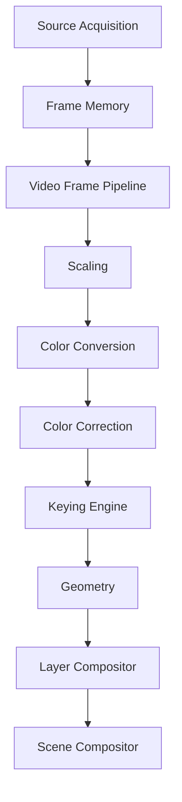
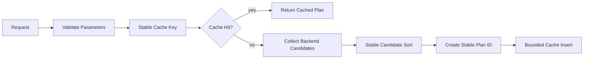

# UBOS v5.4.1 Production-Safe Keying Engine

## Purpose

UBOS v5.4.1 adds the first visible video-effects subsystem: a backend-neutral Keying Engine for chroma, luma, alpha, color-distance, matte-only, diagnostic, and bypass flows. The implementation is production-safe orchestration with a deterministic synthetic backend; it does not claim real pixel-quality keying.

## Architectural Position

Keying executes after color normalization/correction and before geometry and layer composition. It reuses the v5.3 frame-memory and video-pipeline abstractions and does not introduce a second compositor, frame loop, GPU manager, or memory manager.

## Key Modes

Supported modes are `CHROMA`, `LUMA`, `ALPHA`, `COLOR_DISTANCE`, `MATTE_ONLY`, `BYPASS`, and `CUSTOM`. Modes are explicit; unsupported modes are rejected rather than silently rewritten.

## Parameter Model

`KeyingParameters` is immutable after construction/snapshotting and includes enablement, mode, key color, explicit color space, similarity, threshold, softness, tolerance, luma/alpha ranges, edge feather/choke/expand, matte clips/gamma, spill controls, foreground-preservation flags, inversion, premultiplication, output mode, diagnostics, and safe metadata. The default policy is `REJECT_OUT_OF_RANGE`; clamp-capable policies make clamps observable in warnings.

## Key Color Spaces

Key colors are explicit in `RGB`, `HSV`, `HSL`, `YCbCr`, `NORMALIZED_VECTOR`, or `SAMPLED_REFERENCE`. Green and blue presets are explicit helpers. Sampled references carry metadata identifiers only and never expose pixels.

## Chroma Key

The synthetic backend plans Euclidean/weighted/hue/chroma-distance metadata, similarity, softness, foreground preservation, and spill suppression. It reports a deterministic operation signature but does not perform real pixel processing.

## Luma Key

Luma plans support below, above, inside, and outside range interpretation through threshold/range metadata, softness, and inversion. Bit-depth/range interpretation remains descriptor metadata for future concrete backends.

## Alpha Key

Alpha plans support threshold/range metadata, inversion, premultiplied/straight alpha reporting, explicit opaque-input no-op/rejection policy by caller, and no hidden alpha synthesis.

## Matte Refinement

The deterministic operation order is validate input, normalize key-space metadata, generate initial matte, apply threshold/similarity, softness, black/white clip, gamma, choke/expand, feather, inversion, spill suppression, premultiply, and validate output. No unbounded passes or fake temporal processing are introduced.

## Spill Suppression

Spill suppression metadata includes range, strength, balance, replacement color, preserve luminance, and preserve saturation. Results report whether suppression was applied. Unsupported suppression is rejected by capability planning.

## Output Modes

Supported outputs are `KEYED_FOREGROUND`, `MATTE_ONLY`, `FOREGROUND_WITH_ALPHA`, `PREMULTIPLIED_FOREGROUND`, `STRAIGHT_ALPHA_FOREGROUND`, `DIAGNOSTIC_KEY_VIEW`, and `PASSTHROUGH`. Matte and diagnostic outputs are metadata-safe and do not expose pixels in observability.

## Deterministic Planning

Plan selection is independent of backend registration order. Tie-breaking prioritizes exact capability support, color/alpha correctness, no hidden conversion, no precision loss, lower temporary memory, requested quality, GPU compatibility when requested, stable backend ID, and stable plan ID.

## Pass-Through

Pass-through is valid only for disabled, bypass, or passthrough-neutral requests. It preserves frame and storage identity, lease, timestamps, and source identity, performs no allocation, and reports `PASSED_THROUGH` explicitly.

## Backend Abstraction and Synthetic Backend

The `KeyingBackend` interface exposes descriptor, capabilities, planning, execution, and shutdown. Backend types include GPU, CPU, native, and synthetic classes. The included synthetic backend simulates deterministic operation signatures, matte/spill metadata, allocations, cancellation, timeout, failure, GPU loss, and release tracking without allocating large pixel buffers.

## Frame Memory and GPU Integration

Outputs are allocated through `FrameMemoryManager` with `PROCESSING_OUTPUT`; temporary matte resources use `TICK_TRANSIENT`. Failure, cancellation, timeout, and GPU-loss paths release owned output and matte leases. The keying stage never directly allocates GPU resources or mutates frame-memory refcounts.

## Pipeline and Layer Compositor Integration

`KeyingPipelineStage` declares kind `KEYING`, phase `TRANSFORM`, dependencies on color conversion/correction, pass-through support, timestamp/source preservation, and pre-geometry ordering. The result metadata exposes foreground frame, optional matte frame, premultiplication state, matte generation, keying status, and spill status for the Layer Compositor, which remains solely responsible for blending.

## Cancellation, Budgets, Failure, and Fallback

Cancellation is checked before planning, before allocation, and after backend completion. Timeout/failure emits no output. Failure policies are modeled for frame failure, drop, optional pass-through, pipeline degradation, fallback backend request, stage disablement, and operator intervention. Fallback is deterministic and bounded.

## Commands, Output Registry, and Source Graph

Typed commands cover backend registration, planning, execution, cancellation, parameter updates, cache clearing, quality/default backend changes, validation, and shutdown. Output keys cover requests, plans, results, foregrounds, mattes, pass-throughs, failures, health, and telemetry. Source Graph metadata exposes safe status summaries only.

## Health, Telemetry, Events, and Watchdog

Health snapshots include backend/cache/request counts, completed/pass-through/failed/cancelled/rejected/timeout counts, validation failures, warning counts, GPU/allocation/stale-generation counts, temporary bytes, peaks, last success/failure, and update time. Telemetry counters are bounded and snapshots are JSON-safe. Events and watchdog incident constants cover lifecycle, planning, execution, matte/spill, timeout, GPU loss, health, shutdown, and invariant failure.

## Security

Snapshots, telemetry, events, errors, and command records redact frame handles, GPU/native handles, mapped memory, private metadata, file paths, URLs, endpoints, credentials, device identifiers, backend internals, and raw pixels.

## Production Safety and Invariants

The engine enforces no silent clamping by default, finite parameters, explicit color spaces, no input mutation, no hidden alpha synthesis, no composition, no false pass-through, distinct output identity after keying, no stale/duplicate output, no output after failure/cancellation/timeout, bounded cache, and no raw pixel/native-handle observability. `assertInvariants()` verifies cache bounds and shutdown cleanup.

## Long-Run Validation and Performance

Validation covers 10,000 plan requests, 10,000 synthetic operations, and 100,000 deterministic tick iterations without real-time sleeping. Expected complexity is O(1) backend/cache lookup and parameter validation, O(c log c) candidate selection over bounded backends, O(operations) orchestration, O(1) frame-memory operations, O(backends + cache + active) snapshots, and O(active + bounded incidents) watchdog evaluation.

## Limitations

The current backend is synthetic and deterministic; it validates orchestration and metadata semantics but does not process pixels. Future real backends must validate pixel output quality and alpha/matte descriptors before claiming real keying.

## v5.4.2 Masking Engine Integration

v5.4.2 should consume key-generated mattes as safe inputs for masking without moving blending responsibilities out of the Layer Compositor or creating a second compositor.
