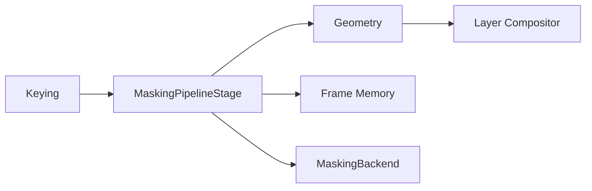

# UBOS v5.4.2 Production-Safe Masking Engine

The masking engine is a backend-neutral, production-safe video transform that models masks as immutable metadata contracts and orchestrates output allocation through Frame Memory. The included synthetic backend is deterministic and intentionally does **not** perform real pixel masking; it validates, plans, allocates references, and emits safe metadata for pipeline certification.

## Contracts

Mask types are explicit: rectangles, rounded rectangles, ellipses, circles, polygons, source alpha, key mattes, external mattes, path references, full-frame, empty, and custom. Coordinate spaces cover source, frame, and canvas pixels/normalized domains. Shapes use bounded immutable contracts. Polygon masks must be closed, have at least three points, declare a fill rule, and are rejected on self-intersection unless a policy explicitly allows it.

Parameters reject invalid values rather than silently clamping. Opacity, feather, and morphology ranges are validated. Expansion and contraction are mutually exclusive. Transforms apply translation, scale, rotation, anchors, pivots, and flips in deterministic order; zero scale and negative implicit-flip scale are rejected.

## Planning and execution

Plans use stable signatures and deterministic backend candidate ordering. The engine maintains a bounded plan cache and invariant checks reject unbounded caches or cached plans that reference stale backends. Pass-through requests preserve the input frame reference and allocate no output. Masked and mask-only outputs allocate through Frame Memory when a manager is supplied; owned leases are released on failure or cancellation.

## Integrations

The pipeline stage declares masking as a transform after keying and before geometry/layer compositing. It preserves timestamps and source identity and does not mutate input frame references. Output registry keys, command constants, watchdog incident constants, source-graph metadata, health snapshots, and telemetry snapshots are public API.

## Security and safety

Metadata redaction removes path, URL, handle, GPU/native, secret, token, credential, password, endpoint, and device details from safe snapshots. Unsupported custom masks, duplicate stack entries, non-finite numbers, invalid matte references, unsupported backend capabilities, stale cached backends, allocation failures, synthetic failure hooks, timeouts, cancellation, and GPU-loss hooks are modeled as explicit production incidents.

## Validation and v5.4.3 guidance

Validation covers lifecycle, duplicate backend rejection, plan determinism/cache hits, pass-through identity, distinct masked output identity, timestamp preservation, invalid parameter/polygon/transform rejection, stack ordering/depth, cancellation, invariant churn, 10,000 plans, and 100,000 no-sleep invariant ticks. v5.4.3 Blur/Sharpen should reuse the same backend descriptor, plan/result, Frame Memory, pipeline-stage, redaction, health, telemetry, and watchdog patterns rather than creating parallel orchestration primitives.
