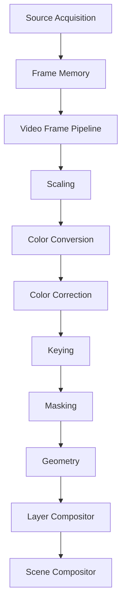
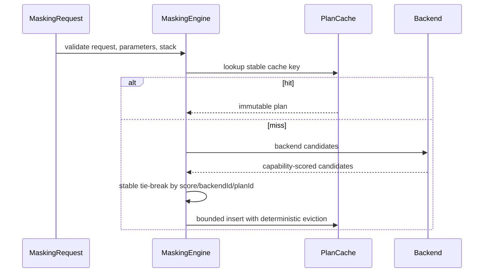

# UBOS v5.4.2 Production-Safe Masking Engine

## Purpose

The Masking Engine adds reusable geometric and matte-based mask generation after keying and before geometry and final layer composition. It is backend-neutral and production-safe: it validates mask contracts, builds deterministic plans, allocates output through Frame Memory, and exposes only metadata-safe observability. The initial backend is deterministic and synthetic; it simulates orchestration, allocation, mask combination, and metadata semantics without claiming real pixel masking.

## Architectural Position and Reuse

Masking owns mask generation, matte reference validation, mask stack resolution, deterministic backend planning, pass-through detection, and mask/masked-frame output metadata. It does not blend foreground/background, place sources, acquire frames, generate keys, mutate input frames, or allocate GPU resources directly. It reuses Video Frame Pipeline stage contracts, Frame Memory leases/allocation, runtime command handlers, output registry keys, source graph metadata conventions, telemetry snapshots, watchdog incident names, and explicit public exports.

## Mask Types and Coordinate Spaces

Supported mask types are `RECTANGLE`, `ROUNDED_RECTANGLE`, `ELLIPSE`, `CIRCLE`, `POLYGON`, `SOURCE_ALPHA`, `KEY_MATTE`, `EXTERNAL_MATTE`, `PATH_REFERENCE`, `FULL_FRAME`, `EMPTY`, and `CUSTOM`. Unsupported or backend-private types are typed failures, and `PATH_REFERENCE` remains metadata-only unless a backend advertises support.

Coordinate spaces are explicit: `SOURCE_PIXELS`, `SOURCE_NORMALIZED`, `FRAME_PIXELS`, `FRAME_NORMALIZED`, `CANVAS_PIXELS`, `CANVAS_NORMALIZED`, and `CUSTOM`. Normalized spaces are documented as bounded 0..1 coordinates by convention; conversion is never implicit and must be provided by a backend or rejected.

## Shape Models and Polygon Rules

Shapes are immutable contracts: rectangles use `x/y/width/height`, rounded rectangles wrap a rectangle and radii, ellipses and circles use center/radii, and polygons use ordered points, `NON_ZERO` or `EVEN_ODD` fill rules, a closed flag, coordinate space, and explicit self-intersection policy. Validation rejects NaN, Infinity, non-positive dimensions or radii, empty polygons, unclosed polygons, unbounded point counts, and rejected self-intersection.

## Parameters, Transform, Combine Modes, and Stacks

`MaskingParameters` contains enabled state, type, shape, inversion, opacity, feathering, morphology, edge hardness, transform, combine mode, matte references, output mode, diagnostics flag, and safe metadata. The default policy is `REJECT_OUT_OF_RANGE`; clamping policies are represented but no silent clamping occurs.

Transforms follow geometry-style deterministic matrix components: translation, scale, rotation, anchor, pivot, and explicit horizontal/vertical flips. Zero scale and negative scale are rejected so flips cannot be hidden in scale signs.

Combine modes are explicit: `REPLACE`, `ADD`, `INTERSECT`, `SUBTRACT`, `XOR`, `MULTIPLY`, `MIN`, `MAX`, `INVERT`, and `CUSTOM`. `MaskStack` preserves entry order, requires unique entry IDs, enforces maximum depth, forbids recursive/cyclic stack references by contract, and includes all generations in cache keys.

## Feathering and Morphology

Feather modes are `NONE`, `INNER`, `OUTER`, `BOTH`, and `BACKEND_DEFAULT`. The synthetic backend records feather metadata only and does not implement blur. Expansion/contraction are mutually exclusive, bounded, and reported as an effective signed morphology value; future UBOS v5.4.3 Blur and Sharpen work can attach a validated blur backend without changing mask contracts.

## Output Modes and Pass-Through

Output modes are `MASKED_FRAME`, `MASK_ONLY`, `ALPHA_ONLY`, `PREMULTIPLIED_FRAME`, `STRAIGHT_ALPHA_FRAME`, `PASSTHROUGH`, and `DIAGNOSTIC_MASK_VIEW`. Mask-only outputs carry descriptor metadata and do not expose pixels in telemetry or snapshots.

Pass-through is valid only when masking is disabled, the stack is empty, the requested output mode permits original frames, or a full-frame opacity-1 non-inverted non-feathered mask is requested. It preserves frame/storage identity, lease identity, timestamps, and source identity, and performs no output allocation.

## Deterministic Planning and Cache

The cache key includes input format, alpha mode, effective stack, output mode, quality, backend preference, pipeline configuration generation, and matte generations. Eviction is bounded and deterministic; backend removal invalidates matching plans.

## Backend Abstraction and Synthetic Backend

Backends provide descriptors, capabilities, planning, execution, and shutdown. Backend classes include GPU compute/fragment, CPU SIMD/reference, platform native, and synthetic. The deterministic synthetic backend supports all required mask contracts as metadata simulation, output and temporary allocation orchestration, configurable failure/timeout/GPU-loss behavior, cancellation, stale-completion rejection, and operation signatures without allocating large pixel buffers or using native graphics dependencies.

## Integrations

Keying integration accepts key matte/keyed alpha references and validates generation/source relationship without regenerating matte or duplicating spill suppression. Frame Memory integration allocates `PROCESSING_OUTPUT` masked frames and `TICK_TRANSIENT` mask-only/temporary outputs and releases masking-owned leases on failure. GPU integration is mediated through Frame Memory/GPU Resource Manager contracts only. Pipeline integration is a `MASKING` transform stage that runs after keying and before geometry/layer compositing. Layer Compositor compatibility is metadata-only: masked frame reference, mask-only reference, alpha state, premultiplication state, stack ID, and status are exposed; final blending remains in Layer Compositor.

## Commands, Output Registry, Source Graph

Typed commands cover backend registration, planning, execution, cancellation, parameter/stack/output changes, feather/morphology updates, cache clearing, backend/quality defaults, validation, and shutdown with idempotent handlers. Output registry keys publish requests, plans, results, masked frames, mask-only frames, pass-through references, failures, health, and telemetry. Source Graph metadata includes enabled state, stack ID/count/types, output mode, feather/morphology flags, status, health, last runtime frame, active backend class, and pass-through state; no pixels, paths, handles, or mutable leases are exposed.

## Health, Telemetry, Events, and Watchdog

Health snapshots include engine state, backend counts, cache size, active/completed/pass-through/failed/cancelled/rejected/timeout counts, validation failures, GPU loss, allocation failure, stale-generation rejection, temporary bytes, peak temporary bytes, last success/failure, and update time. Telemetry tracks plan/cache activity, requests/completions, per-mask counts, feather/morphology operations, combinations, failures, fallback, GPU loss, stale generation, average/maximum planning/execution durations, current request IDs, last event, and health summary. Watchdog incidents include masking stalls, backend failure, timeout, invalid parameters/type/polygon/external matte/key matte, stack exceeded, memory pressure, GPU resource loss, allocation failure, stale generation, invalid cache, graph mismatch, and invariant failure.

## Security and Production Safety

Observability redacts frame handles, GPU resources, mapped memory, private metadata, external matte paths, path references, URLs, endpoints, device identifiers, native objects, and backend error details. Production invariants enforce no silent parameter assumptions, no NaN/Infinity, no unbounded polygon/stack/cache, no input mutation, no hidden composition, no false pass-through, no stale/duplicate output, no output after failure/cancellation/timeout, no leaked output/mask/temp leases, no direct GPU allocation, and no stale key matte usage.

## Long-Run Validation and Performance

The validation suite covers lifecycle, duplicate backend rejection, plan determinism, cache churn, pass-through, all geometric/matte mask types, invalid parameters, polygon rules, transforms, stack ordering/depth, mask-only and masked-frame output, cancellation, invariants, 10,000 plans, 10,000 synthetic operations, and 100,000 no-sleep validation ticks. Expected complexity is O(1) backend lookup, O(1) plan-cache lookup, O(p) polygon validation for bounded points, O(m) stack resolution for bounded masks, O(c log c) candidate selection over bounded backends, and O(active + bounded incidents) watchdog evaluation.

## Limitations

The first backend is synthetic and does not perform real pixel masking, blur, high-quality morphology, AI segmentation, background removal, transitions, graphics authoring, audio, recording, streaming, replay, or UI. Real pixel masking requires a future validated backend. v5.4.3 should add Blur and Sharpen integration as a separate effect engine rather than hiding blur inside feather metadata.
