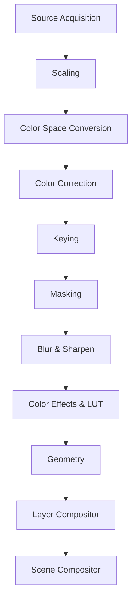
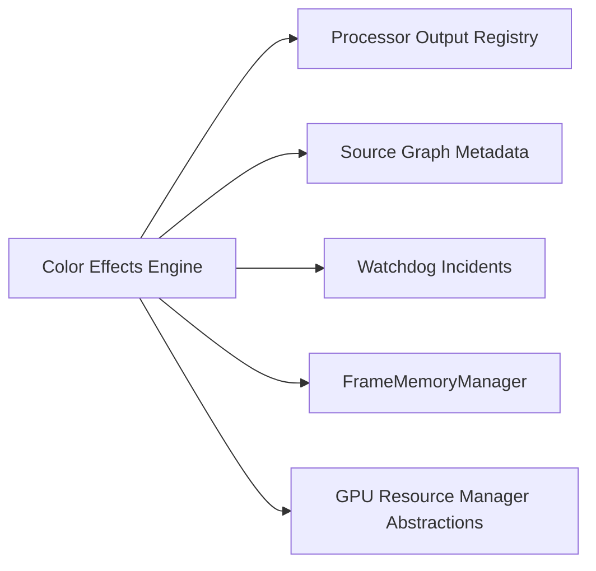

# UBOS v5.4.4 — Color Effects & LUT Engine

## Architecture

The Color Effects & LUT Engine is a backend-neutral creative grading stage. It runs after keying, masking, and blur/sharpen and before geometry and compositing. It does **not** perform technical color-space conversion or technical color correction; those remain owned by v5.3.5 and v5.3.6.

## LUT model

The model supports 1D LUTs, 3D LUTs, identity LUTs, external LUT references, embedded LUT metadata, synthetic LUTs, and backend-generated LUTs. LUTs carry dimensions, domain metadata, interpolation policy, version, checksum, and cube metadata. The engine never loads arbitrary files directly; external LUT references remain safe metadata unless a backend explicitly supports execution.

## Grading model and presets

Grading parameters are immutable and validated without silent clamping. Parameters include exposure, contrast, highlights, shadows, whites, blacks, gamma, lift, gain, offset, saturation, vibrance, hue, temperature, tint, split toning, RGB curves, luma curves, channel mixer, selective color, opacity, blend mode, diagnostics, and safe metadata.

Immutable presets resolve to explicit values: Neutral, Broadcast, Film, Cinema, Documentary, Vintage, Warm, Cool, Noir, Sepia, Sports, Podcast, Interview, Concert, and Presentation.

## Pipeline stage

`ColorEffectsPipelineStage` uses descriptor kind `COLOR_EFFECTS`, phase `TRANSFORM`, version `5.4.4`, and preserves timestamps and source identity. Pass-through returns the input frame identity; grading allocates a new output frame.

## Frame Memory integration

The engine reuses `FrameMemoryManager` to allocate output frames and temporary grading surfaces. Allocations are released on failure, cancellation, timeout-style cancellation, and shutdown cleanup paths.

## GPU integration

GPU behavior is represented only through existing backend descriptors and resource abstractions. The synthetic backend is deterministic and does not claim real GPU LUT execution.

## Layer Compositor boundary

The engine emits frame references and metadata compatible with the Layer Compositor. It does not composite layers, alter geometry, or expose pixels to the Source Graph.

## Commands

The command surface includes backend registration, planning, execution, cancellation, LUT and preset setting, parameter validation, cache clearing, default backend selection, validation, and shutdown.

## Telemetry, watchdog, and Source Graph

Telemetry and snapshots contain health counters, cache size, backend count, pass-through count, grading count, failures, cancellations, GPU loss, allocation failures, stale generation count, and peak temporary bytes. Watchdog incident names include stalled execution, backend failure, timeout, invalid parameters, invalid LUT, GPU loss, allocation failure, stale generation, cache invalidity, and invariant failure. Source Graph metadata exposes LUT name, preset, grading enabled, blend mode, opacity, effect state, health, backend, and pass-through state, with no pixels or native handles.

## Validation and performance

Validation covers duplicate backend rejection, deterministic presets, identity LUTs, pass-through, grading output identity, timestamp/source preservation, stale mask rejection, invalid LUTs and curves, blend modes, cancellation, stale generation, pipeline integration, command handlers, output registry keys, Source Graph metadata, health, telemetry, watchdog names, invariants, shutdown, 10,000 plans, 10,000 synthetic grading operations, and 100,000 pipeline ticks without real-time sleeping.

## Limitations

The default backend is synthetic. It produces deterministic metadata and frame identities but does not execute real GPU LUT kernels. External LUT references remain metadata unless a future backend safely implements LUT execution.
