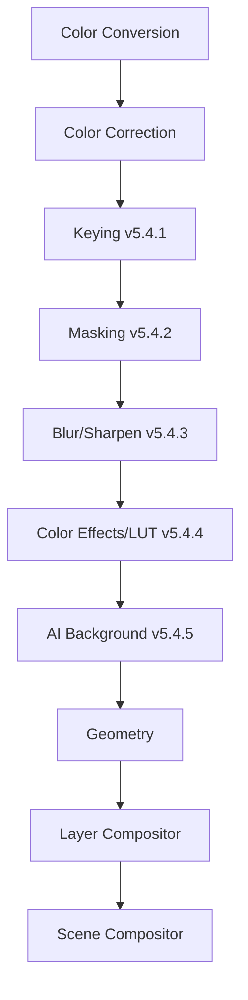
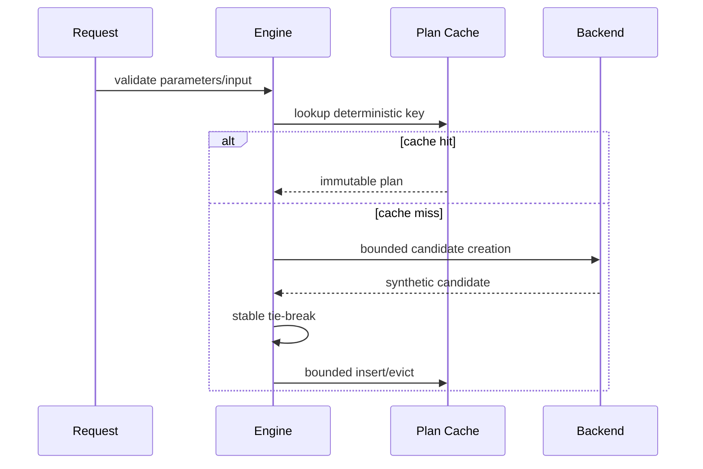

# UBOS v5.4.5 AI Background Processing

## Purpose

UBOS v5.4.5 adds a production-safe, backend-neutral AI Background Processing subsystem for deterministic segmentation planning, synthetic validation, background removal, matte output, background blur/replacement orchestration metadata, temporal matte stabilization, health, telemetry, watchdog incidents, and immutable snapshots. The v5.4.5 implementation ships with a deterministic synthetic backend only and does not claim real AI inference.

## Architectural position and reused abstractions

The subsystem is implemented as `AiBackgroundProcessingEngine` and `AiBackgroundProcessingPipelineStage`. It reuses Video Frame Pipeline stage contracts, Frame Memory allocation/leases, existing key/mask references as metadata inputs, Blur/Sharpen as an explicit dependency boundary, Color Effects as an explicit treatment boundary, and Layer Compositor as the final blending owner. It does not create a runtime loop, frame pipeline, memory manager, GPU manager, compositor, mask engine, or native GPU access.

## Privacy constraints and security

Observability is metadata-only. Telemetry, events, snapshots, errors, and source graph metadata redact frame handles, pixels, tensors, native objects, URLs, paths, credentials, face/identity/biometric terms, and device identifiers. The design forbids identity recognition, face matching, embeddings, demographic or emotion inference, raw-frame analytics retention, frame upload by default, arbitrary model download, remote inference by default, and unverified executable model execution.

## Processing modes, subject model, and output modes

Modes: PERSON_SEGMENTATION, FOREGROUND_SEGMENTATION, BACKGROUND_REMOVAL, TRANSPARENT_BACKGROUND, BACKGROUND_BLUR, BACKGROUND_REPLACEMENT, BACKGROUND_COLOR, MATTE_ONLY, FOREGROUND_ONLY, BACKGROUND_ONLY, VIRTUAL_BACKGROUND, BYPASS, CUSTOM.

Subjects: PERSON, MULTIPLE_PERSONS, FOREGROUND_GENERAL, PRESENTER, CUSTOM. No sensitive classification categories are supported.

Output modes: FOREGROUND_WITH_ALPHA, PREMULTIPLIED_FOREGROUND, STRAIGHT_ALPHA_FOREGROUND, MATTE_ONLY, BACKGROUND_ONLY, COMPOSITING_PAIR, REPLACED_BACKGROUND_FRAME, BLURRED_BACKGROUND_FRAME, PASSTHROUGH, DIAGNOSTIC_SEGMENTATION_VIEW.

## Parameters and validation

`BackgroundProcessingParameters` are immutable and validate finite thresholds, edge refinement, temporal window bounds, smoothing, motion sensitivity, ROI, subject counts, quality tiers, modes, and subject types. The default parameter policy is `REJECT_OUT_OF_RANGE`; clamping policies are represented but not silent.

## Background sources and replacement policies

Background source references are metadata references only: transparent, solid color, image/video/live source references, blurred original, generated reference, virtual set reference, and custom. Raw file paths and hidden network fetches are not accepted. Replacement policies are explicit and observable.

## Model descriptor and registry

`AiBackgroundModelDescriptor` captures immutable model ID/version/checksum, backend relationship, supported modes/subjects/formats/dimensions/memory domains, quality tiers, GPU requirement, temporal and alpha-detail capabilities, model origin, license reference, privacy classification, and safe metadata. Registration is bounded, duplicate IDs are rejected, activation is explicit, and registration does not load or execute models.

## Deterministic planning and cache

The cache key includes input format/color/alpha, processing mode, subject, effective parameters, model/backend preference, quality, key/mask/background generations, device generation, and pipeline generation. Registration order does not affect candidate sorting.

## Pass-through

Pass-through is valid only for disabled/BYPASS PASSTHROUGH requests. It preserves frame/storage identity, lease, timestamp, and source identity, performs no allocation, no model execution, and no temporal update.

## Backend abstraction and synthetic backend

`AiBackgroundBackend` exposes descriptor, capabilities, `createPlan`, `execute`, optional temporal reset, and shutdown. The synthetic backend deterministically simulates segmentation confidence, matte summaries, edge-refinement metadata, temporal state updates, failures, timeouts, cancellation, GPU loss, and output allocation ownership without allocating large tensors or claiming real AI inference.

## Temporal stabilization and confidence policy

Temporal state is bounded per source/stream and stores only matte summaries, confidence summaries, motion summaries, last frame/timestamp, model ID/version, and safe metadata. No raw frames or mattes are retained. Low confidence follows explicit policies and is never silently reported as healthy success.

## Integration boundaries

Keying and Masking references are validated by generation metadata boundaries and are never regenerated. Background blur is an explicit dependency on the Blur/Sharpen engine boundary; this engine does not implement blur kernels. Color Effects are explicit foreground/background treatment boundaries; no hidden grading is performed. The Layer Compositor remains responsible for general blending; AI background exposes foreground, matte, background, replacement, confidence, and model summaries.

## Frame Memory and GPU integration

Outputs are allocated through Frame Memory with PROCESSING_OUTPUT usage. Temporary/held concepts are bounded by plans and snapshots. Pass-through preserves identity. Failures/cancellations/timeouts release owned output leases. GPU access is only represented through Frame Memory/GPU manager generations and no native GPU APIs are used.

## Commands, output registry, Source Graph, health, telemetry, events, watchdog

Typed command constants, output keys, source-graph metadata projection, health snapshots, bounded telemetry counters, event names, and watchdog incident names are exposed. Per-frame information is metadata-only and suitable for sampling/aggregation.

## Cancellation, timeout, fallback, and invariants

Cancellation is checked before planning, allocation, backend execution, and publication. Timeout produces no output unless explicitly degraded by policy. `assertInvariants()` verifies bounded cache/model registry/temporal history and shutdown cleanup.

## Long-run validation and performance

Validation includes deterministic synthetic operation loops without real-time sleeping. Expected complexity: O(1) backend/model/cache lookup, O(1) parameter validation, O(c log c) bounded candidate sorting, O(w) bounded temporal updates, O(operations) orchestration, and snapshot generation over bounded registries and temporal state.

## Limitations

The shipped backend is synthetic and metadata-only. Real local inference, image effects, richer live background freshness enforcement, and deeper Frame Memory lease verification are future work.

## v5.4.6 Image Effects integration

The recommended next task is UBOS v5.4.6 Image Effects Engine, integrating explicit foreground/background image effects after this metadata-safe segmentation boundary.
