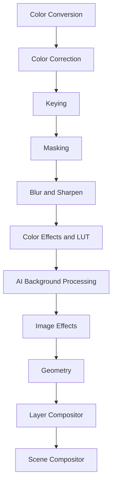
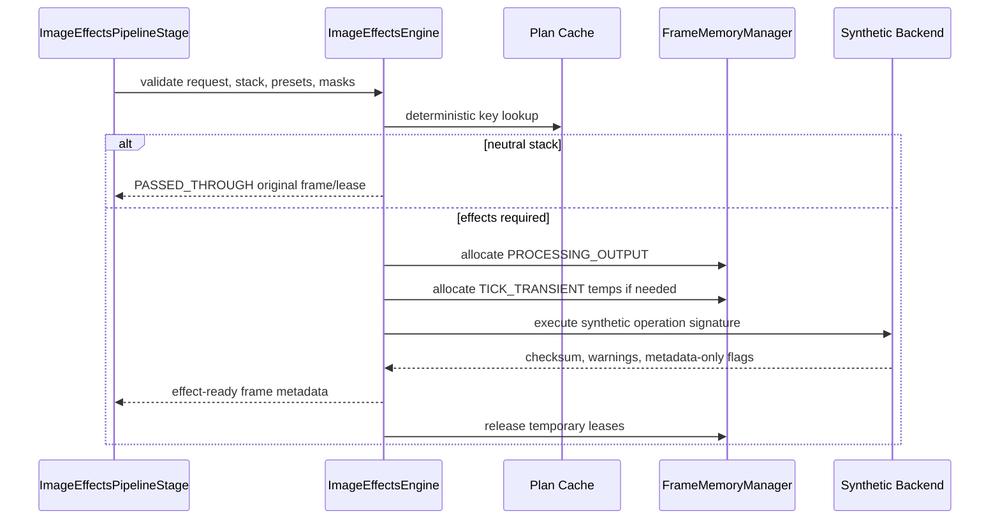

# UBOS v5.4.6 — Production-Safe Image Effects Engine

## Purpose and position

The Image Effects Engine applies deterministic, single-frame visual-effect planning after AI Background Processing and before Geometry, Layer Compositor, and Scene Compositor. It owns validation, preset resolution, bounded stack ordering, output allocation, temporary-surface orchestration, result validation, cleanup, telemetry, health, events, watchdog metadata, and immutable snapshots. It does not own source acquisition, technical color conversion, creative LUT grading, mask creation, blur kernels, geometry placement, multi-layer blending, scene composition, frame clocks, audio, recording, streaming, replay, or UI.

## Effects, parameters, and modes

Supported effect types are explicit: opacity, borders, rounded corners, corner clipping, shadows, glow, outline/stroke, reflection, vignette, monochrome/grayscale/sepia/invert, posterize/threshold, metadata-boundary solarize/emboss/edge-detect/grain/halftone/gradient/tritone, pixelate/mosaic, scanlines, overlays, original blending, bypass, and custom. Parameters are immutable and validated for finite numeric values, bounded opacity/blend/radius/thickness/softness/spread/offsets, bounded posterize/threshold/pixel/mosaic/reflection/vignette/grain/scanline values, valid colors, valid blend modes, valid alpha policies, valid edge policies, and stale mask generation rejection. Default policy is `REJECT_OUT_OF_RANGE`; clamping policies are modeled but every downgrade must be observable.

Output modes are explicit: `EFFECT_FRAME`, `EFFECT_WITH_ALPHA`, `PREMULTIPLIED_EFFECT_FRAME`, `STRAIGHT_ALPHA_EFFECT_FRAME`, `EFFECT_MASK_ONLY`, `PASSTHROUGH`, and `DIAGNOSTIC_EFFECT_VIEW`. Alpha policies are `PRESERVE`, RGB-only, alpha-only, RGBA, premultiplied safe, unpremultiply/process/repremultiply, reject-alpha, and backend default. Edge policies are transparent, clamp, mirror, repeat, opaque black, and backend default.

## Presets and stacks

Built-in presets include `NONE`, shadows, glow, rounded card, border, vignette, black-and-white, sepia, high-contrast mono, security camera, retro scanlines, posterize, pixel art, presentation/podcast/social card, and custom. Presets are immutable after registration, versioned, generation-tagged, bounded, unique, and expanded to explicit parameters without recursive references. Effect stacks are bounded to 32 entries, preserve deterministic order, reject duplicate entry IDs and self-cycles, and distinguish optional entries from required entries.

## Planning and execution

Plans include input format/metadata/alpha, effective stack, preset versions, operation order, backend, pass-through eligibility, pixel-processing requirement, output/temp/mask/blur/alpha requirements, output mode/format/alpha, pass count, temporary/output byte estimates, operation count, deterministic score, warnings, and safe metadata. Backend selection is deterministic and independent of registration order using exact support, alpha/mask/blur compatibility, no hidden conversion, pass count, memory, quality, GPU preference, stable backend ID, and stable plan ID.

## Integrations and boundaries

Blur-based effects declare Blur/Sharpen dependency requirements and include blur generation in cache keys; no blur kernel is implemented here. Mask-aware effects reuse Masking outputs by reference, validate generation and source/stream relationship, and never expose raw mask content. Frame Memory is used for input generation validation, `PROCESSING_OUTPUT` output allocation, `TICK_TRANSIENT` temporary surfaces, lease transfer, and cleanup. GPU access is only abstracted through existing Frame Memory and GPU Resource Manager contracts; the synthetic backend adds no native graphics dependency. Layer Compositor receives an effected frame reference and safe effect metadata only; Image Effects never composites multiple layers.

## Health, telemetry, events, watchdog, security

Snapshots are immutable and bounded. Health reports engine state, backend/preset/cache/request counts, completed/pass-through/degraded/failed/cancelled/rejected/timeout counts, validation failures, mask/blur/GPU/allocation/stale-generation failures, temporary bytes, peaks, and timestamps. Telemetry records bounded counters for plan/cache activity, operations, pass-through, mask/blur use, preset applications, failures, fallbacks, GPU loss, allocations, stale generation, current request IDs, last event, and health summary. Watchdog incidents include stalls, backend failures, timeouts, invalid parameters/presets/stacks/modes/masks, blur dependency failures, memory pressure, GPU resource loss, allocation failure, stale generation, invalid cache, graph mismatch, and invariant failure. Observability redacts frame handles, leases, masks, GPU/native objects, paths, URLs, credentials, endpoints, device identifiers, backend errors, and pixels.

## Validation, performance, limitations, and v5.4.7

Deterministic validation covers lifecycle, duplicates, presets, stacks, plan determinism, cache hit/eviction, pass-through, representative effects, metadata-boundary warnings, masks, blur dependencies, alpha policies, invalid parameters, generation mismatches, allocation, distinct output identity, source/timestamp preservation, command handlers, snapshots, invariants, 10,000 plans, 10,000 operations, and 100,000 synthetic ticks without sleeping. Complexity is O(1) for backend/preset/cache lookup, O(e) stack resolution and validation over bounded entries, O(c log c) candidate selection over bounded backends, O(operations) orchestration, O(1) Frame Memory operations, and bounded snapshot/watchdog evaluation. Current limitation: the synthetic backend simulates operation signatures and checksums only and does not claim real pixel processing. v5.4.7 Motion Effects should consume the same frame identity, metadata, cache, cancellation, and watchdog conventions.
