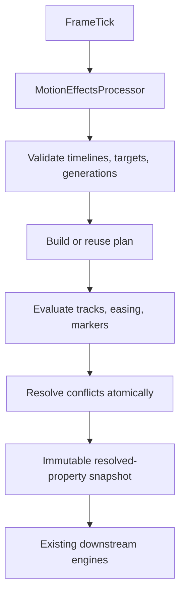
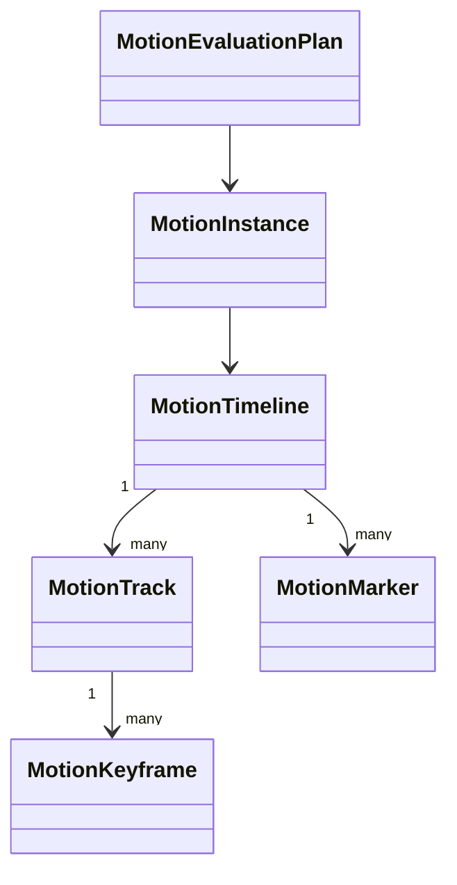
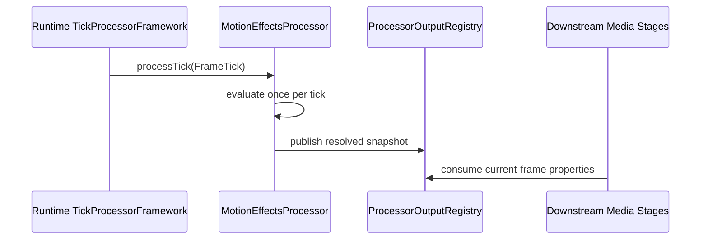
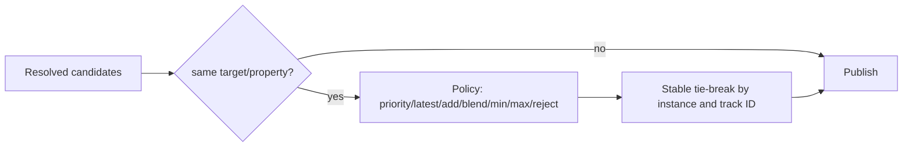
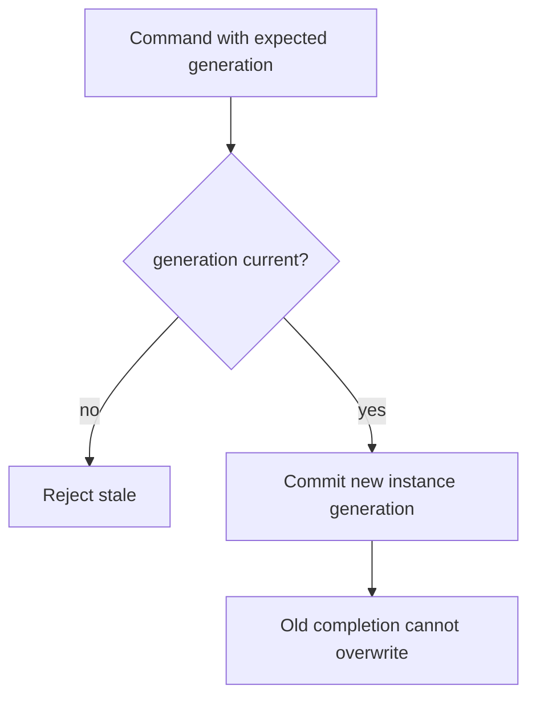
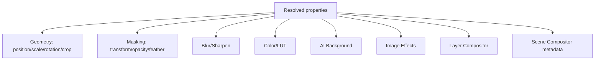
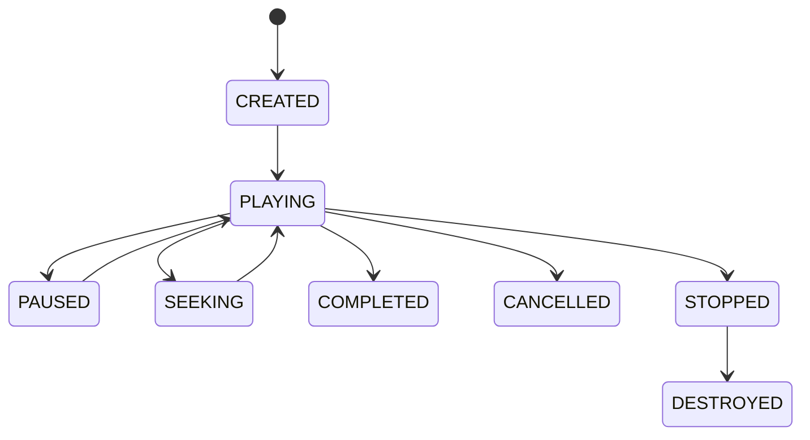
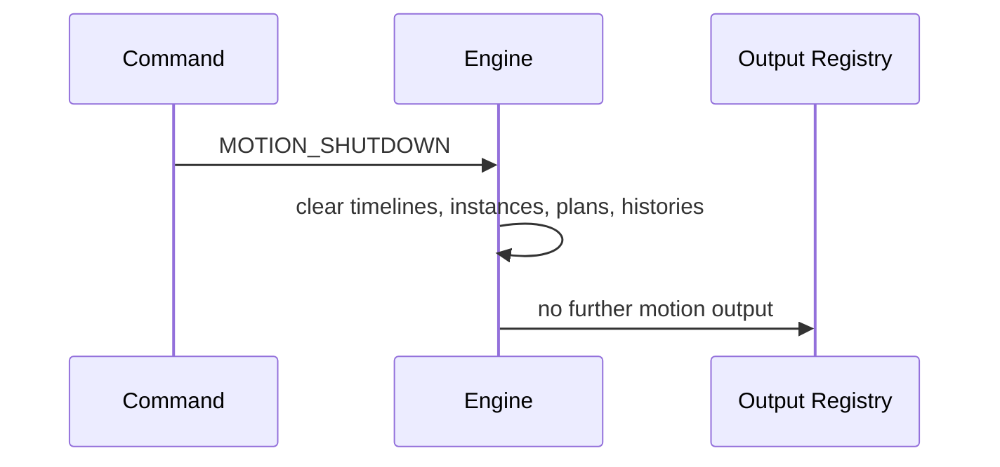

# UBOS v5.4.7 Motion Effects Engine

The Motion Effects Engine is a production-safe control and evaluation layer for deterministic keyframe animation. It evaluates metadata-only property values from the authoritative v5.1 `FrameTick`, then publishes immutable resolved-property snapshots for existing geometry, masking, blur/sharpen, color/LUT, AI background, image effects, layer compositor, and scene compositor stages. It does not allocate frames, own GPU resources, mutate downstream targets directly, create timers, implement transitions, or perform CUT/AUTO/TAKE.

## Model

Timelines are immutable definitions with bounded tracks, keyframes, markers, versions, generations, playback mode, frame-rate basis, delay, priority, tags, and safe metadata. Tracks bind an explicit generated target to one approved property path from the typed vocabulary. Keyframes are sorted deterministically and contain immutable typed values, interpolation, easing, tangent/spring metadata, and hold flags.

## FrameTick authority

Timeline position is derived only from `FrameTick.frameNumber`, the instance start frame, seek/pause state, playback rate, direction, loop mode, and delay. Wall-clock APIs are not used for animation progression; diagnostic timestamps from ticks are copied only into result metadata.

## Processor ordering

Motion should be registered before affected downstream stages. Downstream validation remains authoritative and consumes snapshots through typed contexts/output registry keys.

## Conflict resolution

Discrete properties use STEP/HOLD only and cannot be numerically blended. Conflicts record contributors and the effective winner.

## Retargeting and interruption

Retarget, seek, pause, resume, cancel, stop, and destroy are explicit generation-changing operations. Queues and histories are bounded.

## Downstream consumption

## Lifecycle

## Shutdown

## Production safety, validation, and limits

The engine enforces finite values, property-schema matching, deterministic ordering, duplicate tick rejection, no arbitrary property traversal, no executable expressions, bounded timelines/tracks/keyframes/instances/plans/history, metadata redaction boundaries, immutable JSON-safe snapshots, health, telemetry, watchdog incident names, and invariant reports. Long-run validation uses fake ticks and deterministic target snapshots; performance is assessed with operation counts rather than machine-specific timing thresholds.

## v5.4.8 and v5.5 boundaries

The v5.4.8 Picture-in-Picture Engine can consume motion snapshots for PIP enter/exit/position effects. Scene transition execution, preview/program transition behavior, CUT/AUTO/TAKE, and transition timing remain reserved for UBOS v5.5 Scene Engine transitions.
