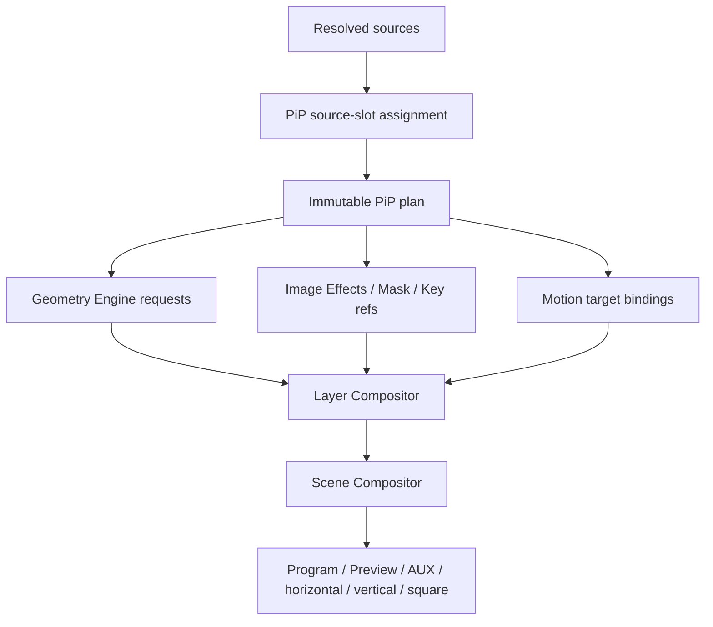
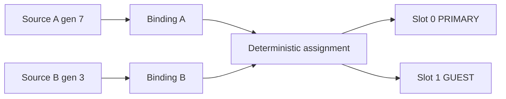
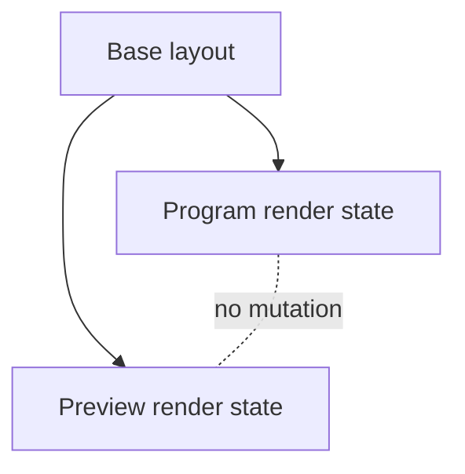
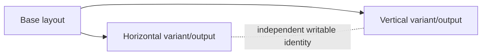
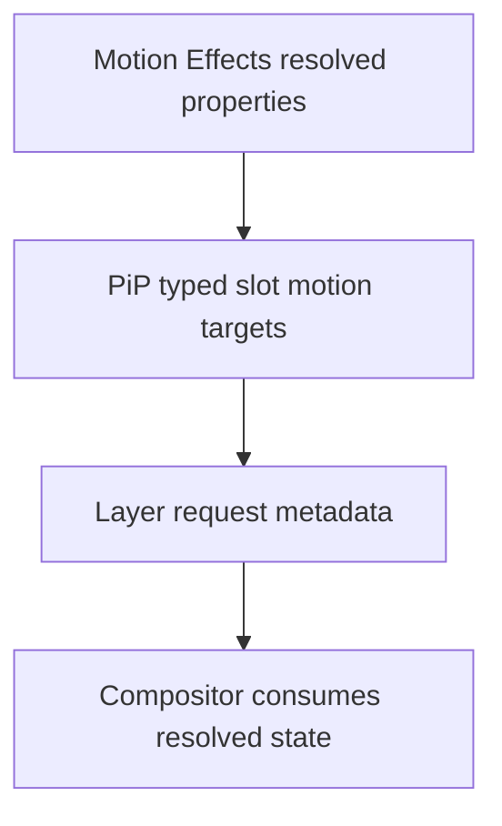
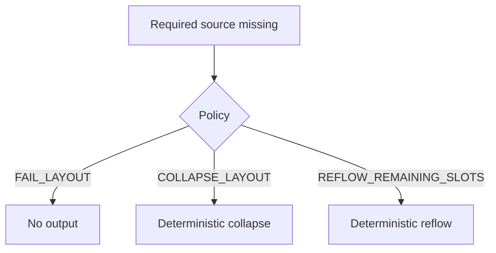
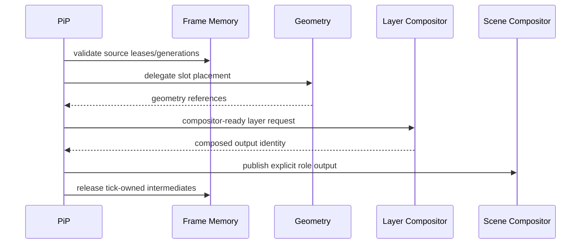
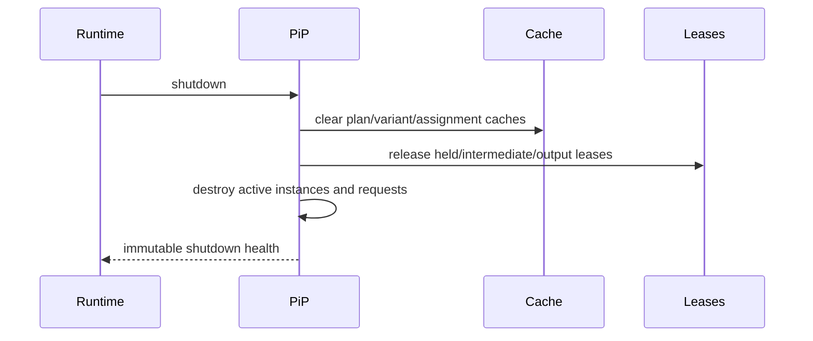

# UBOS v5.4.8 Picture-in-Picture Engine

## Purpose

UBOS v5.4.8 introduces a production-safe Picture-in-Picture (PiP) planning subsystem for deterministic multi-source layouts: presenter-over-slides, interviews, guest panels, split screen, grids, social vertical, horizontal, square, clean-feed, AUX, Program, and Preview outputs. The engine owns layout definitions, slots, bindings, deterministic assignment, variants, plans, health, telemetry, events, watchdog incidents, snapshots, and invariants.

## Architectural position

PiP is an orchestration layer, not a compositor. It reuses FrameTick authority from the Execution Engine, Frame Memory leases, GPU boundaries, Geometry Engine placement, Image Effects metadata, Masking/Keying references, Motion Effects bindings, Layer Compositor blending, and Scene Compositor output publication.

## Layout types and definitions

Supported explicit layout types are single/dual/triple/quad inset, side-by-side, top-bottom, 2x2 and 3x3 grids, custom grids, presenter/slides variants, two/three/four-person interviews, active-speaker-with-guests, main-with-thumbnails, social vertical layouts, horizontal panel, square panel, floating window, docked panel, and custom. Layout type never implies output dimensions; output profile and canvas remain explicit.

`PictureInPictureLayoutDefinition` is immutable after registration and includes layout id/version/generation, display name, type, output profile reference, canvas, rational frame rate, slots, safe area, background, assignment, missing/frozen-source, overflow, animation, output-role compatibility, tags, safe metadata, and timestamps. Registration does not activate or render.

## Slots and source bindings

`PictureInPictureSlot` contains deterministic slot id/index, role, destination rectangle, coordinate space, fit/crop policy, alignment, z-order, visibility, opacity, required/optional state, binding references, fallback, border/corner/shadow, mask, keying, effects, motion presets, safe-area constraints, priority, and sanitized metadata. Definitions contain no raw frame handles.

`PictureInPictureSourceBinding` binds by explicit source id, stream id, expected generation, preferred slot, role, priority, required/active flags, and safe metadata. Display-name binding is intentionally unsupported.

## Assignment policies and auto-layout

Assignment policies are EXPLICIT, ROLE_BASED, PRIORITY_BASED, STABLE_SOURCE_ORDER, ARRIVAL_ORDER, ACTIVE_SPEAKER, PINNED_HOST, PINNED_PRESENTATION, ROUND_ROBIN, and CUSTOM. Tie-breaking is stable and uses output role, slot index, slot/source priorities, source role, stable source id, slot id, variant id, and plan id. Active-speaker behavior is metadata-driven unless a validated audio activity source is supplied.

Auto-layout policies are explicit and opt-in: FIXED_LAYOUT, SELECT_BY_SOURCE_COUNT, SELECT_BY_ROLE_COUNT, SELECT_BY_OUTPUT_ASPECT, SELECT_BY_ACTIVE_SPEAKER, SELECT_BY_PRESENTATION_STATE, and CUSTOM. Selection reasons are observable; no scene switch is hidden inside PiP.

## Output roles and variants

Output roles are PROGRAM, PREVIEW, HORIZONTAL_PROGRAM, VERTICAL_PROGRAM, SQUARE_PROGRAM, CLEAN_FEED, AUXILIARY, MULTIVIEW, and CUSTOM. Role-specific variants are explicit, deterministic, bounded, and never mutate the base layout. Program/Preview and horizontal/vertical/square render state are isolated.

## Fit, crop, visual treatments, and Motion

Fit modes are FIT, FILL, STRETCH, NATIVE, CENTER, INTEGER_SCALE, DOWNSCALE_ONLY, UPSCALE_ONLY, and CUSTOM. Crop policies are REJECT_OUT_OF_BOUNDS, CLAMP_TO_SOURCE, CENTER_CROP, ASPECT_CROP, SAFE_AREA_CROP, and CUSTOM. PiP records requested policy and effective slot destination; the Geometry Engine owns transform math, chroma alignment, and scaling.

Visual treatments are metadata-only references for opacity, borders, rounded corners, shadows, glow, masks, key mattes, image/color-effect presets, and background treatment. Layer Compositor performs final blending.

## Instances, lifecycle, planning, and results

`PictureInPictureLayoutInstance` references a reusable definition and tracks output role, activation state, runtime bindings, assignments, active variant, current runtime frame, last plan/result summary, health, and safe metadata. States are CREATED, ACTIVATING, ACTIVE, SUSPENDED, DEACTIVATING, INACTIVE, FAILED, and DESTROYED. Inactive/suspended/destroyed instances do not render.

A `PictureInPicturePlan` is immutable and contains ordered slots, assignments, geometry/effect/mask/key/motion references, background policy, safe-area results, pass-through eligibility, composition requirement, bounded estimates, deterministic score, warnings, and sanitized metadata. `PictureInPictureResult` records completed, pass-through, degraded, empty, dropped, cancelled, failed, or rejected status.

## Pass-through

Pass-through is allowed only for one visible source that already matches the output profile, fills the full canvas, has no crop/border/mask/effect/opacity/background/motion change, requires no composition, and is allowed by role. Pass-through preserves frame/storage identity and lease ownership; composed output uses a distinct output identity.

## Missing, frozen, overflow, cancellation, budgets, failure policy

Missing-source policies include fail, drop, skip optional, placeholder, transparent, black, bounded hold-last, collapse, reflow, degrade, and operator intervention. Frozen-source policies include continue, mark degraded, hold-last, drop/collapse slot, placeholder, and fail. Overflow is explicit and bounded: reject, ignore lowest priority, rotate, overflow page, active speakers, expand to compatible layout, or operator intervention.

Cancellation checks occur before assignment, before planning, before dependencies, before composition, and after composition before publication. No output is published after cancellation, timeout, or failure. Budgets track binding, assignment, planning, dependencies, composition, publication, total duration, bytes, deadlines, and per-output-role policy.

## Frame Memory, GPU, processor, registry, commands

PiP validates leases and generations via existing Frame Memory boundaries and never mutates refcounts directly. GPU work remains inside Geometry/Effects/Compositor paths; device loss invalidates dependent plans.

`PictureInPictureProcessor` implements `TickProcessor`, runs after Motion Effects, processes active instances in stable order once per FrameTick, publishes results/health/telemetry via `ProcessorOutputRegistry`, and creates no frame clock or runtime loop.

Commands are exposed through typed RuntimeCommandHandlers for layout, variant, instance, activation, binding, slot swap, policy, plan/render/cancel/cache/validate/shutdown operations with idempotent command records.

## Health, telemetry, events, watchdog, Source Graph

Health snapshots include registry sizes, active output counts, cache/request sizes, render counts, pass-through/degraded/dropped/cancelled/failed counts, duplicate/stale/missing/frozen/overflow counts, dependency failures, timeout/GPU loss, held-frame and temporary-byte summaries, and last success/failure. Telemetry is bounded and contains counters, current request ids, active instance ids, last event, and health summary. Events and watchdog incidents are typed and sampled/bounded. Source Graph metadata exposes only layout ids, instance ids, roles, variants, slot ids/roles, bindings, visibility, counts, render status, health, routing eligibility, and pass-through state.

## Security, invariants, long-run validation, performance

Snapshots are JSON-safe, deeply immutable, deterministically ordered, redacted, and free of pixels/native handles/mutable leases. Invariants check uniqueness, non-regressing generations, deterministic slot ordering and assignment, acyclic definitions/variants, valid active layouts, one instance per tick, output isolation, identity rules, no publication after failure/cancellation, bounded leases/caches, telemetry consistency, stale-completion protection, and clean shutdown.

Long-run validation simulates 100,000 ticks, multi-output roles, source changes, missing/frozen sources, placeholders, hold-last, collapse/reflow, swaps, layout/variant changes, motion metadata, cache churn, cancellation, timeout, GPU loss, memory pressure, overload, and shutdown. Performance validation uses operation counts rather than wall-clock thresholds: O(1) lookups, O(s log s) bounded assignment, O(1) plan-cache lookup, O(slots) planning/render orchestration, O(1) per-output publication, bounded snapshot/watchdog evaluation.

## Limitations and next integrations

PiP v5.4.8 intentionally does not implement CUT, TAKE, AUTO, scene transitions, audio mixing, recording, streaming, replay, graphics authoring, text rendering, arbitrary scripting, UI changes, raw GPU access, or duplicate composition. v5.4.9 Effect Chain and Stack Engine can consume PiP visual references for richer ordered effect stacks. v5.5 Scene Engine remains responsible for scene switching and transitions.
