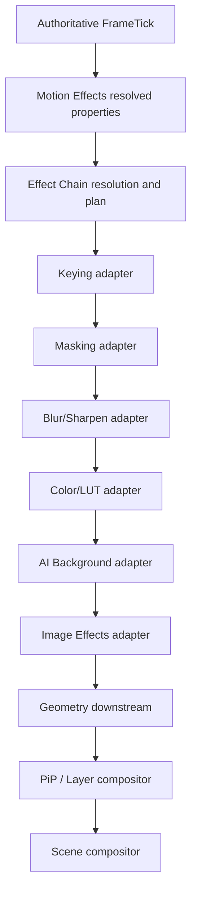
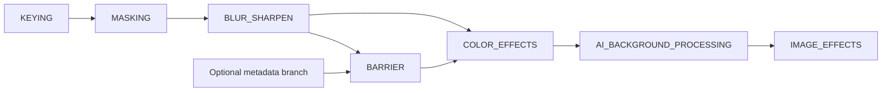
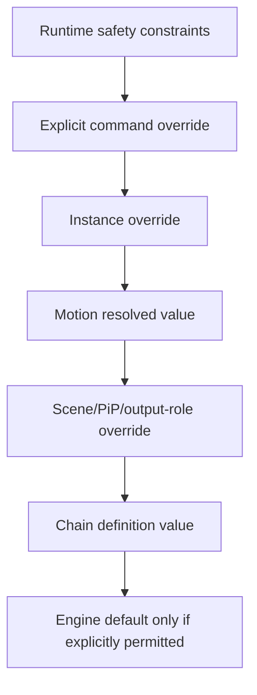
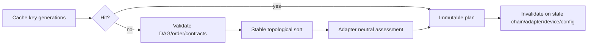
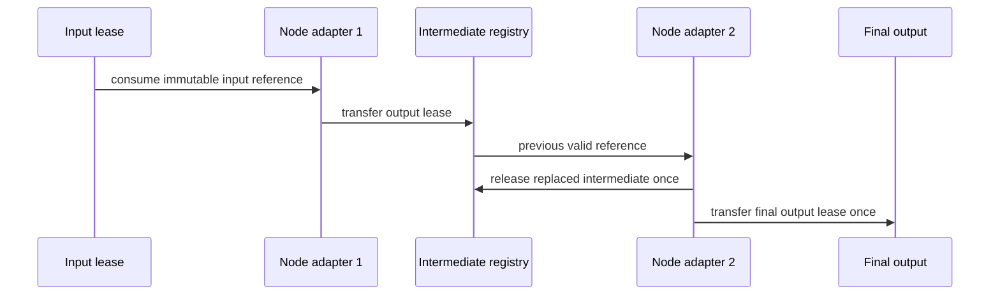
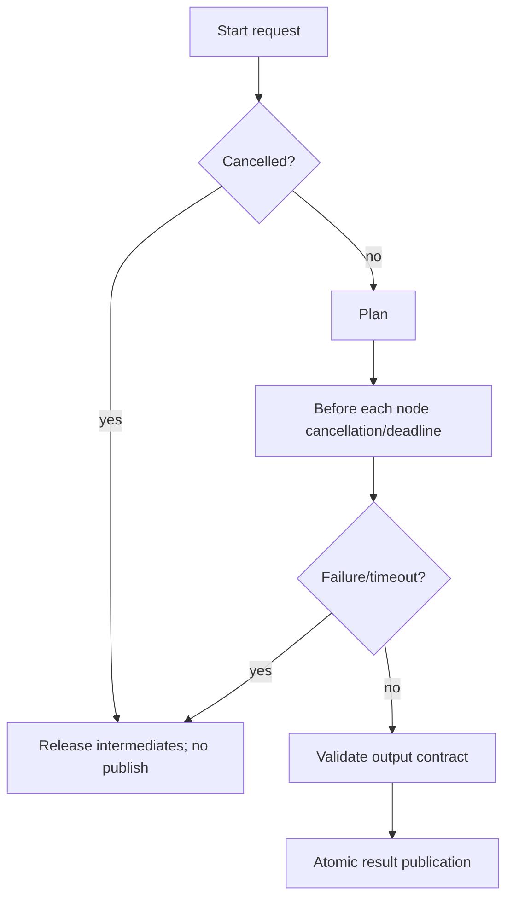
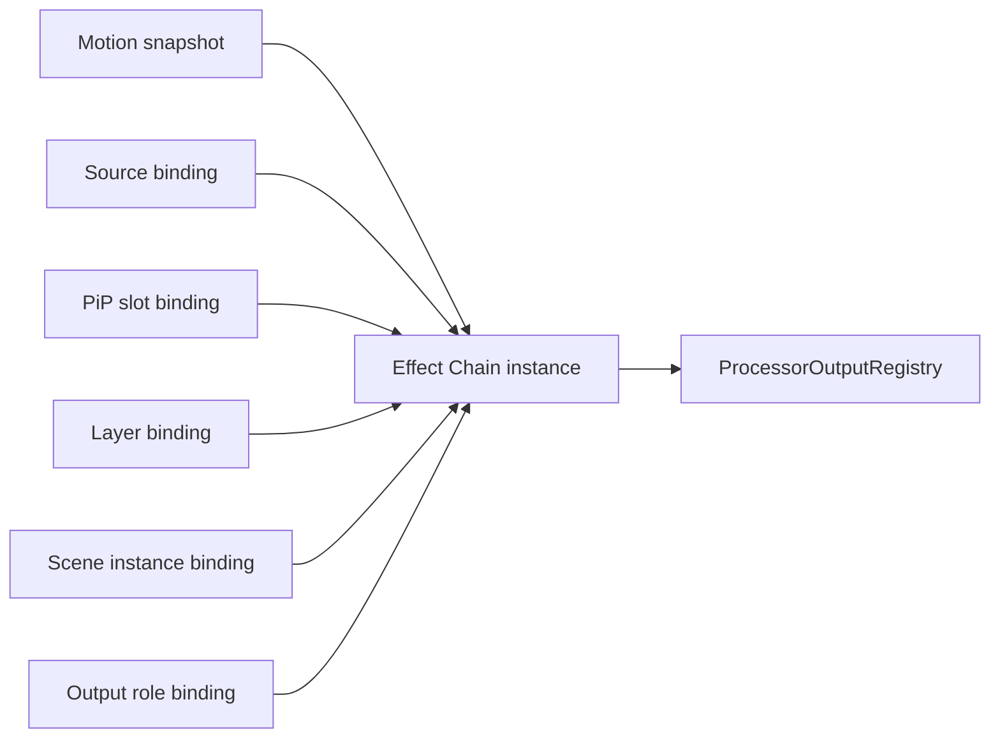
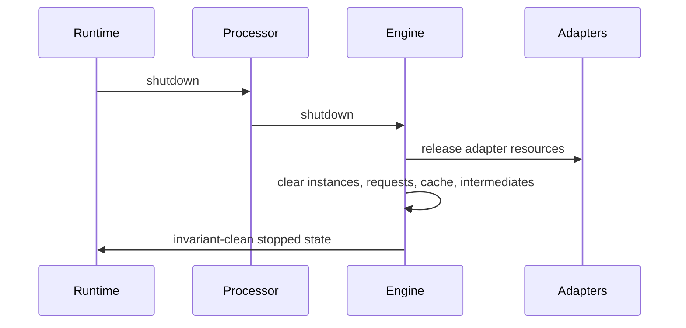

# UBOS v5.4.9 Effect Chain and Stack Engine

UBOS v5.4.9 defines the production-safe orchestration layer for existing v5.4 effect engines. It owns chain definitions, deterministic graph validation, planning, bounded plan caching, activation lifecycle, adapter orchestration, result publication, health, telemetry, snapshots, watchdog incident names, and invariant checks. It does **not** implement effect math, frame clocks, frame memory, GPU allocation, geometry, compositing, scene switching, CUT/AUTO/TAKE, recording, streaming, replay, UI editing, scripting, or transitions.

## Architectural position

The engine reuses the v5.1 `TickProcessor` and `ProcessorOutputRegistry` contracts. `EffectChainProcessor` is ordered after Motion Effects and before downstream Geometry/PiP/Layer/Scene composition; it creates no loop, scheduler, frame clock, frame-memory manager, or GPU manager.

## Definitions, nodes, contracts, graph, and ordering

`EffectChainDefinition` is immutable after registration and includes chain identity/version/generation, ordered nodes, dependency edges, input/output contracts, activation/failure/resource/quality/pass-through/fusion/compatibility policies, tags, safe metadata, and timestamps. `EffectChainNode` is immutable and includes node type, engine reference/version requirement, typed parameter source, explicit parameters, motion bindings, required/enabled state, bypass/failure/timeout/quality/resource policies, dependencies, before/after constraints, group ID, priority, and safe metadata.

Supported node types are `KEYING`, `MASKING`, `BLUR_SHARPEN`, `COLOR_EFFECTS`, `AI_BACKGROUND_PROCESSING`, `IMAGE_EFFECTS`, `PASSTHROUGH`, `BARRIER`, `GROUP`, `OPTIONAL_GROUP`, and `CUSTOM_APPROVED`. Custom approved nodes require a registered typed adapter; script and arbitrary executable nodes are not supported.

Input contracts explicitly list accepted format, color metadata, alpha mode, memory domain, source category, and required key/mask/background/motion generations. Output contracts explicitly list expected format, color metadata, alpha mode, memory domain, required metadata, identity/timestamp preservation, routing eligibility, and safe metadata. No hidden conversion, alpha assumption, color-space assumption, relabeling, or false success is permitted.

Graphs are validated as bounded DAGs with unique node IDs, bounded node count/depth/fan-out, stable topological ordering, direct/indirect cycle rejection, and registration-order-independent plans. Approved default stage order is Keying, Masking, Blur/Sharpen, Color Effects/LUT, AI Background Processing, Image Effects; Geometry and PiP/Layer/Scene composition remain downstream. Alternative ordering requires explicit compatibility policy.

## Instances, activation, binding, parameters, and conditions

`EffectChainInstance` tracks instance identity, chain version/generation, instance generation, source/PiP/layer/scene/output-role target binding, activation state, node and parameter overrides, quality/failure overrides, current runtime frame, last plan, last success summary, health, and safe metadata. States are `CREATED`, `ACTIVATING`, `ACTIVE`, `SUSPENDED`, `DEACTIVATING`, `INACTIVE`, `FAILED`, and `DESTROYED`; inactive and suspended instances do not execute.

Parameter sources are typed: static, instance override, motion resolved, source metadata, scene parameter, PiP slot parameter, output-role parameter, and custom typed provider. Precedence is deterministic:

Conditional enablement supports typed conditions only: always/never, source available/healthy, mask/key/background available, output-role match, frame-number range, explicit boolean parameter, and custom typed condition. Results are captured in the plan.

## Planning, cache, pass-through, bypass, no-op, and fusion

Plans are immutable and include ordered node execution list, resolved parameters, dependency summary, conditional results, bypassed nodes, eliminated no-op nodes, fusion metadata, barrier positions, intermediate requirements, temporary/output/operation estimates, quality/failure policy, pass-through eligibility, new-output requirement, deterministic score, warnings, and safe metadata.

Tie-breaking uses topology, explicit order constraints, group order, priority, approved stage order, stable node ID, stable engine ID, and stable plan ID. The plan cache is bounded and deterministic; keys include chain/instance generations, input descriptor, motion/configuration generations, role, and compatible device/pipeline generation metadata. It stores plans only, never output frames.

Whole-chain pass-through is valid only when all effective nodes are neutral or explicit pass-through, output contract matches input, no alpha/motion/key/mask/background change is requested, and downstream accepts the original frame. Partial bypass is allowed for optional nodes with explicit reason; required nodes cannot be silently skipped. No-op elimination uses adapter-authoritative neutrality only. Fusion is metadata-only; the chain engine never creates fused shaders/kernels and never reorders semantics secretly.

## Adapter, execution, and ownership

`EffectChainNodeAdapter` validates parameters, assesses neutrality, declares compatibility, creates node execution metadata, delegates execution to an existing target engine, validates results, exposes health/telemetry, and releases adapter-owned resources. Built-in adapters cover Keying, Masking, Blur/Sharpen, Color/LUT, AI Background, Image Effects, Passthrough, and Barrier.

Execution requests validate request ID, instance state, expected generations, tick/frame lease metadata, input/output contract, motion snapshot frame, and unsupported graphs. Execution checks cancellation before planning, before/after nodes, before validation, and before publication. Failure, timeout, and cancellation discard partial output and release chain-owned intermediates.

Frame Memory and GPU boundaries remain with existing effect engines. The chain engine validates references/generations, tracks intermediate ownership, and never performs direct GPU allocation or frame refcount mutation.

## Integration, commands, presets, observability, and safety

Typed output keys cover definitions, instances, requests, plans, results, output references, pass-through, failed/degraded results, active summaries, health, telemetry, and node health. Typed commands cover register/update/unregister, create/destroy instance, activate/deactivate/suspend/resume, parameter/enablement/order/failure/quality/binding changes, execute/cancel, clear cache, validate, and shutdown. Built-in presets include clean camera, green screen presenter, guest cleanup, podcast host/guest, social relay, presentation/cinematic/virtual/soft/high-contrast/sports/gaming/lower-third/PiP profiles, and custom.

Health and telemetry snapshots are bounded and JSON-safe. Watchdog incident names cover stalls, timeouts, duplicates, invalid graphs, dependency cycles, order conflicts, unavailable engines, invalid parameters, compatibility failures, node failures, skipped required nodes, false pass-through, leaks, output mismatch, memory pressure, active-instance limits, GPU loss, stale generation, plan-cache invalidity, output-registry mismatch, graph mismatch, and invariant failure. Source Graph exposure is metadata-only: chain IDs, instance IDs, target bindings, ordered node types, enabled/bypassed summaries, output contract summary, status, last frame, health, routing eligibility, pass-through/degraded/partial state. No pixels, handles, leases, GPU objects, native resources, credentials, endpoints, or private parameters are exposed.

## Validation, performance, limitations, and handoff

Validation uses deterministic synthetic ticks, frames, adapters, and no real-time sleeping. It covers creation, duplicate rejection, immutability, updates/generations, presets, instances/lifecycle, graph cycles/depth/order, contracts, parameters/motion, conditional enablement, pass-through, partial bypass, no-op, fusion metadata, adapters, stale generations, execution, ownership summaries, failures/cancellation, processor publication, source metadata, health/telemetry, snapshots, invariants, shutdown, 10,000 plans, 10,000 synthetic executions, and 100,000 processor ticks.

Expected complexity is O(1) lookup for chains/instances/adapters/cache, O(n + e) graph validation/topological sorting, O(n) parameter/condition/node orchestration, O(1) ownership tracking per intermediate, bounded snapshot generation, and O(active + bounded incidents) watchdog evaluation.

Limitations: this phase provides orchestration and synthetic validation boundaries; it intentionally avoids new visual algorithms, native GPU APIs, actual scene switching/transitions, recording, streaming, replay, and UI editing. UBOS v5.4.10 should certify video effects end-to-end against real existing v5.4 engine adapters. v5.5 remains the proper phase for Scene Engine switching and transitions.
