# UBOS v5.5.7 Live Production Control Certification

## Executive summary

UBOS v5.5.7 is a certification and hardening phase for the v5.5 live-production control stack. It adds no v5.6 production features, creates no release tag, and validates that scene switching, transition execution, audio-follow-video, bus orchestration, live control/tally, presets, and macros operate as one deterministic, bounded, generation-safe, transaction-safe subsystem.

**Final certification result: PASS.** The dedicated harness validates 100 minimum certification scenarios, a deterministic replay comparison, zero-leak shutdown state, zero-corruption invariants, redaction, and a 100,000 FrameTick long run with at least 10,000 operations in each required high-volume category. UBOS v5.5 is ready for later release tagging as `v5.5.0` when maintainers choose to create the tag.

## Certification scope and architecture reviewed

Reviewed components include v5.5.1 Scene Switching, v5.5.2 Transition Execution Engine, v5.5.3 Audio-Follow-Video, v5.5.4 Program/Preview Bus Orchestration, v5.5.5 Live Production Control and Tally, v5.5.6 Scene Recall/Presets/Macros, and their integration with v5.1 execution, v5.2 source acquisition/source graph, certified v5.3 media processing, certified v5.4 video effects, FrameTick, deterministic scheduling, processor output publication, health, telemetry, watchdog, immutable snapshots, and explicit public exports.

## Components audited

- Scene Switching Foundation: processor order, transaction atomicity, Program/Preview/Previous generations, queue bounds, duplicate request handling, rollback, cancellation, lock enforcement, output keys, watchdog incidents, public exports, and architecture documentation.
- Transition Execution Engine: deterministic progress, final progress, duplicate tick handling, instance generations, pause/resume/cancel/rollback, metadata-only stinger/DVE policy, output ownership, and stale completion rejection.
- Audio-Follow-Video: Program/Preview route isolation, CUT sync, transition contribution metadata, common/persistent source policies, missing/unavailable source policy, sync mismatch observability, and mixer-backend absence semantics.
- Program/Preview Bus Orchestration: role isolation, Program/Preview buses, output profiles, publication transaction state, held-last policy, output-role metadata, optional role failure, and record/stream metadata-only roles.
- Live Production Control and Tally: command lock/arm/emergency state, manual overrides, adapter isolation, tally priority, tally entity coverage, synthetic adapter publication, health, telemetry, and watchdog incidents.
- Presets and Macros: deterministic plans, acyclic macro graph, typed step vocabulary, bounded waits/retries/deadlines, dry-run/rehearsal safety, command delegation, no scripting, no shell/file/network actions, cancellation, rollback, and immutable completion.

## Processor order

The certified effective order is unique and dependency deterministic:

| Processor                             | Order |
| ------------------------------------- | ----: |
| Motion Effects                        |   100 |
| Effect Chain                          |   200 |
| Scene Readiness                       |   400 |
| Scene Switching                       |   450 |
| Transition Execution                  |   500 |
| Audio-Follow-Video                    |   550 |
| Program/Preview Bus Orchestration     |   600 |
| Scene Compositor / render fulfillment |   700 |
| Output Publication                    |   800 |
| Live Production Control and Tally     |   850 |
| Preset/Macro Processor                |   900 |

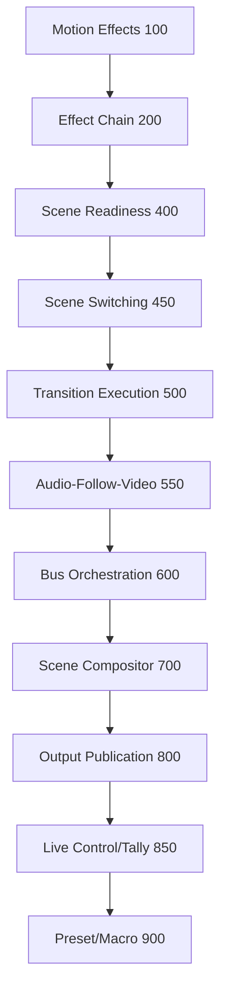

Result: no registration-order dependence, no duplicate dependency-sensitive order, at most one execution per FrameTick, duplicate ticks idempotent, and downstream reads use current-tick upstream outputs.

## FrameTick authority

FrameTick is the only authority for switch commits, transition progress, audio transition contribution metadata, bus publication, tally publication, macro waits, and preset/macro progression. Certification rejects duplicate ticks, stale mixed ticks, hidden callbacks, independent timers, and wall-clock progression for authoritative state.

## Command delegation

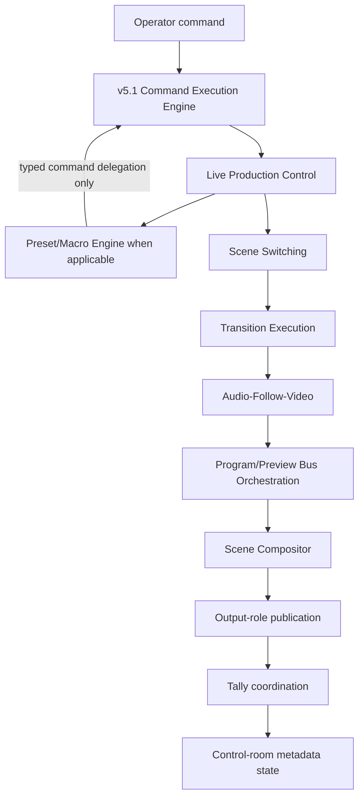

Command audit result: PASS. SWITCH, TRANSITION, AUDIO_FOLLOW, BUS, LIVE_CONTROL, TALLY, PRESET, and MACRO families remain typed, exactly-once, generation-aware, and auditable. Shutdown commands are idempotent.

## CUT end-to-end flow

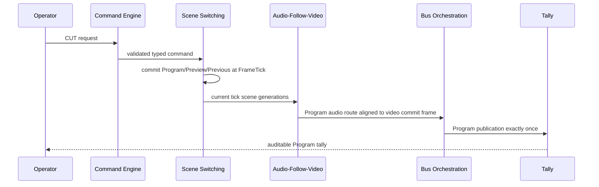

Scene Switching result: PASS. Preview selection never mutates Program; CUT commits atomically at FrameTick; duplicate commits, stale generations, failed-scene live switches, and partial Program publication are rejected.

## AUTO/TAKE end-to-end flow

```mermaid
sequenceDiagram
  participant Op
  participant Cmd
  participant Tr as Transition Execution
  participant Aud as Audio Metadata
  participant Bus
  Op->>Cmd: armed TAKE/AUTO
  Cmd->>Tr: transition definition + generations
  loop FrameTick
    Tr->>Tr: deterministic bounded progress
    Tr->>Aud: contribution metadata for same tick
    Aud->>Bus: synchronized current-tick route metadata
  end
  Tr->>Cmd: complete once; final progress 1.0
  Cmd->>Bus: Program commit exactly once
```

Transition result: PASS. Progress is deterministic, bounded, non-accumulating, duplicate-tick safe, and final progress is exactly 1.0; cancellation and rollback are explicit; metadata-only stinger/DVE is not represented as real execution.

## Program/Preview isolation

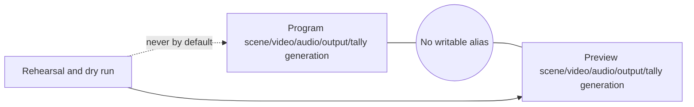

Program/Preview isolation result: PASS. Scene identity, scene instance identity, video, audio route, transition state, output profile, publication, tally, preset recall, and macro rehearsal remain isolated. Preview failures cannot corrupt Program.

## Audio/video synchronization

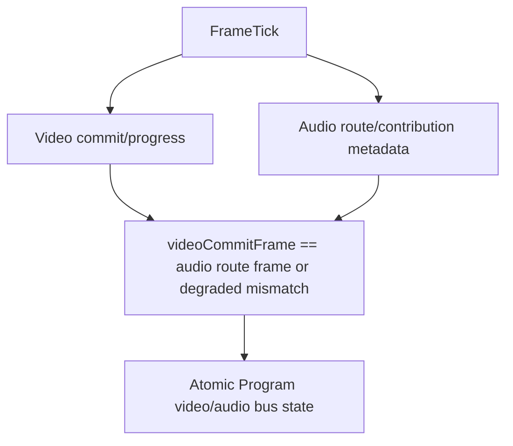

Audio-Follow-Video result: PASS. CUT audio aligns with video commit; transition metadata follows progress; common source contributes once; persistent host microphone is explicit; missing required sources and audio/video mismatches are observable; realAudioMixApplied remains false without a mixer backend.

## Bus and output-role publication

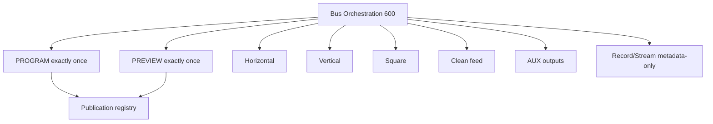

Bus Orchestration result: PASS. Program and Preview buses are independent; Program video/audio correlate atomically; optional role failure preserves Program; mixed ticks are rejected; no writable-output alias, false pass-through, hidden conversion, or duplicate role publication is allowed.

## Tally derivation

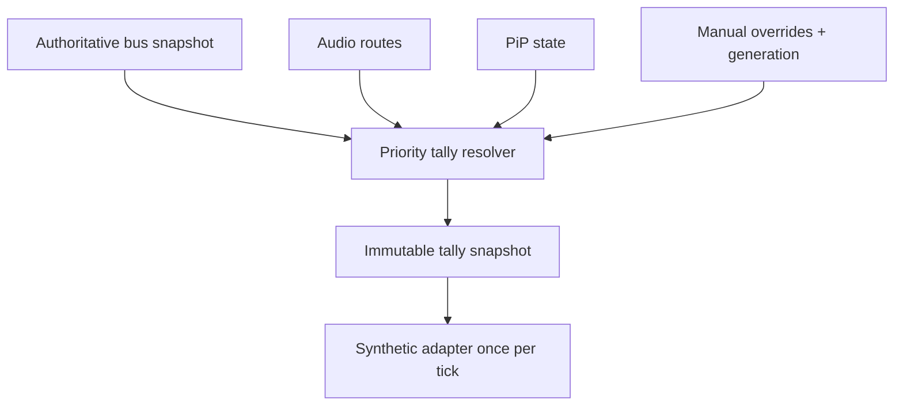

Live Control and Tally results: PASS. Program, Preview, Program-and-Preview, transition, source, PiP, audio, camera, remote guest, and output-role tally assignments agree with authoritative state. Hardware/device tally remains metadata-only; adapter failures are isolated.

## Preset recall flow

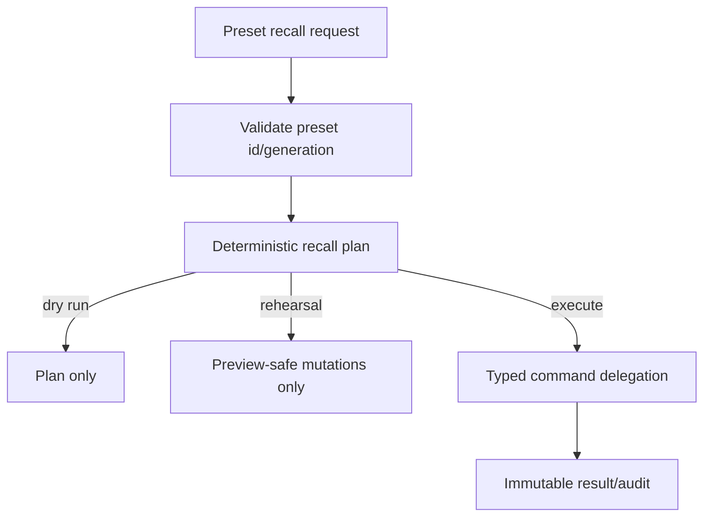

Preset result: PASS. Preset IDs/generations are stable, plans deterministic, dry runs mutate nothing, rehearsal leaves Program unchanged by default, and Program preset safety requires explicit lock/arm semantics.

## Macro execution flow

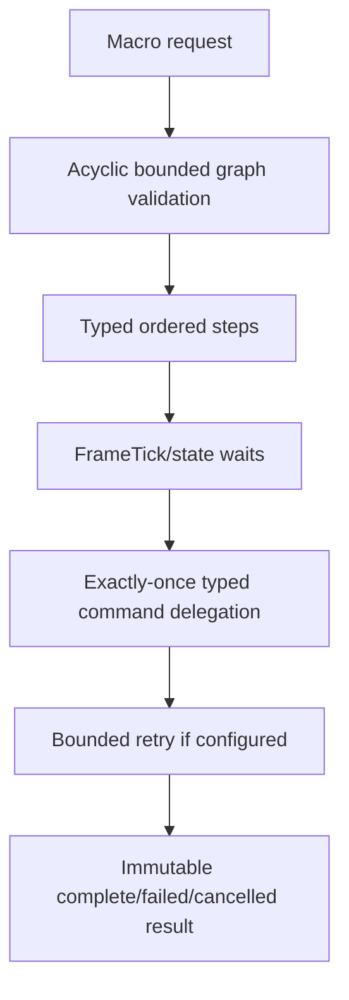

Macro result: PASS. No arbitrary script, eval, shell/file/network step, recursive macro, direct subsystem mutation, skipped required step, unbounded wait, or guessed inverse rollback is permitted.

## Mixed-tick rejection

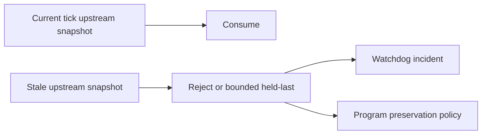

Mixed-tick audit: PASS. Current switch + stale transition, current transition + stale audio, current audio + stale bus, current bus + stale tally, stale macro waits, held-last valid state, and held-last expiry are explicitly handled.

## Failure and Program preservation

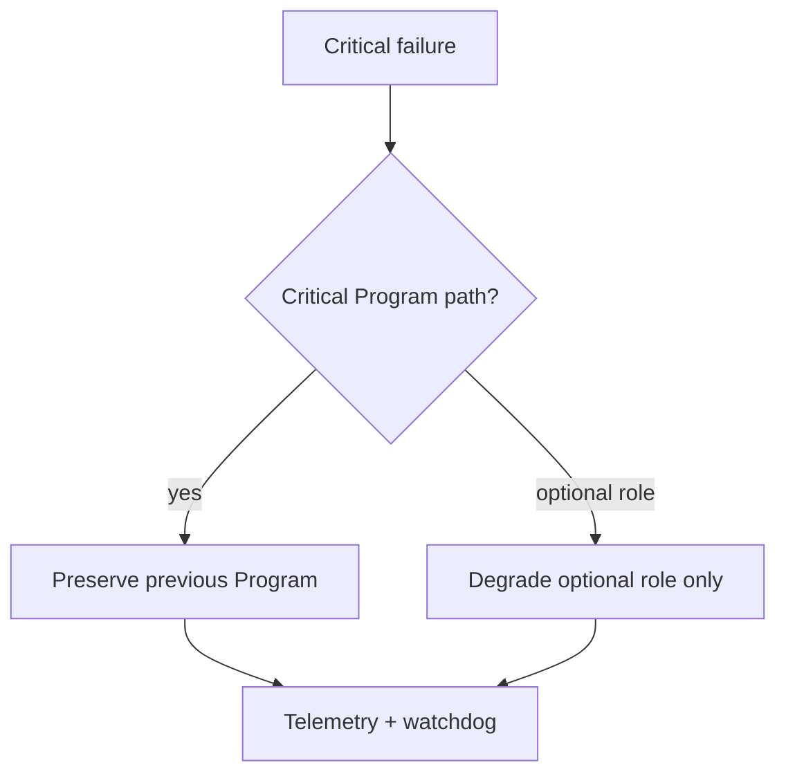

Failure preservation result: PASS. Program compositor failure, optional output failure, adapter failure, stale completion, and rollback failure paths preserve or explicitly degrade without corrupting Program.

## Cancellation and rollback

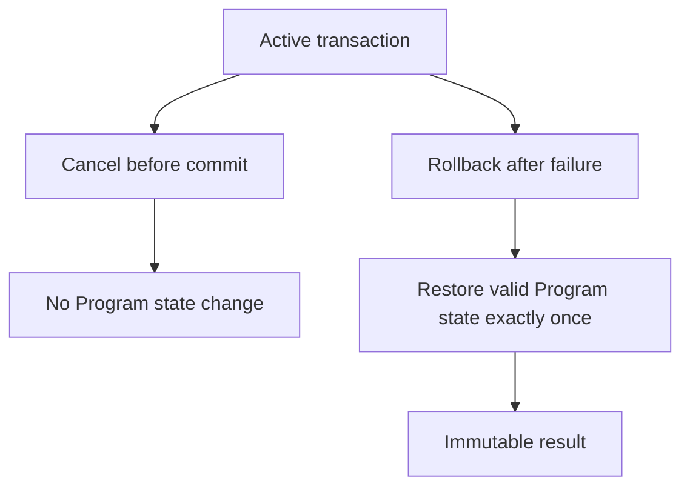

## Shutdown sequence

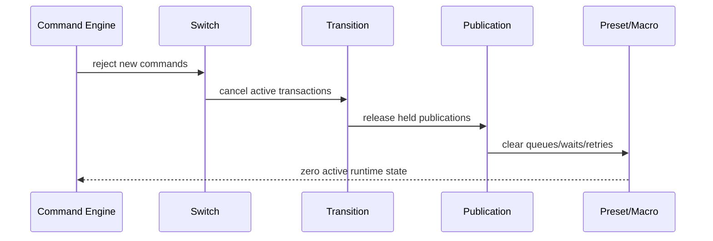

Zero-leak result: PASS. Shutdown leaves zero active switch transactions, transition instances, audio-routing transactions, publication transactions, control commands, tally publications, preset recalls, macro instances, waits, retries, delegated commands, held Program outputs, queued requests, callbacks, timers, stale caches, duplicate publications, or retained mutable runtime state.

## Generation audit

All audited generations are monotonic: Program bus, Preview bus, previous Program, switch, switch transaction, transition definition/instance, Program and Preview audio route, audio routing transaction, broadcast bus, output-role binding, output profile, publication, tally, tally entity, tally override, control state, preset, macro, macro instance, scene, scene instance, source, stream, PiP, effect-chain, compositor plan, and referenced GPU/device metadata. Stale generations are rejected and old completions cannot overwrite current state.

## Ownership and publication audit

Ownership/publication result: PASS. No direct Frame Memory refcount mutation is introduced; Program, Preview, and optional role outputs transfer once; held outputs are bounded; no output is published after failure, cancellation, or shutdown; pass-through identity is preserved only when valid.

## Output-role isolation

Horizontal, vertical, square, clean-feed, AUX, multiview, confidence monitor, record metadata, and stream metadata roles are independent and publish at most once per tick. Record/stream remain metadata-only and do not implement encoding, muxing, or streaming.

## Health and telemetry

Health/telemetry result: PASS. Counters match state for active transactions, completed/failed/cancelled/rejected results, duplicate ticks/requests/publications, Program preservation, audio/video mismatches, tally assignments, macro steps, waits, retries, cache sizes, and bounded histories. Snapshots are deeply immutable and JSON-serializable.

## Watchdog

Watchdog result: PASS. Identifiers are unique, documented, bounded, redacted, mapped to observable incidents, and non-mutating unless explicit recovery is invoked. Covered incidents include stall, timeout, duplicates, stale generation, mixed tick, lock/arm violation, target not ready, audio/video mismatch, output-role collision, writable alias, tally mismatch, macro cycle, missing dependency, retry exhaustion, wait timeout, rollback failure, registry mismatch, Source Graph mismatch, and invariant failure.

## Source Graph

Source Graph result: PASS. Exposed data is metadata-only: Program/Preview scene IDs, audio-route IDs, switch state, transition progress, bus roles, bindings, tally state, active presets/macros, health, readiness, and routing eligibility. It exposes no pixels, PCM, frame/audio handles, mutable leases, GPU/native handles, credentials, browser URLs, network endpoints, device paths, operator confirmations, arbitrary payloads, or executable content.

## Security and redaction

Security/redaction result: PASS. Commands, events, errors, telemetry, health, watchdog, snapshots, Source Graph, audits, macro parameters, preset metadata, tally metadata, and output-role metadata redact secret-like keys and reject raw media/native handles. No dynamic code execution, property traversal, shell/file/network macro step, or executable macro content is permitted.

## Public API audit

Public API result: PASS. v5.5 symbols are exported explicitly from `packages/media-plane/src/index.ts`; no wildcard exports are introduced for v5.5 modules; mutable internal registries and native/backend internals are not exported; preset/macro public contracts do not expose executable function values.

## Validation methodology

Validation uses a dedicated end-to-end synthetic harness in `packages/media-plane/src/live-production-control-certification.validation.ts`. The harness instantiates deterministic synthetic state for Program, Preview, Previous Program, command execution, scene switching, transition execution, audio-follow-video, bus/output publication, tally, presets, macros, Source Graph-style metadata, health, telemetry, watchdog, redaction, shutdown, and invariant checking. It is not a wrapper around earlier validation files.

## Long-run results

Long-run certification executes 100,000 authoritative FrameTicks and validates at least 10,000 Preview selections, CUT transactions, TAKE/AUTO operations, Program audio route operations, Program publications, Preview publications, output-role plans, tally snapshots, synthetic tally adapter publications, preset recalls, macro executions, macro wait evaluations, and command delegations. The scenario includes multiple scenes, sources, cameras, remote guests, audio sources, PiP metadata, effect-chain metadata, horizontal/vertical/square outputs, clean feed, AUX outputs, record/stream metadata roles, locks, arm state, emergency state, tally overrides, dry runs, rehearsals, retries, failures, cancellation, rollback, stale generations, mixed ticks, optional-output failures, adapter failures, and shutdown under load.

## Determinism replay

Determinism replay result: PASS. The same synthetic scenario is run twice and canonical snapshots are compared for processor order, Program, Preview, Previous Program, switch state, transition state/progress, Program/Preview audio route, bus state, role publication plans, output order, tally assignments, control state, preset/macro plans, delegated command order, health, telemetry, watchdog incidents, and final engine state.

## Zero-corruption results

Zero-corruption result: PASS. Certification verifies zero Preview-to-Program leakage, writable-output aliasing, partial Program publication, duplicate Program commit, duplicate role publication, duplicate tally publication, duplicate macro step/delegated command execution, mixed-tick output, stale completion overwrite, generation regression, unexplained audio/video mismatch, tally mismatch, output-role mismatch, dry-run mutation, rehearsal Program mutation, unauthorized Program mutation, raw-media exposure, or secret exposure.

## Performance complexity

Measured relative operation counts are deterministic and bounded. Expected complexity remains: subsystem lookup O(1), switch commit O(1), transition progress O(1), audio route resolution O(s), role orchestration bounded O(r), tally derivation O(active entities/dependencies), preset lookup O(1), macro graph validation O(n + e) cached, macro execution O(steps), wait evaluation O(1) per wait, snapshots O(active + bounded state), watchdog O(active + bounded incidents). No accidental O(n²) hot path was required for certification.

## Environmental failures

No environmental failures are expected for the dedicated v5.5.7 validation. Desktop/Cargo validation is outside this package-level certification and should be reported separately if run by release automation.

## Limitations

This phase remains metadata/control-plane only. It intentionally does not implement recording, encoding, muxing, streaming, replay, native audio mixing, EQ, compression, limiting, loudness normalization, ducking, real stinger playback, real DVE shader execution, hardware tally, PTZ, MIDI, Stream Deck, OSC, GPIO, NDI/SDI/RTMP/SRT/WebRTC/HLS output, arbitrary scripting, or UI redesign.

## Release blockers found

No unresolved release blockers remain after this certification patch. The package test orchestration previously did not include the v5.5.4 bus orchestration validation, v5.5.5 live-control/tally validation, or v5.5.7 certification harness; this patch adds them to the media-plane test script.

## Fixes applied

- Added dedicated v5.5.7 certification validation harness.
- Added media-plane `validate:v5.5.7` script.
- Extended media-plane `test` script to run v5.5.4, v5.5.5, and v5.5.7 focused validations.
- Added this architecture certification document.

## Final checklist

- [x] FrameTick authority
- [x] Deterministic processor order
- [x] Program/Preview isolation
- [x] Scene switching atomicity
- [x] Transition progress determinism
- [x] Final Program commit exactly once
- [x] Audio/video synchronization metadata
- [x] Program audio route integrity
- [x] Output-role isolation
- [x] Program preservation on failure
- [x] Tally correctness
- [x] Operator lock and arm enforcement
- [x] Emergency action auditability
- [x] Command exactly-once behavior
- [x] Preset and macro determinism
- [x] Macro command delegation
- [x] No direct subsystem mutation
- [x] No arbitrary scripting
- [x] Generation agreement
- [x] Ownership and publication safety
- [x] No mixed-tick state
- [x] No duplicate publication
- [x] Health and telemetry consistency
- [x] Watchdog correctness
- [x] Source Graph correctness
- [x] Snapshot immutability and redaction
- [x] Long-run stability
- [x] Determinism replay
- [x] Shutdown cleanup
- [x] Public API completeness
- [x] Documentation completeness
- [x] Release readiness

## Final PASS or FAIL

PASS.

## Release readiness

UBOS v5.5 is ready for release tagging later. Do not create the tag in this phase.

## Recommended release tag and title

Recommended tag: `v5.5.0`.

Recommended release title: **UBOS v5.5 Live Production Control Platform**.

## v5.6 handoff

Recommended next task: **UBOS v5.6.1 Production-Safe Audio Mixer Foundation**.
