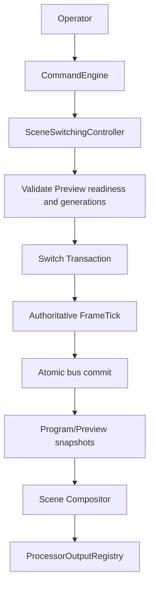
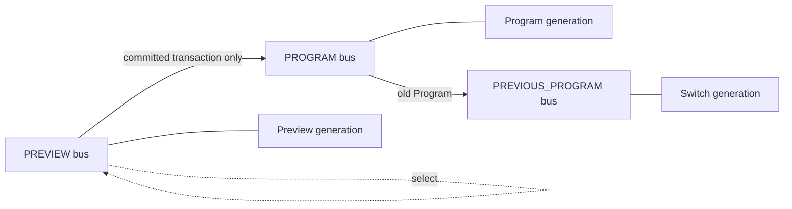
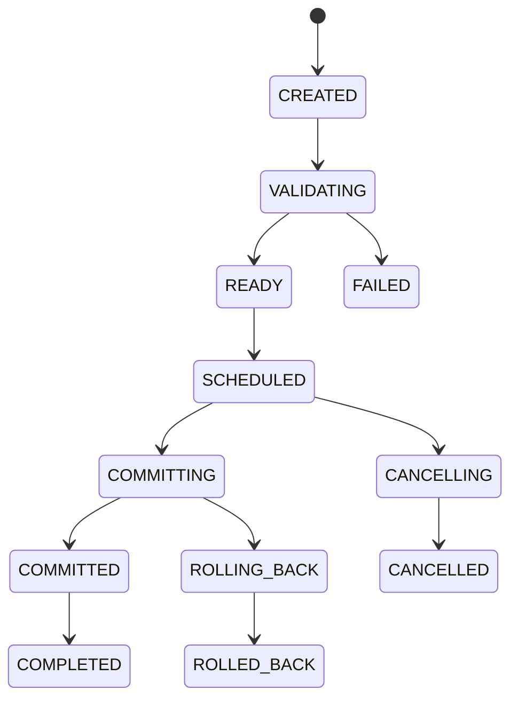
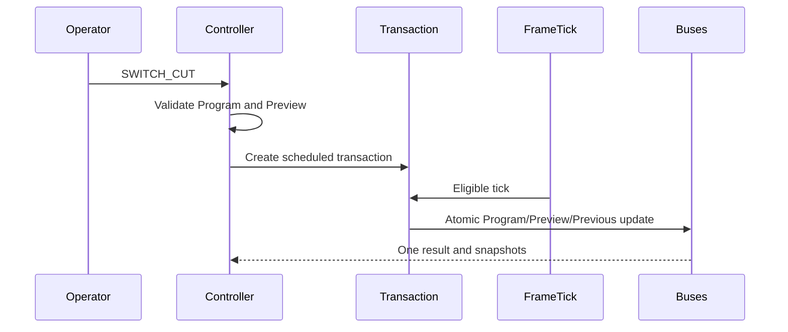
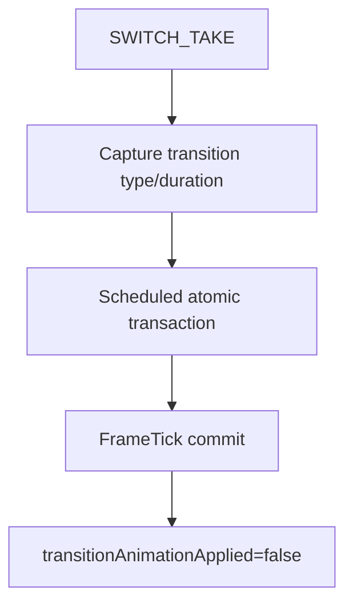
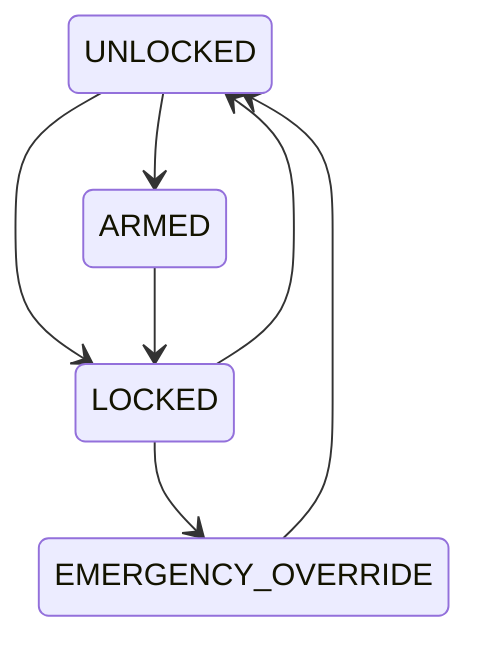
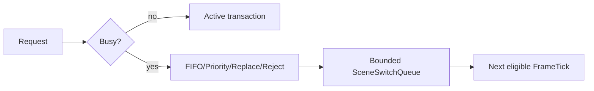
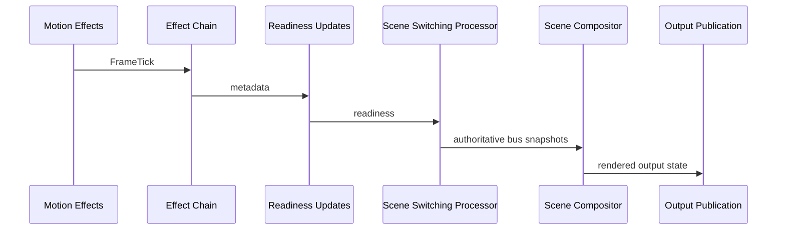
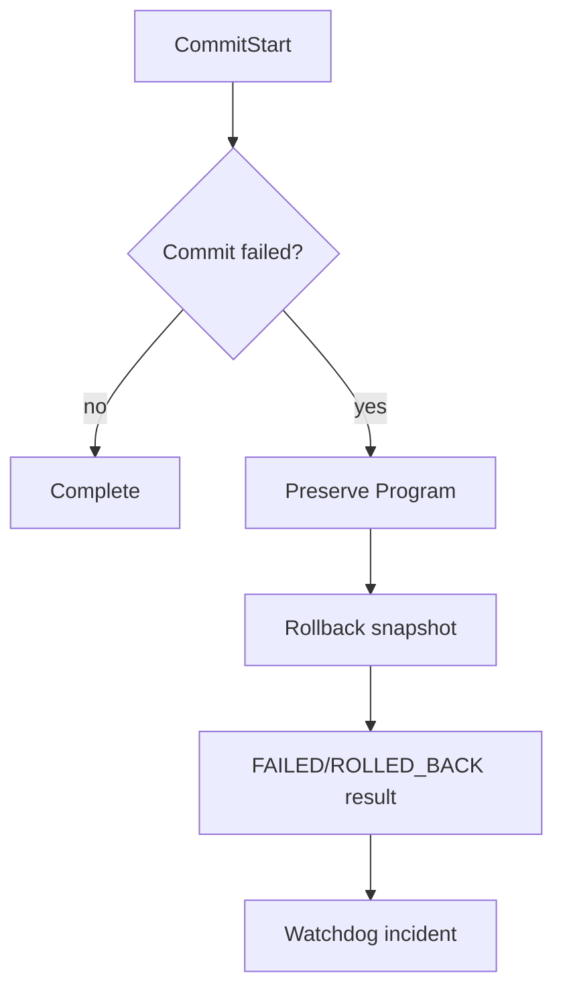
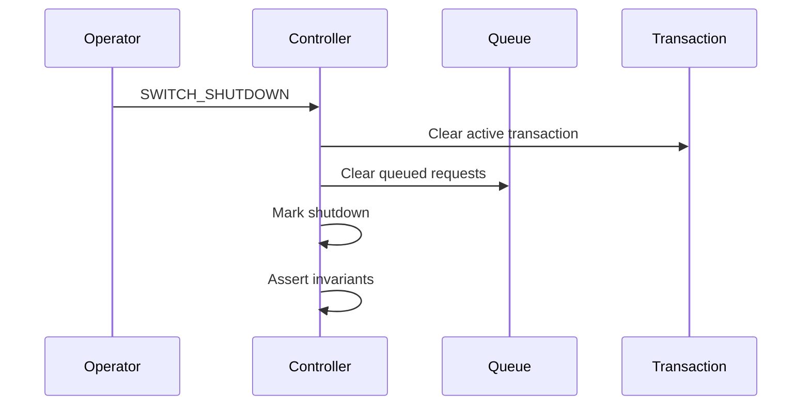

# UBOS v5.5.1 Scene Switching Foundation

## Purpose

UBOS v5.5.1 introduces an authoritative, production-safe Program/Preview scene-switching foundation. It owns scene identity on Program, Preview, and Previous Program buses while preserving the Scene Compositor as the rendering authority.

## Architectural Position

Operator commands enter through the v5.1 command execution engine, mutate controller metadata only, and commit Program changes exclusively in the `SceneSwitchingProcessor` on authoritative `FrameTick` boundaries.

## Program/Preview Model

Program and Preview are independent buses. Preview selection increments only Preview generation and never mutates Program. Program changes occur only through committed switch transactions.

## Scene References

`SceneSwitchReferenceSnapshot` stores stable IDs, scene and instance generations, readiness, health, source dependency summaries, output profile, compositor plan generation, and sanitized metadata. It carries no frame handles, leases, pixels, or GPU/native objects.

## Switch Requests

`SceneSwitchRequestSnapshot` records request IDs, command IDs, mode, source/destination buses, expected bus and scene generations, transition metadata, priority, deadline, cancellation reference, correlation ID, and safe metadata. Duplicate, stale, missing, failed, locked, and unsupported requests are rejected deterministically.

## Transactions

Transactions are monotonic, immutable snapshots. A transaction can commit at most once; cancelled transactions publish no Program update.

## CUT Semantics

CUT validates current Program and selected Preview, schedules at current/next `FrameTick`, atomically moves Preview to Program, records old Program as Previous, applies the explicit Preview-after-CUT policy, increments generations, and publishes one result.

## TAKE Foundation Semantics

TAKE preserves transition metadata for v5.5.2 but does not generate dissolve, wipe, dip, stinger, or DVE frames.

## Preview-after-CUT Policies

Supported policies are `KEEP_SELECTED_SCENE`, `SWAP_WITH_PREVIOUS_PROGRAM`, `CLEAR_PREVIEW`, `FOLLOW_PROGRAM`, `SELECT_NEXT_SCENE`, and `CUSTOM`. The default is `SWAP_WITH_PREVIOUS_PROGRAM`.

## Program Lock

Locked Program rejects unauthorized Program-changing switches. Emergency override is observable and audited through events and lock generation.

## Readiness

Readiness states are `UNKNOWN`, `LOADING`, `READY`, `DEGRADED`, `FAILED`, and `UNAVAILABLE`. Failed/unavailable Preview scenes are blocked; degraded Preview requires explicit policy.

## Queueing

The bounded queue supports FIFO, priority, replace-latest, replace-same-target, reject-new, and custom policy surfaces. It has no background loop.

## FrameTick Authority and Processor Integration

`SceneSwitchingProcessor` is a `TickProcessor`. Switch commits happen only during `processTick`. Duplicate ticks are counted and do not mutate Program.

## Scene Compositor Boundary

The switching controller selects authoritative scene identity only. It does not render, allocate frames, mutate input frames, execute effects, or access GPU/native handles.

## Output Registry

Typed output keys are provided for Program bus, Preview bus, Previous Program, active transaction, switch request/result, queue, readiness, health, telemetry, and failed/rejected results.

## Commands and Events

The command surface includes preview selection, clear, CUT, TAKE, cancel, mode/metadata setters, Program lock operations, policy setters, validate, and shutdown. Events include engine lifecycle, request/validation/scheduling, commit, completion, cancellation, rollback, lock, readiness, health, and shutdown.

## Health, Telemetry, Watchdog

Health snapshots expose engine state, bus scene IDs, generations, active/queued counts, counts by switch type, rejects/failures/cancellations, lock state, readiness, queue pressure, and last success/failure. Telemetry is bounded and includes counters and high-water marks. Watchdog incident identifiers cover duplicate requests/ticks/commits, stale generations, lock violations, Preview readiness, commit/rollback failures, queue pressure, output mismatches, compositor mismatch, leakage, and invariant failures.

## Source Graph

Source Graph integration exposes metadata only: bus scene IDs, generations, switch generation, active transaction ID, switch mode, lock state, readiness states, queue depth, last committed frame, health, and routing eligibility.

## Security and Audit

Operator identities and private metadata are redacted. Snapshots are JSON-safe and immutable. No raw media, frame handles, leases, pixels, GPU objects, native errors, browser URLs, endpoints, credentials, or private scene data are exposed.

## Production Safety and Invariants

The foundation enforces FrameTick-only commits, no Program mutation outside committed transactions, no partial publication, no duplicate commit, stale generation rejection, failed-scene blocking, Program lock enforcement, bounded queues/history, no independent timers, no writable Program/Preview alias, and clean shutdown.

## Failure and Rollback

## Shutdown

## Long-run Validation and Performance

Validation uses fake `FrameTick`s, deterministic scene references, synthetic readiness, bounded registries, no real-time sleeping, and operation-count complexity expectations: O(1) scene/bus/request lookup, bounded O(q) queue operations, O(1) commit and publication, and bounded telemetry/watchdog evaluation.

## Limitations

v5.5.1 does not execute animated transitions, recording, streaming, replay, audio mixing, social output, graphics authoring, arbitrary scripting, or UI redesign.

## v5.5.2 Handoff

The next phase is **UBOS v5.5.2 Production-Safe Transition Execution Engine**, which can consume preserved TAKE/AUTO transition metadata and transaction readiness without changing the FrameTick authority or Program/Preview safety model.
