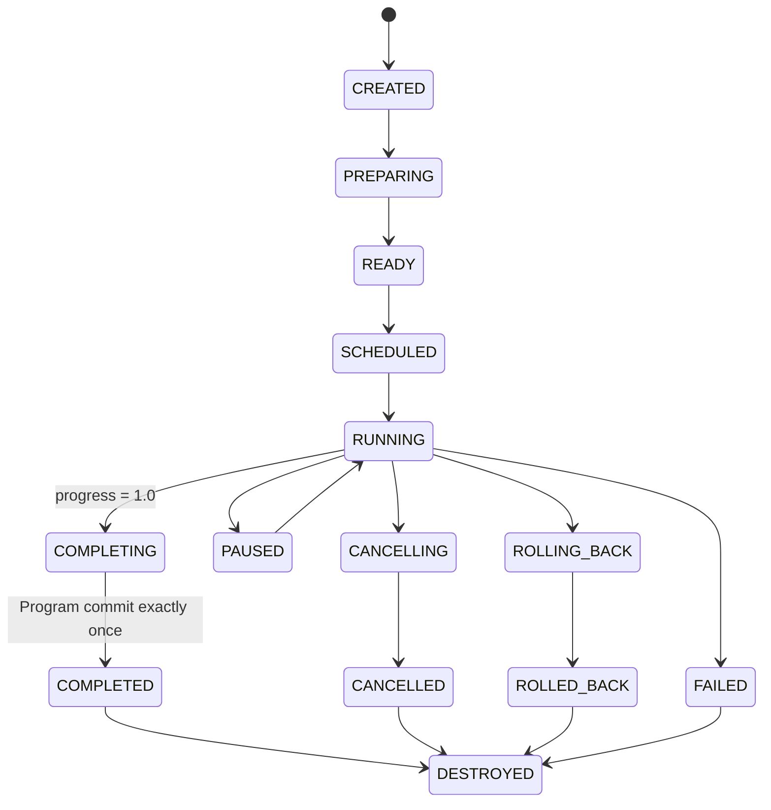
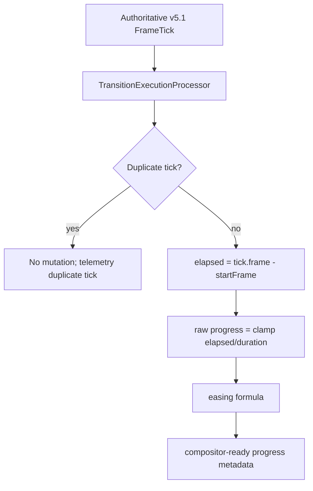
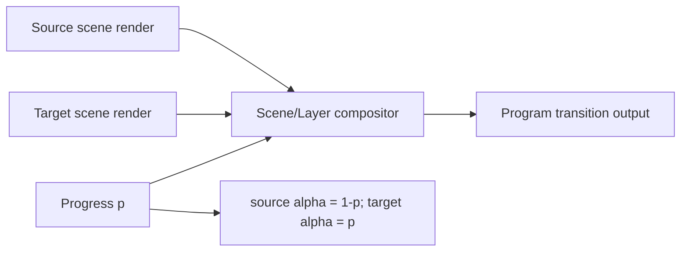
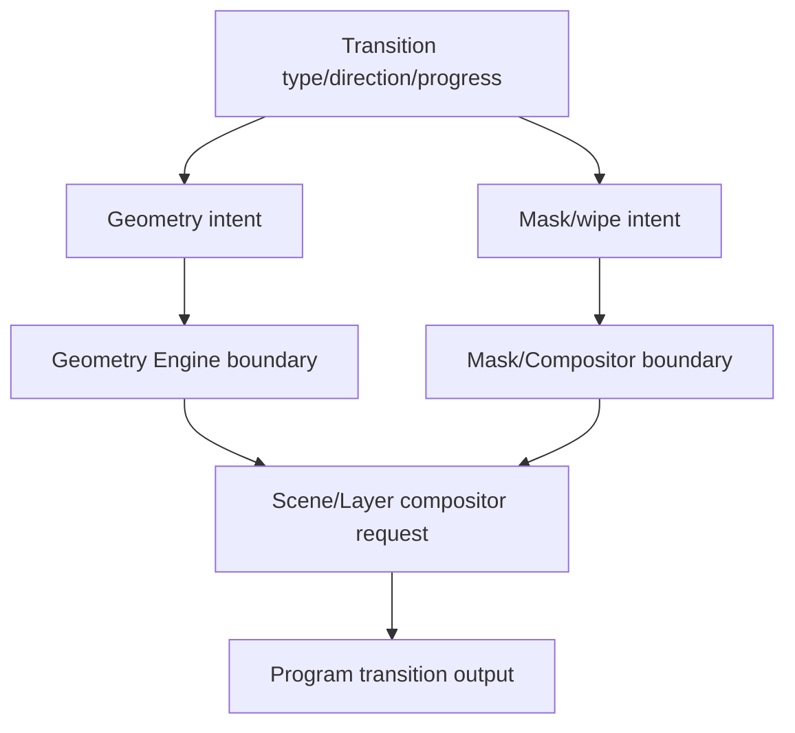
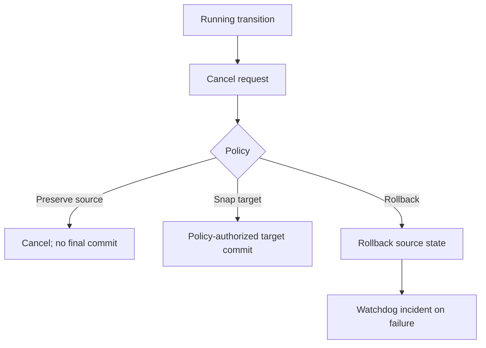
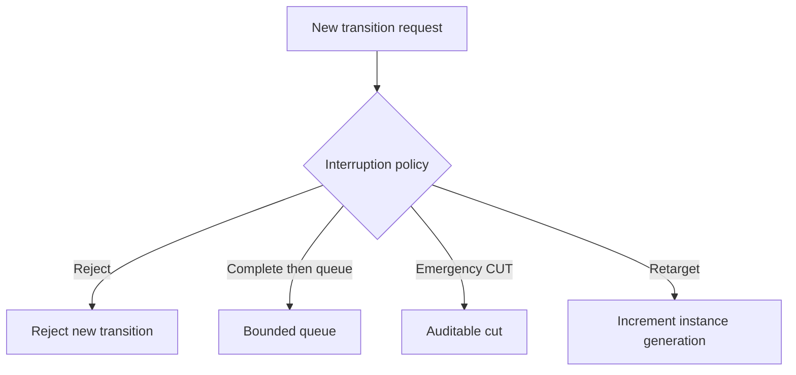
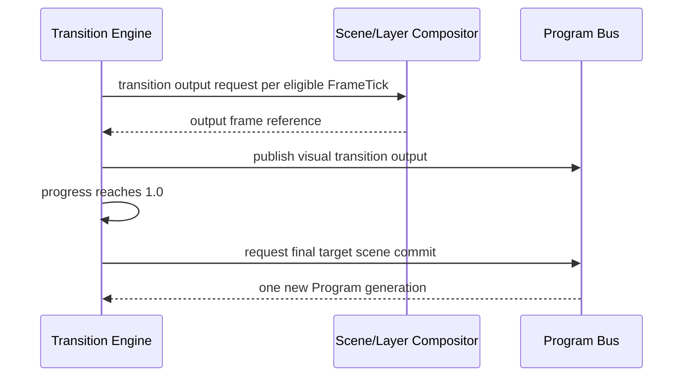
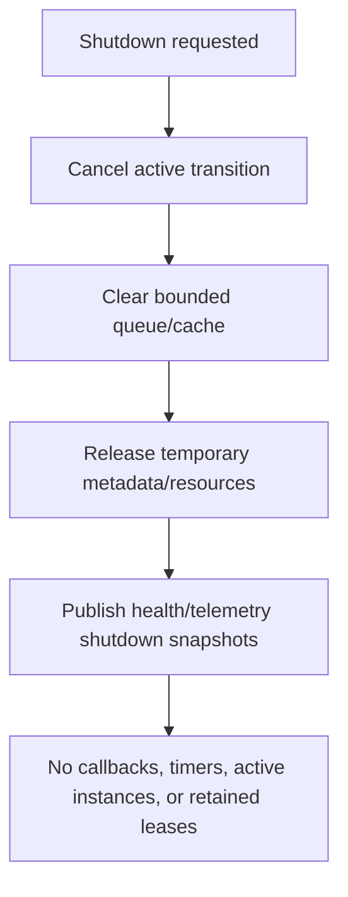

# UBOS v5.5.2 Transition Execution Engine

## Purpose and architectural position

UBOS v5.5.2 turns v5.5.1 scene-switching transition metadata into production-safe, deterministic transition execution. Operator commands still flow through the Scene Switching Controller and validated `SceneSwitchTransaction` metadata; the Transition Execution Engine resolves immutable definitions, creates immutable requests/plans/instances, evaluates progress from the authoritative v5.1 `FrameTick`, and hands compositor-ready metadata to existing Scene and Layer Compositor boundaries.

The engine owns definitions, execution instances, deterministic progress, source/target scene pairing, timing, transition lifecycle, cancellation, interruption, rollback coordination, health, telemetry, events, snapshots, and invariants. It does not own scene definition, source acquisition, effect math, final scene authority outside completion commit, encoding, recording, streaming, replay, arbitrary scripting, audio, or native GPU access.

## Existing abstractions reused

- v5.1 `FrameTick`, `TickProcessor`, `ProcessorOutputRegistry`, and `RuntimeCommandHandler`.
- Scene and Layer Compositor boundaries for transition composition; the engine emits metadata/intents only.
- Geometry and mask boundaries are referenced as intent metadata; no duplicate rasterization or transform engine is created.
- Frame Memory and GPU managers remain outside the engine; plans include lease/resource requirements and GPU generation metadata only.

## Transition lifecycle

## Transition types

Supported public types are `CUT`, `DISSOLVE`, `FADE`, `DIP_TO_COLOR`, directional wipes, slides, pushes, reveal/cover, iris open/close, clock wipe, barn door horizontal/vertical, `LUMA_WIPE`, `STINGER`, `DVE`, and `CUSTOM`. Unsupported values are rejected. Metadata-only boundaries such as stinger/DVE/luma/custom are represented safely and must not claim real pixel/audio execution unless an approved backend advertises support.

## Definitions, instances, requests, plans, and results

Definitions are deeply immutable after registration and include identity, version, generation, type, duration, direction, easing, color/softness/border metadata, policy fields, backend preference, quality tier, sanitized metadata, and creation/update timestamps. Updates require expected generations and monotonic version/generation.

Requests are immutable, exactly-once, and carry transaction and transition generation expectations, source/target scene references, Program/Preview generations, the start `FrameTick`, interruption/failure policy, cancellation reference, correlation id, and sanitized metadata.

Instances capture transaction, definition, source/target scene, Program/Preview generations, explicit state, start/current runtime frame, elapsed frames, raw/eased progress, render references, cancellation/interruption state, and sanitized metadata. Completed instances cannot restart implicitly.

Plans describe operation order, source/target render requirements, compositor requirements, geometry/mask intents, temporary resource estimates, output byte estimate, deterministic score, warnings, and safe metadata.

Results report status, transition type, source/target scenes, start/completion frames, total frames, progress, animation flag, Program commit flag, rollback flag, output reference, warnings, duration, ownership transfer, and completion time.

## FrameTick authority and progress/easing

Progress is derived only from frame numbers. No `Date.now()`, `setInterval`, `requestAnimationFrame`, independent timers, or sleeps are used for transition progression. Raw/eased progress is finite and bounded from 0.0 to 1.0; the final frame reaches exactly 1.0 without an extra final frame.

Supported easing: linear, ease/quad/cubic/sine in/out/in-out, and validated custom cubic Bezier. Invalid control points or unsupported easing are rejected.

## CUT, AUTO, and TAKE

CUT bypasses animated planning, allocates no intermediate transition frame, commits the target at a FrameTick boundary, publishes one final result, and reports `transitionAnimationApplied: false`.

AUTO and TAKE resolve a transition definition, create a plan/instance, preserve Program scene identity as the source until completion, publish one transition visual output per eligible FrameTick, expose progress, and commit the target scene exactly once when progress reaches 1.0. TAKE reports `transitionAnimationApplied: true` when animated frames execute.

## Dissolve composition

Dissolve exposes explicit alpha metadata only. The compositor remains the pixel-processing authority; the engine does not claim hidden gamma-correct blending.

## Fade and dip-to-color

Fade supports source fade-out, target fade-in, fade-through-black, and fade-through-explicit-color metadata with deterministic midpoint behavior. Dip-to-color exposes source-to-color first half and color-to-target second half metadata; midpoint hold is metadata and never duplicates frames implicitly.

## Wipes, geometry, masks, slide/push/reveal/cover

Wipes expose direction, progress boundary, softness, border, border color, and invert metadata. Slide/push/reveal/cover expose geometry intents and off-canvas bounds. Iris, clock wipe, and barn door expose mask shape intents. The engine does not rasterize masks or implement duplicate transform math.

## Stinger and DVE foundations

Stinger metadata includes sanitized asset reference boundary, cut point frame, total duration, alpha capability, audio metadata boundary, pre-roll, and post-roll. No arbitrary file path, hidden asset loading, or audio execution is performed.

DVE metadata includes source/target transform paths, scale, rotation, perspective boundary, border, and shadow metadata. Unsupported perspective/native shader work is rejected or remains plan metadata.

## Cancellation, interruption, retargeting, and rollback

Policies are explicit. Old generations cannot overwrite new instances. Cancellation after final commit is rejected. Rollback is exactly once and must preserve a valid Program state or emit a watchdog incident.

## Source/target rendering and compositor boundaries

Source Program scene remains stable and authoritative until final commit. Target Preview scene remains stable unless an explicit retarget policy is used. Source and target renders must use independent writable outputs; output identity must be distinct from both inputs. The Transition Engine emits compositor-ready requests and never mutates inputs, raw frames, leases, pixels, or native handles.

## Frame Memory/GPU boundaries

The engine does not directly allocate native GPU resources or mutate frame-memory refcounts. It validates source/target render references as metadata, includes GPU generation in plan keys, and fails deterministically on device-loss/compositor failure without publishing lost outputs.

## Processor integration and order

`TransitionExecutionProcessor` is a v5.1 `TickProcessor`. Recommended processor order remains Motion Effects, Effect Chain, Scene readiness, Scene Switching foundation, Transition Execution, Scene Compositor, then Program output publication. No second loop or scheduler is introduced.

## Program and Preview semantics

During animation, Program scene identity remains source; visual output may be transitional. Target becomes authoritative only after the final commit. Preview mutations do not alter active transitions unless retarget policy allows it.

## Commands, output registry, events, health, telemetry, watchdog

Typed commands cover registration, update, defaults, start/auto/take, pause/resume, cancel, interrupt, retarget, duration/direction/easing/color metadata, validation, cache clearing, and shutdown. Output registry keys publish definitions, active instance, request, plan, result, progress, render summaries, Program transition output, completion/cancel/failure, health, and telemetry.

Events cover lifecycle from engine creation through registration/request/validation/schedule/start/progress/pause/resume/retarget/interrupt/cancel/rollback/complete/fail/publication/commit/health/shutdown. Per-frame progress is sampled or aggregated.

Health and telemetry snapshots are bounded. Watchdog incidents cover stalls, timeouts, duplicate requests/ticks/completions, stale generations, stale/unready scenes, invalid progress, compositor/program/rollback failures, GPU loss, memory/queue pressure, Program/Preview leaks, and invariant failures.

## Source Graph and security

Source Graph metadata exposes only transition id/type, source/target scene ids, progress, duration, direction, status, current frame, commit/rollback state, health, and routing eligibility. It does not expose pixels, frame handles, leases, GPU objects, private scene metadata, credentials, network endpoints, browser URLs, file paths, or raw stinger asset paths.

## Production-safety guarantees and invariants

The engine enforces FrameTick-only progression, no duplicate progress evaluation per tick, no Program commit before completion, no duplicate final completion or Program commit, generation checks, target readiness, no partial publication, no output aliasing, no input mutation, no hidden geometry/mask implementation, no direct GPU/refcount mutation, no output after cancellation/failure/timeout, no leaked transition-owned resources, no fake stinger/DVE execution claim, and clean shutdown.

## Long-run validation and performance

Validation uses fake FrameTicks, deterministic synthetic render/compositor adapters, fake monotonic diagnostics time, and ownership counters. Performance validation relies on relative operation counts, not unstable wall-clock thresholds: O(1) definition/instance/request lookup, O(1) plan cache lookup, O(1) progress/easing, O(1) orchestration plus compositor cost, bounded queue processing, bounded snapshot generation, and bounded watchdog evaluation.

## Limitations and v5.5.3 handoff

Audio crossfades, audio-follow-video, recording, streaming, replay, social output, graphics authoring, arbitrary scripting, UI redesign, and native shader work are intentionally excluded. UBOS v5.5.3 should add Audio-Follow-Video and Transition Audio Foundation using the same FrameTick and command/telemetry boundaries.
