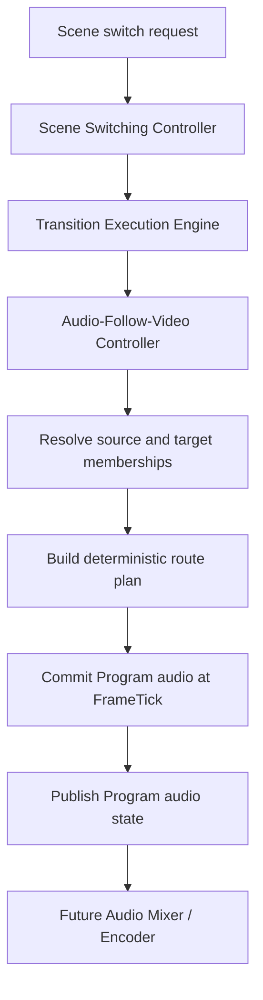
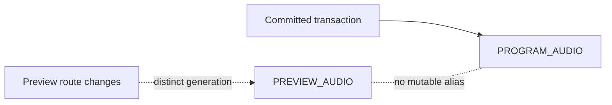
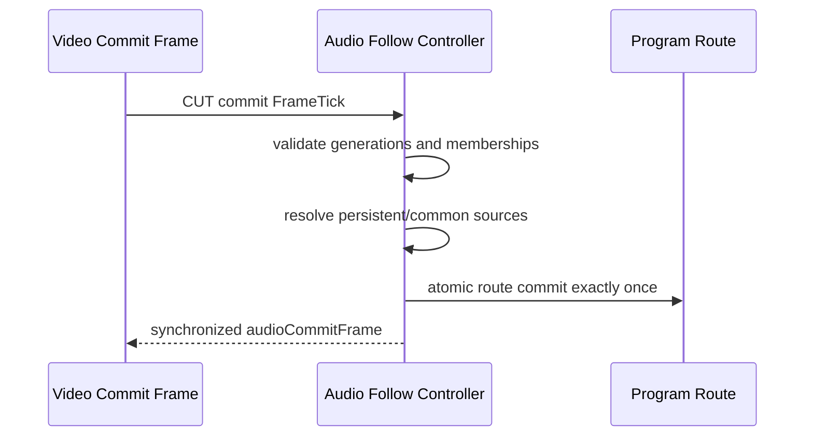
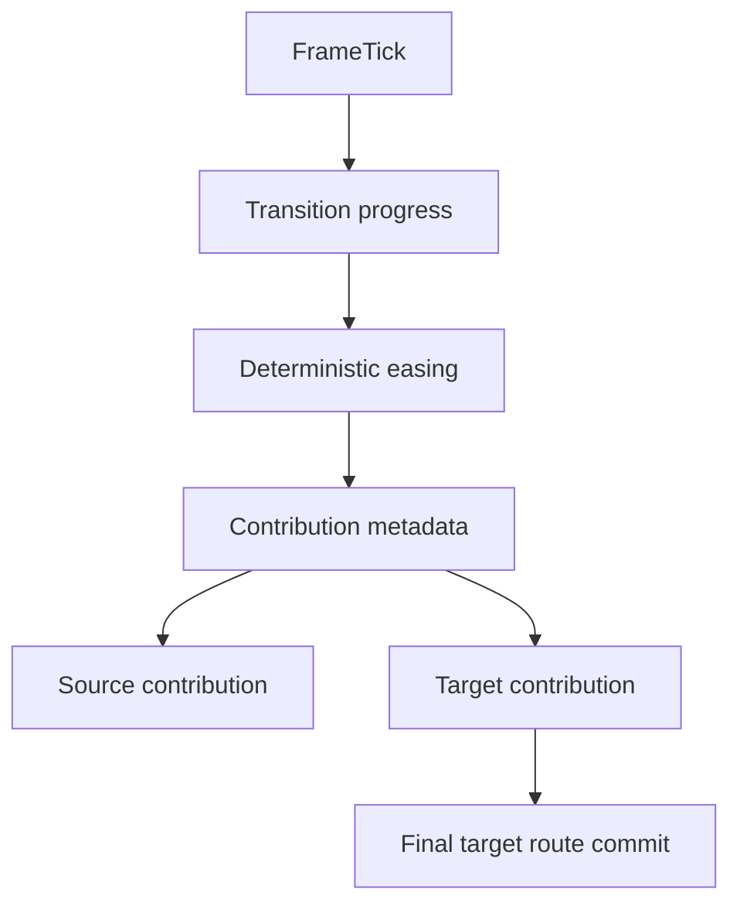
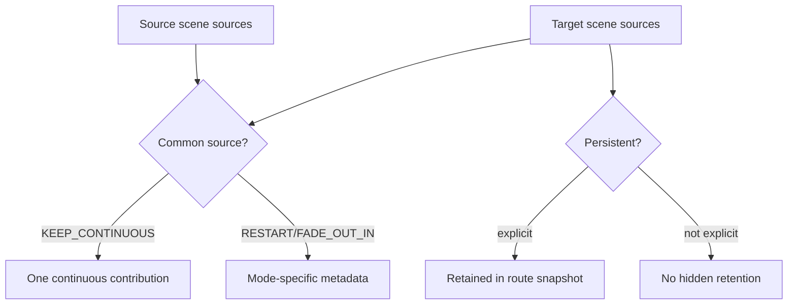
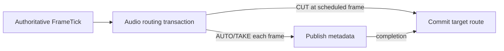
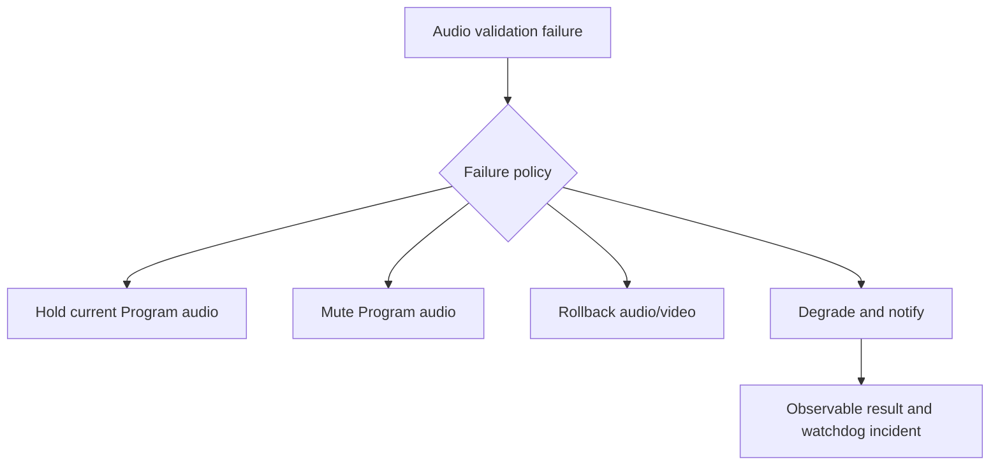
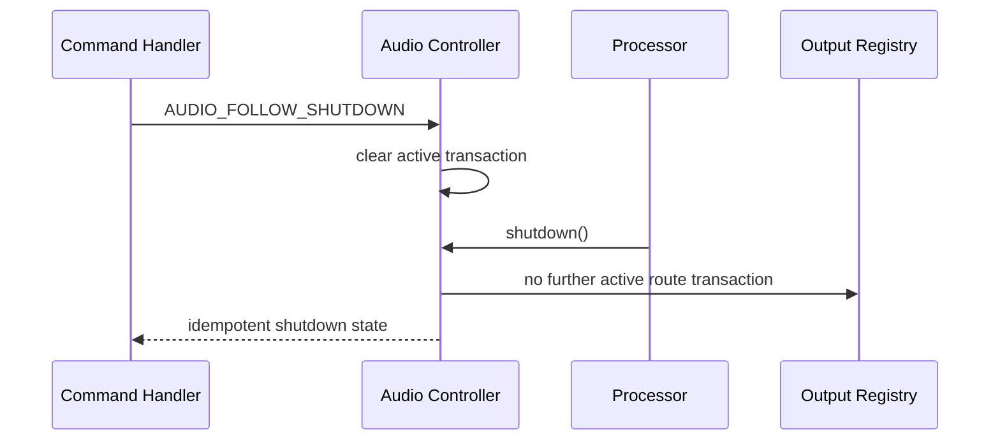
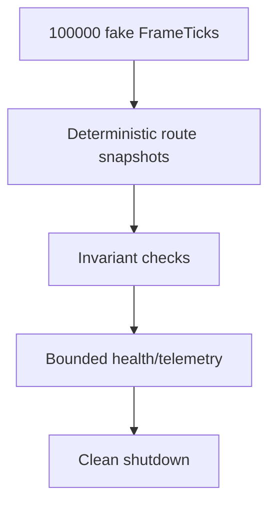

# UBOS v5.5.3 — Audio-Follow-Video and Transition Audio Foundation

## Purpose and architectural position

UBOS v5.5.3 connects authoritative scene switching and transition execution to metadata-only Program audio routing. The subsystem resolves scene audio memberships, builds deterministic Program/Preview route snapshots, publishes transition contribution metadata, and preserves future mixer handoff metadata without claiming PCM mixing, gain-ramp DSP, encoding, recording, streaming, or native device capture.

It sits after v5.5.1 Scene Switching and v5.5.2 Transition Execution and before scene compositing/output publication:

## Relationship to v5.5.1 and v5.5.2

Scene Switching remains video-bus authority. Transition Execution remains transition-progress authority. Audio-Follow-Video consumes committed/scheduled scene and transition metadata and owns only audio route state, contribution metadata, health, telemetry, watchdog classification, and source graph metadata.

## Audio bus model and follow modes

The public API defines `PROGRAM_AUDIO`, `PREVIEW_AUDIO`, `AUX_AUDIO`, `CLEAN_FEED_AUDIO`, `MONITOR_AUDIO`, and `CUSTOM`. v5.5.3 treats Program audio as authoritative and Preview as isolated metadata. Follow modes are explicit: `FOLLOW_PROGRAM_SCENE`, `FOLLOW_SELECTED_SOURCE`, `FOLLOW_PRIMARY_AUDIO_SOURCE`, `FOLLOW_SCENE_DEFAULT`, `MANUAL`, `HOLD_CURRENT`, `MUTE`, and `CUSTOM`.

## Scene audio membership and source references

A scene membership is immutable, JSON-safe, and contains scene generations, source references, default/optional/persistent/muted/solo source IDs, source priorities, role mappings, routing policy, transition policy, and sanitized metadata. Source references expose IDs, generations, role, availability, activity, mute/persistence flags, sample-rate/channel/clock metadata, health, and last-buffer timestamp metadata only. They never expose PCM buffers, native handles, credentials, private paths, device endpoints, or mutable leases.

## Program route, switch modes, and transition definitions

Program routes are immutable transaction outputs with route ID/generation, Program scene ID/generation, active/muted/persistent references, contribution metadata, transition state, transition ID, runtime frame, health, and safe metadata. Switch modes include `CUT`, `CROSSFADE`, `FADE_OUT_IN`, `FADE_TO_SILENCE`, `HOLD_CURRENT`, `CONTINUE_COMMON_SOURCES`, `MUTE_THEN_SWITCH`, and `CUSTOM`. Crossfade/fade modes are metadata-only until a validated mixer backend exists; `realAudioMixApplied` is therefore false.

Transition definitions are immutable registrations with ID, version, generation, mode, bounded positive duration, easing, source/target fade policy, common-source policy, persistent-source policy, mute/silence policy, per-role overrides, and safe metadata. Registration does not execute routing.

## Common and persistent source policies

Common-source policy is explicit and defaults to preventing duplicate source gain stacking. Persistent policy is explicit and bounded, supporting host microphones and music beds persisting across scene changes while guest/browser/media sources may follow target scene or stop on exit.

## FrameTick authority, requests, transactions, and results

FrameTick is the only audio transition clock. There is no setInterval, Date.now progression, independent scheduler, or secondary runtime loop. Requests contain expected scene/source/route generations, memberships, current route, mode, transition reference, start tick, deadline metadata, cancellation metadata, failure policy, correlation ID, and safe metadata. Transactions move through explicit states and commit or rollback exactly once. Results include previous/new routes, generation, commit frames, synchronization state, contribution summaries, persistent/muted summaries, warnings, duration, and completion time.

## Missing-source and audio/video failure coordination

Missing required sources are observable and follow explicit policy: fail route, mute missing source, skip optional source, hold current audio, use explicit fallback, use silence metadata, degrade, or request operator intervention. Audio/video failure coordination is explicit: preserve both, switch video while holding/muting audio, fail entire switch, rollback both, degrade and notify, or custom.

## Integration points

`AudioFollowVideoProcessor` implements the v5.1 `TickProcessor` contract and is ordered after scene switching and transition execution and before compositor/output publication. It publishes Program route, Preview route, active transaction, result, health, telemetry, and contribution snapshots to the existing `ProcessorOutputRegistry`. Commands are exposed as v5.1 command handlers with exactly-once/idempotent metadata and generation-aware payload expectations.

## Commands, output registry, events, health, telemetry, and watchdog

The API exports typed command constants for mode changes, membership registration/update/removal, Program/Preview route metadata, CUT/TAKE/AUTO, cancel/rollback, mute/unmute, persistent sources, transition/failure policy, validation, and shutdown. Output keys are distinct for Program/Preview routes and failed/rejected results. Events are bounded and typed. Health and telemetry counters are bounded and include route counts, duplicate requests/ticks, stale generations, missing/unavailable sources, persistent/common counts, synchronization mismatches, active source IDs, current transaction ID, and last event. Watchdog incident constants classify stalls, timeouts, duplicate requests/commits/ticks, stale generations, missing/unavailable sources, invalid contributions, sync mismatches, commit/rollback failures, output mismatch, Program/Preview leakage, and invariant failures.

## Source Graph metadata and security

Source Graph integration exposes metadata only: Program/Preview route IDs, active/muted/persistent source IDs, roles, route generations, follow mode, active transaction ID, transition mode/progress, sync state, health, and routing eligibility. Sanitization redacts device paths, endpoint names, native handles, browser URLs, network endpoints, credentials, private metadata, and operator identifiers. Snapshots are deeply immutable, bounded, deterministic, JSON-safe, and free of PCM/sample content.

## Production-safety invariants

The implementation asserts unique IDs/generations, valid active references, Program/Preview isolation, one route commit per transaction, duplicate tick idempotence, finite bounded contributions, no duplicate common-source contribution, exact final target route metadata, explicit degraded sync mismatch, no Program route change after cancellation/failure, valid rollback, state/telemetry agreement, bounded retained state, and clean shutdown.

## Long-run validation and performance

Validation uses fake FrameTicks, deterministic memberships, synthetic source references, fake transition progress, monotonic diagnostic timestamps, and bounded registries. It exercises 100,000 processor ticks with no real-time sleeping. Expected complexity is O(1) for membership/source/route lookup, O(s log s) or bounded O(s) for common/persistent resolution, O(s) contribution evaluation and route commit, O(memberships + bounded state) snapshot generation, and O(active + bounded incidents) watchdog evaluation.

## Limitations and v5.5.4 handoff

This release is a metadata-routing foundation. It does not implement real PCM mixing, gain ramps, EQ, compression, limiting, loudness normalization, ducking, audio effects, recording, streaming, replay, native audio backends, or audio encoding. v5.5.4 should build Program/Preview Bus Orchestration and Output Role Coordination on top of these stable route, contribution, and synchronization contracts.
