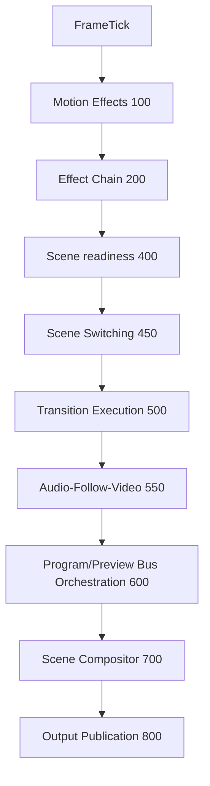
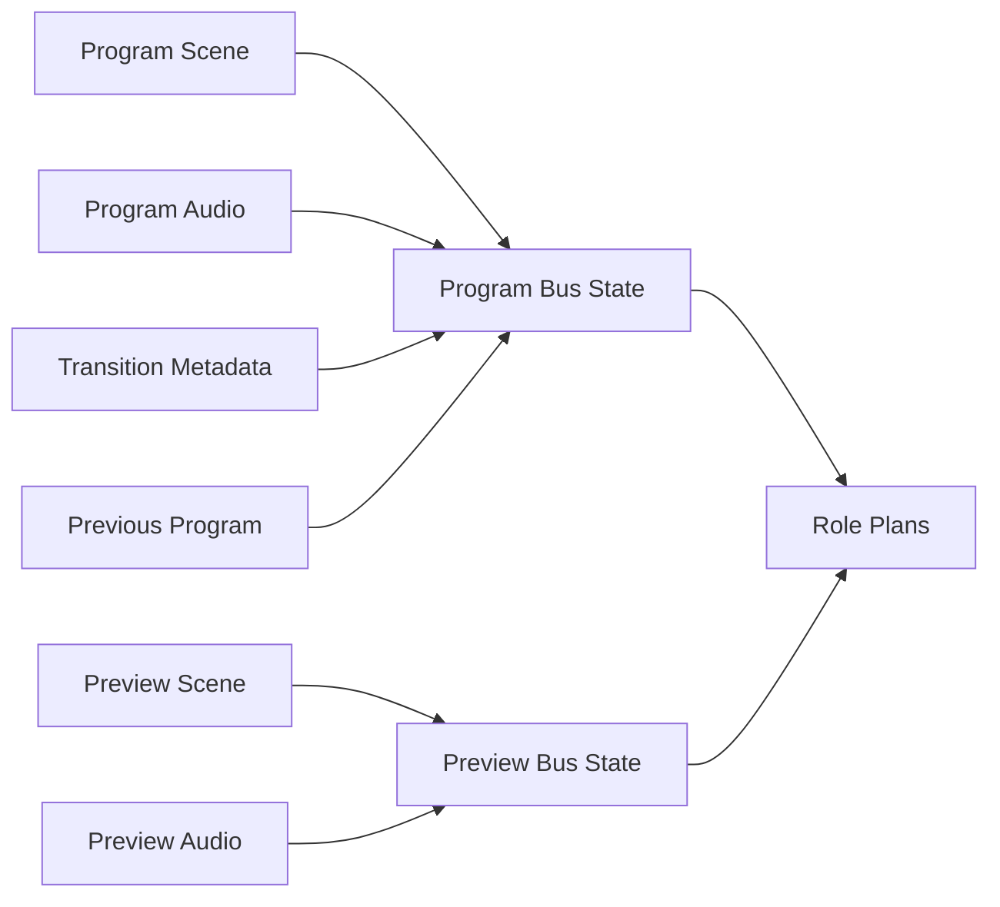
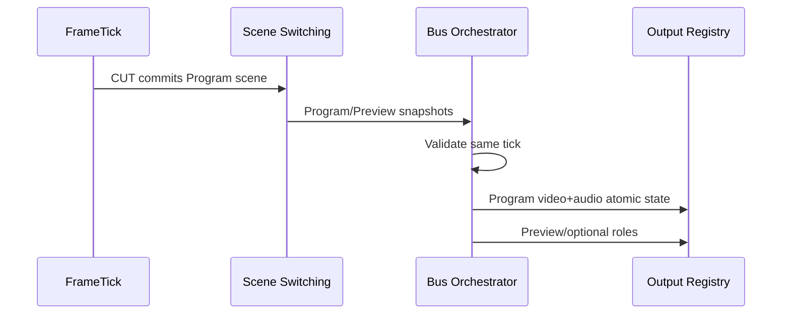
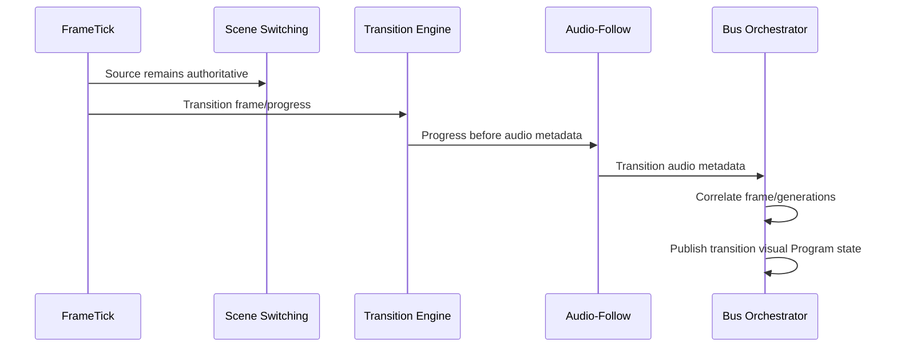
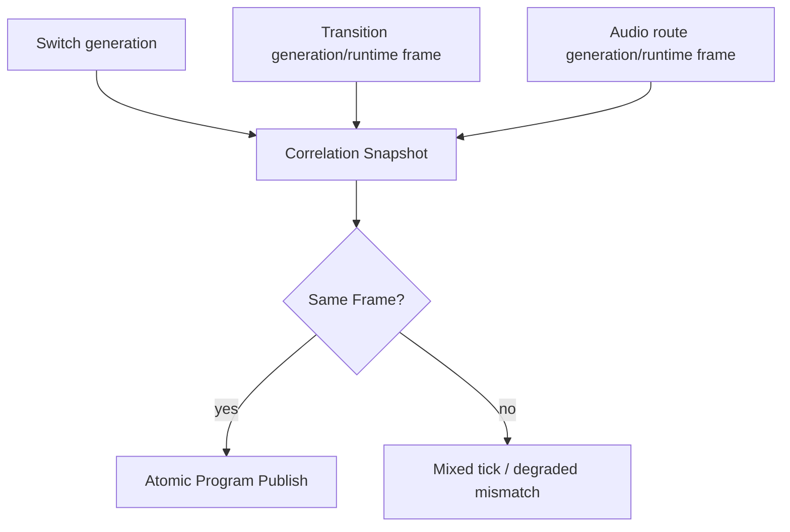
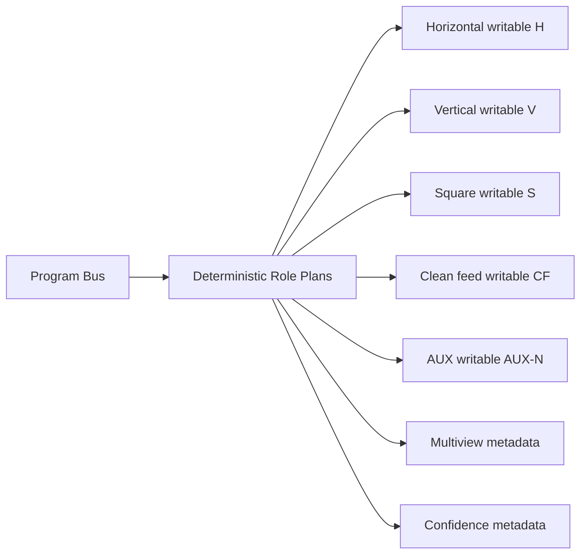
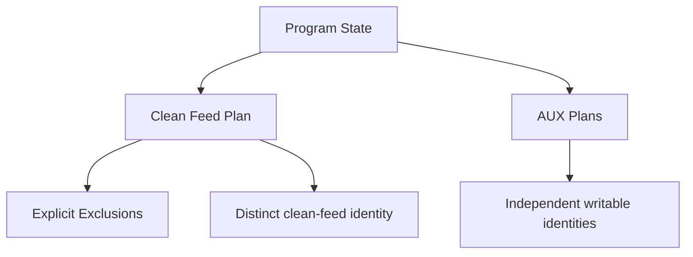
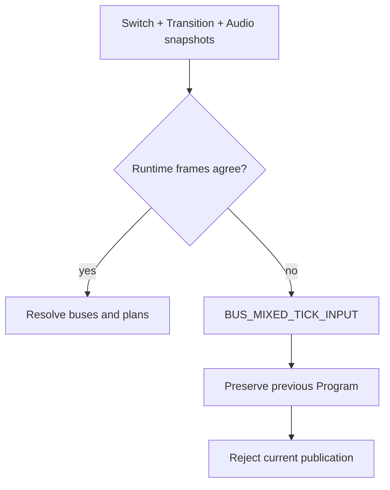
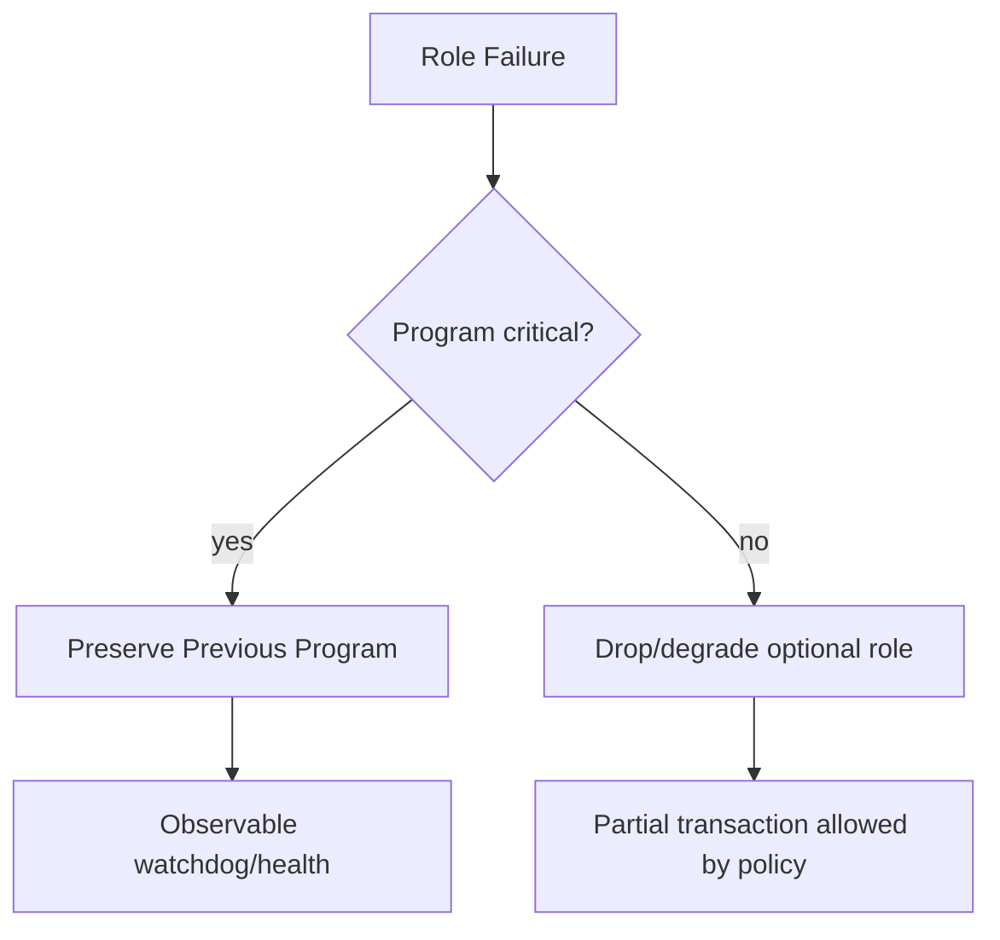
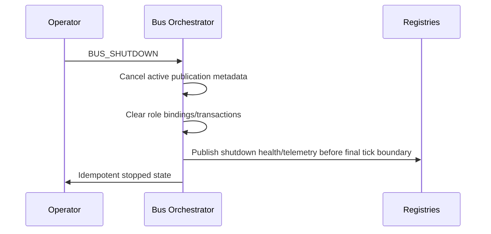

# UBOS v5.5.4 Program/Preview Bus Orchestration

UBOS v5.5.4 adds a metadata-only, production-safe Program/Preview Bus Orchestrator. It coordinates Scene Switching, Transition Execution, Audio-Follow-Video, Scene Compositor requests, and output-role publication state without duplicating switching, transition, audio, compositor, frame-memory, GPU, encoding, recording, streaming, or transport responsibilities.

## Corrected processor order

Transition Execution now runs at order `500`; Audio-Follow-Video runs at `550`; Program/Preview Bus Orchestration runs at `600`. This removes the ambiguous same-order dependency and guarantees transition progress is available before audio-follow and bus orchestration consume it.

## Architectural position and prior phases

The orchestrator follows v5.1 FrameTick and TickProcessor contracts, v5.5.1 Program/Preview scene identity, v5.5.2 transition execution metadata, and v5.5.3 audio-follow metadata. It owns coordinated bus state, output-role definitions and bindings, per-role generations, output publication transactions, Program/Preview isolation, role readiness, failure coordination, health, telemetry, watchdog incidents, immutable snapshots, and invariants.

## Bus categories, definitions, roles, and profiles

Supported bus categories include Program video/audio, Preview video/audio, Previous Program, horizontal/vertical/square Program, clean feed, AUX, multiview, confidence monitor, record-feed, stream-feed, and custom metadata buses. Each `BroadcastBusDefinitionSnapshot` has a stable ID, generation, role, display name, output profile, scene/audio binding policies, publication/readiness/failure/retention policies, priority, criticality, routing eligibility, and redacted safe metadata.

Output roles are explicit: Program, Preview, Previous Program, horizontal, vertical, square, clean feed, AUX, multiview, confidence monitor, record, stream, and custom. Record and stream remain metadata-only; no transport or encoding is performed. Output profiles include dimensions, rational frame rate, pixel/color/alpha/audio metadata, safe area, orientation, memory domain, latency class, quality tier, routing eligibility, and safe metadata.

## Bus states and role bindings

`BroadcastBusStateSnapshot` captures the authoritative per-tick scene, scene generation, video summary, audio route summary, transition summary, output profile, readiness, health, publication state, and last successful publication. `OutputRoleBindingSnapshot` binds a role to a bus by ID, not display name. Bindings carry scene-selection policy, audio policy, clean-feed exclusions, priority, required/enabled state, generation, and safe metadata.

## Scene and audio policies

Scene policies include Follow Program, Follow Preview, Follow Previous Program, Fixed Scene, Program/Preview with variant, AUX selection, and Custom. Audio policies include Follow Program Audio, Follow Preview Audio, Follow Video Scene Audio Membership, Clean Feed Audio, Fixed Audio Route, No Audio, and Custom. `NO_AUDIO` is represented by explicit silence metadata; PCM is not mixed or copied.

## Program/Preview orchestration and transitions

Program state combines the committed Program scene, active transition visual metadata where applicable, committed Program audio route, profile, bus generation, switch/transition/audio generations, and publication generation. Preview state is independently versioned and cannot mutate Program.

During animated transitions, Program scene authority remains with the source until the switching layer commits the final target. The bus orchestrator can publish transition-frame metadata, but final scene authority remains the switching subsystem.

## Audio/video correlation

## Horizontal, vertical, square, clean-feed, AUX, multiview, and confidence monitor

Horizontal, vertical, and square roles are explicit role plans with distinct output profiles and writable identities. Clean feed is an explicit role with validated exclusion metadata such as graphics, lower thirds, bugs/logos, captions, overlays, guest return graphics, selected audio sources, transition overlays, and custom typed exclusions. AUX outputs are bounded, indexed, independently bound, and failure-isolated from Program. Multiview and confidence monitor are metadata-only foundations that delegate rendering/layout to later compositor phases.

## Publication requests, transactions, atomicity, plans, and results

Each authoritative FrameTick creates at most one `OutputPublicationTransactionSnapshot`. It contains source switching, transition, and audio-follow snapshots; requested roles; deterministic role plans; role readiness/results; atomicity policies; warnings; timestamps; and safe metadata. The default effective policy is Program video/audio atomicity plus best-effort optional outputs. Role plans are deterministic by priority and role-instance ID; Program is never starved by optional roles. Results report status, profile, scene/audio generations, transition state, output summary, pass-through, degradation, warnings, and byte estimates.

## Upstream snapshot agreement and readiness

The orchestrator rejects mixed-tick input by default. Same-tick agreement is required for switching, transition, audio-follow, and readiness metadata. Readiness considers scene, transition, audio route, profile compatibility, compositor readiness, PiP/effect dependencies, resource availability, and binding validity.

## Frame Memory/GPU boundaries and Scene Compositor integration

The orchestrator never allocates GPU resources, mutates Frame Memory reference counts, blends layers, executes effects, or mutates frames. It emits role-specific metadata and publication requests for existing compositor/rendering boundaries. Pass-through is explicit and only allowed when profile, transform, effect, transition, and output contracts are compatible. Fan-out may share immutable readable metadata, never writable storage.

## Failure, overload, health, telemetry, watchdog, Source Graph, and security

Failure policies include preserving last Program, failing Program publication, dropping current Program frame, warning degradation, disabling optional roles, dropping Preview/multiview/AUX first, retry-next-tick metadata, and operator intervention. Telemetry and health use bounded counters only. Watchdog incident codes include duplicate ticks, stale generations, mixed ticks, writable alias, Program/audio mismatch, compositor failure, optional failure, partial Program publication, memory pressure, registry/source-graph mismatch, and invariant failure. Source Graph integration exposes bus IDs, roles, scene/audio IDs, generations, profiles, readiness, transition state, health, routing eligibility, and degraded/held state only. Secrets, raw pixels, PCM, native handles, mutable leases, device paths, and stream destinations are redacted or excluded.

## Commands, events, public exports, invariants, and validation

Typed command constants cover bus registration/update/removal, enable/disable, role binding, profile/policy changes, AUX/clean-feed/multiview/confidence configuration, publication/cancellation, validation, cache clear, and shutdown. Event constants cover lifecycle, registration, binding, publication, mixed tick, correlation, readiness, health, preservation, and shutdown. Public API exports are explicit from `packages/media-plane/src/index.ts`.

Invariants verify unique IDs, monotonic generations, distinct Program/Preview state, same-frame audio/video or explicit degradation, one transaction per frame, one role publication per tick, Program exactly once on commit, no Program mutation from optional failure, writable identity isolation, bounded retained state, and shutdown cleanup.

## Long-run, determinism replay, and performance

The focused validation runs deterministic publication loops, multi-role planning, duplicate/mixed-tick rejection, snapshot immutability, shutdown, invariant checks, processor order checks, and replay equality. Complexity targets are O(1) bus/profile lookup, O(1) upstream agreement, bounded O(r log r) deterministic role planning, O(r) readiness/publication orchestration, O(1) output publication per role, O(buses + roles + bounded state) snapshots, and O(active roles + bounded incidents) watchdog evaluation. No real-time sleeping is used.

## Shutdown and v5.5.5 handoff

Limitations: v5.5.4 does not implement encoding, muxing, recording, streaming, replay, PCM mixing, audio DSP, native outputs, NDI/SDI/RTMP/SRT/WebRTC/HLS transport, native multiview display, text rendering, or UI redesign. Recommended next task: **UBOS v5.5.5 — Production-Safe Live Production Control and Tally Coordination**.
