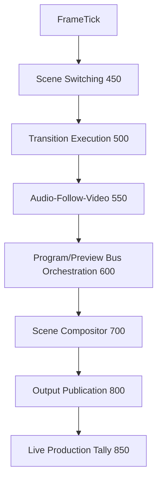
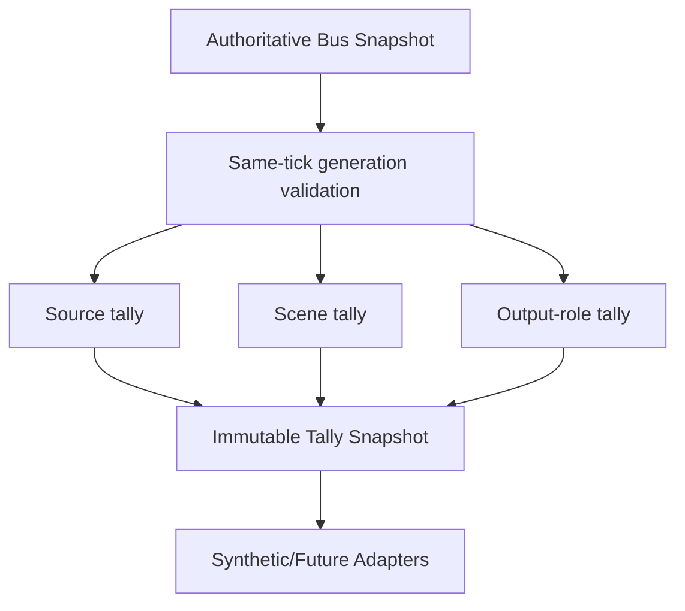
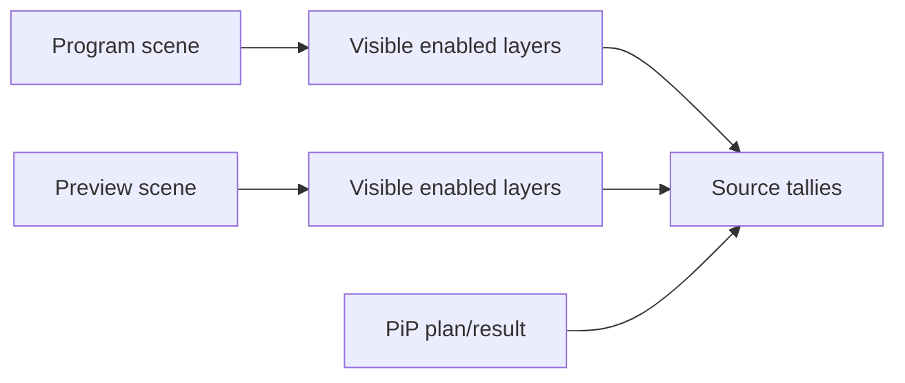
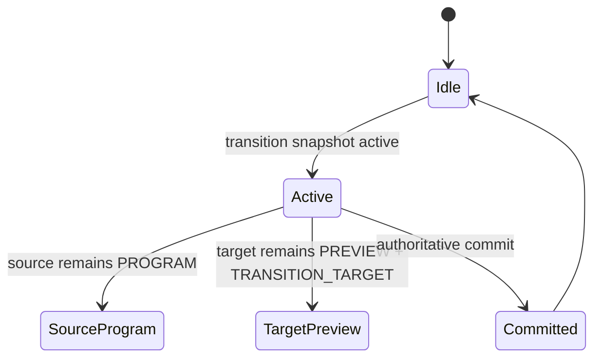
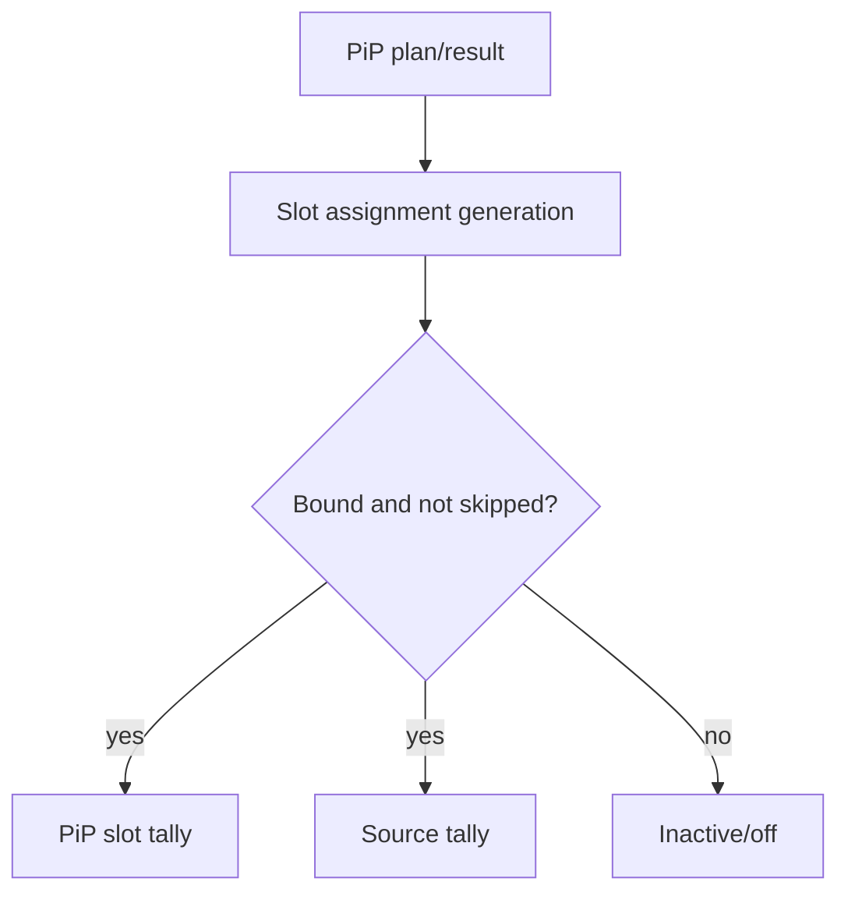
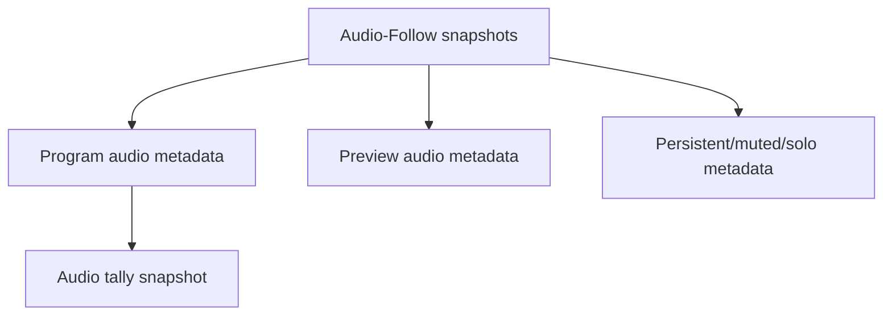
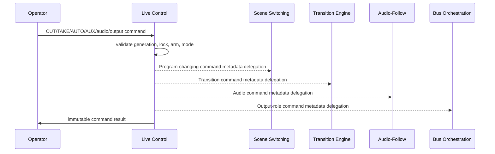
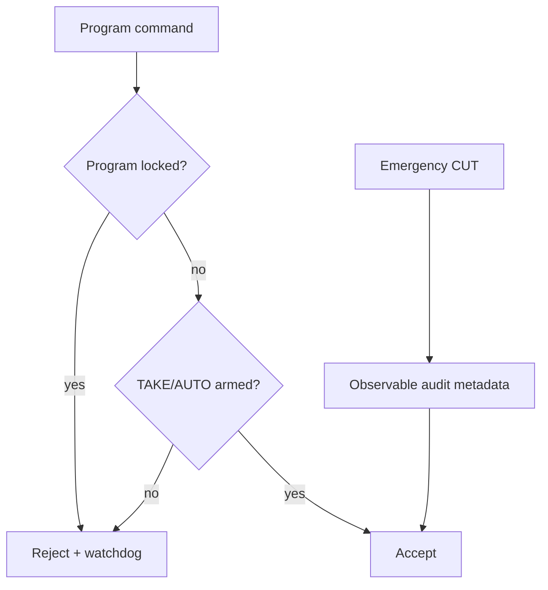
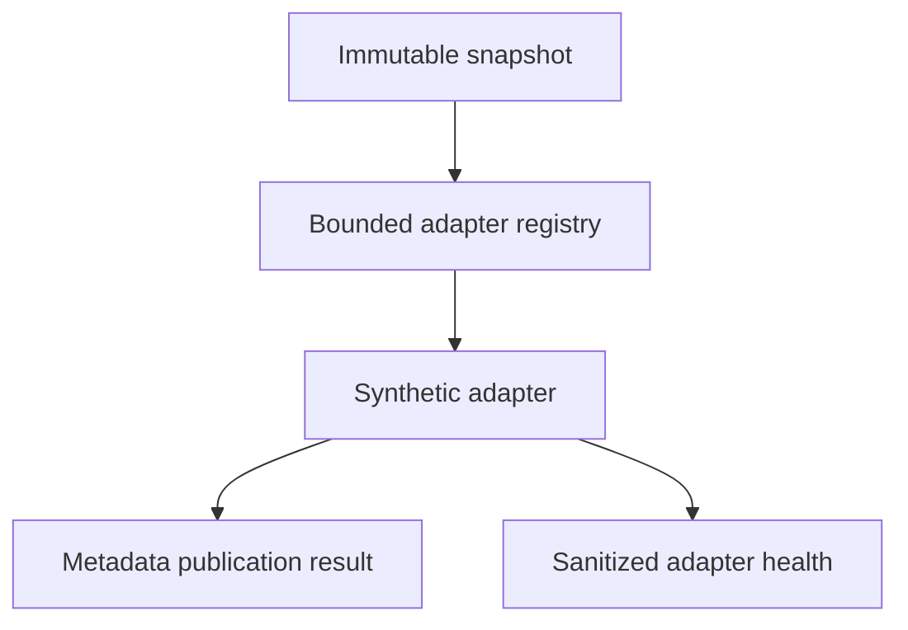
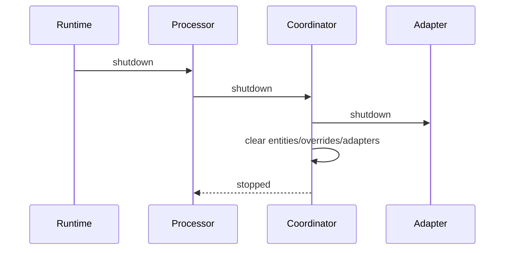

# UBOS v5.5.5 Live Production Control and Tally Coordination

## Purpose

UBOS v5.5.5 adds a metadata-only live production control and tally coordination layer. It derives authoritative Program, Preview, combined, transition, auxiliary, clean-feed, record, stream, multiview, confidence, unavailable, failed, locked, disabled, off, and custom tally states from current FrameTick snapshots.

## Architectural position and v5.5.1-v5.5.4 relationship

The coordinator runs after Scene Switching, Transition Execution, Audio-Follow-Video, and Program/Preview Bus Orchestration. It does not switch scenes, render pixels, route PCM, publish transports, or touch hardware.

## Program/Preview-to-tally flow

## Tally states, priority, and entity types

Supported tally states are explicit and bounded: OFF, PREVIEW, PROGRAM, PROGRAM_AND_PREVIEW, TRANSITION_SOURCE, TRANSITION_TARGET, AUXILIARY, CLEAN_FEED, MULTIVIEW, RECORD, STREAM, CONFIDENCE, DISABLED, UNAVAILABLE, FAILED, LOCKED, and CUSTOM. Effective priority is deterministic with FAILED highest, then UNAVAILABLE, LOCKED, PROGRAM_AND_PREVIEW, PROGRAM, transition roles, PREVIEW, metadata output roles, and OFF. Entity types are SOURCE, SCENE, SCENE_INSTANCE, CAMERA, REMOTE_GUEST, AUDIO_SOURCE, PIP_SLOT, LAYER, BUS, OUTPUT_ROLE, TRANSITION, CONTROL_SURFACE, and CUSTOM.

## Scene-to-source tally derivation

Scene tally is derived from Program and Preview bus scene IDs, transition source/target metadata, AUX/clean-feed bindings, and output metadata roles. Source, camera, remote guest, audio source, and PiP-slot tallies are metadata projections of source graph and registered entity references.

## Transition-aware tally lifecycle

Default policy keeps source Program until commit and target Preview until authoritative commit, while exposing transition roles.

## PiP-slot tally flow

## Audio tally flow

Audio tally is metadata-only and may differ from video tally; discrepancies remain observable.

## Operator command delegation and safety

## Control lifecycle, overrides, and snapshots

LiveProductionControlState records controller generation, Program/Preview scene metadata, transition metadata, lock/armed/mode state, shift/modifier metadata, emergency state, pending/last command, runtime frame, health, and sanitized metadata. Overrides are bounded, monotonic, auditable, never mutate Program buses, and include MANUAL_OVERRIDE reason codes.

## Tally coordinator, processor, adapter, and output registry

LiveProductionTallyCoordinator owns deterministic tally derivation, override application, exact-once snapshot publication, command metadata, health, telemetry, events, watchdog incidents, and invariants. LiveProductionTallyProcessor is a TickProcessor ordered at 850 and publishes typed output keys. TallyPublicationAdapter is the future metadata-only adapter contract. SyntheticTallyPublicationAdapter validates one snapshot per tick and uses no network, device, timer, or hardware access.

## Commands, events, health, telemetry, watchdog

The API exposes bounded command constants for live control and tally actions; event constants for command, mode, tally, adapter, health, and shutdown events; health snapshots with control/tally/adapter counters; telemetry with bounded counters; and watchdog incident constants for duplicate commands/ticks, mixed ticks, stale generations, lock/arm violations, adapter failures, and invariant failures.

## Source Graph, security, and audit

Only stable IDs, entity types, tally reasons, roles, availability/readiness, generation, frame, health, and routing eligibility metadata are exposed. Raw pixels, PCM, device paths, network endpoints, credentials, confirmation token values, native handles, mutable leases, and private operator metadata are redacted or excluded.

## Production safety and invariants

FrameTick is the only publication clock; there is no independent loop. Tally state cannot mutate Program/Preview buses, and commands cannot bypass owning subsystems. Invariants cover uniqueness, one assignment per entity per tick, one snapshot per tick, deterministic priority, explicit manual override reasons, bounded registries, adapter isolation, and clean shutdown.

## Long-run validation, determinism replay, and performance

Validation uses fake FrameTicks and deterministic upstream snapshots. Replay compares canonical snapshots. Performance expectations are O(1) entity lookup, O(active dependencies) source traversal, O(active slots/routes/roles) specialty tallies, bounded priority resolution, and O(active entities + bounded state) snapshot generation.

## Limitations and v5.5.6 handoff

This phase does not implement physical tally lamps, CCU/PTZ, MIDI, Stream Deck, GPIO, OSC, VISCA, recording, streaming, replay, graphics authoring, native drivers, or UI redesign. Recommended next task: UBOS v5.5.6 Scene Recall, Presets, and Operator Macro Foundation.
