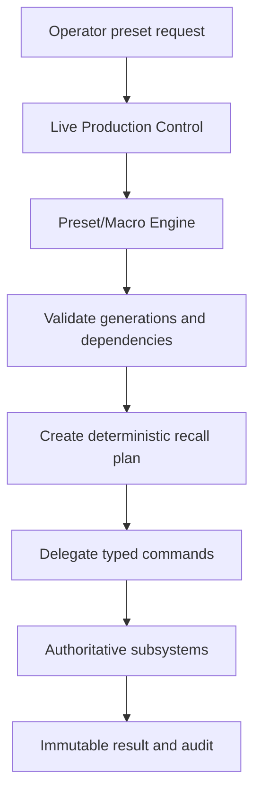
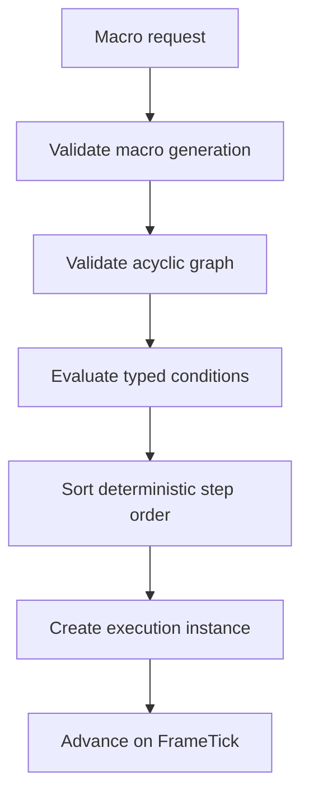
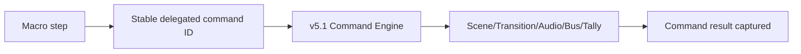
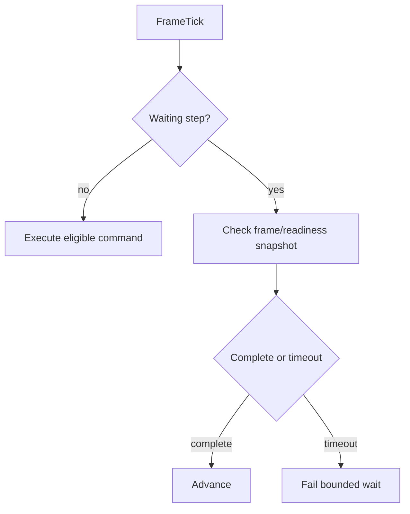
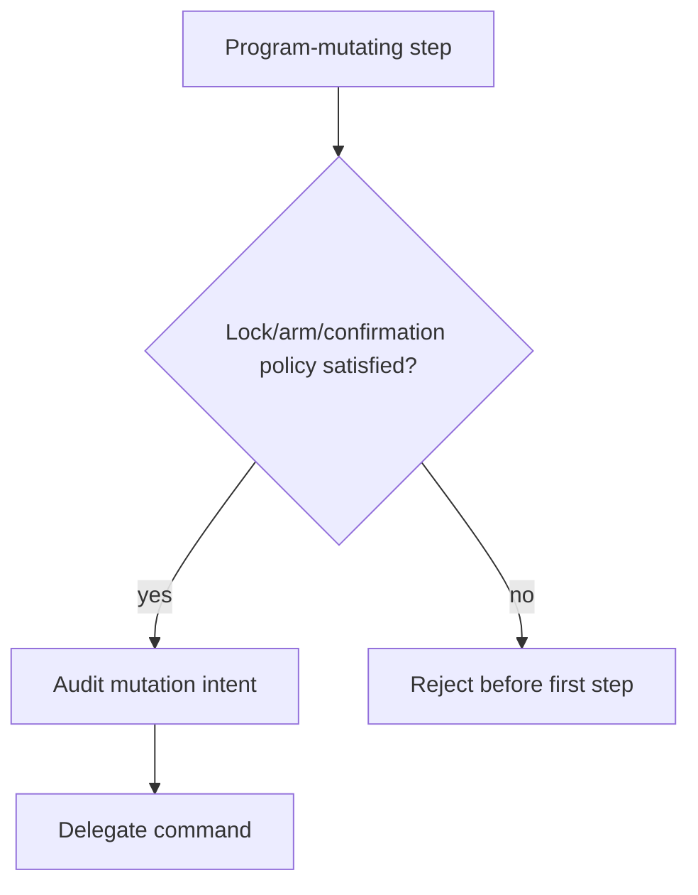
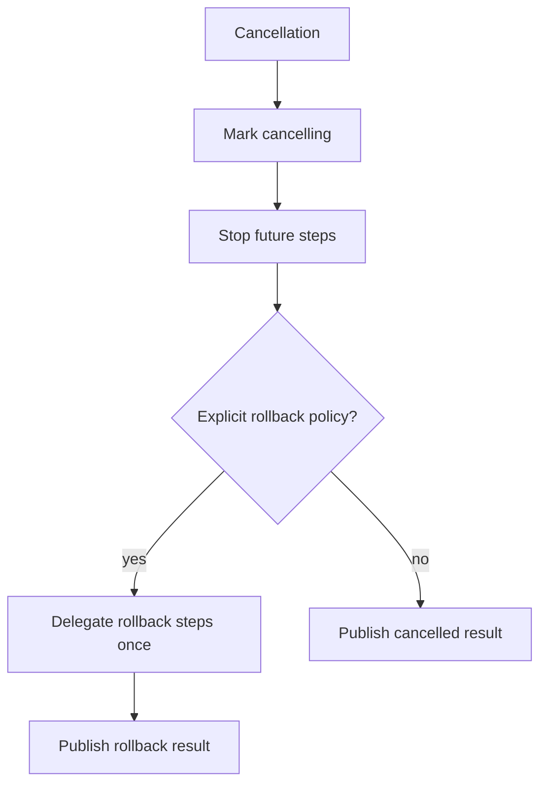
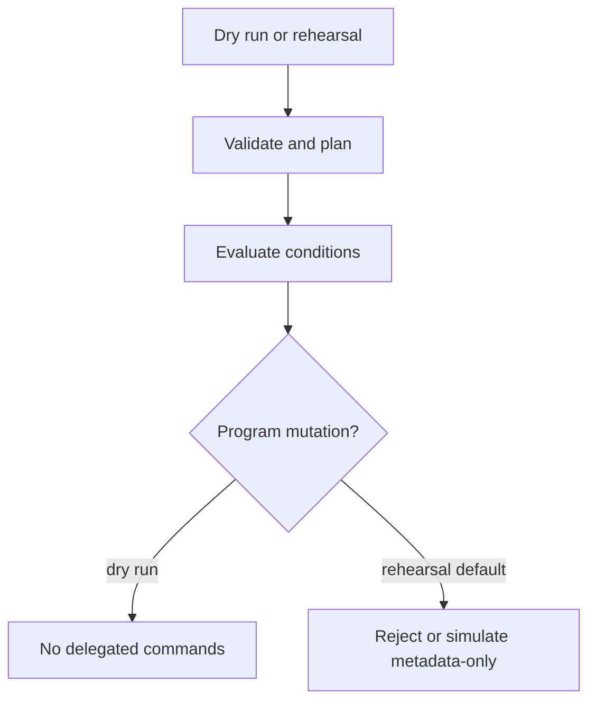
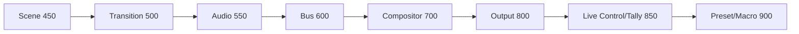
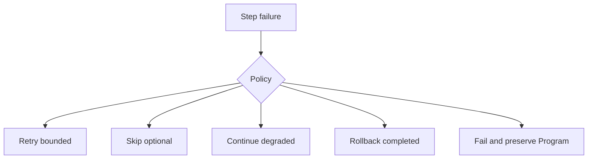
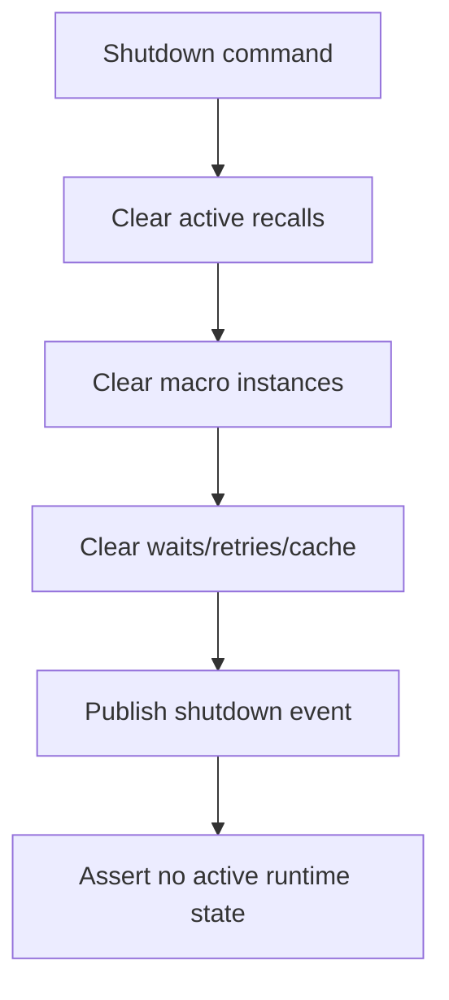

# UBOS v5.5.6 — Production-Safe Scene Recall, Presets, and Operator Macro Foundation

## Purpose and architectural position

UBOS v5.5.6 adds a production-safe Preset/Macro Engine that lets operators recall repeatable production states without bypassing the authoritative v5.1 command engine or the v5.5.1–v5.5.5 switching, transition, audio-follow, bus, live-control, and tally subsystems. The engine owns metadata definitions, deterministic planning, bounded macro lifecycle, audit, health, telemetry, watchdog incidents, and immutable JSON-safe snapshots. It does **not** own Program/Preview mutation, transition rendering, audio routing, output publication, tally derivation, effects, source acquisition, rendering, hardware I/O, arbitrary scripting, or dynamic code.

## Relationship to v5.5.1–v5.5.5

The engine is positioned after Live Production Control/Tally publication and before no downstream subsystem. It delegates steps through typed command records so Scene Switching remains authoritative for CUT/TAKE/preview selection, Transition Execution remains authoritative for AUTO/cancel/duration, Audio-Follow-Video remains authoritative for route state, Bus Orchestration remains authoritative for output/AUX/clean-feed roles, and Tally remains authoritative for tally state.

## Preset model

Supported preset types are explicit: `SCENE_PRESET`, `PROGRAM_PRESET`, `PREVIEW_PRESET`, `TRANSITION_PRESET`, `AUDIO_ROUTE_PRESET`, `PIP_LAYOUT_PRESET`, `EFFECT_CHAIN_PRESET`, `OUTPUT_ROLE_PRESET`, `AUX_PRESET`, `CLEAN_FEED_PRESET`, `TALLY_OVERRIDE_PRESET`, `OPERATOR_CONTROL_PRESET`, `PRODUCTION_STATE_PRESET`, and `CUSTOM_TYPED_PRESET`. Custom typed presets are rejected until a registered adapter exists. Definitions are immutable, generation-protected, bounded, sanitized, and include target scope, bindings, subsystem generations, dependencies, parameters, command template references, recall/failure/rollback/safety policies, rehearsal eligibility, confirmation requirements, tags, safe metadata, and creation/update times.

Target scopes are explicit and use stable IDs: `GLOBAL`, `WORKSPACE`, `PROGRAM`, `PREVIEW`, `SCENE`, `SCENE_INSTANCE`, `SOURCE`, `PIP_INSTANCE`, `EFFECT_CHAIN_INSTANCE`, `AUDIO_ROUTE`, `OUTPUT_ROLE`, `AUX_OUTPUT`, `TALLY_ENTITY`, `OPERATOR_SESSION`, and `CUSTOM`.

## Recall requests, plans, and results

Recall requests are immutable and include request/command/preset IDs, expected preset generation, target scope/IDs, expected subsystem generations, runtime frame, mode, dry-run/rehearsal flags, lock/arm requirements, deadline/cancellation/correlation/operator references, and safe metadata. Plans are deterministic and include a stable plan ID, resolved target bindings, sorted command templates, payload summaries, safety checks, validation results, step/duration estimates, rollback availability, score, warnings, and safe metadata. Results report validated/staged/completed/partial/degraded/cancelled/rolled-back/failed/rejected status, delegated command IDs, subsystem summaries, Program mutation attempt/commit flags, dry-run/rehearsal flags, rollback, warnings, failure reason, completion frame, and completion time.

Scene recall restores references only: scene selection, scene instance, source bindings, PiP layout, effect-chain references, transition metadata, audio membership preset, output-role variant references, and operator notes. It never restores raw frame state and never performs hidden CUT/TAKE/AUTO. Production-state presets similarly reference Program/Preview scenes, transitions, audio metadata, output roles, AUX selections, clean feeds, PiP/effect/tally references, and policy-permitted lock/arm metadata; they do not contain raw media, leases, GPU/native resources, or hidden mutations.

## Macro model

`OperatorMacroDefinition` is immutable and includes macro identity, ordered typed steps, dependency graph, execution/failure/rollback/safety/timing policies, maximum duration frames, command mode, lock/arm requirements, rehearsal eligibility, tags, safe metadata, and timestamps. Macro IDs are unique, generations are monotonic, steps are bounded, graph validation is acyclic, recursive macro calls are not supported by default, and shell/file/network/script steps do not exist.

Typed step support includes preview selection, CUT/TAKE/AUTO, transition cancel/set/duration, audio-follow mode and Program mute/unmute metadata, PiP layout, effect preset, output role enable/disable, AUX scene, clean-feed preset, tally override/clear, Program lock/unlock/arm/disarm, bounded FrameTick waits, authoritative readiness waits, barrier, preset application, and custom typed steps only with an adapter. Conditions are typed (`ALWAYS`, `NEVER`, scene/source/readiness/transition/audio/output/lock/arm/tally/frame/boolean/custom) and are evaluated against immutable input snapshots without scripts or eval.

Planning tie-breaks are deterministic: dependency order, step index, critical priority, stable step ID, stable command type, and plan ID. Registration order cannot affect plan output.

## Execution, FrameTick authority, and delegation

Execution requests include request/command/macro IDs, expected macro/controller/subsystem generations, start frame, dry-run/rehearsal flags, arming/lock confirmation metadata, deadline frame, cancellation/correlation/operator references, and safe metadata. Instances track state, generation, frame, current/completed/skipped/failed steps, delegated commands, rollback steps, cancellation, health, and metadata. FrameTick is the only progression clock for start, step advancement, waits, deadlines, retry delays, and cancellation boundaries. There is no setTimeout, setInterval, independent loop, scheduler, sleep, or Date.now-based progression.

Each non-wait step resolves to a stable delegated command ID and typed command type. The engine records metadata-only command summaries and captures failure as step failure. It never mutates subsystem state directly.

## Waits, failures, retries, cancellation, rollback

`WAIT_FRAME_COUNT` derives completion from frame numbers. Other readiness waits consume authoritative subsystem readiness snapshots when present and remain bounded by timeout frames. Failure policies include fail/stop/skip optional/continue degraded/rollback/preserve Program/emergency safe-scene/request intervention/custom; required critical steps cannot silently skip. Retry policy is bounded by max retry count, retry delay frames, and macro deadline. Cancellation during or between steps stops future steps. Rollback executes only explicit rollback step references or policy-supplied inverse commands and is audited; no inverse is guessed.

## Dry run and rehearsal

Dry run validates, resolves targets, validates generations, builds plans, evaluates conditions, reports Program-mutating steps and missing dependencies, estimates frames, and executes no delegated command. Rehearsal marks results and rejects live Program mutation by default unless explicit safety policy allows metadata-only override.

## Program safety, security, and audit

Program mutation requires lock/arm/confirmation policy, redacted operator metadata, allowlist policy, and audit. Emergency actions are explicit and auditable. Sanitization redacts secrets, URLs, endpoints, credentials, device paths, native handles, pixels, PCM, GPU objects, and mutable leases. Snapshots are JSON-safe, bounded, deterministic, immutable, and executable-code free.

## Built-ins

Built-in production presets are immutable templates for opening, host camera, lower-third, guest/presentation/screen-share layouts, social/horizontal layouts, clean-feed/podcast/interview/break/technical-difficulties/ending/safe Program/custom. Built-in operator macro templates include start/end show, take/return guest, presentation start/end, clean-feed enable/disable, break start/end, emergency safe scene, vertical/horizontal preparation, optional audio mute/restore, and custom. Templates require bindings and do not hard-code private scene/source IDs, recording/streaming, or hardware actions.

## Processor integration and output registry

`OperatorPresetMacroProcessor` uses the existing TickProcessor contract with order 900, after Live Production Control/Tally (850). It publishes typed output keys for preset definitions, macro definitions, active recall/instances, requests, plans, results, step results, completed/failed summaries, health, telemetry, validation, and audit. It has no second loop.

## Commands, events, health, telemetry, watchdog, Source Graph

Typed commands cover preset register/update/unregister/validate/recall/stage/dry-run/cancel, macro register/update/unregister/validate/execute/dry-run/rehearse/pause/resume/cancel/rollback/failure-policy/plan-cache-clear, and shutdown. Events cover lifecycle, registration, recall, macro execution, step progress, pause/resume/cancel, rollback, completion/failure, Program safety, health, and shutdown. Health and telemetry are bounded counters and current IDs. Watchdog incidents cover stalls, timeouts, duplicates, stale generations, missing dependencies, graph cycles, Program safety, step failure, retry exhaustion, wait timeout, rollback failure, result/registry mismatch, and invariants. Source Graph exposure is metadata-only.

## Invariants, validation, replay, performance, limitations, and v5.5.7 handoff

`assertInvariants()` verifies uniqueness, monotonic generations, acyclic graphs, valid active references, step membership, exactly-once step/delegated command behavior, FrameTick waits, Program safety, dry-run/rehearsal isolation, cancellation/failure stop semantics, rollback once, bounded registries/cache/history, health/telemetry agreement, and clean shutdown. Validation uses fake FrameTicks, deterministic snapshots, synthetic command delegation, fake monotonic clocks, bounded registries, 10,000 recalls, 10,000 executions, and 100,000 ticks with deterministic replay. Complexity targets are O(1) registry lookup, O(n+e) graph validation/order, O(n) condition/planning, O(1) active wait evaluation, O(reversible completed steps) rollback, and bounded snapshot/watchdog traversal. Limitations: no real recording/streaming/replay/audio mixing/hardware/PTZ/OSC/MIDI/Stream Deck/cloud automation or graphics authoring. Recommended next task: UBOS v5.5.7 Live Production Control Certification.

## Mermaid diagrams

### 1. Preset recall flow

### 2. Macro planning and execution

### 3. Command delegation

### 4. FrameTick wait handling

### 5. Program safety validation

### 6. Cancellation and rollback

### 7. Dry-run/rehearsal isolation

### 8. Processor order

### 9. Failure recovery

### 10. Shutdown sequence

