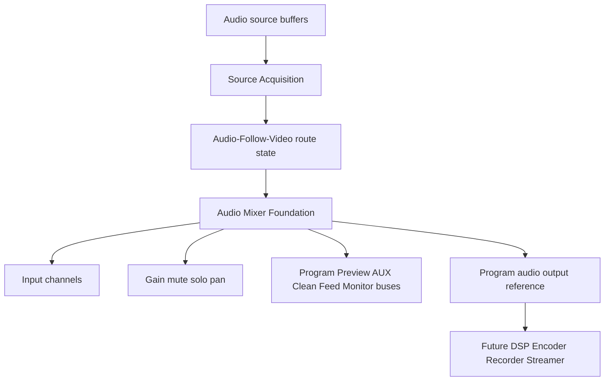
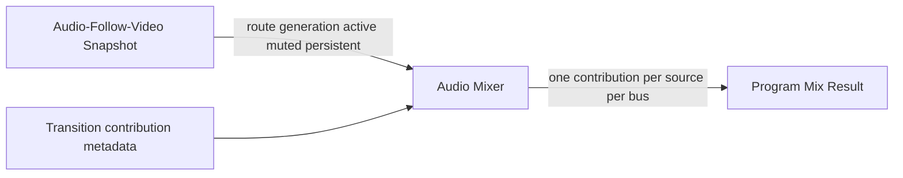
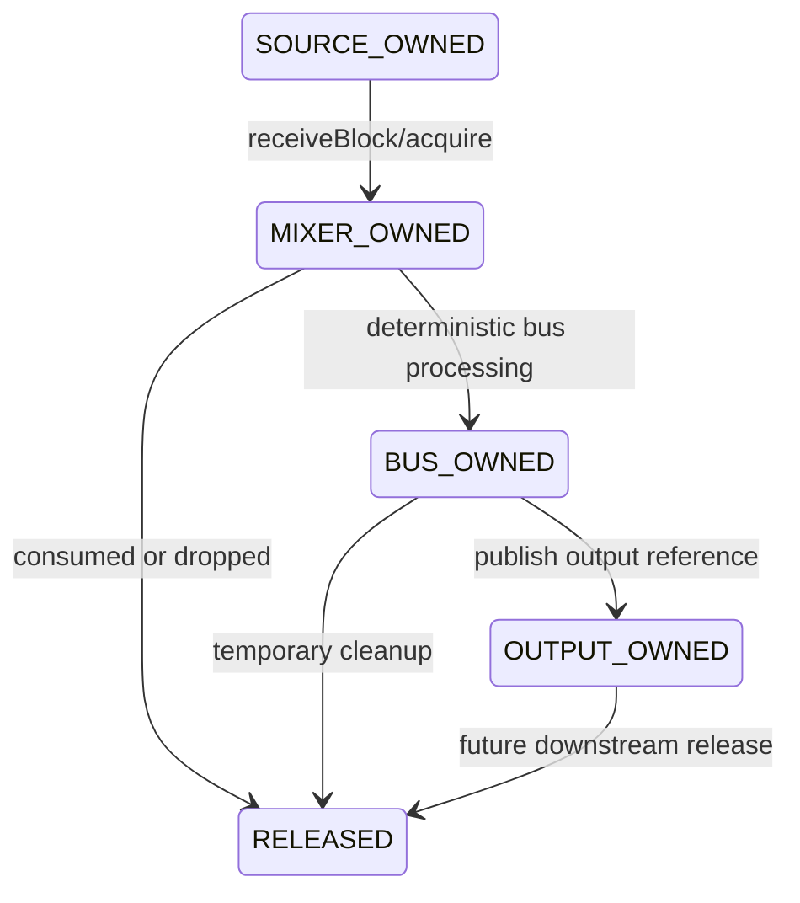
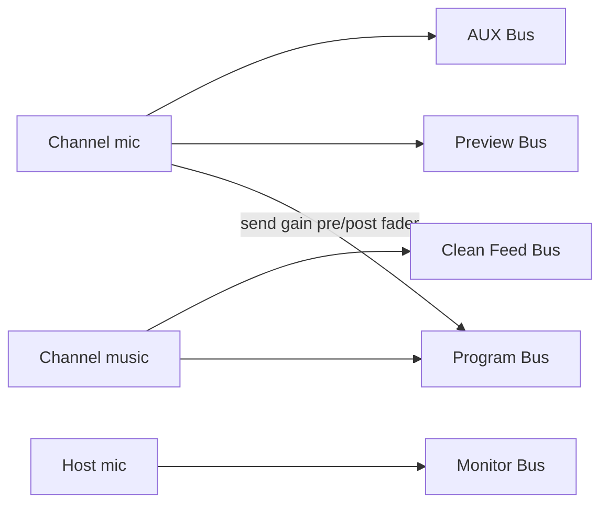
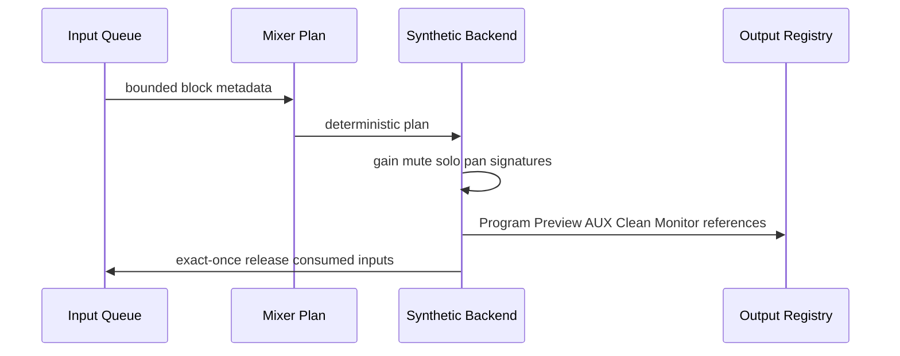
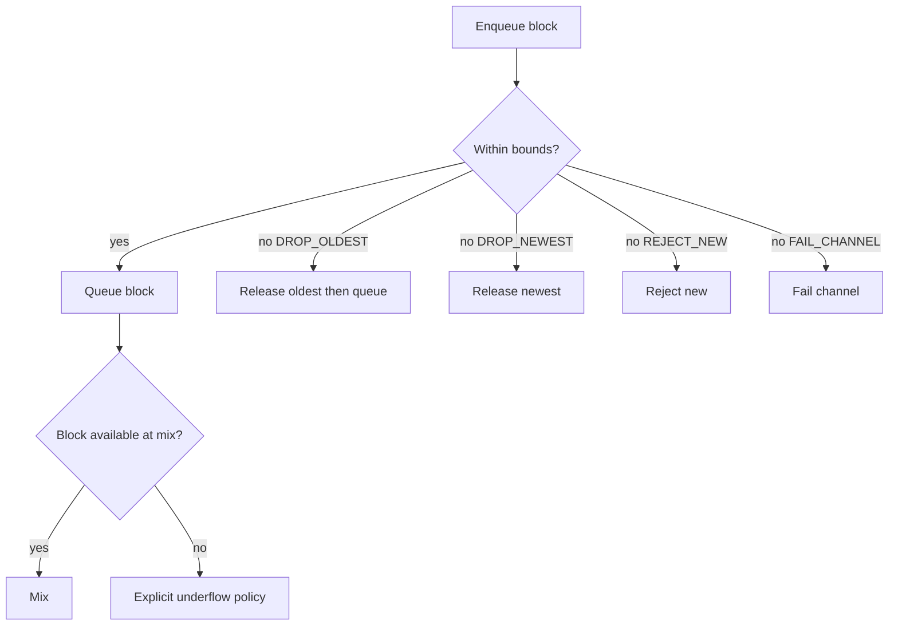
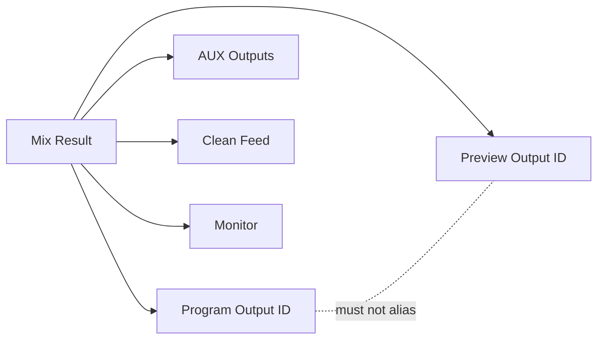
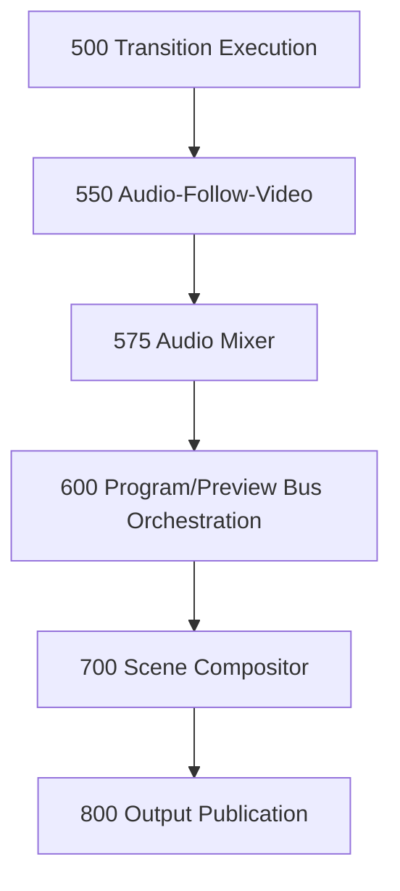
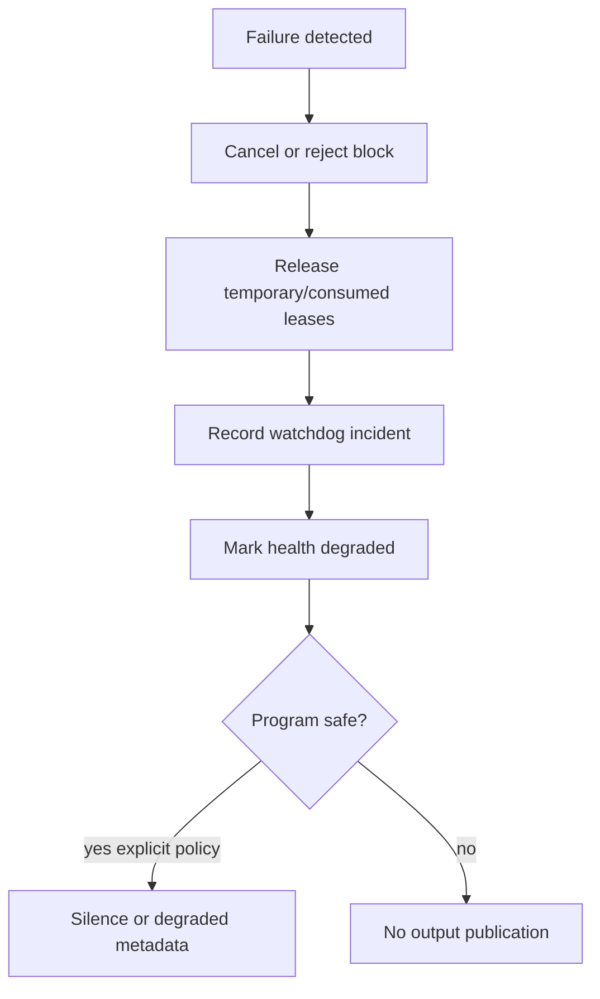
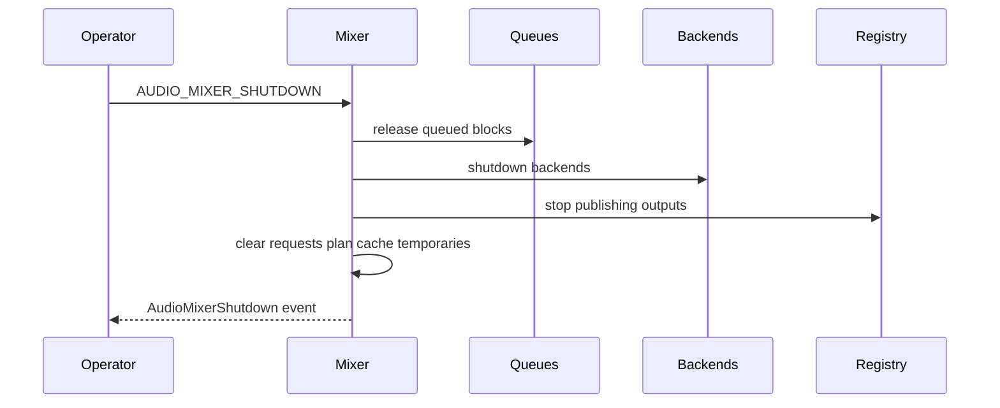

# UBOS v5.6.1 — Production-Safe Audio Mixer Foundation

## Purpose and architectural position

UBOS v5.6.1 introduces the authoritative metadata-safe audio mixer foundation between Source Acquisition / Audio-Follow-Video and future DSP, encoder, recorder, and streaming layers. It owns input channel state, explicit PCM block ownership, deterministic per-block mixing plans, channel-to-bus routing, Program/Preview/AUX/Clean Feed/Monitor output references, health, telemetry, watchdog incidents, and invariant validation.

It deliberately does **not** own source discovery, native device capture, scene switching, route decisions, advanced DSP, encoding, recording, streaming, playback, or native WASAPI/CoreAudio/ALSA/PipeWire/PulseAudio/ASIO/JACK access.

## Relationship to v5.5 Audio-Follow-Video

The mixer consumes Audio-Follow-Video route generations, active/muted/persistent source metadata, and transition contribution metadata. It does not resolve routes or commit scene changes. Stale route and transition generations are rejectable, and common source contributions are tracked per bus to prevent duplicate mixing.

## Audio clock authority

The mixer never creates an independent audio clock, runtime loop, scheduler, `setInterval`, `requestAnimationFrame`, or `Date.now()` progression. FrameTick coordinates publication only. Sample progression derives from source sample rate, sample position, sample count, source clock domain, and normalized timestamps. Duplicate blocks, gaps, overlaps, regressions, and discontinuities are observable.

## PCM buffer envelope, formats, and layouts

`AudioPcmBufferEnvelope` records buffer/source/stream identity, source and stream generations, sequence number, sample position/count/rate, timestamp/duration, clock domain, discontinuity/corruption/silence flags, ownership state, backend ID, generation, safe metadata, and an opaque payload reference. Public snapshots redact payload bytes.

Supported formats are `PCM_F32`, `PCM_F64`, `PCM_S16`, `PCM_S24_PACKED`, `PCM_S32`, `PCM_U8`, and `OPAQUE_SYNTHETIC`. Supported layouts are `MONO`, `STEREO`, `DUAL_MONO`, `QUAD`, `SURROUND_5_1`, `SURROUND_7_1`, and `CUSTOM`. Layout/channel-count compatibility is explicit; no hidden upmix, downmix, or format conversion is performed.

## Ownership and leases

Ownership states are `SOURCE_OWNED`, `MIXER_OWNED`, `BUS_OWNED`, `OUTPUT_OWNED`, `BORROWED_READ_ONLY`, and `RELEASED`. `AudioPcmBufferLease` records lease ID, buffer ID, owner, generation, acquisition frame/sample metadata, release state, and release reason. Double release and released-buffer processing are rejected; shutdown releases mixer-owned buffers.

## Channel model

`AudioMixerChannelDefinition` includes stable channel identity, source/stream references and generations, role, format/rate/layout, input/fader gain, pan, balance, mute, solo, solo-safe metadata, phase invert, enabled state, latency compensation metadata, bus sends, monitor policy, Audio-Follow participation, safe metadata, and timestamps. Updates are generation protected and registration does not open a source or start mixing.

`AudioMixerChannelState` exposes bounded state: active/available/muted/soloed flags, current/expected sample positions, queue depth, dropped/underflow/discontinuity counts, last input timestamp, current contribution, bus participation, health, and safe metadata.

## Bus and send model

Buses support roles `PROGRAM`, `PREVIEW`, `AUXILIARY`, `CLEAN_FEED`, `MONITOR`, `RECORD`, `STREAM`, and `CUSTOM`. In v5.6.1 Program is authoritative; Preview/AUX/Clean Feed/Monitor are fully modeled; Record/Stream remain internal foundations with no encoding, recording, or streaming implementation.

`AudioBusSend` defines source channel, destination bus and generation, enable state, pre/post-fader flag, gain, optional pan/mute overrides, transition contribution participation, priority, and safe metadata. Sends are unique and bounded; no hidden routing is created.

## Gain, mute/solo, pan/balance

Gain utilities provide deterministic dB-to-linear and linear-to-dB conversion, unity gain, silent floor, maximum gain, and finite/range validation. There is no silent clamping. Mute/solo resolution is deterministic and supports channel mute, channel solo, bus mute, additive/exclusive/solo-in-place policy metadata, and solo-safe channels. Pan/balance supports mono-to-stereo foundation and stereo balance metadata with finite bounded positions; surround panning is not claimed.

## Processing order

The explicit processing order is:

1. Validate input block.
2. Apply source contribution.
3. Apply input gain.
4. Apply phase inversion.
5. Apply pan/balance.
6. Apply fader gain.
7. Apply send gain.
8. Sum into destination bus.
9. Apply bus master gain.
10. Validate output.
11. Transfer ownership.
12. Release temporary buffers.

## Mix request, plan, and result

`AudioMixRequest` records request ID, runtime frame, block sequence, requested sample position, sample count, output buses, input channels, expected generations for channels/buses/Audio-Follow/transition/mixer configuration, deadline, cancellation, and safe metadata. It rejects duplicate requests, duplicate block sequences, stale generations, sample-position regressions, invalid block sizes, and shutdown state.

`AudioMixPlan` provides deterministic channel/bus ordering, resolved sends, mute/solo resolution, contribution values, operation order, bounded memory estimates, expected sample position/count, deterministic score, warnings, and safe metadata. Cache keys include generation-sensitive state and the cache is bounded.

`AudioMixResult` reports status, output references for Program/Preview/AUX/Clean Feed/Monitor, active/muted/soloed/dropped/underflow channels, contribution summaries, byte counts, real-vs-synthetic PCM honesty, warnings, ownership transfers, duration, and completion time. Program output is published at most once per block.

## Backend abstraction and synthetic backend

`AudioMixerBackend` declares descriptor, capabilities, initialize/createPlan/processBlock/reset/shutdown. Capabilities include supported formats/rates/layouts, limits, real PCM support, gain/pan/mute/solo/phase support, interleaving support, memory limits, determinism, and safe metadata. Backend selection is deterministic by priority then ID.

`SyntheticAudioMixerBackend` performs deterministic metadata-safe synthetic mixing, output reference/checksum generation, gain/mute/solo/phase/pan operation accounting, sample-position validation, and fault simulation for allocation failure, timeout, backend failure, discontinuity, underflow, and overflow. It accurately reports `realPcmProcessing: false`.

## Input queues and underflow/overflow

Each channel has a bounded `AudioInputQueue` with block/sample/duration/byte bounds. Overflow policies include `DROP_OLDEST`, `DROP_NEWEST`, `REJECT_NEW`, `FAIL_CHANNEL`, and `CUSTOM`. Dropped buffers are released and high-water state is tracked.

Underflow policies are modeled as `OUTPUT_SILENCE`, `HOLD_LAST_BLOCK_METADATA`, `DROP_OUTPUT_BLOCK`, `FAIL_PROGRAM_BLOCK`, `DEGRADE_CHANNEL`, and `CUSTOM`. The foundation reports underflow explicitly and does not silently repeat audio.

## Program/Preview/AUX/Clean Feed/Monitor integration

Program and Preview output identities are independent and non-aliasing. Optional bus failure is isolated from Program. Output metadata is compatible with Program/Preview bus orchestration and is published through typed output keys.

## Processor integration and order

`AudioMixerProcessor` implements the existing TickProcessor contract and runs at order 575, after Transition Execution (500) and Audio-Follow-Video (550), before Program/Preview Bus Orchestration (600), Scene Compositor (700), and Output Publication (800). It uses existing FrameTicks and ProcessorOutputRegistry; it creates no second loop.

## Output registry, commands, and events

Typed output keys cover configuration, channel states, bus states, active request, plan, result, Program/Preview/AUX/Clean Feed/Monitor outputs, health, telemetry, and summaries for underflow/overflow/discontinuity/failures.

Typed commands cover backend/channel/bus/send registration and updates, gain/mute/solo/pan/phase changes, block processing/cancellation, plan-cache clearing, validation, reset, and shutdown. Command records are metadata-safe and contain no PCM samples, native handles, credentials, or secrets.

Typed events cover creation, backend/channel/bus/send changes, block queueing/dropping, mix requested/planned/started/completed/degraded/cancelled/failed, underflow/overflow/gap/overlap/discontinuity, Program/Preview publication, health changes, and shutdown. Per-block event history is bounded.

## Health, telemetry, watchdog, and Source Graph

Health snapshots report engine/health state, backend/channel/bus counts, Program/Preview IDs, block counters, duplicate/stale/underflow/overflow/gap/overlap/discontinuity/ownership counters, queue bytes, temporary bytes, Program bytes, last sample position, last successful block, failure, and update timestamp.

Telemetry uses bounded counters for registrations, updates, queueing, plan cache hits/misses, processed/completed/degraded/silent/failed/cancelled blocks, bus publications, gain/pan/mute/solo/phase operations, underflow/overflow/gap/overlap/discontinuity, duplicates, stale generations, ownership violations, output/temporary bytes, active channel/bus maxima, current request, active backend, last event, and health summary.

Watchdog incidents include stalls, block timeout, duplicate request/block, stale channel/bus/route/transition generation, sample regression/gap/overlap, input/program underflow, overflow, output alias, duplicate source contribution, backend/allocation failure, ownership violation, registry/source-graph mismatch, and invariant failure.

Source Graph exposure is metadata-only: mixer state, channel IDs/roles/availability/mute/solo, bus IDs/roles, send relationships, sample-rate/layout metadata, queue depth summaries, sample positions, underflow/overflow/discontinuity state, Program output generation, mixer health, and routing eligibility. Raw PCM, sample values, payload bytes, native handles, mutable leases, paths, credentials, and private metadata are excluded.

## Security and production safety

Metadata and errors are sanitized for secrets, endpoints, device paths, native handles, payloads, sample values, private metadata, and memory-address-like fields. Snapshots are immutable, JSON-safe, bounded, deterministic, and redacted.

The implementation enforces no independent mixer clock, no fabricated sample positions, no duplicate block processing, no duplicate Program output, no stale generations, no silent conversion, no hidden routing, no duplicate source contribution, no partial Program mix, no Program/Preview alias, no output after cancellation/failure/shutdown, no unbounded state, no native audio APIs, no encoder/recorder/streamer, no raw PCM in observability, no double release, no released-buffer reuse, no temporary leak, and no fake advanced DSP claim.

## Invariants and validation

`assertInvariants()` verifies uniqueness of backend/channel/bus/send IDs, valid send endpoints, Program/Preview distinction, no active leases after clean validation, no temporary-byte leak, bounded state, health/telemetry consistency, and shutdown cleanup. The validation suite covers deterministic registration, generation rejection, ownership, exact-once release, queue pressure, sample tracking, bus isolation, Audio-Follow/transition metadata consumption, watchdog incidents, Source Graph redaction, snapshot immutability, command semantics, shutdown idempotency, 10,000 Program/Preview/AUX mixes, and 100,000 synthetic processor-style ticks without sleeping.

## Determinism replay and performance

Determinism replay runs identical synthetic scenarios twice and compares canonical health, telemetry, channel, bus, send, plan, operation signature, output checksum, sample-position, watchdog, and final state snapshots. Performance validation uses operation counts rather than wall-clock thresholds. Expected complexity is O(1) for backend/channel/bus/send lookup and queue operations, O(channels) for mute/solo resolution, O(channels + sends + buses) for plan creation, O(samples × active sends) for mixing, O(channels + buses + bounded state) for snapshots, and O(active + bounded incidents) for watchdog evaluation.

## Limitations and v5.6.2 handoff

v5.6.1 is a production-safe foundation, not a production-native audio playback/capture, DSP, encoding, recording, streaming, replay, hardware mixer, or UI redesign phase. The synthetic backend may generate deterministic operation signatures and checksums rather than process large PCM buffers. UBOS v5.6.2 should build the Production-Safe Channel Strip and Audio Routing Engine on top of these contracts.

