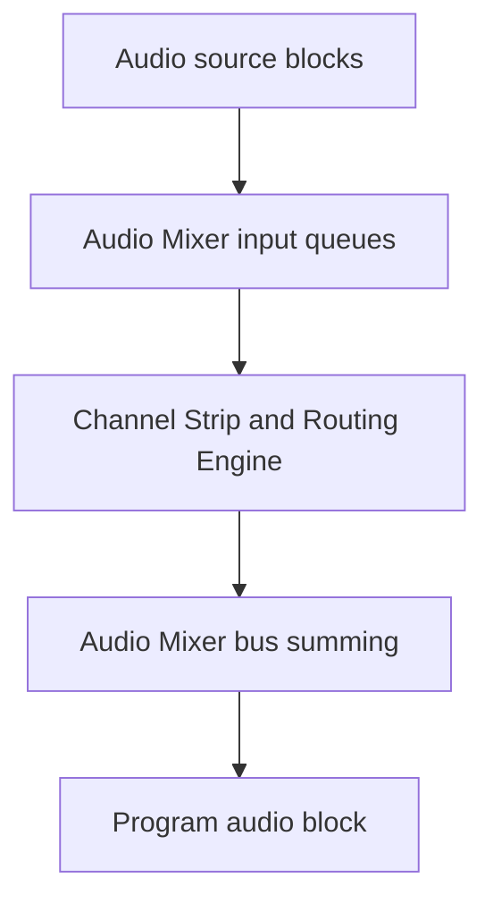
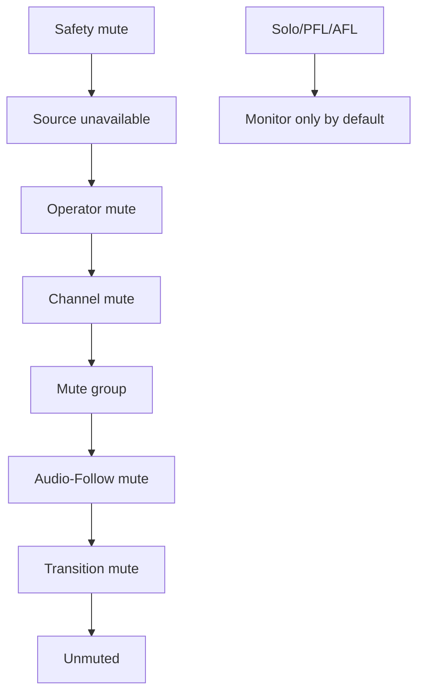
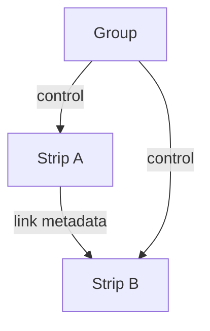
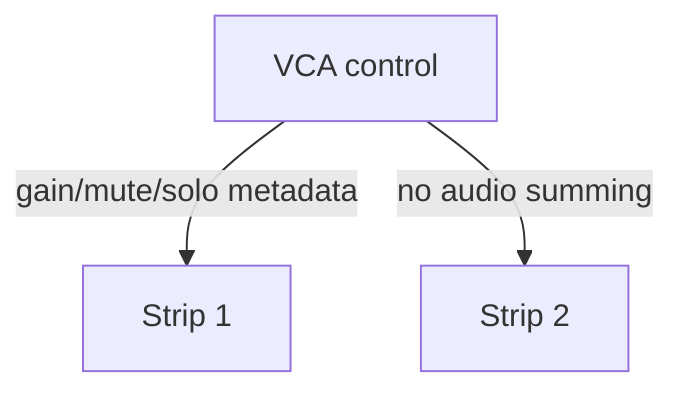
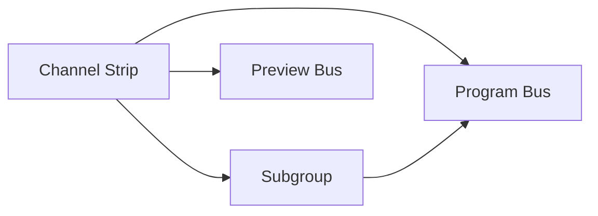
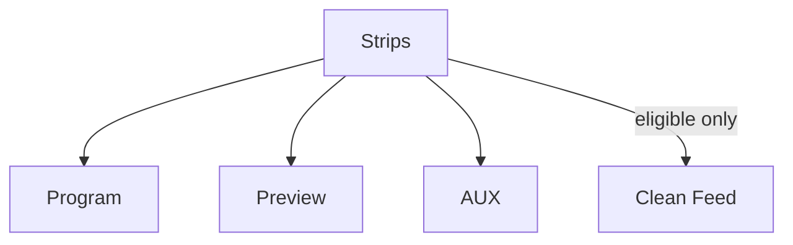
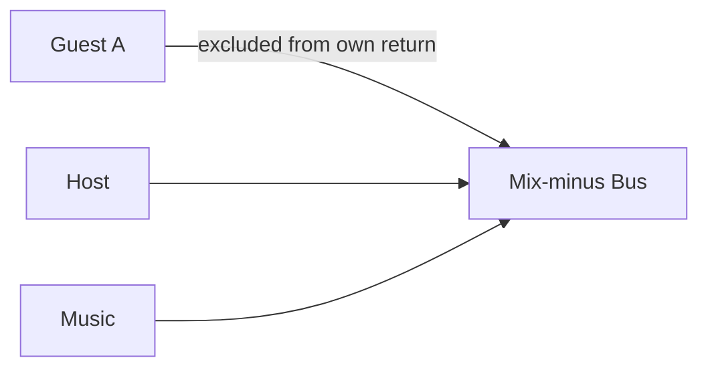
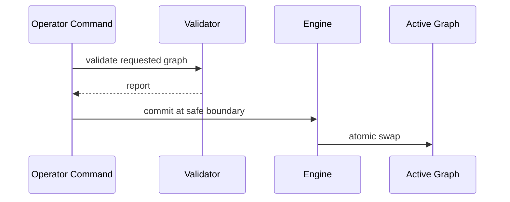
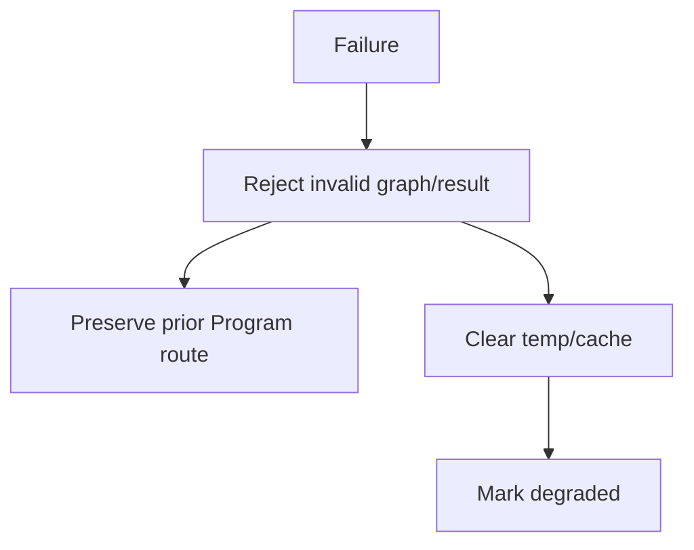
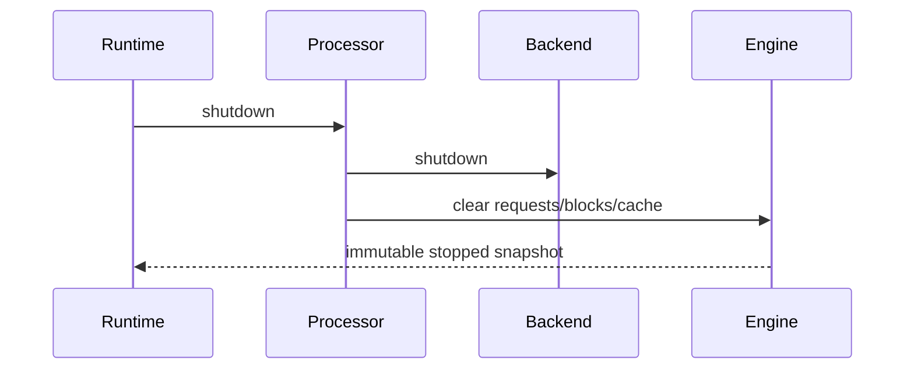

# UBOS v5.6.2 — Production-Safe Channel Strip and Audio Routing Engine

## Purpose and architecture

UBOS v5.6.2 adds the authoritative metadata-safe channel-strip and routing layer between the v5.6.1 audio mixer input queues and final bus summing. It reuses the v5.1 execution engine `TickProcessor` contract, v5.2 source metadata, v5.5 Audio-Follow-Video decisions, and v5.6.1 audio mixer/PCM ownership snapshots. It does not create a second audio clock, scheduler, source manager, mixer, native device layer, encoder, recorder, streamer, or advanced DSP module.

## Relationship to v5.6.1

The channel-strip engine owns strip configuration, gain-stage ordering, mute/solo policy, links, groups, VCA-style control metadata, sends, routing graph validation, contribution planning, health, telemetry, and bounded snapshots. The mixer remains responsible for final bus summing and buffer ownership. The synthetic backend reports `realPcmProcessing=false` and creates deterministic opaque output references/checksums only.

## Channel strip model

A strip includes stable identity, generation, source/channel relationship, sample format/layout, input trim, phase inversion, pan/balance, fader, mute, solo, solo-safe, PFL/AFL, Audio-Follow and transition participation, groups, links, sends, route references, monitor policy, and safe metadata. Registration is immutable and bounded; updates are atomic and generation-protected.

## Gain-stage order

1. source contribution
2. input trim
3. phase inversion
4. pan/balance coefficient resolution
5. pre-fader send tap
6. fader gain
7. post-fader send tap
8. mute resolution
9. post-mute send tap
10. group/VCA contribution
11. destination bus contribution
12. bus master gain

Input trim and fader support dB/linear values, unity, silence floor, finite validation, and bounded positive gain. Pan/balance supports mono pan, stereo balance, dual-mono balance, center/left/right, and custom-normalized metadata. Pan laws are explicit: linear, constant-power, -3 dB center, -4.5 dB center, -6 dB center, and custom typed metadata. Unsupported surround panning is rejected.

## Phase, mute, solo, PFL, and AFL

Phase inversion is explicit by channel labels with `NONE`, `LEFT`, `RIGHT`, `ALL`, or `CUSTOM`. Mute priority is deterministic: safety, source unavailable, operator, channel, mute group, Audio-Follow, transition, then unmuted. Solo supports solo-in-place, PFL, AFL, exclusive, additive, solo-safe, and none. PFL/AFL are monitor metadata/routes by default and do not mutate Program.

## Linking, groups, and VCA-style controls

Links support stereo, gain, fader, mute, solo, pan mirror, pan inverse, and custom typed metadata. Self-links and link cycles are rejected. Groups include mute, solo, fader, routing, monitor, and custom groups with unique members. VCA-style controls contribute control gain/mute/solo metadata only and never duplicate the signal path or sum audio.

## Routing

Endpoints are typed (`CHANNEL_INPUT`, `CHANNEL_STRIP`, `SUBGROUP`, `PROGRAM_BUS`, `PREVIEW_BUS`, `AUX_BUS`, `CLEAN_FEED_BUS`, `MONITOR_BUS`, `RECORD_BUS`, `STREAM_BUS`, `CUSTOM_BUS`) and use stable IDs/generations. Edges are immutable and include source/destination, tap point, gain, overrides, priority, feedback metadata, Audio-Follow/transition participation, clean-feed eligibility, latency metadata, and safe metadata. Duplicate source/destination/tap routes are rejected unless a future explicit summing policy is added.

The routing graph validates direct and indirect cycles with default `REJECT_ALL_CYCLES`, uses deterministic topological sorting, and swaps only through atomic graph commit at safe processing boundaries. Failed commits preserve the prior graph.

## Subgroups, sends, Program/Preview, AUX, Clean Feed, Mix-minus, Monitor

Subgroups model dialogue, music, effects, remote guests, desktop audio, browser audio, ambience, and custom roles with explicit format/layout and bounded membership. Sends support pre/post fader, pre/post mute, pre/post group, and custom taps. Program and Preview routes are independent and never alias writable outputs. AUX routes are independent and optional. Clean-feed routing uses explicit exclusions with no hidden subtraction or phase cancellation. Mix-minus plans explicitly exclude contributors and reject self-return by default. Monitor routing carries PFL/AFL metadata without hardware-monitor claims.

## Audio-Follow and transition integration

Audio-Follow-Video remains the routing decision authority. The channel-strip processor consumes Program/Preview route generation and transition contribution metadata, rejects stale generations, and ensures common/persistent sources contribute once. Transition metadata uses runtime frame/sample position fields; the synthetic backend does not claim real crossfade DSP.

## Process request, plan, and result

Process requests include expected generations, sample position, block sequence, output buses, deadline, cancellation reference, and metadata-only input buffer snapshots. Plans deterministically order strips, groups, sends, routing edges, mute/solo states, VCA contributions, Audio-Follow/transition contributions, and operations. Results publish exactly one block result with explicit ownership transfer and no output on failure/cancellation.

## Backend and processor

`AudioChannelStripBackend` exposes descriptor, capabilities, initialize, createPlan, process, reset, and shutdown. `SyntheticAudioChannelStripBackend` consumes opaque metadata, computes deterministic signatures/checksums, simulates failure modes, and reports no real PCM processing. `AudioChannelStripRoutingProcessor` runs at order 565, after Audio-Follow-Video (550) and before Audio Mixer (575), using the v5.1 tick framework with no independent loop.

## Output registry, commands, events, health, telemetry, watchdog

Typed output keys publish definitions, states, groups, VCAs, graph snapshots, sends, subgroups, clean feeds, mix-minus, transactions, requests, plans, results, contribution states, health, telemetry, and failed/rejected results. Commands are metadata-only and use expected generations. Events are sampled/bounded. Health and telemetry counters are bounded. Watchdog incidents cover stalls, duplicate requests/blocks/routes, stale generations, cycles, invalid endpoints, duplicate source contribution, Program/Clean Feed failures, mix-minus self-return, link cycles, invalid gain/pan, backend/allocation/ownership failures, registry mismatch, source graph mismatch, and invariants.

## Source Graph, security, invariants, and limitations

Source Graph integration exposes only sanitized metadata: strip IDs/roles, source/channel relationships, memberships, mute/solo/PFL/AFL, fader/trim/pan summaries, sends, routing endpoints, graph generation, participation, exclusions, health, and eligibility. Raw PCM, sample values, payload bytes, native handles, device paths, credentials, URLs, and private metadata are redacted. Invariants verify uniqueness, monotonic generations, acyclic graphs, valid references, no duplicate source contribution, Program/Preview isolation, clean-feed exclusions, mix-minus no self-return, bounded registries/caches/history, and clean shutdown. Limitations: no EQ, filters, dynamics, loudness normalization, reverb/delay, pitch/time processing, encoding, recording, streaming, native hardware mixer control, MIDI, OSC, Stream Deck, or UI redesign.

## Long-run, determinism, and performance

Validation uses fake ticks, deterministic sample positions, synthetic PCM references, deterministic Audio-Follow/transition metadata, bounded registries, and operation-count complexity checks. Expected complexity: O(1) lookups, O(n+e) graph validation/topological sorting, O(strips) mute/solo, O(linked members) link resolution, O(VCA memberships) VCA contribution, O(edges) sends/routing, and O(active+bounded state) snapshots/watchdog.

## v5.6.3 handoff

The next phase should add Production-Safe EQ and Dynamics Processing Foundation after this routing layer, preserving explicit gain stages and avoiding hidden DSP.

## Diagrams

