# UBOS v5.6.3 — Production-Safe EQ and Dynamics Processing Foundation

## Purpose

UBOS v5.6.3 adds the authoritative EQ and dynamics-processing foundation between the certified v5.6.2 Channel Strip/Audio Routing Engine and the v5.6.1 Audio Mixer bus-output path. The implementation is intentionally production-safe and synthetic: it validates definitions, resolves deterministic plans, tracks bounded processor state, publishes metadata, and reports real DSP capability flags honestly. It does not create a native DSP clock, native audio API integration, encoder, recorder, streamer, or hardware-DSP path.

## Architectural position and relationship to v5.6.1/v5.6.2

v5.6.1 remains authoritative for mixer queues, PCM ownership envelopes, bus definitions, and Program/Preview/AUX/Clean Feed/Monitor/Record/Stream bus semantics. v5.6.2 remains authoritative for strip gain stages, pan/balance, mute/solo, groups/VCA, sends, and routing contribution resolution. v5.6.3 consumes the resolved channel/bus target metadata, applies explicit EQ/dynamics plans, and returns processed references to the mixer path without duplicating routing, summing, timing, or ownership logic.

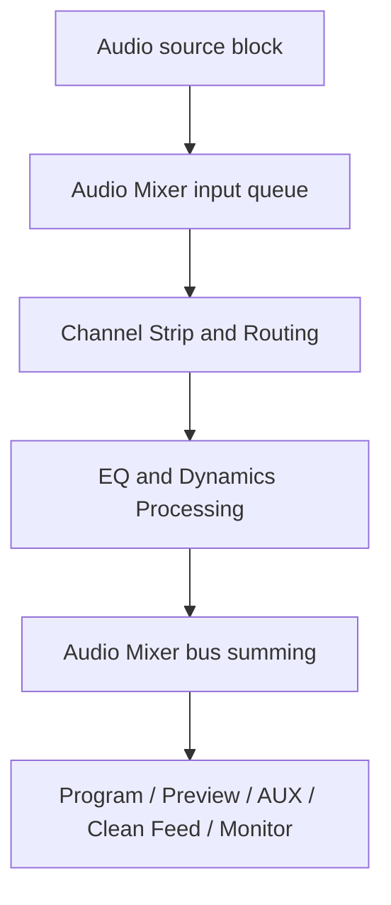

## Processing insertion points

Insertion points are explicit and include channel, subgroup, bus, Program, Preview, AUX, Clean Feed, Monitor, Record, Stream, and Custom pre/post boundaries. No processor is inserted implicitly.

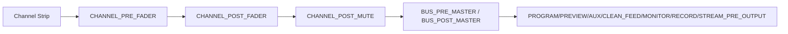

## EQ filters, bands, and chains

Supported EQ processor types are high-pass, low-pass, low shelf, high shelf, parametric bell, notch, band-pass metadata, and all-pass metadata. `AudioEqBandDefinition` is immutable and generationed; it validates frequency below Nyquist, finite gain, positive Q, supported slope, supported order, explicit phase mode, precision, channel selection, and sanitized metadata. `AudioEqChainDefinition` binds ordered bands to a target and insertion point with bounded band count, explicit wet/dry, bypass, quality, creation/update timestamps, and stable order independent of registration order.

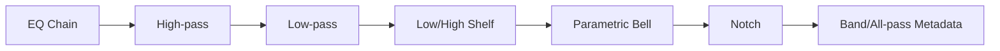

## Gate, expander, compressor, limiter, de-esser, and sidechain foundation

`AudioDynamicsProcessorDefinition` supports noise gate, expander, compressor, limiter, de-esser foundation, and sidechain detector foundation. It includes threshold, ratio, attack, release, hold, knee, makeup, ceiling, range, hysteresis, lookahead metadata, detector mode, detector channel mode, sidechain reference, wet/dry, auto-mode flags, linked-channel policy, channel selection, quality, and timestamps. The synthetic backend computes deterministic detector and gain-reduction summaries, but reports `realDynamicsProcessing` and `realLimiterProcessing` as false.

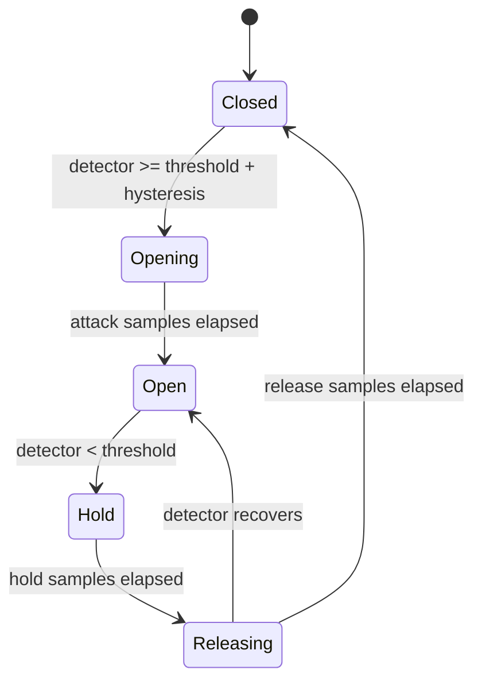

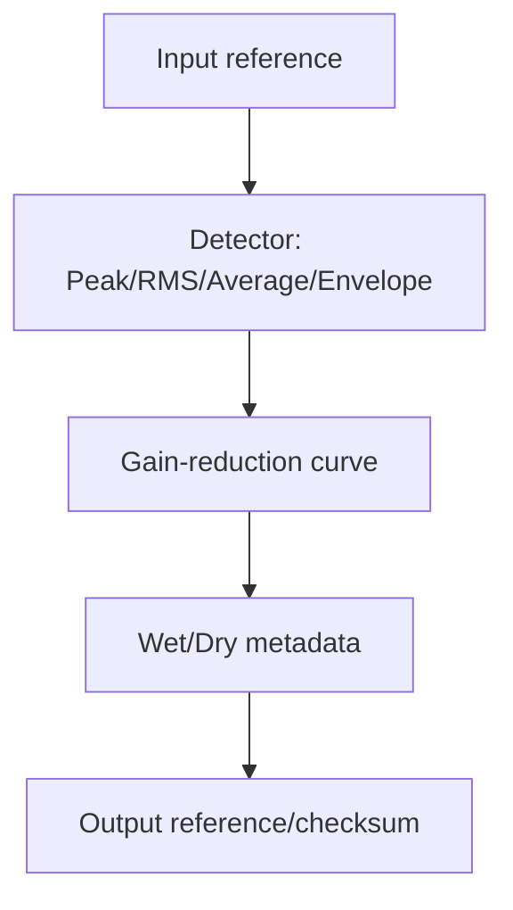

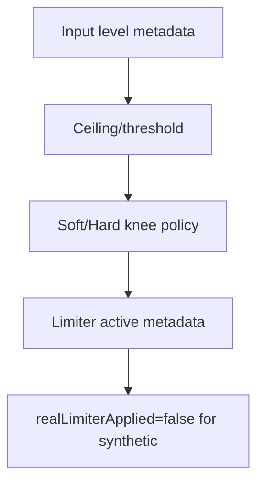

Sidechains are explicit `AudioSidechainReference` objects with one source, source generation, tap point, detector gain, filter metadata, channel mode, self-sidechain policy, and sanitized metadata. Self-cycles are rejected unless explicitly metadata-only.

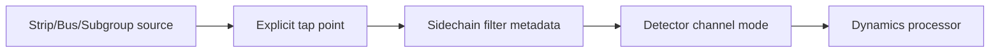

## Detector modes and linked channel processing

Detector modes are PEAK, RMS, AVERAGE, TRUE_PEAK_METADATA, ENVELOPE, and CUSTOM_TYPED. Channel detector modes are INDEPENDENT, LINKED_MAX, LINKED_AVERAGE, LEFT, RIGHT, MID, SIDE, and CUSTOM. Layout compatibility is validated; no hidden downmix or detector substitution occurs.

## Parameters and validation

The default policy is REJECT. NaN, Infinity, non-positive frequency, frequency at/above Nyquist, non-positive Q, unsupported slope/order, invalid ratios, negative times, ceiling above policy maximum, wet/dry outside 0–1, invalid insertion point, invalid sidechain source, and incompatible detector layout are rejected. No silent clamping is performed.

## Processor chains, bypass, and wet/dry

`AudioProcessingChainDefinition` stores an explicit ordered processor list, target, insertion point, failure policy, latency metadata, temporary-memory budget, quality tier, timestamps, and metadata. Duplicate processor references and missing processors are rejected. Processor bypass, chain bypass, global EQ bypass, global dynamics bypass, safe bypass, and diagnostic bypass are observable. True bypass preserves identity where ownership allows; processed output gets a distinct synthetic identity.

## State model and discontinuity reset

Processor state snapshots are bounded metadata only: detector envelope, gain reduction, gate/compressor/limiter status, prior sample position, reset generation, discontinuity reset state, and sanitized metadata. State is reset on discontinuity, sample-position regression recovery, source/strip/processor/chain/backend generation changes, explicit reset, and shutdown.

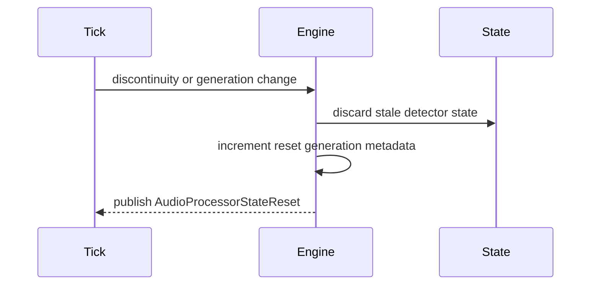

## Request, plan, result, and configuration transactions

Requests validate request ID, block sequence, sample position/count, format/layout, expected EQ/dynamics/processing-chain/sidechain generations, routing/mixer/audio-follow/transition/backend generations, deadline, cancellation metadata, and sanitized metadata. Plans are deterministic and cacheable by generations and format/layout; they list target order, chain order, processor order, sidechain dependencies, bypassed processors, metadata-only processors, operation counts, byte estimates, deterministic score, and warnings. Results report status, processed chains, applied/bypassed/metadata-only processors, summaries, output identities, real-processing flags, ownership transfer, bytes, and completion time.

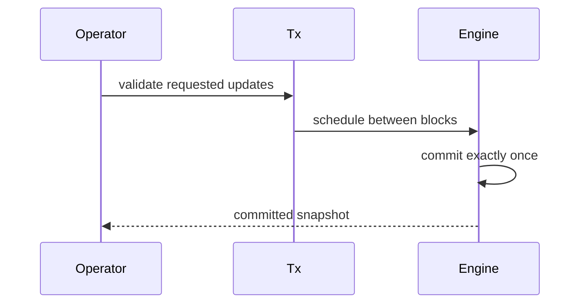

## Backend abstraction and synthetic backend

`AudioEqDynamicsBackend` declares descriptor, capabilities, initialize, createPlan, processBlock, resetProcessorState, resetTargetState, and shutdown. The synthetic backend supports bounded synthetic/small PCM references, deterministic plan/result signatures, detector/gate/compressor/limiter metadata, sidechain dependencies, and simulated backend/allocation/timeout failures. It reports real EQ, dynamics, and limiter processing as false.

## Channel-strip, mixer, Audio-Follow, and transition integration

The processor runs after channel strip/routing and before mixer bus output. It consumes authoritative contribution generations and target identity, preserves sample position and timestamps, rejects stale routing/mixer/Audio-Follow/transition metadata, does not resolve routes again, does not calculate transition progress, and does not mutate PCM reference counts.

## Output registry, commands, events, health, telemetry, watchdog

Typed output keys publish definitions, sidechains, processor state, active transaction, request, plan, result, processed channel/bus outputs, Program/Preview/AUX/Clean Feed/Monitor state, health, telemetry, watchdog summary, and failed/rejected results. Commands use metadata-only payloads with expected generations and no raw PCM. Events cover lifecycle, registration/update/removal, sidechains, validation/commit/rollback, per-block aggregate processing, state reset, health, and shutdown. Health and telemetry counters are bounded. Watchdog incidents cover duplicate requests/blocks, stale generations, invalid parameters, sidechain cycles, stale detector state, backend/allocation failures, ownership/output/source graph mismatches, and invariant failures.

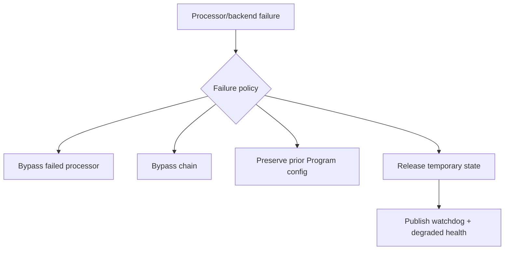

## Source Graph, security, snapshots, and invariants

Source Graph exposes only metadata: chain IDs, processor IDs/types, insertion points, bypass state, frequency/gain/Q summaries, dynamics threshold/ratio summaries, gain-reduction summaries, sidechain references, processing-chain generation, processor health, last sample position, and routing eligibility. It never exposes raw PCM, payload bytes, native handles, mutable leases, device paths, browser URLs, network endpoints, or credentials. Snapshots are JSON-safe, deeply immutable, bounded, deterministic, and redacted. `assertInvariants()` verifies bounded caches/state, unique references, no duplicate processors, zero temporary bytes after completion, and shutdown cleanup.

## Processor order and shutdown sequence

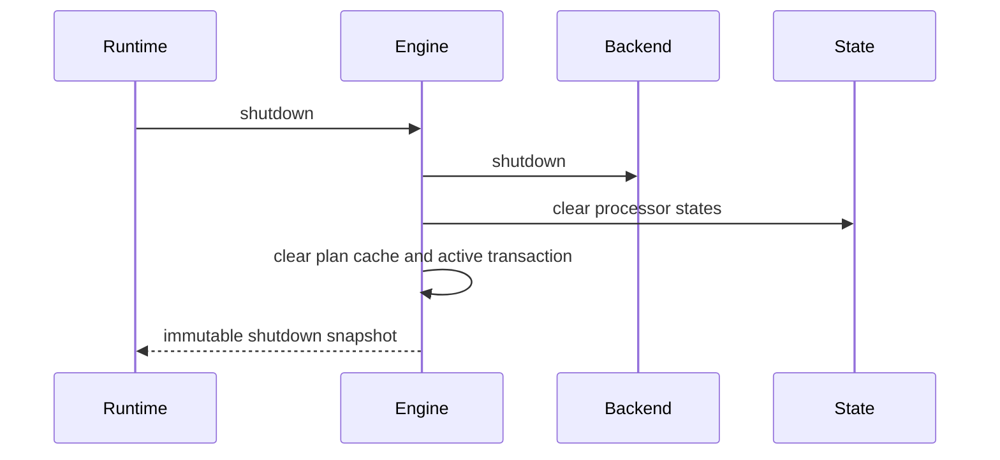

## Long-run validation, determinism replay, and performance

Validation uses fake frame ticks, deterministic sample positions, synthetic buffer references, fake diagnostics timing, bounded registries, explicit ownership metadata, repeated plan replay, 10,000-plan loops, 1,000 execution loops, and processor tick publication. Operation complexity is designed as O(1) lookups, O(processors) parameter validation, O(processors + sidechains) planning, O(samples × detector channels) detector evaluation, O(samples × active bands) EQ work, O(samples × active processors) dynamics work, O(targets + processors + sidechains) orchestration, and O(active + bounded state) snapshots/watchdog.

## Limitations and v5.6.4 handoff

The foundation is metadata/synthetic and does not claim real EQ, real compression, real limiting, true-peak limiting, de-essing, loudness compliance, spectral analysis, native device DSP, encoding, recording, streaming, replay, or automatic ducking. UBOS v5.6.4 should build Production-Safe Loudness, Metering, and Audio Monitoring on top of the immutable request/plan/result, state, telemetry, watchdog, and Source Graph metadata established here.
