# UBOS v5.6.4 — Production-Safe Loudness, Metering, and Audio Monitoring

## Purpose and architectural position
UBOS v5.6.4 adds the authoritative post-mixer loudness, metering, and monitor-control metadata subsystem. It sits after v5.6.1 Audio Mixer, v5.6.2 Channel Strip/Routing, and v5.6.3 EQ/Dynamics metadata. It owns meter definitions, sample-derived windows, bounded state, loudness foundation metadata, clipping/silence/low-level/phase/correlation summaries, dynamics activity metering, monitor-source selection, PFL/AFL coordination metadata, snapshots, health, telemetry, watchdog incidents, validation, and public API exports. It does **not** own source acquisition, routing decisions, EQ/dynamics processing, bus summing, native playback, encoding, recording, streaming, replay, or hardware meters.

## Measurement authority
FrameTick coordinates publication, but audio sample position, sample count, sample rate, block sequence, and expected generations are the only measurement authority. The engine has no independent clock, timers, `Date.now()` windows, `setInterval`, or `requestAnimationFrame` authority. Duplicate request IDs and duplicate block sample ranges are rejected.

## Meter types, targets, definitions, and windows
Supported meter types include sample peak, held peak, RMS, average level, momentary/short-term/integrated/loudness-range foundation metadata, true-peak metadata, clipping, silence, low-level, DC-offset metadata, phase/channel correlation, mono compatibility metadata, gain reduction, gate/compressor/limiter activity, channel activity, and approved custom typed meters. Targets include channel, channel strip, subgroup, Program, Preview, AUX, Clean Feed, Monitor, Record, Stream, sidechain, and custom targets. Meter definitions are immutable after registration and update atomically by generation. Measurement windows are explicit and sample-derived: per-block, fixed sample count, fixed duration, 400 ms momentary, 3 s short-term, integrated session, sliding, and custom typed.

## Peak, RMS, loudness, true peak, clipping, silence, and phase
The synthetic backend computes deterministic peak/RMS/average signatures and dBFS values from bounded block summaries and sample position. Loudness profiles are foundation-level only: EBU R128, ATSC A/85, ITU BS.1770, podcast, streaming, music, and custom. True peak is a metadata boundary in this phase; no real oversampling or brickwall guarantee is claimed. Clipping, silence, low-level, DC offset metadata, stereo/channel correlation, negative-correlation warnings, phase-inversion suspicion, and mono-compatibility metadata are bounded and deterministic.

## Dynamics integration
Dynamics meters consume authoritative activity summaries from the v5.6.3 layer by generation. v5.6.4 does not recalculate or mutate gate, expander, compressor, limiter, detector, or processor state.

## Meter state, values, request/plan/result
Meter state snapshots contain identity, target generation, runtime frame, block sequence, sample position/count, current/held values, clip/silence/low-level/loudness/phase/dynamics/discontinuity state, health, and safe metadata. They contain no PCM or raw sample history. Requests validate duplicate IDs, duplicate blocks, sample-position regressions, expected generations, layouts, formats, cancellation, and shutdown. Plans order targets/meters deterministically and are cache bounded. Results include Program/Preview/AUX/Clean Feed/Monitor/Record/Stream summaries, metadata-only IDs, real-measurement flags, warnings, and zero temporary bytes on completion.

## Backend abstraction and synthetic backend
`AudioMeteringBackend` exposes descriptor, capabilities, initialize, createPlan, processBlock, resetMeterState, resetTargetState, and shutdown. The deterministic `SyntheticAudioMeteringBackend` supports bounded PCM-like summaries, deterministic checksums, synthetic peak/RMS, loudness metadata, clipping/silence/phase simulation, dynamics metadata, and simulated backend/allocation/timeout failures while accurately reporting real true-peak and loudness as false.

## Monitor sources, controls, PFL/AFL, and priority
Monitor source references support Program, Preview, AUX, Clean Feed, subgroup, channel PFL, channel AFL, solo bus, Record, Stream, and custom sources. Monitor state is metadata/control only: selected source, active PFL/AFL, solo, gain, mute, dim, mono, channel selection, left/right swap metadata, and phase-invert metadata. Priority is deterministic: emergency, exclusive PFL, exclusive AFL, solo, manual source, Program default, silence metadata. Program audio is never mutated.

## Loudness sessions and configuration transactions
Loudness sessions are bounded and generation-protected with CREATED, RUNNING, PAUSED, COMPLETED, RESET, and FAILED states. Integrated loudness and loudness-range results remain foundation metadata until formal vectors certify compliance. Configuration transactions validate atomically, commit only once between blocks, preserve the previous valid configuration on failure, and leave no partial configuration.

## Processor order, output registry, commands, events, health, telemetry, watchdog
`AudioLoudnessMeteringProcessor` runs at order 580, after Audio Mixer 575 and before Bus Orchestration 600. It publishes typed output-registry keys for definitions, states, sessions, channel/bus meters, Program/Preview/AUX/Clean Feed/Monitor/Record/Stream metadata, clipping, silence, phase, gain reduction, monitor state/result, requests, plans, results, health, telemetry, and failures. Commands and events cover meter lifecycle, loudness sessions, monitor controls, validation, configuration commit/rollback, block processing, cancellation, cache clearing, target reset, and shutdown. Health and telemetry are bounded counters. Watchdog incidents cover stalls, timeouts, duplicates, stale generations, invalid windows/thresholds, Program clipping/silence/low-level, phase/loudness warnings, true-peak unsupported, monitor conflicts, backend/allocation failures, registry/source graph mismatches, and invariant failures.

## Source Graph, security, and redaction
Only bounded aggregate metadata is exposed: meter IDs/types, target IDs/types, summaries, clipping/silence/phase/dynamics state, monitor source/mute/dim/mono, session state, generations, health, and routing eligibility. Raw PCM, sample history, backend coefficients, native handles, mutable leases, device paths, browser URLs, endpoints, credentials, and secrets are redacted.

## Production-safety guarantees and invariants
The subsystem enforces no independent metering clock, no duplicate block measurement, no duplicate clip/silence event for the same sample range, no stale generation use, explicit windows/weighting, no false true-peak or compliance claims, no normalization/gain riding/ducking, no Program mutation, no partial Program publication, no raw history, no output after cancellation/failure/shutdown, bounded state/caches/history, no native device control, and clean shutdown. `assertInvariants()` verifies identities, generations, windows, thresholds, finite values, bounded state, duplicate prevention, temporary-state release, registry agreement, and shutdown cleanup.

## Validation, determinism replay, performance, limitations, and v5.6.5 handoff
The focused validation covers engine/backend creation, duplicates, generation updates, immutability, peak/RMS/loudness/true-peak metadata, clipping/silence/low-level, phase, dynamics metadata, all bus targets, monitor priority/mute/dim/mono, sessions, transactions, requests/plans/results, duplicates/stale generations, source graph, health, telemetry, watchdogs, snapshots, commands, invariants, shutdown, 10,000 operation loops, and 100,000 processor ticks with no real-time sleeping. Determinism replay compares canonical snapshots from the same synthetic scenario. Complexity is O(1) lookup, O(meters + targets) planning, O(samples × channels) level/loudness/clipping/silence, O(samples × channel pairs) phase, O(active listen sources) monitor resolution, and O(active + bounded incidents) watchdog. Limitations: loudness and true-peak are foundation/metadata-only unless a future certified backend supplies reference-vector validation. The next task is UBOS v5.6.5 Production-Safe Audio/Video Synchronization and Master Audio Bus.

## Mermaid diagrams

### 1. Metering signal flow
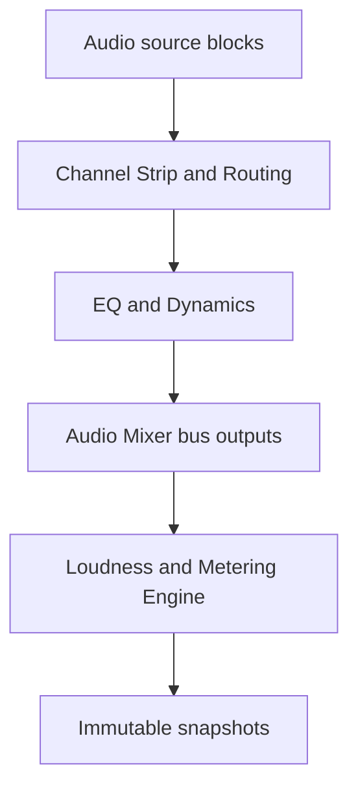
### 2. Measurement-window lifecycle
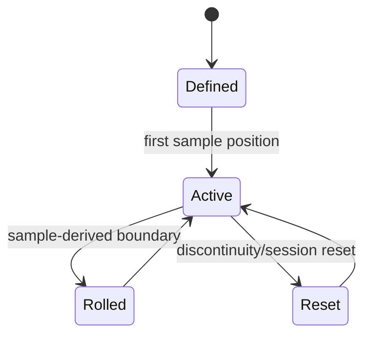
### 3. Loudness-session lifecycle
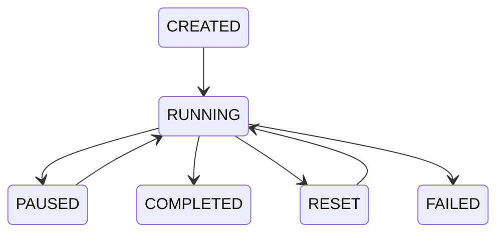
### 4. Peak/RMS calculation path
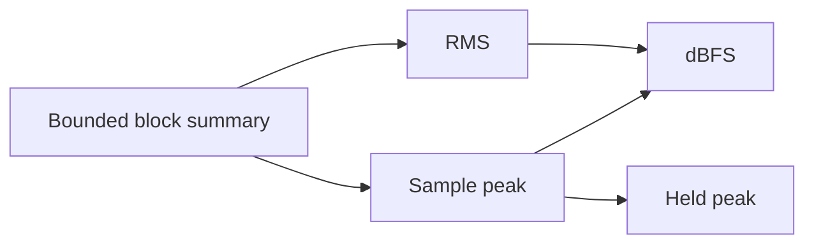
### 5. Clipping and silence detection
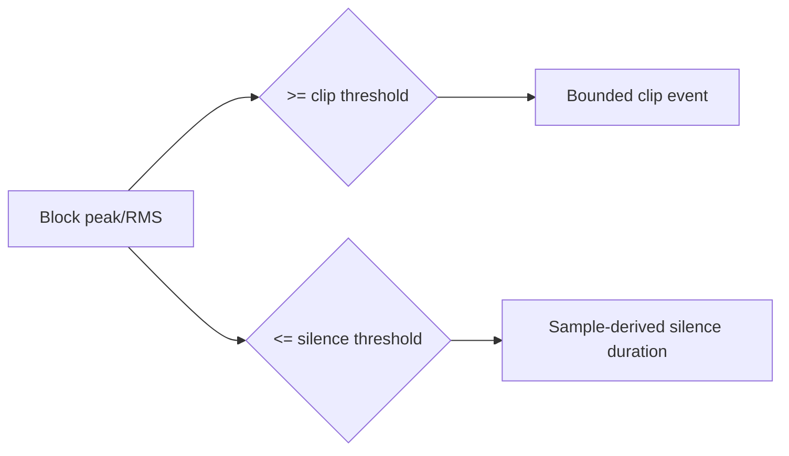
### 6. Phase-correlation flow
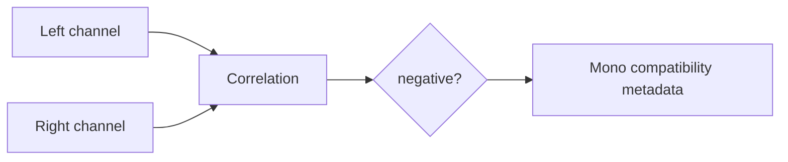
### 7. Dynamics-meter integration
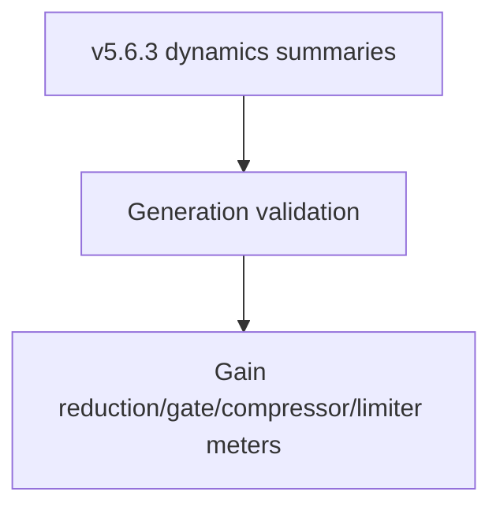
### 8. PFL/AFL monitor routing
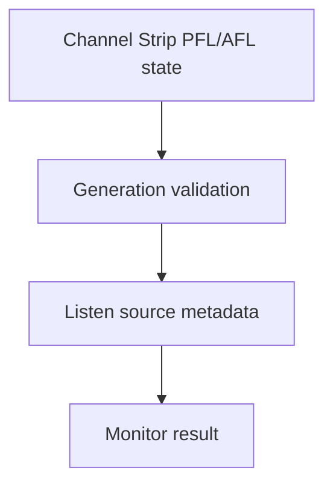
### 9. Monitor priority resolution
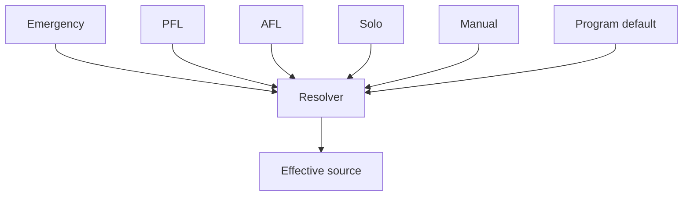
### 10. Atomic configuration commit
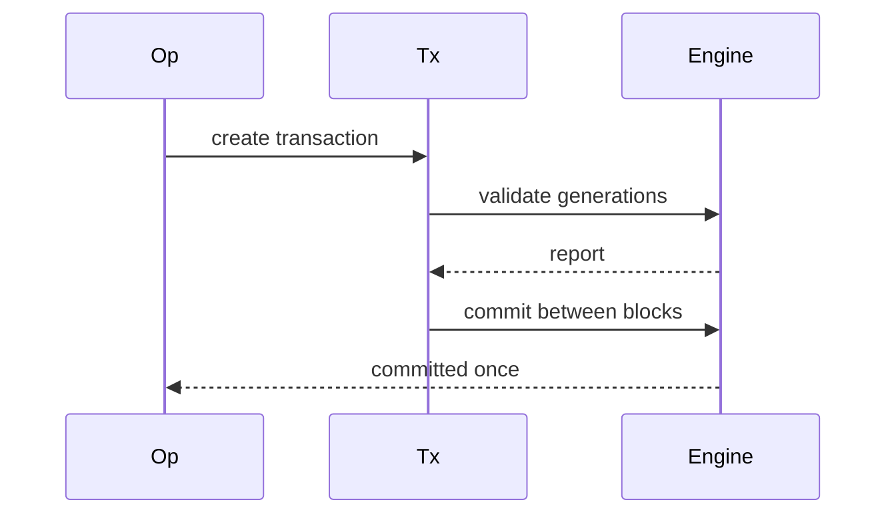
### 11. State reset on discontinuity

### 12. Processor order

### 13. Failure cleanup
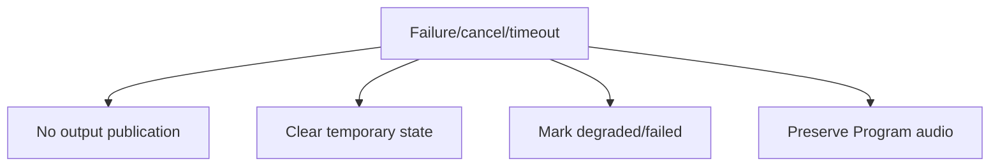
### 14. Shutdown sequence
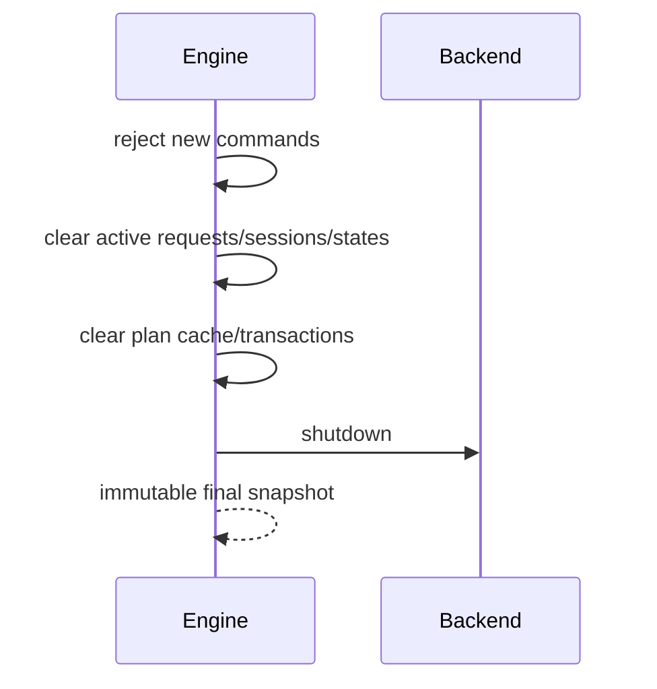
