# UBOS v5.6.5 Audio/Video Synchronization and Master Audio

## Purpose and architectural position
UBOS v5.6.5 adds a metadata-only synchronization and master-audio authority between the certified video path (source acquisition, video frame pipeline, scene switching, transition execution, scene compositor) and the v5.6 audio path (mixer, routing, EQ/dynamics, loudness/metering). It produces synchronized Program A/V correlation snapshots and final master-audio references for future encoders, recorders, and streamers without encoding, muxing, recording, streaming, hardware genlock, native audio output, raw PCM exposure, or pixel exposure.

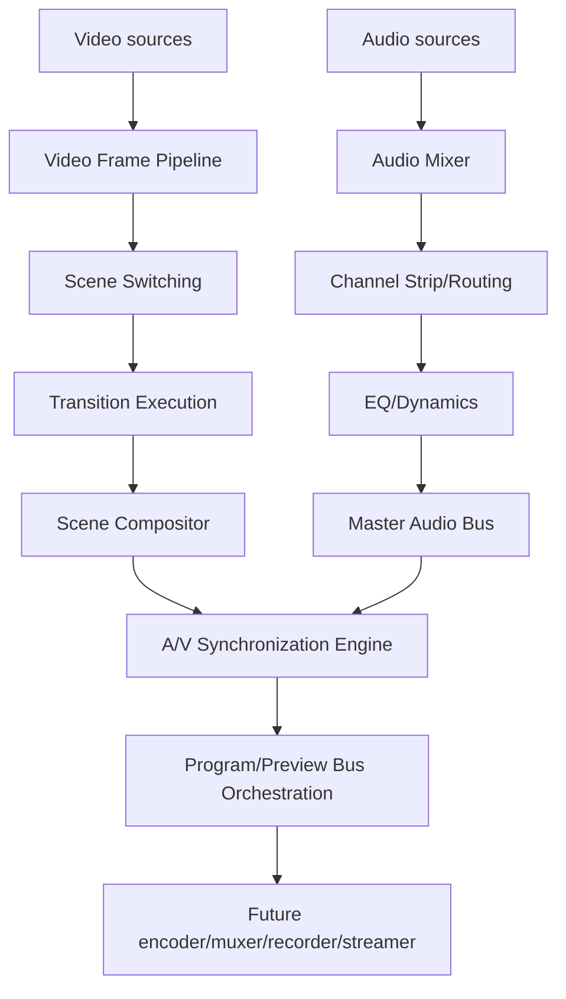

## Relationship to v5.6.1-v5.6.4
The subsystem reuses existing `FrameTick` authority, processor execution, output registry, audio mixer output references, audio ownership concepts, routing roles, EQ/dynamics limiter references, and loudness/metering summaries. It does not duplicate mixing, limiting, metering, frame memory, scene compositing, or runtime loops.

## Time model, rational bases, and timestamps
Time contracts are explicit: nanoseconds, rational time bases, video frame numbers, audio sample positions, PTS/DTS metadata, clock domains, discontinuity generations, and normalized master timeline timestamps. Rational conversion uses integer arithmetic: `pts * numerator * 1_000_000_000 / denominator`, rejects invalid denominators, and protects overflow. Diagnostic time remains separate from presentation authority.

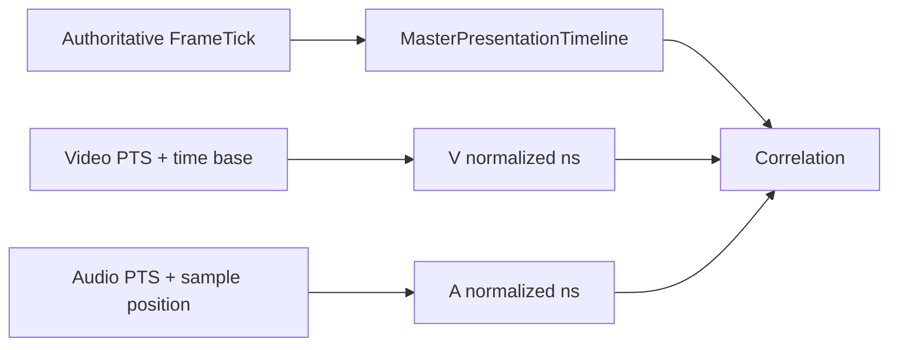

## Master timeline
Exactly one active master presentation timeline is allowed. States include CREATED, PRIMING, RUNNING, PAUSED, DISCONTINUOUS, RECOVERING, DEGRADED, FAILED, STOPPED, and SHUTDOWN. Generations are monotonic; reset is explicit and increments discontinuity metadata.

## Clock domains and correlation
Clock domains are explicit: MASTER_FRAME_CLOCK, VIDEO_SOURCE_CLOCK, AUDIO_SOURCE_CLOCK, SYSTEM_MONOTONIC_DIAGNOSTIC, NETWORK_MEDIA_CLOCK, DEVICE_CLOCK, SYNTHETIC_CLOCK, and UNKNOWN. UNKNOWN is not silently substituted. The synthetic correlation model is deterministic, bounded, and metadata-only; it reports offsets, drift ppm, confidence, sample counts, and lifecycle states without hardware-lock claims.

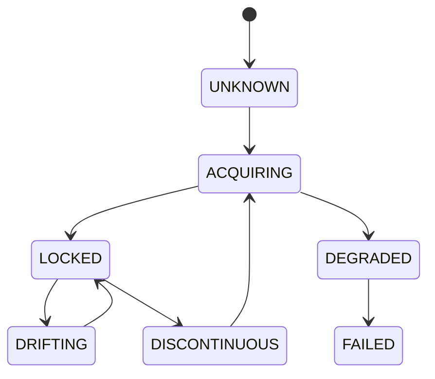

## A/V sync state, tolerances, modes, and corrections
The sync state records Program video/audio references, PTS values, normalized timestamps, skew (`audioNs - videoNs`; positive means audio ahead), sample/frame equivalents, drift, correction, held/dropped counters, silence metadata, discontinuity, confidence, warnings, and health. The default mode is BROADCAST_BALANCED. Tolerance thresholds are ordered: synchronized <= warning <= correction <= failure. Corrections are explicit and bounded: no correction, delay audio, hold/drop video, hold/drop audio metadata, silence insertion metadata, resync at boundary, reset correlation, preserve-and-degrade, fail publication, or request operator intervention.

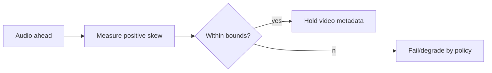

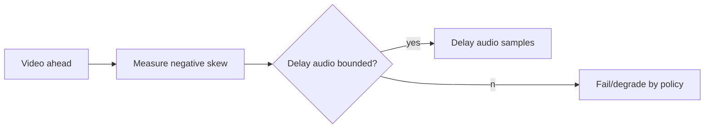

## Audio delay and video delay foundation
Audio delay compensation is sample-derived, bounded, committed at block boundaries, and snapshot-safe. Video delay is metadata-only and references existing frame ownership contracts; it does not create a frame memory system, interpolate frames, or silently repeat frames.

## Drift detection and discontinuities
The synthetic estimator tracks instantaneous skew and deterministic drift metadata with bounded state. Discontinuities cover timestamp jumps, sample-position jumps, video frame jumps, clock-domain changes, timeline resets, source restarts, transition restarts, and scene switch generation jumps. Policies include START_NEW_SEGMENT, RESET_CORRELATION, HOLD_PROGRAM, DROP_UNSAFE_OUTPUT, DEGRADE_AND_PUBLISH, and FAIL_PUBLICATION.

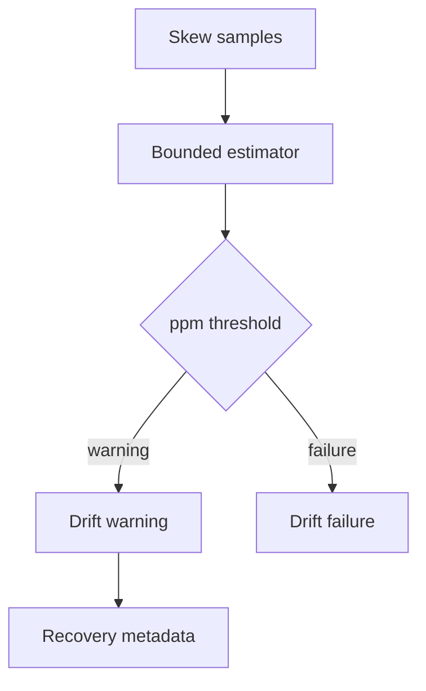

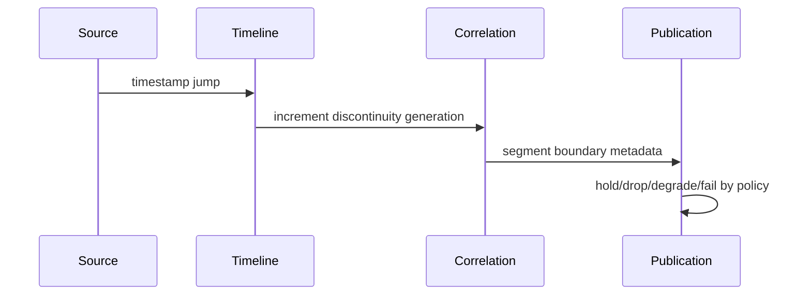

## Requests, plans, and results
`AudioVideoSyncRequest` is immutable and generation-protected. `AudioVideoSyncPlan` normalizes timestamps, validates generations, measures skew/drift, selects authority and correction, estimates retained resources, and records deterministic operation order. `AudioVideoSyncResult` records synchronized/corrected/degraded/failed publication readiness without mutating input references.

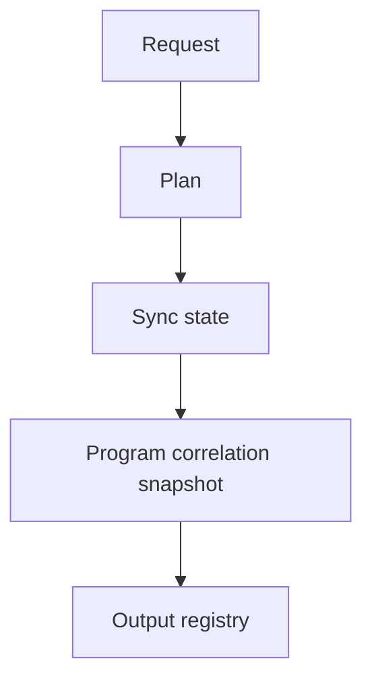

## Master audio bus
Master bus definitions are immutable and unique. Roles: PROGRAM_MASTER, PREVIEW_MASTER, AUX_MASTER, CLEAN_FEED_MASTER, MONITOR_MASTER, RECORD_MASTER, STREAM_MASTER, CUSTOM. The Program master is explicit; Preview is independent; AUX/Clean Feed/Monitor failures are isolated; Record/Stream remain metadata foundations.

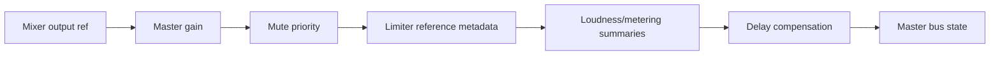

## Master gain/mute, limiter, and metering
Gain supports dB/linear metadata. Mute priority is emergency, safety, operator, master, unmuted. The limiter integrates v5.6.3 metadata/references only; no duplicate limiter or true-peak guarantee is implemented. Loudness/metering consume v5.6.4 summaries without recalculation, normalization, or Program mutation.

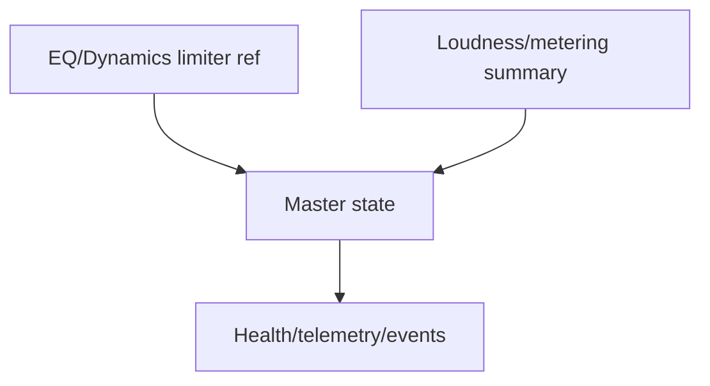

## Backends and synthetic implementations
`AudioVideoSynchronizationBackend` and `MasterAudioBusBackend` expose descriptors, capabilities, initialize, plan/process, reset, and shutdown. Synthetic backends are deterministic, metadata-only, and accurately report no real clock synchronization, no hardware support, no native audio, no encoder, no recorder, and no streamer.

## Configuration transactions
Configuration changes are represented by immutable transactions with generation checks, validation reports, scheduled runtime frame/sample position, states, and safe timestamps. Commit is atomic at safe boundaries; cancellation changes nothing; failure preserves prior configuration.

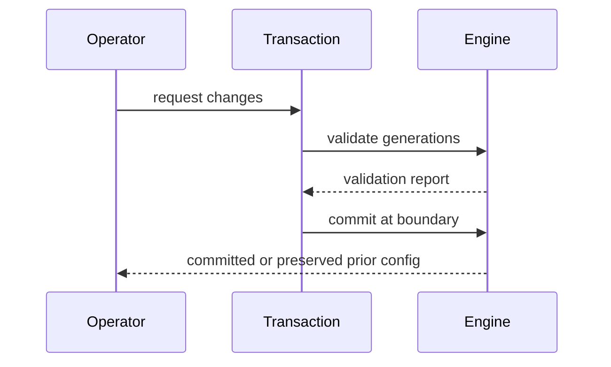

## Processor order and output registry
The `AudioVideoSyncMasterBusProcessor` runs at order 590, after loudness/metering and before Program/Preview bus orchestration. Typed output keys cover timeline, correlations, policy, mode, request/plan/result, Program correlation, master audio states, delay/discontinuity/drift states, transactions, health, telemetry, and failed/rejected results.

## Commands, events, health, telemetry, and watchdog
Commands are typed and metadata-only, compatible with v5.1 command handlers. Events cover lifecycle, timeline, correlation, sync, corrections, master bus updates, processing, publication, health changes, and shutdown. Health and telemetry are bounded and JSON-safe. Watchdog incident codes cover duplicate requests/ticks, stale generations, regressions, lead/lag, drift, discontinuity, resource pressure, mismatches, backend failures, limiter failures, and ownership violations.

## Source Graph and security
Source Graph exposure is bounded metadata only: timeline, Program correlation, PTS summaries, skew/drift, sync status, correction, delay counters, discontinuity generation, master-bus roles, mute/gain, readiness, health, and routing eligibility. Raw PCM, pixels, payload bytes, native handles, device paths, credentials, URLs, endpoints, private timing metadata, and mutable leases are excluded.

## Production safety and invariants
The implementation enforces one master timeline, unique IDs, monotonic generations, valid rational bases, no duplicate Program master output, no mixed-tick publication, no hidden correction, bounded caches/held-resource metadata, Program/Preview independence, no duplicate limiter, no media payload exposure, and clean shutdown. `assertInvariants()` validates critical state.

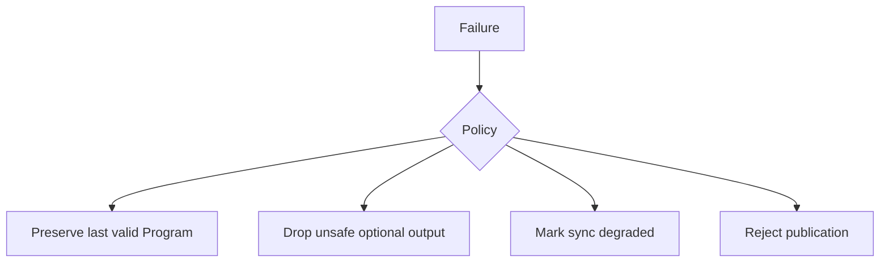

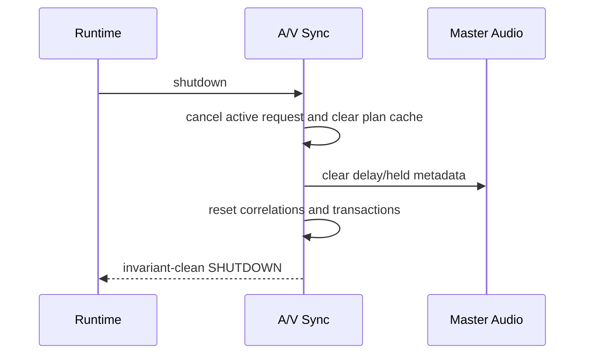

## Long-run validation, determinism replay, and performance
Validation uses fake FrameTicks, deterministic timestamps/sample positions, synthetic references, synthetic backends, fake diagnostics, and bounded trackers. The long-run test covers 100,000 processor ticks, 10,000 sync plans, 10,000 Program blocks, 10,000 Preview blocks, replay comparison, source graph metadata, health/telemetry consistency, and clean shutdown. Complexity is O(1) for lookups, normalization, skew, correction selection, and bounded estimator updates; master-bus processing is O(active buses); snapshots are O(correlations + buses + bounded state).

## Limitations and v5.6.6 handoff
This phase does not encode, mux, record, stream, replay, resample asynchronously, time-stretch, pitch-shift, interpolate frames, or claim hardware sync. UBOS v5.6.6 should consume the synchronized Program A/V metadata and master-audio references to build the Production-Safe Media Encoder Foundation.
